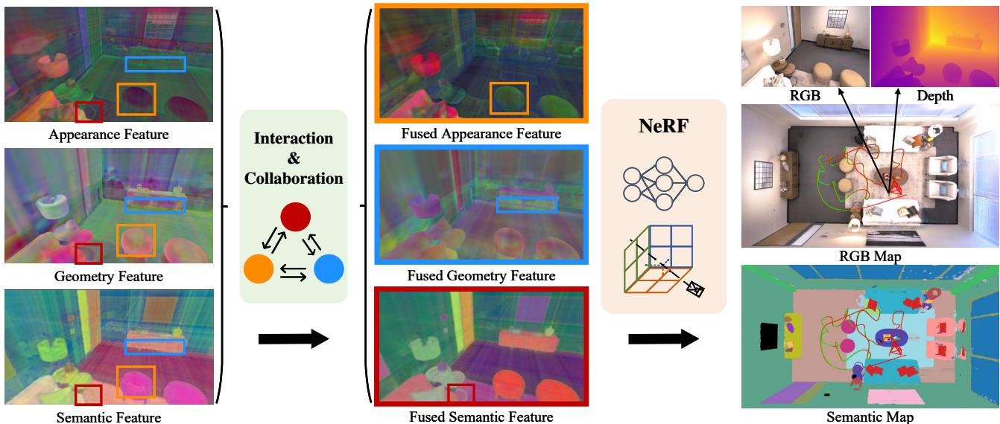
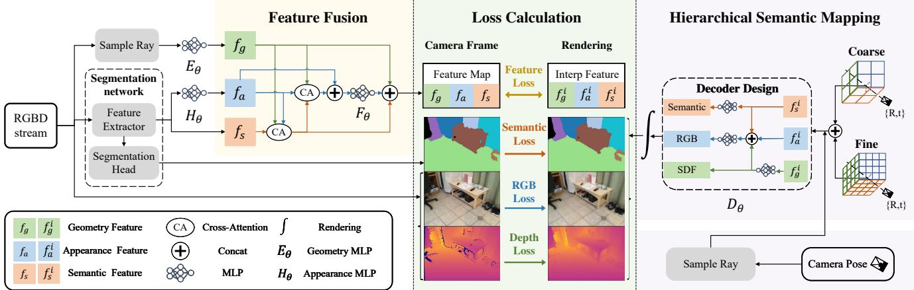
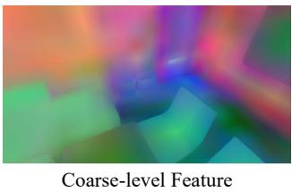
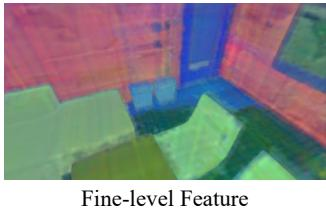
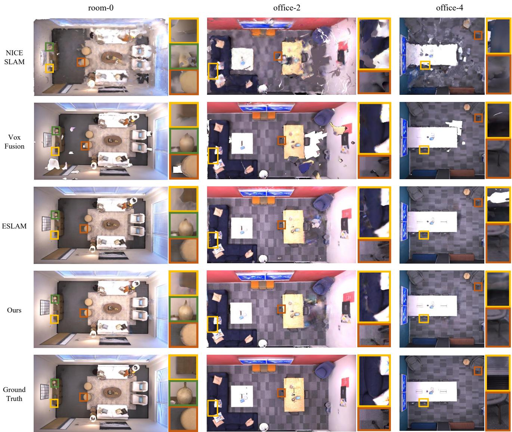
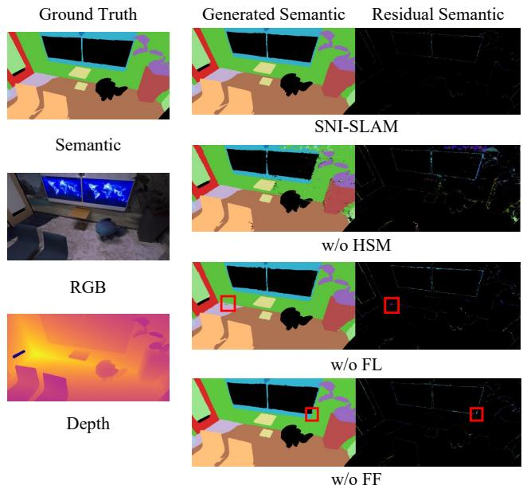

# SNI-SLAM: Semantic Neural Implicit SLAM

Siting Zhu1\*, Guangming Wang2\*, Hermann Blum3, Jiuming Liu1,

Liang Song4, Marc Pollefeys3, Hesheng Wang1†

1 Department of Automation, Shanghai Jiao Tong University 2 University of Cambridge 3 ETH Zurich¨ 4 China University of Mining and Technology, China

{zhusiting,liujiuming,wanghesheng}@sjtu.edu.cn gw462@cam.ac.uk {hermann.blum,marc.pollefeys}@inf.ethz.ch TS21060167P31@cumt.edu.cn

  
Figure 1. Our SNI-SLAM leverages the correlation of multi-modal features in the environment to conduct semantic SLAM based on Neural Radiance Fields (NeRF). This modeling strategy achieves not only higher accuracy compared with existing NeRF-based SLAM, but also enables real-time semantic mapping. We propose a feature collaboration method between appearance, geometry, and semantics, which significantly enhances the feature representation capabilities. Fused Appearance (orange box): Shadowing on the chair caused by light is eliminated. Fused Geometry (blue box): The inconsistency of the cabinet bottom edge is improved. Fused Semantic (red box): The distinction between table leg and floor is enhanced.

## Abstract

We propose SNI-SLAM, a semantic SLAM system utilizing neural implicit representation, that simultaneously performs accurate semantic mapping, high-quality surface reconstruction, and robust camera tracking. In this system, we introduce hierarchical semantic representation to allow multi-level semantic comprehension for top-down structured semantic mapping of the scene. In addition, to fully utilize the correlation between multiple attributes ofthe environment, we integrate appearance, geometry and semantic features through cross-attention for feature collaboration. This strategy enables a more multifaceted understanding of the environment, thereby allowing SNI-SLAM to re-

main robust even when single attribute is defective. Then, we design an internal fusion-based decoder to obtain semantic, RGB, Truncated Signed Distance Field (TSDF) values from multi-level features for accurate decoding. Furthermore, we propose a feature loss to update the scene representation at the feature level. Compared with lowlevel losses such as RGB loss and depth loss, our feature loss is capable of guiding the network optimization on a higher-level. Our SNI-SLAM method demonstrates superior performance over all recent NeRF-based SLAM methods in terms of mapping and tracking accuracy on Replica and ScanNet datasets, while also showing excellent capabilities in accurate semantic segmentation and real-time semantic mapping. Codes will be available at https://github.com/IRMVLab/SNI-SLAM.

## 1. Introduction

Dense semantic Simultaneous Localization and Mapping (SLAM) is a fundamental challenge in robotics [24, 35] and autonomous driving [19, 41, 44, 45]. It incorporates semantic understanding of the environment into map construction and estimates camera pose simultaneously. Compared with traditional SLAM, semantic SLAM is capable of identifying, categorizing, and relating entities in the scene as well as generating semantic maps.

Traditional semantic SLAM has limitations including its inability to predict unknown areas and high storage space requirements [20]. Recently, Neural Radiance Fields (NeRF) [22] have shown remarkable capability in scene representation, promising to address these limitations. Compared with traditional SLAM mapping representations such as TSDF and point cloud, this implicit scene representation benefits from continuous modeling and low storage cost. Following the advantages of implicit representation, NeRF-based SLAM [16, 40, 46, 50, 54] methods have been developed. However, most existing NeRF-SLAM systems establish RGB maps, where color information is not directly suitable for downstream tasks such as navigation. In the meantime, there has been some works [52, 53] demonstrating that NeRF can jointly learn geometric and semantic representations. However, these works require hours of offline training to obtain semantic scene representation, which is impractical for semantic SLAM that inherently demands real-time performance. Therefore, developing a semantic SLAM system based on NeRF is essential and challenging.

For semantic NeRF-based SLAM, there are two challenges: 1) Appearance, geometry and semantic information are interrelated, so processing them independently will lose interact connections, leading to an incomplete understanding of the image or scene. 2) As the appearance of a scene, such as color, varies under different views, leveraging semantic multi-view consistency to optimize appearance will affect the details of the appearance, and vice versa.

For the first challenge, MSeg3D [18] fuses geometry and semantic features to obtain more accurate semantic segmentation results. However, this work does not take advantage of appearance information as another modality to enhance semantic expression from the visual structural perspective. Moreover, mutual reinforcement of different modalities is not explored either. In this paper, we use the individual characteristics of appearance, semantics, and geometry, to design a mutual collaboration and enhancement approach between these modalities based on cross-attention. This design enables improvements for each modality respectively.

For the second challenge, Semantic-NeRF [52] appends a segmentation renderer before injecting viewing directions into the Multi-layer Perceptron (MLP). However, the impact of semantic optimization on appearance and geometric expression is not explored. To address this challenge, we propose a one-way correlation approach between different modalities by improving the decoder design and rendering process. This allows valuable information from one modality to enhance other modalities without affecting the original representation or being influenced in the reverse.

Overall, we provide the following contributions:

• We present SNI-SLAM, a dense RGB-D semantic SLAM system based on NeRF, which can achieve accurate 3D semantic segmentation by real-time mapping. We introduce hierarchical semantic encoding for precisely constructing semantic maps. In addition, we utilize a feature loss to guide the network optimization on a higher-level, resulting in superior scene optimization results.

• We perform an advanced feature collaboration approach to integrate geometry, appearance, and semantic features based on cross-attention. This design enables mutual reinforcement between different features. Moreover, we introduce a new decoder for one-way correlation to achieve enhanced decoding results without mutual interference.

• Extensive evaluations are conducted on two challenging datasets, Replica [38] and ScanNet [5], to demonstrate our method attains state-of-the-art performance compared with existing NeRF-based SLAM in mapping, tracking, and semantic segmentation.

## 2. Related Work

Semantic SLAM. Visual odometry [2, 7, 10, 27, 33, 43] and real-time dense mapping [6, 12, 15, 34, 49] are capable of localization and scene reconstruction. Semantic SLAM combines the advantages of visual odometry and real-time dense mapping, while integrating semantic information to achieve higher level understanding of the environment [24]. This technology enables the robot to understand its own position and the meaning of the elements in the environment. SLAM++ [36] is object-aware RGB-D SLAM that uses joint pose graph to represent object-level information in the scene. Kimera [35] relies on RGB-D or stereo sensing to generate dense semantic mesh maps and uses visualinertial odometry for the motion estimation. These methods utilize explicit modeling for 3D semantic reconstruction. However, this representation requires considerable storage space and is insufficient for detailed reconstruction. In this paper, we leverage the advantages of neural implicit representaion for conducting high-fidelity semantic SLAM with minimal storage space.

Neural implicit SLAM. Neural implicit representation [8, 9, 25, 29, 51] is a novel 3D representation approach that uses neural network to learn geometric representation and appearance information of the environment. This technique has a wide range of applications, such as new view synthesis [22, 26], object pose estimation [3, 13, 14, 32, 48] and surface reconstruction [29, 47, 51]. Neural implicit representation with SLAM is our main focus. iMAP [40] introduces a single MLP network to achieve real-time mapping and localization of the scene. NICE-SLAM [54] adopts hierarchical feature grid as scene representation, enabling more accurate mapping. ESLAM [16] uses multi-scale axis-aligned feature planes, reducing the memory consumption growth. Vox-Fusion [50] is based on octree management for incremental mapping. Previous works have proved the feasibility for neural networks to model color and geometric information in the environment. However, the potential of neural implicit representation goes far beyond this, as it can be used to encode semantic information [52, 53]. vMAP [17] is an object-level dense SLAM system that utilizes semantic segmentation results for object association, but it does not perform semantic mapping. NIDS-SLAM [11] uses ORB-SLAM3 [2] for tracking and Instant-NGP [28] for mapping. For the processing of semantic information, it maps the segmentation results to color encodings for optimization of network. However, this work does not integrate semantic with other features of the environment, such as geometry and appearance. In this paper, we introduce cross-attention based feature fusion to incorporate semantic, appearance, and geometry features, thus improving the accuracy of mapping, tracking, and semantic segmentaion.

  
Figure 2. An overview of SNI-SLAM. Our method takes an RGB-D stream as input. RGB images are fed into semantic feature extractor to obtain semantic features. These features are then transformed into appearance features through appearance MLP $H _ { \theta } .$ . Geometry features are derived from ray sampling and then processed through geometry MLP $E _ { \theta }$ . Subsequently, these three types of features are fused using cross-attention based feature fusion and generate feature map. This feature map, the input RGB-D, and the segmentation results obtained from segmentation network serve as supervision signals. Generated features are obtained by interpolation of scene representation, then these features are utilized for feature loss construction as well as to obtain the generated RGB, depth and semantics through decoding and rendering process. Supervision and generated information are used for loss construction to update scene representation and MLP network. We use hierarchical semantic representation for semantic mapping. For camera tracking, we utilize loss functions to optimize camera pose. We follow [16] for geometry and appearance scene representation.

## 3. Method

The overview of our method is shown in Fig. 2. Given an input RGB-D frames $I = \{ c _ { i } , d _ { i } \} _ { i = 1 } ^ { N }$ , we perform dense semantic mapping and real-time tracking by jointly optimizing the scene representation, the MLP network and camera pose. Sec. 3.1 describes how to integrate geometric, semantic, and appearance features through feature fusion based on cross-attention. Sec. 3.2 presents the hierarchical semantic mapping and localization process, including semantic representation, a new decoder design, volume rendering, and camera tracking. Sec. 3.3 introduces the loss functions.

## 3.1. Cross-Attention based Feature Fusion

Geometry, semantics and appearance are interconnected. For semantic and appearance features, the appearance of an object may vary under changing light conditions or viewing angle, but its semantic feature usually remains the same. This stability makes semantic feature an important tool for recognizing and understanding objects. In the meantime, the appearance feature of an object can also enhance our understanding of its semantic information. By observing the color, brightness, or texture of an object, we can infer which category an object belongs to. For geometry and semantic, robots can recognize and use geometric feature to locate and quantify the position and shape of an object. This information can then be utilized to infer the likely nature or identity of the object. In addition, semantic information can be used to improve understanding of the geometry and location of objects.

Considering the correlation among features, we employ cross-attention to fuse geometry feature $f _ { g } ,$ semantic feature $f _ { s } ,$ , and appearance feature $f _ { a }$ . The input RGB image is passed through a pretrained semantic segmentation network to obtain semantic feature $f _ { s }$ . In this work, we utilize an universal feature extractor Dinov2 [30], followed by segmentation head to construct the segmentation network. The extracted semantic feature lacks specificity to the environment as it is derived from a pretrained segmentation network. Therefore, we utilize real-time updated appearance MLP $H _ { \theta }$ to transform the semantic feature into appearance feature $f _ { g } = H _ { \theta } ( f _ { s } )$ . This MLP network stores environment-specific appearance information. For geometry feature, we first obtain the coordinates of 3D points $\{ p _ { i } \} _ { i = \cdot } ^ { N }$ through ray sampling. Then, we use a NeRF-based frequency encoding [25] to get vector $\gamma ( p )$

$$
\gamma ( p ) = ( s i n 2 ^ { 0 } \pi p , c o s 2 ^ { 0 } \pi p , \ldots , s i n 2 ^ { L - 1 } \pi p , c o s 2 ^ { L - 1 } \pi p ) ,\tag{1}
$$

where $L$ defines the total count of frequencies used. We use $L = 6$ for 3D coordinates. $\gamma ( p )$ is processed through geometry MLP $E _ { \theta } ( \gamma ( \boldsymbol { p } ) )$ to obtain geometry feature $f _ { g } ,$ , which stores geometry information of the environment.

Then, we leverage the structural property of geometry to guide attention. $f _ { g }$ is used as $Q , f _ { a }$ is used as $K$ , and $f _ { s }$ is used as $V .$ , to perform cross-attention calculation to obtain fused semantic feature $T _ { s } \mathrm { : }$

$$
T _ { s } = s o f t m a x ( \frac { f _ { g } f _ { a } ^ { T } } { \sqrt { \left| \left| f _ { a } \right| \right| _ { 2 } ^ { 2 } } } ) f _ { s } .\tag{2}
$$

Through this fusion, the weighted combination of semantic information is dynamically adjusted based on geometry and appearance feature matches, thereby minimizing the influence of incorrect semantic predictions by highlighting matches and downplaying mismatches. Moreover, we utilize $f _ { a } , f _ { g }$ and fused semantic features $T _ { s }$ as $V , Q$ and $K$ to obtain fused appearance feature $T _ { a }$ respectively:

$$
T _ { a } = s o f t m a x ( \frac { f _ { g } \cdot T _ { s } ^ { T } } { \sqrt { | | T _ { s } | | _ { 2 } ^ { 2 } } } ) f _ { a } .\tag{3}
$$

The fused appearance feature $T _ { a }$ is enhanced through crossattention, but it may lose some fine-grained details present in the original appearance feature $f _ { a }$ . Therefore, we concatenate $f _ { a }$ and $T _ { a } ,$ and then pass concatenated feature through fusion MLP $F _ { \theta }$ . This fusion preserves the augmented information from $T _ { a }$ while also integrating the finer details from $f _ { a } ,$ , thus achieving a more enriched appearance representation. Then, the result is concatenated with $f _ { g }$ and $T _ { s }$ to obtain feature map $F M ~ = ~ \{ f _ { g } , T _ { a } ^ { \prime } , T _ { s } \}$ This multi-modal feature fusion approach based on crossattention facilitates interaction and mutual learning among features from different modalities, resulting in more accurate feature representation.

## 3.2. Hierarchical Semantic Mapping

Currently, existing NeRF-based semantic modeling methods employ single-level neural implicit representation, regardless of whether they use voxel grid [42] or

  
Figure 3. Visualization of coarse-level and fine-level features. Coarse-level feature captures general structure and arrangement of components. Fine-level feature provides more fine-grained details.

MLP [23, 52]. However, their performances are often limited when dealing with complex scenarios. We discover that using a hierarchical approach is more effective for semantic representation of the environment. When looking at a scene, we first grasp the overall layout and identify the main objects to develop a coarse understanding. After that, we shift our focus to more finely detailed. This top-down approach allows us to understand and process complex semantic information more naturally and efficiently. Therefore, we employ coarse-to-fine semantic modeling for scene representation in this paper. Moreover, we design a fusion-based decoder to obtain semantic, color, SDF values, then achieve semantic, RGB, depth images through rendering process.

Coarse-to-fine Semantic Representation. We utilize feature planes [16] to store features, which saves storage space compared with voxel grid [50, 54]. For semantic mapping, we employ a coarse-to-fine semantic representation. For each feature plane, we use two different levels of spatial resolution, where $\{ F _ { s - x y } ^ { c o a r s e } , F _ { s - x z } ^ { c o a r s e } , F _ { s - y z } ^ { c o a r s e } \}$ represent coarse level features, $\{ F _ { s - x y } ^ { f i n e } , F _ { s - x z } ^ { f i n e } , F _ { s - y z } ^ { f i n e } \}$ represent fine level features, visualization of coarse and fine semantic features are shown in Fig. 3. For a given coordinate, we then concatenate the corresponding coarse and fine feature. We demonstrate empirically that the introduction of multilevel semantic representations improves the performance of implicit semantic modeling and provides finer and richer semantic understanding.

Decoder Design. There are typically two common designs for decoders in existing models. One approach [16] uses separate decoder networks to process different features. Another approach [50] utilizes the decoder network to obtain geometric and color information from a single feature. However, both approaches suffer because these decoders optimize independently without interaction. In our work, we incorporate the idea of feature collaboration into decoder module to obtain SDF, RGB, and semantic values from geometry, appearance and semantic features. Inside the decoder, we concatenate geometry feature with appearance and semantic features, then the concatenated feature passes through MLP network to obtain color decoding information. This design provides one-way correlation to ensure that improvement and application of the features occur only in one direction, thereby preventing mutual interference between the features. In addition, it also facilitates information exchange between features, improving the network’s understanding of them. Considering the complexity of rich semantic categories, a larger hidden layer is necessary for comprehensive modeling. In this work, we use 256 dimension hidden layer for semantic decoding.

Rendering. We sample N points on the ray $\{ p _ { n } \} _ { i = 1 } ^ { N }$ to generate color $c ( p _ { n } )$ , semantic $s ( p _ { n } )$ and TSDF $d ( p _ { n } )$ values of these points through decoder $D _ { \theta } ( p _ { n } )$ . Then, we use SDF-based rendering method proposed in StyleSDF [31] to convert SDF values into volume densities:

$$
\begin{array} { l } { \displaystyle \sigma _ { g } ( p _ { n } ) = \frac { 1 } { \alpha _ { g } } \cdot \mathrm { S i g m o i d } \left( - \frac { d ( p _ { n } ) } { \alpha _ { g } } \right) , } \\ { \displaystyle \sigma _ { s } ( p _ { n } ) = \frac { 1 } { \alpha _ { s } } \cdot \mathrm { S i g m o i d } \left( - \frac { d ( p _ { n } ) } { \alpha _ { s } } \right) , } \end{array}\tag{4}
$$

where $\alpha _ { g }$ represents a learnable parameter that determines the level of sharpness along the surface boundary. Another learnable parameter $\alpha _ { s }$ is used for semantic rendering. Volume density $\sigma _ { g } ( p _ { n } )$ is subsequently utilized in rendering both the color and depth associated with each ray to obtain rendered color cˆ and depth $\hat { d } \colon$

$$
\begin{array} { l } { { \displaystyle w _ { g } = \exp \left( - \sum _ { i = 1 } ^ { n - 1 } \sigma _ { g } ( p _ { i } ) \right) \left( 1 - \exp ( - \sigma _ { g } ( p _ { n } ) ) \right) , } } \\ { { \displaystyle \hat { c } = \sum _ { n = 1 } ^ { N } w _ { g } \cdot c ( p _ { n } ) , \quad \hat { d } = \sum _ { n = 1 } ^ { N } w _ { g } \cdot z _ { n } . } } \end{array}\tag{5}
$$

In this context, $z _ { n }$ represents the depth of point $p _ { n }$ in relation to the camera’s pose. $\sigma _ { s } ( p _ { n } )$ is used in semantic rendering and obtain rendered semantic sˆ:

$$
\begin{array} { c } { { w _ { s } = \displaystyle \exp \left( - \sum _ { i = 1 } ^ { n - 1 } \sigma _ { s } ( p _ { i } ) \right) \left( 1 - \exp ( - \sigma _ { s } ( p _ { n } ) ) \right) , } } \\ { { \hat { s } = \displaystyle \sum _ { n = 1 } ^ { N } w _ { s } \cdot s ( p _ { n } ) . } } \end{array}\tag{6}
$$

## 3.3. Loss Functions

We sample M pixels from input images and refer to paper [1] for the definition of free space loss. This loss compels the MLP network to predict values for points $p \in$ $P _ { m } ^ { f s }$ that are positioned between the camera optical center and the truncation region of the surface:

$$
\mathcal { L } _ { f s } = \frac { 1 } { \vert M \vert } \sum _ { m \in M } \frac { 1 } { \vert P _ { m } ^ { f s } \vert } \sum _ { p \in P _ { m } ^ { f s } } ( d ( p ) - 1 ) ^ { 2 } .\tag{7}
$$

For points within the truncated region and close to the surface, we follow [16] for loss function:

$$
\mathcal { L } _ { t r } = \frac { 1 } { \left| M \right| } \sum _ { m \in M } \frac { 1 } { \left| P _ { m } ^ { t r } \right| } \sum _ { p \in P _ { m } ^ { t r } } ( z ( p ) + T \cdot d ( p ) - D ( m ) ) ^ { 2 } ,\tag{8}
$$

where $z ( p )$ is the depth of point p on the plane in relation to the camera, T is truncation distance. $D ( m )$ is depth of the ray measured by the sensor. $P _ { m } ^ { t r }$ represents the set of points located within the truncation region on the ray m.

Semantic Loss. For the supervision of semantic information, we use cross-entropy loss. It is worth noting that in the process of rendering semantic, we detach the gradient to prevent the semantic loss from interfering with the optimization of geometry and appearance features:

$$
\mathcal { L } _ { s } = - \sum _ { m \in M } \sum _ { l = 1 } ^ { L } p _ { l } ( m ) \cdot \log \hat { p _ { l } } ( m ) ,\tag{9}
$$

where pl represents multi-class semantic probability at class l of the ground truth map.

Feature Loss. When only using color, depth, and semantic values as supervision signals, the MLP network will overly focus on less significant details and ignore some more salient features. To address this problem, feature loss is constructed and utilized to provide additional guidance for updating feature plane and MLP network. By providing direct supervision on intermediate features, this higher-level loss enables the scene representaion to preserve important details:

$$
\mathcal { L } _ { f } = \| f _ { \mathrm { e x t r a c t } } - f _ { \mathrm { i n t e r p } } \| _ { 1 } ,\tag{10}
$$

where $f _ { \mathrm { e x t r a c t } }$ represents the feature map generated in Sec. $3 . 1 , f _ { \mathrm { i n t e r p } }$ stands for features obtained by the interpolation from the feature planes. The extracted features are more accurate and used as supervision signals.

Color and Depth Loss. The input is RGB-D frames containing ground truth RGB and depth values. We construct color and depth loss by comparing the rendered RGB and depth values with the ground truth values. These loss functions are then utilized for updating the network:

$$
\begin{array} { l } { { \mathcal { L } _ { c } = \displaystyle \frac { 1 } { | M | } \sum _ { i = 0 } ^ { | M | } \| C _ { i } - C _ { i } ^ { g t } \| , } } \\ { { \mathcal { L } _ { d } = \displaystyle \frac { 1 } { | M | } \sum _ { i = 0 } ^ { | M | } \| D _ { i } - D _ { i } ^ { g t } \| , } } \end{array}\tag{11}
$$

where $C _ { i } , D _ { i }$ are rendered RGB and depth values, $C _ { i } ^ { g t } , D _ { i } ^ { g t }$ are ground truth values.

The complete loss function $\mathcal { L }$ is the weighted sum of the above losses:

$$
\begin{array} { r } { \mathcal { L } = \lambda _ { f s } \mathcal { L } _ { f s } + \lambda _ { t r } \mathcal { L } _ { t r } + \lambda _ { s } \mathcal { L } _ { s } + \lambda _ { f } \mathcal { L } _ { f } + \lambda _ { c } \mathcal { L } _ { c } + \lambda _ { d } \mathcal { L } _ { d } , } \end{array}\tag{12}
$$

where $\lambda _ { f s } , \lambda _ { t r } , \lambda _ { s } , \lambda _ { f } , \lambda _ { c } , \lambda _ { d }$ are weighting coefficients.

## 4. Experiments

Datasets. We evaluate the performance of SNI-SLAM on three datasets, including 8 synthetic scenes on Replica [38] and 4 real-world scenes on ScanNet [5], both with semantic ground truth annotations, and 5 real-world scenes on TUM RGB-D [39] without semantic ground truth annotations. RGB-D [39] without semantic ground truth annotations.

<table><tr><td rowspan="2">Methods</td><td colspan="4">Reconstruction</td><td colspan="2">Localization</td></tr><tr><td>Depth L1[cm] ↓</td><td>Acc.[cm] ↓</td><td>Comp.[cm] ↓</td><td>Comp.Ratio(%) ↑</td><td>ATE Mean[cm] ↓</td><td>ATE RMSE[cm] ↓</td></tr><tr><td>iMAP* [40]</td><td>4.645</td><td>3.624</td><td>4.934</td><td>80.515</td><td>3.118</td><td>4.153</td></tr><tr><td>NICE-SLAM [54]</td><td>1.903</td><td>2.373</td><td>2.645</td><td>91.137</td><td>1.795</td><td>2.503</td></tr><tr><td>Vox-Fusion [50]</td><td>2.913</td><td>1.882</td><td>2.563</td><td>90.936</td><td>1.027</td><td>1.473</td></tr><tr><td>Co-SLAM [46]</td><td>1.513</td><td>2.104</td><td>2.082</td><td>93.435</td><td>0.935</td><td>1.059</td></tr><tr><td>ESLAM [16]</td><td>0.945</td><td>2.082</td><td>1.754</td><td>96.427</td><td>0.545</td><td>0.678</td></tr><tr><td>SNI-SLAM (Ours)</td><td>0.766</td><td>1.942</td><td>1.702</td><td>96.624</td><td>0.397</td><td>0.456</td></tr></table>

Table 1. Quantitative comparison of map reconstruction and localization accuracy for our proposed SNI-SLAM and other NeRF-based dense SLAM methods. The results are average of 8 scenes on the Replica dataset [38]. To ensure more objectivity in the results, each scene is tested and averaged with five independent runs. Our work outperforms previous works, indicating that our semantic-SLAM system has promising SLAM performance. For the details of the evaluations for each scene, please refer to the supplementary.

  
Figure 4. Qualitative comparison on scene reconstruction of our method and baseline. The ground truth images and details are rendered with ReplicaViewer software [38]. We visualize 3 selected scenes of Replica dataset [38] and details are highlighted with colorful boxes. Our method achieves more accurate detailed geometry and higher completion, especially in places that have limited observations.

<table><tr><td>Methods</td><td>room0</td><td>room1</td><td>room2</td><td>office0</td><td>Avg.</td></tr><tr><td>NIDS-SLAM [11]</td><td>82.45</td><td>84.08</td><td>76.99</td><td>85.94</td><td>82.37</td></tr><tr><td>SNI-SLAM (Ours)</td><td>88.42</td><td>87.43</td><td>86.16</td><td>87.63</td><td>87.41</td></tr></table>

Table 2. Quantitative comparison of SNI-SLAM with existing semantic NeRF-based SLAM method NIDS-SLAM [11] for semantic segmentation metrics mIoU(%) on 4 scenes of the Replica dataset [38], as its results are only reported on such scenes. For a fair comparison with NIDS-SLAM [11], the results are obtained using ground truth semantic label for supervision. For one scene, we calculate mIoU between rendered and ground truth semantic maps calculated every 50 frames to obtain average mIoU. Our method outperforms NIDS-SLAM [11]. The performance of SNI-SLAM on other scenes is provided in the supplementary.

Metrics. To evaluate the SLAM system, we use metrics from Co-SLAM [46]. For mesh reconstruction metrics, we use Depth L1 (cm), Accuracy (cm), Completion (cm), and Completion ratio(%) with a threshold of 5cm. Also, we use ATE [39] for tracking accuracy evaluation. Semantic segmentation is evaluated with respect to mIoU [21] metric. Baselines. We compare the metrics of the semantic segmentation accuracy with NIDS-SLAM [11], which is the only semantic NeRF-SLAM method to the best of our knowledge. For SLAM accuracy, we compare our method with state-of-the-art NeRF-based dense visual SLAM methods [16, 37, 40, 46, 50, 54]. For more detailed explanation, please refer to supplementary.

Implementation Details. We use 16-channel feature vectors to represent semantic, geometry and appearance features. The decoder MLP has two layers and the hidden layer dimension is 32. We run SNI-SLAM on NVIDIA RTX 4090 GPU. Please refer to the supplementary for further details of our implementation.

## 4.1. Experimental Results

Replica dataset [38]. As shown in Tab. 1, our method achieves the highest accuracy compared with other NeRFbased SLAM methods and up to 32% relative increase in tracking accuracy. Accuracy (cm) is calculated based on the error between reconstructed points and ground truth points. Vox-Fusion [50] achieves the highest Accuracy (cm) because it only reconstructs observed areas and ignores errors in predicted unseen regions, but this strategy results in nearly worst Completion (cm) and Completion ratio (%) metrics compared with other NeRF-SLAM methods.

The reconstruction of 3 scenes are shown in Fig. 4 with interesting regions highlighted with coloured boxes. For some narrow details, such as bottle necks and chair legs, other methods fail to correctly reconstrcut them and blend them into the background. Our method leverage semantic information to understand object categories, appearance cues to identify texture and materials, and geometric constraints to maintain valid shapes, thereby achieving complete modeling. Moreover, other methods have difficulty reconstructing edges such as the corners of tables and the seams of sofas accurately. Our method incorporates three types of representations: appearance which has edge, color, texture information, geometry which has 3D structure information such as size, shape, position, and semantic representation which has advantages in distinguishing different object categories based on boundaries. Fusing these representations enables the network to model fine-grained details of objects, resulting in detailed reconstruction.

<table><tr><td>Scene ID</td><td>0000</td><td>0059</td><td>0106</td><td>0207</td><td>Avg.</td></tr><tr><td>iMAP* [40]</td><td>55.95</td><td>32.06</td><td>17.50</td><td>11.91</td><td>29.36</td></tr><tr><td>NICE-SLAM [54]</td><td>8.64</td><td>12.25</td><td>8.09</td><td>5.59</td><td>8.64</td></tr><tr><td>Co-SLAM [46]</td><td>7.13</td><td>11.14</td><td>9.36</td><td>7.14</td><td>8.69</td></tr><tr><td>Vox-Fusion [50]</td><td>8.39</td><td>9.18</td><td>7.44</td><td>5.57</td><td>7.65</td></tr><tr><td>ESLAM [16]</td><td>7.32</td><td>8.55</td><td>7.51</td><td>5.71</td><td>7.27</td></tr><tr><td>SNI-SLAM (Ours)</td><td>6.90</td><td>7.38</td><td>7.19</td><td>4.70</td><td>6.54</td></tr></table>

Table 3. We compare our proposed SNI-SLAM with other existing NeRF-based SLAM methods on ScanNet dataset [5] for tracking metrics RMSE (cm). Our method outperforms baseline.
<table><tr><td>Method</td><td>fr1/ desk</td><td>fr1/ desk2</td><td>fr1/ room</td><td>fr2/ xyz</td><td>fr3/ office</td><td>Avg.</td></tr><tr><td>NICE-SLAM [54]</td><td>4.26</td><td>4.99</td><td>34.49</td><td>31.73</td><td>3.87</td><td>15.87</td></tr><tr><td>Vox-Fusion [50]</td><td>3.52</td><td>6.00</td><td>19.53</td><td>1.49</td><td>26.01</td><td>11.31</td></tr><tr><td>Point-SLAM [37]</td><td>4.34</td><td>4.54</td><td>30.92</td><td>1.31</td><td>3.48</td><td>8.92</td></tr><tr><td>SNI-SLAM (Ours)</td><td>2.56</td><td>4.35</td><td>11.46</td><td>1.12</td><td>2.27</td><td>4.35</td></tr></table>

Table 4. Comparison of our SNI-SLAM with other NeRF-based SLAM methods in tracking performance. We report RMSE (cm) on 5 scenes of TUM RGBD dataset [39].
<table><tr><td></td><td>Methods</td><td>Track. FPS ↑</td><td>Map. FPS ↑</td><td>SLAM FPS ↑</td><td>#param. ↓</td></tr><tr><td>wWoo sem</td><td>iMAP[40] NICE-SLAM [54] Vox-Fusion [50] Co-SLAM [46]</td><td>9.92 13.70 2.11 17.24</td><td>2.23 0.20 2.17 10.20</td><td>1.822 0.198 1.07 6.41</td><td>0.26M 12.2M 0.87M 0.26M</td></tr><tr><td>semm</td><td>ESLAM [16] NIDS-SLAM [11] SNI-SLAM (Ours)</td><td>18.11 16.03</td><td>3.62 2.48</td><td>3.02 0.86-2.13 2.15</td><td>6.85M 12.6M 6.2M</td></tr></table>

Table 5. Runtime and memory comparison on Replica [38] (w/o sem: without semantic mapping; sem: semantic mapping).

As shown in Tab. 2, our method outperforms NIDS-SLAM [11] in segmentation metrics of all scenes and achieves up to 10% increase on mIoU.

ScanNet dataset [5]. Following previous methods [16, 46, 50, 54], we evaluate tracking accuracy on the ScanNet dataset [5]. As shown in Tab. 3, our method also outperforms baseline methods and achieve 10% improvement of accuracy in this real-world dataset.

TUM RGBD dataset [39]. As TUM dataset lacks semantic labels, we utilize SAM model DEVA [4] for semantic segmentation to obtain 2D labels for semantic mapping and tracking. Compared with other NeRF-based SLAM methods, our method achieves up to 41% improvement in Tab. 4.

<table><tr><td>Name</td><td>HSM</td><td>FL</td><td>Dec</td><td>FF</td><td>RMSE[cm]</td><td>mIoU(%)</td></tr><tr><td>SR</td><td></td><td></td><td></td><td></td><td>0.83</td><td>71.5</td></tr><tr><td>HSR</td><td>√</td><td></td><td></td><td></td><td>0.55</td><td>84.1</td></tr><tr><td>HSR+L</td><td>√</td><td>√</td><td></td><td></td><td>0.47</td><td>85.0</td></tr><tr><td>DHSR+L</td><td>√</td><td>√</td><td>√</td><td></td><td>0.43</td><td>85.3</td></tr><tr><td>SNI-SLAM</td><td>√</td><td>√</td><td>√</td><td>√</td><td>0.33</td><td>86.0</td></tr></table>

Table 6. Ablation study of our contributions on the office0 of Replica [38] : (HSM) Hierarchical Semantic Mapping; (FL) Feature Loss; (Dec) Decoder Design; (FF) Cross-Attention based Feature Fusion; (SR) Semantic NeRF-based SLAM only with feature plane as scene representaion; (HSR) Add coarse-to-fine semantic mapping; (HSR+L), (DHSR+L) add corresponding innovation.

## 4.2. Runtime Analysis

We evaluate runtime and parameter numbers of our SNI-SLAM on Replica [38] in Tab. 5. Our semantic NeRF-based SLAM is capable of semantic mapping with only a slight increase in runtime and similar parameter numbers compared with existing NeRF-based SLAM methods. Additionally, our method runs faster with half the number of parameters compared with exisitng baseline NIDS-SLAM [11].

## 4.3. Ablation Study

Tab. 6 shows multiple experiments to validate the effectiveness of different component in SNI-SLAM.

Hierarchical Semantic Mapping (HSM). Tab. 6 shows that coarse-to-fine semantic representation can significantly increase the accuracy of semantic mapping and tracking. Compared with single-layer representation, multi-layer semantic scene representation is capable of simultaneously taking into account the overall semantic and local semantic features. Fig. 5 shows that single-layer representation may not adequately represent large semantic areas like walls. It could mis-segment walls into other labels by focusing too much on detailed information. In contrast, a hierarchical model can provide a more comprehensive understanding by representing both overall semantic categories and finergrained details. This semantic representation achieves more precise modeling and semantic expression.

Feature Loss (FL). We validate the effectiveness of feature loss in Tab. 6. Constructing RGB, depth, semantic loss can only supervise information limited to one dimension, but features is capable of abstracting more information. Utilizing feature loss can force the model to learn important but easily ignored details in images, such as small objects or pixel details in edge regions. As shown in Fig. 5, semantic rendering results of whether to add feature loss reveals that constructing loss of geometry, appearance, and semantic features can avoid missegmentation at boundaries.

Cross-Attention based Feature Fusion (FF). The effectiveness of feature fusion module is validated in Tab. 6. Fig. 5 displays that utilizing feature fusion can distinguish the TV screen from the background semantically. From

  
Figure 5. Ablation study of semantic rendering results and ground truth labels on office0 of Replica [38]. We visualize rendering results in different circumstances: (w/o HSM) without Hierarchical Semantic Mapping; (w/o FL) without Feature Loss; (w/o FF) without Feature Fusion. It can be seen from residuals that the whole SNI-SLAM achieves best semantic accuracy.

RGB image, we can observe significant differences in color between the TV and its background, indicating a substantial divergence in their appearance features as well. Therefore, appearance feature can serve as a guidance to semantic feature through feature fusion, to avoid missegmentation in the cases where semantic segmentation network makes mistakes. This fusion strategy leverages the complementarity between geometry, appearance, and semantic features, thereby generating a more powerful feature representation.

## 5. Conclusion

We propose SNI-SLAM, a semantic SLAM system based on neural implicit representation to improve dense visual mapping and tracking accuracy while providing semantic mapping of the whole scene. We propose feature fusion method based on cross-attention to enable appearance, geometry, semantic features to potentially promote each other and engage in cross-learning. We propose coarse-to-fine semantic representation to model the semantic information in the scene at multiple levels. This representation can maintain the precision of overall scene semantic information, while considering intricate semantic details. We propose a new decoder design that enables fusion of interpolation features from feature planes, leading to more accurate decoding results.

Acknowledgements: This work was supported in part by the Natural Science Foundation of China under Grant 62225309, 62073222, U21A20480 and 62361166632

## References

[1] Dejan Azinovic, Ricardo Martin-Brualla, Dan B Goldman,´ Matthias Nießner, and Justus Thies. Neural rgb-d surface reconstruction. In Proceedings ofthe IEEE/CVF Conference on Computer Vision and Pattern Recognition, pages 6290– 6301, 2022. 5

[2] Carlos Campos, Richard Elvira, Juan J. Gomez Rodr ´ ´ıguez, Jose M. M. Montiel, and Juan D. Tard´ os. Orb-slam3: An´ accurate open-source library for visual, visual–inertial, and multimap slam. IEEE Transactions on Robotics, 37(6): 1874–1890, 2021. 2, 3

[3] Hanzhi Chen, Fabian Manhardt, Nassir Navab, and Benjamin Busam. Texpose: Neural texture learning for selfsupervised 6d object pose estimation. In Proceedings of the IEEE/CVF Conference on Computer Vision and Pattern Recognition, pages 4841–4852, 2023. 2

[4] Ho Kei Cheng, Seoung Wug Oh, Brian Price, Alexander Schwing, and Joon-Young Lee. Tracking anything with decoupled video segmentation. In ICCV, 2023. 7

[5] Angela Dai, Angel X Chang, Manolis Savva, Maciej Halber, Thomas Funkhouser, and Matthias Nießner. Scannet: Richly-annotated 3d reconstructions of indoor scenes. In Proceedings of the IEEE conference on computer vision and pattern recognition, pages 5828–5839, 2017. 2, 7

[6] Angela Dai, Matthias Nießner, Michael Zollhofer, Shahram¨ Izadi, and Christian Theobalt. Bundlefusion: Real-time globally consistent 3d reconstruction using on-the-fly surface reintegration. ACM Transactions on Graphics (ToG), 36(4): 1, 2017. 2

[7] Andrew J Davison, Ian D Reid, Nicholas D Molton, and Olivier Stasse. Monoslam: Real-time single camera slam. IEEE transactions on pattern analysis and machine intelligence, 29(6):1052–1067, 2007. 2

[8] Tianchen Deng, Siyang Liu, Xuan Wang, Yejia Liu, Danwei Wang, and Weidong Chen. Prosgnerf: Progressive dynamic neural scene graph with frequency modulated auto-encoder in urban scenes. arXiv preprint arXiv:2312.09076, 2023. 2

[9] Tianchen Deng, Guole Shen, Tong Qin, Jianyu Wang, Wentao Zhao, Jingchuan Wang, Danwei Wang, and Weidong Chen. Plgslam: Progressive neural scene represenation with local to global bundle adjustment. arXiv preprint arXiv:2312.09866, 2023. 2

[10] Patrick Geneva, Kevin Eckenhoff, Woosik Lee, Yulin Yang, and Guoquan Huang. Openvins: A research platform for visual-inertial estimation. In 2020 IEEE International Conference on Robotics and Automation (ICRA), pages 4666– 4672. IEEE, 2020. 2

[11] Yasaman Haghighi, Suryansh Kumar, Jean Philippe Thiran, and Luc Van Gool. Neural implicit dense semantic slam. arXiv preprint arXiv:2304.14560, 2023. 3, 7, 8

[12] Armin Hornung, Kai M Wurm, Maren Bennewitz, Cyrill Stachniss, and Wolfram Burgard. Octomap: An efficient probabilistic 3d mapping framework based on octrees. Autonomous robots, 34:189–206, 2013. 2

[13] Lin Huang, Tomas Hodan, Lingni Ma, Linguang Zhang, Luan Tran, Christopher Twigg, Po-Chen Wu, Junsong Yuan, Cem Keskin, and Robert Wang. Neural correspondence field

for object pose estimation. In European Conference on Computer Vision, pages 585–603. Springer, 2022. 2

[14] Muhammad Zubair Irshad, Sergey Zakharov, Rares Ambrus, Thomas Kollar, Zsolt Kira, and Adrien Gaidon. Shapo: Implicit representations for multi-object shape, appearance, and pose optimization. In European Conference on Computer Vision, pages 275–292. Springer, 2022. 2

[15] Shahram Izadi, David Kim, Otmar Hilliges, David Molyneaux, Richard Newcombe, Pushmeet Kohli, Jamie Shotton, Steve Hodges, Dustin Freeman, Andrew Davison, et al. Kinectfusion: real-time 3d reconstruction and interaction using a moving depth camera. In Proceedings of the 24th annual ACM symposium on User interface software and technology, pages 559–568, 2011. 2

[16] Mohammad Mahdi Johari, Camilla Carta, and Franc¸ois Fleuret. Eslam: Efficient dense slam system based on hybrid representation of signed distance fields. In Proceedings of the IEEE/CVF Conference on Computer Vision and Pattern Recognition, pages 17408–17419, 2023. 2, 3, 4, 5, 6, 7

[17] Xin Kong, Shikun Liu, Marwan Taher, and Andrew J Davison. vmap: Vectorised object mapping for neural field slam. In Proceedings of the IEEE/CVF Conference on Computer Vision and Pattern Recognition, pages 952–961, 2023. 3

[18] Jiale Li, Hang Dai, Hao Han, and Yong Ding. Mseg3d: Multi-modal 3d semantic segmentation for autonomous driving. In Proceedings of the IEEE/CVF Conference on Computer Vision and Pattern Recognition, pages 21694–21704, 2023. 2

[19] Jiuming Liu, Guangming Wang, Zhe Liu, Chaokang Jiang, Marc Pollefeys, and Hesheng Wang. Regformer: an efficient projection-aware transformer network for large-scale point cloud registration. In Proceedings of the IEEE/CVF International Conference on Computer Vision, pages 8451–8460, 2023. 2

[20] Zhizheng Liu, Francesco Milano, Jonas Frey, Roland Siegwart, Hermann Blum, and Cesar Cadena. Unsupervised continual semantic adaptation through neural rendering. In Proceedings of the IEEE/CVF Conference on Computer Vision and Pattern Recognition, pages 3031–3040, 2023. 2

[21] Jonathan Long, Evan Shelhamer, and Trevor Darrell. Fully convolutional networks for semantic segmentation. In Proceedings of the IEEE conference on computer vision and pattern recognition, pages 3431–3440, 2015. 7

[22] Ricardo Martin-Brualla, Noha Radwan, Mehdi SM Sajjadi, Jonathan T Barron, Alexey Dosovitskiy, and Daniel Duckworth. Nerf in the wild: Neural radiance fields for unconstrained photo collections. In Proceedings of the IEEE/CVF Conference on Computer Vision and Pattern Recognition, pages 7210–7219, 2021. 2

[23] Kirill Mazur, Edgar Sucar, and Andrew J Davison. Featurerealistic neural fusion for real-time, open set scene understanding. In 2023 IEEE International Conference on Robotics and Automation (ICRA), pages 8201–8207. IEEE, 2023. 4

[24] John McCormac, Ankur Handa, Andrew Davison, and Stefan Leutenegger. Semanticfusion: Dense 3d semantic map-

ping with convolutional neural networks. In 2017 IEEE International Conference on Robotics and automation (ICRA), pages 4628–4635. IEEE, 2017. 2

[25] Ben Mildenhall, Pratul P Srinivasan, Matthew Tancik, Jonathan T Barron, Ravi Ramamoorthi, and Ren Ng. Nerf: Representing scenes as neural radiance fields for view synthesis. Communications ofthe ACM, 65(1):99–106, 2021. 2, 4

[26] Ben Mildenhall, Peter Hedman, Ricardo Martin-Brualla, Pratul P Srinivasan, and Jonathan T Barron. Nerf in the dark: High dynamic range view synthesis from noisy raw images. In Proceedings of the IEEE/CVF Conference on Computer Vision and Pattern Recognition, pages 16190–16199, 2022. 2

[27] Anastasios I Mourikis and Stergios I Roumeliotis. A multistate constraint kalman filter for vision-aided inertial navigation. In Proceedings 2007 IEEE international conference on robotics and automation, pages 3565–3572. IEEE, 2007. 2

[28] Thomas Muller, Alex Evans, Christoph Schied, and Alexan-¨ der Keller. Instant neural graphics primitives with a multiresolution hash encoding. ACM Trans. Graph., 41(4):102:1– 102:15, 2022. 3

[29] Michael Oechsle, Songyou Peng, and Andreas Geiger. Unisurf: Unifying neural implicit surfaces and radiance fields for multi-view reconstruction. In Proceedings of the IEEE/CVF International Conference on Computer Vision, pages 5589–5599, 2021. 2

[30] Maxime Oquab, Timothee Darcet, Th´ eo Moutakanni, Huy´ Vo, Marc Szafraniec, Vasil Khalidov, Pierre Fernandez, Daniel Haziza, Francisco Massa, Alaaeldin El-Nouby, et al. Dinov2: Learning robust visual features without supervision. arXiv preprint arXiv:2304.07193, 2023. 4

[31] Roy Or-El, Xuan Luo, Mengyi Shan, Eli Shechtman, Jeong Joon Park, and Ira Kemelmacher-Shlizerman. Stylesdf: High-resolution 3d-consistent image and geometry generation. In Proceedings of the IEEE/CVF Conference on Computer Vision and Pattern Recognition, pages 13503– 13513, 2022. 5

[32] Wanli Peng, Jianhang Yan, Hongtao Wen, and Yi Sun. Selfsupervised category-level 6d object pose estimation with deep implicit shape representation. In Proceedings of the AAAI Conference on Artificial Intelligence, pages 2082– 2090, 2022. 2

[33] Tong Qin, Peiliang Li, and Shaojie Shen. Vins-mono: A robust and versatile monocular visual-inertial state estimator. IEEE Transactions on Robotics, 34(4):1004–1020, 2018. 2

[34] Victor Reijgwart, Alexander Millane, Helen Oleynikova, Roland Siegwart, Cesar Cadena, and Juan Nieto. Voxgraph: Globally consistent, volumetric mapping using signed distance function submaps. IEEE Robotics and Automation Letters, 5(1):227–234, 2019. 2

[35] Antoni Rosinol, Marcus Abate, Yun Chang, and Luca Carlone. Kimera: an open-source library for real-time metricsemantic localization and mapping. In 2020 IEEE International Conference on Robotics and Automation (ICRA), pages 1689–1696. IEEE, 2020. 2

[36] Renato F Salas-Moreno, Richard A Newcombe, Hauke Strasdat, Paul HJ Kelly, and Andrew J Davison. Slam++: Si-

multaneous localisation and mapping at the level of objects. In Proceedings of the IEEE conference on computer vision and pattern recognition, pages 1352–1359, 2013. 2

[37] Erik Sandstrom, Yue Li, Luc Van Gool, and Martin R Os-¨ wald. Point-slam: Dense neural point cloud-based slam. In Proceedings of the IEEE/CVF International Conference on Computer Vision, pages 18433–18444, 2023. 7

[38] Julian Straub, Thomas Whelan, Lingni Ma, Yufan Chen, Erik Wijmans, Simon Green, Jakob J Engel, Raul Mur-Artal, Carl Ren, Shobhit Verma, et al. The replica dataset: A digital replica of indoor spaces. arXiv preprint arXiv:1906.05797, 2019. 2, 5, 6, 7, 8

[39] Jurgen Sturm, Nikolas Engelhard, Felix Endres, Wolfram¨ Burgard, and Daniel Cremers. A benchmark for the evaluation of rgb-d slam systems. In 2012 IEEE/RSJ international conference on intelligent robots and systems, pages 573–580. IEEE, 2012. 7

[40] Edgar Sucar, Shikun Liu, Joseph Ortiz, and Andrew J Davison. imap: Implicit mapping and positioning in real-time. In Proceedings of the IEEE/CVF International Conference on Computer Vision, pages 6229–6238, 2021. 2, 3, 6, 7

[41] Yulun Tian, Yun Chang, Fernando Herrera Arias, Carlos Nieto-Granda, Jonathan P How, and Luca Carlone. Kimeramulti: Robust, distributed, dense metric-semantic slam for multi-robot systems. IEEE Transactions on Robotics, 38(4), 2022. 2

[42] Suhani Vora, Noha Radwan, Klaus Greff, Henning Meyer, Kyle Genova, Mehdi SM Sajjadi, Etienne Pot, Andrea Tagliasacchi, and Daniel Duckworth. Nesf: Neural semantic fields for generalizable semantic segmentation of 3d scenes. arXiv preprint arXiv:2111.13260, 2021. 4

[43] Guangming Wang, Chi Zhang, Hesheng Wang, Jingchuan Wang, Yong Wang, and Xinlei Wang. Unsupervised learning of depth, optical flow and pose with occlusion from 3d geometry. IEEE Transactions on Intelligent Transportation Systems, 23(1):308–320, 2020. 2

[44] Guangming Wang, Xinrui Wu, Zhe Liu, and Hesheng Wang. Hierarchical attention learning of scene flow in 3d point clouds. IEEE Transactions on Image Processing, 30:5168– 5181, 2021. 2

[45] Guangming Wang, Xinrui Wu, Shuyang Jiang, Zhe Liu, and Hesheng Wang. Efficient 3d deep lidar odometry. IEEE Transactions on Pattern Analysis and Machine Intelligence, 45(5):5749–5765, 2022. 2

[46] Hengyi Wang, Jingwen Wang, and Lourdes Agapito. Coslam: Joint coordinate and sparse parametric encodings for neural real-time slam. In Proceedings ofthe IEEE/CVF Conference on Computer Vision and Pattern Recognition, pages 13293–13302, 2023. 2, 6, 7

[47] Peng Wang, Lingjie Liu, Yuan Liu, Christian Theobalt, Taku Komura, and Wenping Wang. Neus: Learning neural implicit surfaces by volume rendering for multi-view reconstruction. arXiv preprint arXiv:2106.10689, 2021. 2

[48] Bowen Wen, Jonathan Tremblay, Valts Blukis, Stephen Tyree, Thomas Muller, Alex Evans, Dieter Fox, Jan Kautz,¨ and Stan Birchfield. Bundlesdf: Neural 6-dof tracking and 3d reconstruction of unknown objects. In Proceedings of

the IEEE/CVF Conference on Computer Vision and Pattern Recognition, pages 606–617, 2023. 2

[49] Thomas Whelan, Stefan Leutenegger, Renato Salas-Moreno, Ben Glocker, and Andrew Davison. Elasticfusion: Dense slam without a pose graph. Robotics: Science and Systems, 2015. 2

[50] Xingrui Yang, Hai Li, Hongjia Zhai, Yuhang Ming, Yuqian Liu, and Guofeng Zhang. Vox-fusion: Dense tracking and mapping with voxel-based neural implicit representation. In 2022 IEEE International Symposium on Mixed and Augmented Reality (ISMAR), pages 499–507. IEEE, 2022. 2, 3, 4, 6, 7

[51] Lior Yariv, Jiatao Gu, Yoni Kasten, and Yaron Lipman. Volume rendering of neural implicit surfaces. Advances in Neural Information Processing Systems, 34:4805–4815, 2021. 2

[52] Shuaifeng Zhi, Tristan Laidlow, Stefan Leutenegger, and Andrew J Davison. In-place scene labelling and understanding with implicit scene representation. In Proceedings of the IEEE/CVF International Conference on Computer Vision, pages 15838–15847, 2021. 2, 3, 4

[53] Shuaifeng Zhi, Edgar Sucar, Andre Mouton, Iain Haughton, Tristan Laidlow, and Andrew J. Davison. ilabel: Revealing objects in neural fields. IEEE Robotics and Automation Letters, 8(2):832–839, 2023. 2, 3

[54] Zihan Zhu, Songyou Peng, Viktor Larsson, Weiwei Xu, Hujun Bao, Zhaopeng Cui, Martin R Oswald, and Marc Pollefeys. Nice-slam: Neural implicit scalable encoding for slam. In Proceedings of the IEEE/CVF Conference on Computer Vision and Pattern Recognition, pages 12786–12796, 2022. 2, 3, 4, 6, 7