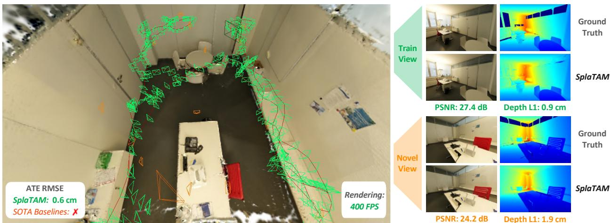
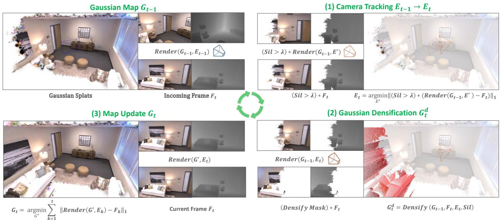
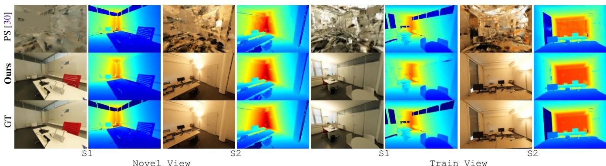

# SplaTAM: Splat, Track & Map 3D Gaussians for Dense RGB-D SLAM

spla-tam.github.io

Nikhil Keetha1, Jay Karhade1, Krishna Murthy Jatavallabhula2, Gengshan Yang1, Sebastian Scherer1, Deva Ramanan1, and Jonathon Luiten1

1CMU 2MIT

  
Figure 1. SplaTAM enables precise camera tracking and high-fidelity reconstruction for dense simultaneous localization and mapping (SLAM) in challenging real-world scenarios. SplaTAM achieves this by online optimization of an explicit volumetric representation, 3D Gaussian Splatting [14], using differentiable rendering. Left: We showcase the high-fidelity 3D Gaussian Map along with the train (SLAM-input) & novel view camera frustums. It can be noticed that SplaTAM achieves sub-cm localization despite the large motion between subsequent cameras in the texture-less environment. This is particularly challenging for state-of-the-art baselines leading to the failure of tracking. Right: SplaTAM enables photo-realistic rendering of both train & novel views at 400 FPS for a resolution of 876 × 584.

## Abstract

Dense simultaneous localization and mapping (SLAM) is crucial for robotics and augmented reality applications. However, current methods are often hampered by the nonvolumetric or implicit way they represent a scene. This work introduces SplaTAM, an approach that, for the first time, leverages explicit volumetric representations, i.e., 3D Gaussians, to enable high-fidelity reconstruction from a single unposed RGB-D camera, surpassing the capabilities of existing methods. SplaTAM employs a simple online tracking and mapping system tailored to the underlying Gaussian representation. It utilizes a silhouette mask to elegantly capture the presence ofscene density. This combination enables several benefits over prior representations, including fast rendering and dense optimization, quickly determining if areas have been previously mapped, and structured map expansion by adding more Gaussians. Extensive experiments show that SplaTAM achieves up to 2× superior performance in camera pose estimation, map construction, and novel-view synthesis over existing methods, paving the wayfor more immersive high-fidelity SLAM applications.

## 1. Introduction

Visual simultaneous localization and mapping (SLAM)— the task of estimating the pose of a vision sensor (such as a depth camera) and a map of the environment—is an essential capability for vision or robotic systems to operate in previously unseen 3D environments. For the past three decades, SLAM research has extensively centered around the question of map representation – resulting in a variety of sparse [2, 3, 7, 23], dense [4, 6, 8, 13, 15, 25, 26, 34, 42, 43], and neural scene representations [21, 29, 30, 37, 46, 55]. Map representation is a fundamental choice that dramatically impacts the design of every processing block within the SLAM system, as well as of the downstream tasks that depend on the outputs of SLAM.

In terms of dense visual SLAM, the most successful handcrafted representations are points, surfels/flats, and signed distance fields. While systems based on such map representations have matured to production level over the past years, there are still significant shortcomings that need to be addressed. Tracking explicit representations relies crucially on the availability of rich 3D geometric features and high-framerate captures. Furthermore, these approaches only reliably explain the observed parts of the scene; many applications, such as mixed reality and highfidelity 3D capture, require techniques that can also explain/synthesize unobserved/novel camera viewpoints [32].

The shortcomings of handcrafted representations, combined with the emergence of radiance field representations [21] for high-quality image synthesis, have fueled a recent class of methods that attempt to encode the scene into the weight space of a neural network. These radiance-fieldbased SLAM algorithms [30, 54] benefit from high-fidelity global maps and image reconstruction losses that capture dense photometric information via differentiable rendering. However, current methods use implicit neural representations to model the volumetric radiance fields, which causes a number of issues in the SLAM setting - they are computationally inefficient, not easy to edit, do not model spatial geometry explicitly, and suffer from catastrophic forgetting.

In this context, we explore the question, “How can one use an explicit volumetric representation to design a SLAM solution?” Specifically, we use a radiance field based on 3D Gaussians [14] to Splat (Render), Track, and Map for SLAM. We believe that this representation has the following benefits over existing map representations:

• Fast rendering and rich optimization: Gaussian Splatting can be rendered at speeds up to 400 FPS, making it significantly faster to visualize and optimize than implicit alternatives. The key enabling factor for fast optimization is the rasterization of 3D primitives. We introduce several simple modifications that make splatting even faster for SLAM, including the removal of view-dependent appearance and the use of isotropic Gaussians. Furthermore, this allows us to use dense photometric loss for SLAM in real-time, in contrast to traditional & implicit map representations that rely respectively on sparse 3D geometric features or pixel-sampling to maintain efficiency.

• Maps with explicit spatial extent: The spatial frontier of the existing map can be easily controlled by adding Gaussians only in parts of the scene that have been observed in the past. Given a new image frame, this allows one to efficiently identify which portions of the scene are new content (outside the map’s spatial frontier) by rendering a silhouette. This is crucial for camera tracking as we only want to compare mapped areas of the scene to new images. However, this is difficult for implicit map representations, as the network is subject to global changes during gradient-based optimization for the unmapped space.

• Explicit map: We can arbitrarily increase the map capacity by simply adding more Gaussians. Furthermore, this explicit volumetric representation enables us to edit parts of the scene, while still allowing photo-realistic rendering. Implicit approaches cannot easily increase their capacity or edit their represented scene.

• Direct gradient flow to parameters: As the scene is represented by Gaussians with physical 3D locations, colors, and sizes, there is a direct, almost linear (projective) gradient flow between the parameters and the rendering. Because camera motion can be thought of as keeping the camera still and moving the scene, we also have a direct gradient into the camera parameters, which enables fast optimization. Neural-based representations don’t have this as the gradient needs to flow through (potentially many) non-linear neural network layers.

Given all of the above advantages, an explicit volumetric representation is a natural way for efficiently inferring a high-fidelity spatial map while simultaneously estimating camera motion, as is also visible from Fig. 1. We show across all our experiments on simulated and real data that our approach, SplaTAM, achieves state-of-the-art results compared to all previous approaches for camera pose estimation, map estimation, and novel-view synthesis.

## 2. Related Work

In this section, we briefly review various approaches to dense SLAM, with a particular emphasis on recent approaches that leverage implicit representations encoded in overfit neural networks for tracking and mapping. For a more detailed review of traditional SLAM methods, we refer the interested reader to this excellent survey [2].

Traditional approaches to dense SLAM have explored a variety of explicit representations, including 2.5D images [15, 34], (truncated) signed-distance functions [6, 25, 26, 42], gaussian mixture models [9, 10] and circular surfels [13, 33, 43]. Of particular relevance to this work is surfels, which are colored circular surface elements and can be optimized in real-time from RGB-D image inputs as shown in [13, 33, 43]. While the aforementioned SLAM approaches do not assume the visibility function to be differentiable, there exist modern differentiable rasterizers that enable gradient flow through depth discontinuities [50]. However, since 2D surfels are discontinuous, they need careful regularization to prevent holes [33, 50]. In this work, we use volumetric (as opposed to surface-only) scene representations in the form of 3D Gaussians, enabling easy continuous optimization for fast and accurate SLAM.

Pretrained neural network representations have been integrated with traditional SLAM techniques, largely focusing on predicting depth from RGB images. These approaches range from directly integrating depth predictions from a neural network into SLAM [38], to learning a variational autoencoder that decodes compact optimizable latent codes to depth maps [1, 52], to approaches that simultaneously learn to predict a depth cost volume and tracking [53]. Implicit scene representations: iMAP [37] first performed both tracking and mapping using neural implicit representations. To improve scalability, NICE-SLAM [54] proposed the use of hierarchical multi-feature grids. On similar lines, iSDF [28] used implicit representations to efficiently compute signed-distances, compared to [25, 27]. Following this, a number of works [11, 18, 19, 22, 29, 31, 41, 51, 55], have recently advanced implicit-based SLAM through a number of ways - by reducing catastrophic forgetting via continual learning(experience replay), capturing semantics, incorporating uncertainty, employing efficient resolution hash-grids and encodings, and using improved losses. More recently, Point-SLAM [30], proposes an alternative route, similar to [45] by using neural point clouds and performing volumetric rendering with feature interpolation, offering better 3-D reconstruction, especially for robotics. However, like other implicit representations, volumetric ray sampling greatly limits its efficiency, thereby resorting to optimization over a sparse set of pixels as opposed to per-pixel dense photometric error. Instead, SplaTAM’s explicit volumetric radiance model leverages fast rasterization, enabling complete use of per-pixel dense photometric errors.

  
Figure 2. Overview of SplaTAM. Top-Left: The input to our approach at each timestep is the current RGB-D frame and the 3D Gaussian Map Representation that we have built representing all of the scene seen so far. Top-Right: Step (1) estimates the camera pose for the new image, using silhouette-guided differentiable rendering. Bottom-Right: Step (2) increases the map capacity by adding new Gaussians based on the rendered silhouette and input depth. Bottom-Left: Step (3) updates the underlying Gaussian map with differentiable rendering

3D Gaussian Splatting: Recently, 3D Gaussians have emerged as a promising 3D scene representation [14, 16, 17, 40], in particular with the ability to differentiably render them extremely quickly via splatting [14]. This approach has also been extended to model dynamic scenes [20, 44, 47, 48] with dense 6-DOF motion [20]. Such approaches for both static and dynamic scenes require that each input frame has an accurately known 6-DOF camera pose, in order to successfully optimize the representation. For the first time our approach removes this constraint, simultaneously estimating the camera poses while also fitting the underlying Gaussian representation.

## 3. Method

SplaTAM is the first dense RGB-D SLAM solution to use 3D Gaussian Splatting [14]. By modeling the world as a collection of 3D Gaussians which can be rendered into highfidelity color and depth images, we are able to directly use differentiable-rendering and gradient-based-optimization to optimize both the camera pose for each frame and an underlying volumetric discretized map of the world.

Gaussian Map Representation. We represent the underlying map of the scene as a set of 3D Gaussians. We made a number of simplifications to the representation proposed in [14], by using only view-independent color and forcing Gaussians to be isotropic. This implies each Gaussian is parameterized by only 8 values: three for its RGB color c, three for its center position $\pmb { \mu } \in \mathbb { R } ^ { 3 }$ , one for its radius r and one for its opacity $o \in [ 0 , 1 ]$ . Each Gaussian influences a point in 3D space $\mathbf { x } \in \mathbb { R } ^ { 3 }$ according to the standard (unnormalized) Gaussian equation weighted by its opacity:

$$
f ( \mathbf { x } ) = o \exp \left( - \frac { \| \mathbf { x } - \pmb { \mu } \| ^ { 2 } } { 2 r ^ { 2 } } \right) .\tag{1}
$$

Differentiable Rendering via Splatting. The core of our approach is the ability to render high-fidelity color, depth, and silhouette images from our underlying Gaussian Map into any possible camera reference frame in a differentiable way. This differentiable rendering allows us to directly calculate the gradients in the underlying scene representation (Gaussians) and camera parameters with respect to the error between the renders and provided RGB-D frames, and update both the Gaussians and camera parameters to minimize this error, thus fitting both accurate camera poses and an accurate volumetric representation of the world.

Gaussian Splatting [14] renders an RGB image as follows: Given a collection of 3D Gaussians and camera pose, first sort all Gaussians from front-to-back. RGB images can then be efficiently rendered by alpha-compositing the splatted 2D projection of each Gaussian in order in pixel space. The rendered color of pixel ${ \bf p } = ( u , \nu )$ can be written as:

$$
C ( \mathbf { p } ) = \sum _ { i = 1 } ^ { n } \mathbf { c } _ { i } f _ { i } ( \mathbf { p } ) \prod _ { j = 1 } ^ { i - 1 } ( 1 - f _ { j } ( \mathbf { p } ) ) ,\tag{2}
$$

where $f _ { i } ( \mathbf { p } )$ is computed as in Eq. (1) but with $\pmb { \mu }$ and $r$ of the splatted 2D Gaussians in pixel-space:

$$
\pmb { \mu } ^ { \mathrm { 2 D } } = K \frac { E _ { t } \pmb { \mu } } { d } , \qquad r ^ { \mathrm { 2 D } } = \frac { f r } { d } , \quad \mathrm { w h e r e } \quad d = ( E _ { t } \pmb { \mu } ) _ { z } .\tag{3}
$$

Here, K is the (known) camera intrinsic matrix, $E _ { t }$ is the extrinsic matrix capturing the rotation and translation of the camera at frame $t , f$ is the (known) focal length, and d is the depth of the $i ^ { t h }$ Gaussian in camera coordinates.

We propose to similarly differentiably render depth:

$$
D ( \mathbf { p } ) = \sum _ { i = 1 } ^ { n } d _ { i } f _ { i } ( \mathbf { p } ) \prod _ { j = 1 } ^ { i - 1 } ( 1 - f _ { j } ( \mathbf { p } ) ) ,\tag{4}
$$

which can be compared against the input depth map and return gradients with respect to the 3D map.

We also render a silhouette image to determine visibility $- \mathrm { e . g . }$ if a pixel contains information from the current map:

$$
S ( \mathbf { p } ) = \sum _ { i = 1 } ^ { n } f _ { i } ( \mathbf { p } ) \prod _ { j = 1 } ^ { i - 1 } ( 1 - f _ { j } ( \mathbf { p } ) ) .\tag{5}
$$

SLAM System. We build a SLAM system from our Gaussian representation and differentiable renderer. We begin with a brief overview and then describe each module in detail. Assume we have an existing map (represented via a set of 3D Gaussians) that has been fitted from a set of camera frames 1 to t. Given a new RGB-D frame t + 1, our SLAM system performs the following steps (see Fig. 2):

(1) Camera Tracking. We minimize the image and depth reconstruction error of the RGB-D frame with respect to camera pose parameters for $t + 1$ , but only evaluate errors over pixels within the visible silhouette.

(2) Gaussian Densification. We add new Gaussians to the map based on the rendered silhouette and input depth.

(3) Map Update. Given the camera poses from frame 1 to t + 1, we update the parameters of all the Gaussians in the scene by minimizing the RGB and depth errors over all images up to t + 1. In practice, to keep the batch size manageable, a selected subset of keyframes that overlap with the most recent frame are optimized.

Initialization. For the first frame, the tracking step is skipped, and the camera pose is set to identity. In the densification step, since the rendered silhouette is empty, all pixels are used to initialize new Gaussians. Specifically, for each pixel, we add a new Gaussian with the color of that pixel, the center at the location of the unprojection of that pixel depth, an opacity of 0.5, and a radius equal to having a one-pixel radius upon projection into the 2D image given by dividing the depth by the focal length:

$$
r = \frac { D _ { \mathrm { G T } } } { f }\tag{6}
$$

Camera Tracking. Camera Tracking aims to estimate the camera pose of the current incoming online RGB-D image. The camera pose is initialized for a new timestep by a constant velocity forward projection of the pose parameters in the camera center + quaternion space. E.g. the camera parameters are initialized using the following:

$$
E _ { t + 1 } = E _ { t } + \left( E _ { t } - E _ { t - 1 } \right)\tag{7}
$$

The camera pose is then updated iteratively by gradientbased optimization through differentiably rendering RGB, depth, and silhouette maps, and updating the camera parameters to minimize the following loss while keeping the Gaussian parameters fixed:

$$
L _ { \mathrm { t } } = \sum _ { \mathbf { p } } \Big ( S ( \mathbf { p } ) > 0 . 9 9 \Big ) \Big ( \mathrm { L } _ { 1 } \big ( D ( \mathbf { p } ) \big ) + 0 . 5 \mathrm { L } _ { 1 } \big ( C ( \mathbf { p } ) \big ) \Big )\tag{8}
$$

This is an L1 loss on both the depth and color renders, with color weighted down by half. The color weighting is empirically selected, where we observe the range of $C ( \mathbf { p } )$ to be [0.01, 0.03] & $D ( \mathbf { p } )$ to be [0.002, 0.006]. We only apply the loss over pixels that are rendered from well-optimized parts of the map by using our rendered visibility silhouette which captures the epistemic uncertainty of the map. This is very important for tracking new camera poses, as often new frames contain new information that hasn’t been captured or well optimized in our map yet. The L1 loss also gives a value of 0 if there is no ground-truth depth for a pixel.

Gaussian Densification. Gaussian Densification aims to initialize new Gaussians in our Map at each incoming online frame. After tracking we have an accurate estimate for the camera pose for this frame, and with a depth image we have a good estimate for where Gaussians in the scene should be. However, we don’t want to add Gaussians where the current Gaussians already accurately represent the scene geometry. Thus we create a densification mask to determine which pixels should be densified:

$$
\begin{array} { l } { M ( \mathbf { p } ) = \left( S ( \mathbf { p } ) < 0 . 5 \right) + } \\ { \qquad \left( D _ { \mathrm { G T } } ( \mathbf { p } ) < D ( \mathbf { p } ) \right) \left( \mathrm { L } _ { 1 } \big ( D ( \mathbf { p } ) \big ) > \lambda \mathrm { M D E } \right) } \end{array}\tag{9}
$$

This mask indicates where the map isn’t adequately dense (S < 0.5), or where there should be new geometry in front of the current estimated geometry (i.e., the ground-truth depth is in front of the predicted depth, and the depth error is greater than λ times the median depth error (MDE), where λ is empirically selected as 50). For each pixel, based on this mask, we add a new Gaussian following the same procedure as first-frame initialization.

Gaussian Map Updating. This aims to update the parameters of the 3D Gaussian Map given the set of online camera poses estimated so far. This is done again by differentiablerendering and gradient-based-optimization, however unlike tracking, in this setting the camera poses are fixed, and the parameters of the Gaussians are updated.

This is equivalent to the “classic” problem of fitting a radiance field to images with known poses. However, we make two important modifications. Instead of starting from scratch, we warm-start the optimization from the most recently constructed map. We also do not optimize over all previous (key)frames but select frames that are likely to influence the newly added Gaussians. We save each $n ^ { \mathrm { t h } }$ frame as a keyframe and select k frames to optimize, including the current frame, the most recent keyframe, and k − 2 previous keyframes which have the highest overlap with the current frame. Overlap is determined by taking the point cloud of the current frame depth map and determining the number of points inside the frustum of each keyframe.

This phase optimizes a similar loss as during tracking, except we don’t use the silhouette mask as we want to optimize over all pixels. Furthermore, we add an SSIM loss to RGB rendering and cull useless Gaussians that have near 0 opacity or are too large, as done partly in [14].

## 4. Experimental Setup

Datasets and Evaluation Settings. We evaluate our approach on four datasets: ScanNet++ [49], Replica [35], TUM-RGBD [36] and the original ScanNet [5]. The last three are chosen in order to follow the evaluation procedure of previous radiance-field-based SLAM methods Point-SLAM [30] and NICE-SLAM [54]. However, we also add ScanNet++ [49] evaluation because none of the other three benchmarks have the ability to evaluate rendering quality on hold out novel views and only evaluate camera pose estimation and rendering on the training views.

Replica [35] is the simplest benchmark as it contains synthetic scenes, highly accurate and complete (synthetic) depth maps, and small displacements between consecutive camera poses. TUM-RGBD [36] and the original Scan-Net are harder, especially for dense methods, due to poor RGB and depth image quality as they both use old lowquality cameras. Depth images are quite sparse with lots of missing information, and the color images have a very high amount of motion blur. For ScanNet++ [49] we use the DSLR captures from two scenes (8b5caf3398 (S1) and b20a261fdf (S2)), where complete dense trajectories are present. In contrast to other benchmarks, Scan-Net++ color and depth images are very high quality, and provide a second capture loop for each scene to evaluate completely novel hold-out views. However, each camera pose is very far apart from one another making poseestimation very difficult. The difference between consecutive frames on ScanNet++ is about the same as a 30-frame gap on Replica. For all benchmarks except ScanNet++, we take baseline numbers from Point-SLAM [30]. Similar to Point-SLAM, we evaluate every 5th frame for the training view rendering benchmarking on Replica. Furthermore, for all comparisons to prior baselines, we present results as the average of 3 seeds (0-2) and use seed 0 for the ablations.

Evaluation Metrics. We follow all evaluation metrics for camera pose estimation and rendering performance as [30]. For measuring RGB rendering performance we use PSNR, SSIM and LPIPS. For depth rendering performance we use Depth L1 loss. For camera pose estimation tracking we use the average absolute trajectory error (ATE RMSE).

Baselines. The main baseline method we compare to is Point-SLAM [30], the previous state-of-the-art (SOTA) method for dense radiance-field-based SLAM. We also compare to older dense SLAM approaches such as NICE-SLAM [54], Vox-Fusion [46], and ESLAM [12] where appropriate. Lastly, we compare against traditional SLAM systems such as Kintinuous [42], ElasticFusion [43], and ORB-SLAM2 [23] on TUM-RGBD, DROID-SLAM [39] on Replica, and ORB-SLAM3 [3] on ScanNet++.

## 5. Results & Discussion

In this section, we first discuss our evaluation results on camera pose estimation for the four benchmark datasets. Then, we further showcase our high-fidelity 3D Gaussian reconstructions and provide qualitative and quantitative comparisons of our rendering quality (both for novel views and input training views). Finally, we discuss pipeline ablations and provide a runtime comparison.

<table><tr><td>Methods</td><td>Avg.</td><td>S1</td><td>S2</td></tr><tr><td>Point-SLAM [30]</td><td>343.8</td><td>296.7</td><td>390.8</td></tr><tr><td>ORB-SLAM3 [3]</td><td>158.2</td><td>156.8</td><td>159.7</td></tr><tr><td>SplaTAM</td><td>1.2</td><td>0.6</td><td>1.9</td></tr></table>

ScanNet++ [49]

<table><tr><td>Methods</td><td>Avg.</td><td>fr1/ desk</td><td>fr1/ desk2</td><td>fr1/ room</td><td>fr2/ xyz</td><td>fr3/ off.</td></tr><tr><td>Kintinuous [42]</td><td>4.84</td><td>3.70</td><td>7.10</td><td>7.50</td><td>2.90</td><td>3.00</td></tr><tr><td>ElasticFusion [43]</td><td>6.91</td><td>2.53</td><td>6.83</td><td>21.49</td><td>1.17</td><td>2.52</td></tr><tr><td>ORB-SLAM2 [23]</td><td>1.98</td><td>1.60</td><td>2.20</td><td>4.70</td><td>0.40</td><td>1.00</td></tr><tr><td>NICE-SLAM [54]</td><td>15.87</td><td>4.26</td><td>4.99</td><td>34.49</td><td>31.73</td><td>3.87</td></tr><tr><td>Vox-Fusion [46]</td><td>11.31</td><td>3.52</td><td>6.00</td><td>19.53</td><td>1.49</td><td>26.01</td></tr><tr><td>Point-SLAM [30]</td><td>8.92</td><td>4.34</td><td>4.54</td><td>30.92</td><td>1.31</td><td>3.48</td></tr><tr><td>SplaTAM</td><td>5.48</td><td>3.35</td><td>6.54</td><td>11.13</td><td>1.24</td><td>5.16</td></tr><tr><td></td><td></td><td></td><td></td><td></td><td></td><td></td></tr></table>

TUM-RGBD [36]

<table><tr><td>Methods Avg. R0 R1 R2 Of0</td></tr><tr><td>Of1 Of2 of3 Of4 DROID-SLAM [39] 0.38 0.53 0.38 0.45 0.35 0.24 0.36 0.33 0.43</td></tr><tr><td>Vox-Fusion [46] 3.09 1.37 4.70 1.47 8.48 2.04 2.58 1.11 2.94 1.10 1.13</td></tr><tr><td>NICE-SLAM [54] 1.06 0.97 1.31 1.07 0.88 1.00 1.06 ESLAM [12] 0.63 0.71 0.70 0.52 0.57 0.55 0.58</td></tr><tr><td>0.72 0.63 Point-SLAM [30] 0.52 0.61 0.41 0.37 0.38 0.48 0.54 0.69 0.72</td></tr><tr><td>SplaTAM 0.36 0.31 0.40 0.29 0.47 0.27 0.29 0.32 0.55</td></tr><tr><td>Replica [35]</td></tr><tr><td>Methods Avg. 0000 0059 0106 0169 0181 0207</td></tr><tr><td>Vox-Fusion [46] 26.90 68.84 24.18 8.41 27.28 23.30 9.41</td></tr><tr><td>NICE-SLAM [54] 10.70 12.00 14.00 7.90 10.90 13.40 6.20</td></tr><tr><td>Point-SLAM [30] 12.19 10.24 7.81 8.65 22.16 14.77 9.54</td></tr><tr><td>SplaTAM 11.88 12.83 10.10 17.72 12.08 11.10 7.46</td></tr><tr><td>Orig-ScanNet [5]</td></tr></table>

Table 1. Online Camera-Pose Estimation Results on Four Datasets (ATE RMSE ↓[cm]). Our method consistently outperforms all the SOTA-dense baselines on ScanNet++, Replica, and TUM-RGBD, while providing competitive performance on Orig-ScanNet [5]. Best results are highlighted as first , second , and third . Numbers for the baselines on Orig-ScanNet [5], TUM-RGBD [36] and Replica [35] are taken from Point-SLAM [30].

Camera Pose Estimation Results. In Table 1, we compare our method’s camera pose estimation results to a number of baselines on four datasets [5, 35, 36, 49].

On ScanNet++ [49], both SOTA SLAM approaches Point-SLAM [30] and ORB-SLAM3 [3] (RGB-D variant) completely fail to correctly track the camera pose due to the very large displacement between contiguous cameras, and thus give very large pose-estimation errors. In particular, for ORB-SLAM3, we observe that the texture-less ScanNet++ scans cause the tracking to re-initialize multiple times due to the lack of features. In contrast, our approach successfully manages to track the camera over both sequences giving an average trajectory error of only 1.2cm.

On the relatively easy synthetic Replica [35] dataset, the de-facto evaluation benchmark, our approach reduces the trajectory error over the prior SOTA-dense baseline [30] by more than 30% from 0.52cm to 0.36cm. Furthermore, SplaTAM provides better or competitive performance to a feature-based tracking method such as DROID-SLAM [39].

On TUM-RGBD [36], all the volumetric methods struggle immensely due to both poor depth sensor information (very sparse) and poor RGB image quality (extremely high motion blur). Compared to prior methods in this category [30, 54], SplaTAM still significantly outperforms, decreasing the trajectory error of the prior SOTA in this category [30] by almost 40%, from 8.92cm to 5.48cm. Also, we observe that feature-based methods (ORB-SLAM2 [23]) still outperform dense methods on this benchmark.

The original ScanNet [5] benchmark has similar issues to TUM-RGBD, where no dense volumetric method is able to obtain results with less than 10cm error & SplaTAM performs similarly to the two prior SOTA methods [30, 54].

Overall these camera pose estimation results are extremely promising and show off the strengths of our SplaTAM method. The results on ScanNet++ show that if you have high-quality clean input images, our approach can successfully and accurately perform SLAM even with extremely large motions between camera positions, which is not something that is possible with previous SOTA approaches such as Point-SLAM [30] and ORB-SLAM3 [3].

Rendering Quality Results. In Table 2, we evaluate our method’s rendering quality on the input views of Replica dataset [35] (as is the standard evaluation approach from Point-SLAM [30] and NICE-SLAM [54]). Our approach achieves similar PSNR, SSIM, and LPIPS results as Point-SLAM [30], although the comparison is not fair as Point-SLAM has the unfair advantage as it takes the ground-truth depth of these images as an input for where to sample its 3D volume for rendering. Our approach achieves much better results than the other baselines Vox-Fusion [46] and NICE-SLAM [54], improving over both by around 10dB in PSNR.

In general, we believe that the rendering results on Replica in Table 2 are irrelevant because the rendering performance is evaluated on the same training views that were passed in as input, and methods can simply have a high capacity and overfit to these images. We only show this as this is the de-facto evaluation for prior methods, and we wish to have some way to compare against them.

Hence, a better evaluation is to evaluate novel-view rendering. However, all current SLAM benchmarks don’t have a hold-out set of images separate from the camera trajectory that the SLAM algorithm estimates, so they cannot be used for this purpose. Therefore, we set up a novel benchmark for this using the new high-quality ScanNet++ [49] dataset.

<table><tr><td>Methods</td><td>Metrics</td><td>Avg. R0</td><td>R1</td><td>R2</td><td></td><td>Of0</td><td>Of1</td><td>Of2</td><td>Of3 Of4</td></tr><tr><td></td><td>PSNR ↑</td><td>24.41</td><td>22.39</td><td>22.36</td><td>23.92</td><td>27.79</td><td>29.83</td><td>20.33</td><td>23.47 25.21</td></tr><tr><td>Vox-Fusion [46]</td><td>SSIM ↑</td><td>0.80</td><td>0.68</td><td>0.75</td><td>0.80</td><td>0.86 0.88</td><td>0.79</td><td>0.80</td><td>0.85</td></tr><tr><td></td><td>LPIPS 米</td><td>0.24</td><td>0.30 0.27</td><td>0.23</td><td>0.24</td><td>0.18</td><td>0.24</td><td>0.21</td><td>0.20</td></tr><tr><td></td><td>PSNR 个</td><td>24.42</td><td>22.12</td><td>22.47 24.52</td><td></td><td>29.07 30.34</td><td></td><td>19.6622.2324.94</td><td></td></tr><tr><td>NICE-SLAM [54]</td><td>SSIM ↑</td><td>0.81</td><td>0.69</td><td>0.76</td><td>0.81</td><td>0.87</td><td>0.89</td><td>0.80 0.80</td><td>0.86</td></tr><tr><td></td><td>LPIPS</td><td>0.23</td><td>0.33</td><td>0.27</td><td>0.21</td><td>0.23</td><td>0.18 0.24</td><td>0.21</td><td>0.20</td></tr><tr><td></td><td>PSNR ↑</td><td>35.17</td><td>32.40</td><td>34.08</td><td> 35.50 38.26</td><td></td><td>39.16</td><td>33.99 33.48 33.49</td><td></td></tr><tr><td>Point-SLAM [30]</td><td>SSIM↑</td><td>0.98</td><td>0.97</td><td>0.98</td><td>0.98</td><td>0.98</td><td>0.99</td><td>0.96 0.96</td><td>0.98</td></tr><tr><td></td><td>LPIPS X</td><td>0.12</td><td>0.11</td><td>0.12</td><td>0.11</td><td>0.10</td><td>0.12 0.16</td><td>0.13</td><td>0.14</td></tr><tr><td></td><td>PSNR ↑</td><td>34.11</td><td>32.86</td><td>33.89 35.25</td><td></td><td>38.26 39.17</td><td>31.97 </td><td></td><td>29.70 31.81</td></tr><tr><td>SplaTAM</td><td></td><td></td><td>0.98</td><td>0.97</td><td>0.98</td><td>0.98</td><td></td><td>0.97</td><td></td></tr><tr><td></td><td>SSIM↑ LPIPS</td><td>0.97 0.10 0.07</td><td></td><td>0.10</td><td>0.08</td><td>0.09 0.09</td><td>0.98 0.10</td><td>0.95</td><td>0.95 0.12 0.15</td></tr></table>

Table 2. Quantitative Train View Rendering Performance on Replica [35]. SplaTAM is comparable to the SOTA baseline, Point-SLAM [30] and consistently outperforms the other dense SLAM methods by a large margin. Numbers for the baselines are taken from Point-SLAM [30]. Note that Point-SLAM uses ground-truth depth for rendering.

The results for both novel-view and training-view rendering on this ScanNet++ benchmark can be found in Table 3. Our approach achieves a good novel-view synthesis result of 24.41 PSNR on average and slightly higher on training views with 27.98 PSNR. Note that for novel-view synthesis, we use the ground-truth pose of the novel view to align it with the origin of the SLAM map, i.e., the first SLAM frame. Since Point-SLAM [30] fails to successfully estimate the camera poses and build a good map, it also completely fails on the task of novel-view synthesis.

We can also evaluate the geometric reconstruction of the scene by evaluating the rendered depth and comparing it to the ground-truth depth, again for both training and novel views. Our method obtains an incredibly accurate reconstruction with a depth error of only around 2cm in novel views and 1.3cm in training views.

Visual results of both novel-view and training-view rendering for RGB and depth can be seen in Fig. 3. As can be seen, our methods achieve visually excellent results over both scenes for both novel and training views. In contrast, Point-SLAM [30] fails at camera-pose tracking and overfits to the training views, and isn’t able to successfully render novel views at all. Point-SLAM also takes the ground-truth depth as an input for rendering to determine where to sample, and as such the depth maps look similar to the groundtruth, while color rendering is completely wrong.

With this novel benchmark that is able to correctly evaluate Novel-View Synthesis and SLAM simultaneously, as well as our approach as a strong initial baseline for this benchmark, we hope to inspire many future approaches that improve upon these results for both tasks.

Color and Depth Loss Ablation. Our SplaTAM involves fitting the camera poses (during tracking) and the scene map (during mapping) using both a photometric (RGB) and depth loss. In Table 4, we ablate the decision to use both and investigate the performance of only one or the other for both tracking and mapping. We do this using Room 0 of Replica. With only depth our method completely fails to track the camera trajectory, because the L1 depth loss doesn’t provide adequate information in the x-y image plane. Using only an RGB loss successfully tracks the camera trajectory (although with more than 5x the error as using both). Both the RGB and depth work together to achieve excellent results. With only the color loss, reconstruction PSNR is really high, only 1.5 PSNR lower than the full model. However, the depth L1 is much higher using only color vs directly optimizing this depth error. In the color-only experiments, the depth is not used for tracking & mapping, but it is used for the densification and initialization of Gaussians.

<table><tr><td rowspan="2">Methods</td><td rowspan="2">Metrics</td><td colspan="3">Novel View</td><td colspan="3">Training View</td></tr><tr><td>Avg.</td><td>S1</td><td>S2</td><td>Avg.</td><td>S1</td><td>S2</td></tr><tr><td rowspan="4">Point-SLAM [30]</td><td>PSNR [dB] ↑</td><td>11.91</td><td>12.10</td><td>11.73</td><td>14.46</td><td>14.62</td><td>14.30</td></tr><tr><td>SSIM↑</td><td>0.28</td><td>0.31</td><td>0.26</td><td>0.38</td><td>0.35</td><td>0.41</td></tr><tr><td>LPIPS ↓</td><td>0.68</td><td>0.62</td><td>0.74</td><td>0.65</td><td>0.68</td><td>0.62</td></tr><tr><td>Depth L1 [cm] ↓</td><td>x</td><td>x</td><td>x</td><td>x</td><td>X</td><td>X</td></tr><tr><td rowspan="4"></td><td>PSNR [dB] ↑</td><td></td><td>23.99</td><td></td><td>27.98</td><td>27.82</td><td></td></tr><tr><td></td><td>24.41</td><td></td><td>24.84</td><td></td><td></td><td>28.14</td></tr><tr><td>SSIM↑</td><td>0.88</td><td>0.88</td><td>0.87</td><td>0.94</td><td>0.94</td><td>0.94</td></tr><tr><td>LPIPS ↓ Depth L1 [cm] ↓</td><td>0.24 2.07</td><td>0.21 1.91</td><td>0.26 2.23</td><td>0.12 1.28</td><td>0.12 0.93</td><td>0.13 1.64</td></tr></table>

Table 3. Novel & Train View Rendering Performance on Scan-Net++ [49]. SplaTAM provides high-fidelity performance on both training views seen during SLAM and held-out novel views from any camera pose. On the other hand, Point-SLAM [30] requires ground-truth depth & performs poorly.
<table><tr><td>Track. Color</td><td>Map. Color</td><td>Track. Depth</td><td>Map. Depth</td><td>ATE [cm]↓</td><td>Dep. L1 [cm]↓</td><td>PSNR [dB]↑</td></tr><tr><td>x</td><td>X</td><td>V</td><td>V</td><td>86.03</td><td>x</td><td>X</td></tr><tr><td>V</td><td></td><td>X</td><td>×</td><td>1.38</td><td>12.58</td><td>31.30</td></tr><tr><td>V</td><td>V</td><td>V</td><td>V</td><td>0.27</td><td>0.49</td><td>32.81</td></tr></table>

Table 4. Color & Depth Loss Ablation on Replica/Room 0.

<table><tr><td>Velo. Prop.</td><td>Sil. Mask</td><td>Sil. Thresh.</td><td>ATE [cm]↓</td><td>Dep. L1 [cm]↓</td><td>PSNR [dB]↑</td></tr><tr><td>X</td><td>V</td><td>0.99</td><td>2.95</td><td>2.15</td><td>25.40</td></tr><tr><td></td><td>X</td><td>0.99</td><td>115.80</td><td>0.29</td><td>14.16</td></tr><tr><td></td><td></td><td>0.5</td><td>1.30</td><td>0.74</td><td>31.36</td></tr><tr><td>7</td><td>L</td><td>0.99</td><td>0.27</td><td>0.49</td><td>32.81</td></tr></table>

Table 5. Camera Tracking Ablations on Replica/Room 0.

Camera Tracking Ablation. In Table 5, we ablate three aspects of our camera tracking: (1) the use of forward velocity propagation, (2) the use of a silhouette mask to mask out invalid map areas in the loss, and (3) setting the silhouette threshold to 0.99 instead of 0.5. All three are critical to excellent results. Without forward velocity propagation, tracking still works, but the overall error is more than 10x higher, which subsequently degrades the map and rendering. Silhouette is critical as without it tracking completely fails. Setting the silhouette threshold to 0.99 allows the loss to be applied on well-optimized pixels in the map, thereby leading to an important 5x reduction in the error compared to the threshold of 0.5, which is used for the densification.

  
Figure 3. Renderings on ScanNet++ [49]. Our method, SplaTAM, renders color & depth for the novel & train views with fidelity comparable to the ground truth. It can also be observed that Point-SLAM [30] fails to provide good renderings on both novel & train view images. Note that Point-SLAM (PS) uses the ground-truth depth to render the train & novel view images. Despite the use of ground-truth depth, the failure of PS can be attributed to the failure of tracking as shown in Tab. 1.

<table><tr><td>Methods</td><td>Tracking /Iteration</td><td>Mapping /Iteration</td><td>Tracking /Frame</td><td>Mapping /Frame</td><td>ATE RMSE [cm] ↓</td></tr><tr><td>NICE-SLAM [54]</td><td>30 ms</td><td>166 ms</td><td>1.18 s</td><td>2.04 s</td><td>0.97</td></tr><tr><td>Point-SLAM [30]</td><td>19 ms</td><td>30 ms</td><td>0.76 s</td><td>4.50 s</td><td>0.61</td></tr><tr><td>SplaTAM</td><td>25 ms</td><td>24 ms</td><td>1.00 s</td><td>1.44 s</td><td>0.27</td></tr><tr><td>SplaTAM-S</td><td>19 ms</td><td>22 ms</td><td>0.19 s</td><td>0.33 s</td><td>0.39</td></tr></table>

Table 6. Runtime on Replica/R0 using a RTX 3080 Ti.

Runtime Comparison. In Table 6, we compare our runtime to NICE-SLAM [54] and Point-SLAM [30] on a Nvidia RTX 3080 Ti. Each iteration of our approach renders a full 1200x980 pixel image (∼1.2 mil pixels) to apply the loss for both tracking and mapping. Other methods use only 200 pixels for tracking and 1000 pixels for mapping each iteration (but attempt to cleverly sample these pixels). Even though we differentiably render 3 orders of magnitude more pixels, our approach incurs similar runtime, primarily due to the efficiency of rasterizing 3D Gaussians. Additionally, we show a version of our method with fewer iterations and half-resolution densification, SplaTAM-S, which works 5x faster with only a minor degradation in performance. In particular, SplaTAM uses 40 and 60 iterations per frame for tracking & mapping respectively on Replica, while SplaTAM-S uses 10 and 15 iterations per frame.

Limitations & Future Work. Although SplaTAM achieves state-of-the-art performance, we find our method to show some sensitivity to motion blur, large depth noise, and aggressive rotation. We believe a possible solution would be to temporally model these effects and wish to tackle this in future work. Furthermore, SplaTAM can be scaled up to large-scale scenes through efficient representations like OpenVDB [24]. Finally, our method requires known camera intrinsics and dense depth as input for performing SLAM, and removing these dependencies is an interesting avenue for the future.

## 6. Conclusion

We present SplaTAM, a novel SLAM system that leverages 3D Gaussians as its underlying map representation to enable fast rendering and dense optimization, explicit knowledge of map spatial extent, and streamlined map densification. We demonstrate its effectiveness in achieving state-of-theart results in camera pose estimation, scene reconstruction, and novel-view synthesis. We believe that SplaTAM not only sets a new benchmark in both the SLAM and novelview synthesis domains but also opens up exciting avenues, where the integration of 3D Gaussian Splatting with SLAM offers a robust framework for further exploration and innovation in scene understanding. Our work underscores the potential of this integration, paving the way for more sophisticated and efficient SLAM systems in the future.

Acknowledgments. This work was supported in part by the Intelligence Advanced Research Projects Activity (IARPA) via Department of Interior/ Interior Business Center (DOI/IBC) contract number 140D0423C0074. The U.S. Government is authorized to reproduce and distribute reprints for Governmental purposes notwithstanding any copyright annotation thereon. Disclaimer: The views and conclusions contained herein are those of the authors and should not be interpreted as necessarily representing the official policies or endorsements, either expressed or implied, of IARPA, DOI/IBC, or the U.S. Government. This work used Bridges-2 at PSC through allocation cis220039p from the Advanced Cyberinfrastructure Coordination Ecosystem: Services & Support (ACCESS) program which is supported by NSF grants #2138259, #2138286, #2138307, #2137603, and #213296, and also supported by a hardware grant from Nvidia.

The authors thank Yao He for his support with testing ORB-SLAM3 & Jeff Tan for testing the code & demos. We also thank Chonghyuk (Andrew) Song, Margaret Hansen, John Kim & Michael Kaess for their insightful feedback & discussion on initial versions of the work.

## References

[1] Michael Bloesch, Jan Czarnowski, Ronald Clark, Stefan Leutenegger, and Andrew J Davison. Codeslam—learning a compact, optimisable representation for dense visual slam. In CVPR, 2018. 2

[2] Cesar Cadena, Luca Carlone, Henry Carrillo, Yasir Latif, Davide Scaramuzza, Jose Neira, Ian Reid, and John J´ Leonard. Past, present, and future of simultaneous localization and mapping: Toward the robust-perception age. IEEE Transactions on robotics, 32(6):1309–1332, 2016. 1, 2

[3] Carlos Campos, Richard Elvira, Juan J Gomez Rodr´ ´ıguez, Jose MM Montiel, and Juan D Tard´ os. Orb-slam3: An accu-´ rate open-source library for visual, visual–inertial, and multimap slam. IEEE Transactions on Robotics, 37(6):1874– 1890, 2021. 1, 5, 6

[4] Brian Curless and Marc Levoy. A volumetric method for building complex models from range images. In Proceedings of the 23rd annual conference on Computer graphics and interactive techniques, pages 303–312, 1996. 1

[5] Angela Dai, Angel X. Chang, Manolis Savva, Maciej Halber, Thomas Funkhouser, and Matthias Nießner. ScanNet: Richly-annotated 3D reconstructions of indoor scenes. In Conference on Computer Vision and Pattern Recognition (CVPR). IEEE/CVF, 2017. 5, 6

[6] Angela Dai, Matthias Nießner, Michael Zollofer, Shahram¨ Izadi, and Christian Theobalt. Bundlefusion: Real-time globally consistent 3d reconstruction using on-the-fly surface re-integration. ACM Transactions on Graphics 2017 (TOG), 2017. 1, 2

[7] Andrew J Davison, Ian D Reid, Nicholas D Molton, and Olivier Stasse. Monoslam: Real-time single camera slam. IEEE transactions on pattern analysis and machine intelligence, 29(6):1052–1067, 2007. 1

[8] Jakob Engel, Thomas Schops, and Daniel Cremers. Lsd-¨ slam: Large-scale direct monocular slam. In European conference on computer vision, pages 834–849. Springer, 2014. 1

[9] Kshitij Goel and Wennie Tabib. Incremental multimodal surface mapping via self-organizing gaussian mixture models. IEEE Robotics and Automation Letters, 8(12):8358–8365, 2023. 2

[10] Kshitij Goel, Nathan Michael, and Wennie Tabib. Probabilistic point cloud modeling via self-organizing gaussian mixture models. IEEE Robotics and Automation Letters, 8(5): 2526–2533, 2023. 2

[11] Xiao Han, Houxuan Liu, Yunchao Ding, and Lu Yang. Romap: Real-time multi-object mapping with neural radiance fields. arXiv preprint arXiv:2304.05735, 2023. 3

[12] Mohammad Mahdi Johari, Camilla Carta, and Franc¸ois Fleuret. Eslam: Efficient dense slam system based on hybrid representation of signed distance fields. In Proceedings of the IEEE/CVF Conference on Computer Vision and Pattern Recognition, pages 17408–17419, 2023. 5, 6

[13] Maik Keller, Damien Lefloch, Martin Lambers, Shahram Izadi, Tim Weyrich, and Andreas Kolb. Real-time 3d reconstruction in dynamic scenes using point-based fusion. In 2013, 2013. 1, 2

[14] Bernhard Kerbl, Georgios Kopanas, Thomas Leimkuhler,¨ and George Drettakis. 3d gaussian splatting for real-time radiance field rendering. ACM Transactions on Graphics, 42 (4), 2023. 1, 2, 3, 4, 5

[15] Christian Kerl, Jurgen Sturm, and Daniel Cremers. Robust¨ odometry estimation for rgb-d cameras. In ICRA, 2013. 1, 2

[16] Leonid Keselman and Martial Hebert. Approximate differentiable rendering with algebraic surfaces. In European Con ference on Computer Vision. Springer, 2022. 3

[17] Leonid Keselman and Martial Hebert. Flexible techniques for differentiable rendering with 3d gaussians. arXiv preprint arXiv:2308.14737, 2023. 3

[18] Xin Kong, Shikun Liu, Marwan Taher, and Andrew J Davison. vmap: Vectorised object mapping for neural field slam. In Proceedings of the IEEE/CVF Conference on Computer Vision and Pattern Recognition, pages 952–961, 2023. 3

[19] Heng Li, Xiaodong Gu, Weihao Yuan, Luwei Yang, Zilong Dong, and Ping Tan. Dense rgb slam with neural implicit maps. arXiv preprint arXiv:2301.08930, 2023. 3

[20] Jonathon Luiten, Georgios Kopanas, Bastian Leibe, and Deva Ramanan. Dynamic 3d gaussians: Tracking by persistent dynamic view synthesis. arXiv preprint arXiv:2308.09713, 2023. 3

[21] Ben Mildenhall, Pratul P Srinivasan, Matthew Tancik, Jonathan T Barron, Ravi Ramamoorthi, and Ren Ng. Nerf: Representing scenes as neural radiance fields for view synthesis. Communications ofthe ACM, 65(1):99–106, 2021. 1, 2

[22] Yuhang Ming, Weicai Ye, and Andrew Calway. idf-slam: End-to-end rgb-d slam with neural implicit mapping and deep feature tracking. arXiv preprint arXiv:2209.07919, 2022. 3

[23] Raul Mur-Artal and Juan D. Tardos. ORB-SLAM2: An Open-Source SLAM System for Monocular, Stereo, and RGB-D Cameras. IEEE Transactions on Robotics, 33(5): 1255–1262, 2017. 1, 5, 6

[24] Ken Museth, Jeff Lait, John Johanson, Jeff Budsberg, Ron Henderson, Mihai Alden, Peter Cucka, David Hill, and Andrew Pearce. Openvdb: An open-source data structure and toolkit for high-resolution volumes. In ACM SIGGRAPH Courses, 2013. 8

[25] Richard A Newcombe, Shahram Izadi, Otmar Hilliges, David Molyneaux, David Kim, Andrew J Davison, Pushmeet Kohli, Jamie Shotton, Steve Hodges, and Andrew W Fitzgibbon. Kinectfusion: Real-time dense surface mapping and tracking. In ISMAR, 2011. 1, 2, 3

[26] Richard A Newcombe, Steven J Lovegrove, and Andrew J Davison. Dtam: Dense tracking and mapping in real-time. In 2011 international conference on computer vision, pages 2320–2327. IEEE, 2011. 1, 2

[27] Helen Oleynikova, Zachary Taylor, Marius Fehr, Roland Siegwart, and Juan Nieto. Voxblox: Incremental 3d euclidean signed distance fields for on-board mav planning. In 2017 IEEE/RSJ International Conference on Intelligent Robots and Systems (IROS), pages 1366–1373. IEEE, 2017. 3

[28] Joseph Ortiz, Alexander Clegg, Jing Dong, Edgar Sucar, David Novotny, Michael Zollhoefer, and Mustafa Mukadam.

isdf: Real-time neural signed distance fields for robot perception. arXiv preprint arXiv:2204.02296, 2022. 3

[29] Antoni Rosinol, John J Leonard, and Luca Carlone. Nerfslam: Real-time dense monocular slam with neural radiance fields. arXiv preprint arXiv:2210.13641, 2022. 1, 3

[30] Erik Sandstrom, Yue Li, Luc Van Gool, and Martin R Os-¨ wald. Point-slam: Dense neural point cloud-based slam. In Proceedings of the IEEE/CVF International Conference on Computer Vision, pages 18433–18444, 2023. 1, 2, 3, 5, 6, 7, 8

[31] Erik Sandstrom, Kevin Ta, Luc Van Gool, and Martin R Os-¨ wald. Uncle-slam: Uncertainty learning for dense neural slam. arXiv preprint arXiv:2306.11048, 2023. 3

[32] Paul-Edouard Sarlin, Mihai Dusmanu, Johannes L Schonberger, Pablo Speciale, Lukas Gruber, Viktor¨ Larsson, Ondrej Miksik, and Marc Pollefeys. Lamar: Benchmarking localization and mapping for augmented reality. In European Conference on Computer Vision, pages 686–704. Springer, 2022. 2

[33] Thomas Schops, Torsten Sattler, and Marc Pollefeys. BAD SLAM: Bundle adjusted direct RGB-D SLAM. In CVF/IEEE Conference on Computer Vision and Pattern Recognition (CVPR), 2019. 2

[34] Frank Steinbrucker, J¨ urgen Sturm, and Daniel Cremers.¨ Real-time visual odometry from dense rgb-d images. In ICCV Workshops, 2011. 1, 2

[35] Julian Straub, Thomas Whelan, Lingni Ma, Yufan Chen, Erik Wijmans, Simon Green, Jakob J Engel, Raul Mur-Artal, Carl Ren, Shobhit Verma, et al. The replica dataset: A digital replica of indoor spaces. arXiv preprint arXiv:1906.05797, 2019. 5, 6, 7

[36] Jurgen Sturm, Nikolas Engelhard, Felix Endres, Wolfram¨ Burgard, and Daniel Cremers. A benchmark for the evaluation of RGB-D SLAM systems. In International Conference on Intelligent Robots and Systems (IROS). IEEE/RSJ, 2012. 5, 6

[37] Edgar Sucar, Shikun Liu, Joseph Ortiz, and Andrew J Davison. imap: Implicit mapping and positioning in real-time. In Proceedings of the IEEE/CVF International Conference on Computer Vision, pages 6229–6238, 2021. 1, 2

[38] K. Tateno, F. Tombari, I. Laina, and N. Navab. Cnn-slam: Real-time dense monocular slam with learned depth prediction. In CVPR, 2017. 2

[39] Zachary Teed and Jia Deng. Droid-slam: Deep visual slam for monocular, stereo, and rgb-d cameras. Advances in neural information processing systems, 2021. 5, 6

[40] Angtian Wang, Peng Wang, Jian Sun, Adam Kortylewski, and Alan Yuille. Voge: a differentiable volume renderer using gaussian ellipsoids for analysis-by-synthesis. In The Eleventh International Conference on Learning Representations, 2022. 3

[41] Hengyi Wang, Jingwen Wang, and Lourdes Agapito. Coslam: Joint coordinate and sparse parametric encodings for neural real-time slam. In Proceedings ofthe IEEE/CVF Conference on Computer Vision and Pattern Recognition, pages 13293–13302, 2023. 3

[42] Thomas Whelan, Michael Kaess, Hordur Johannsson, Maurice Fallon, John J Leonard, and John McDonald. Real-time

large-scale dense rgb-d slam with volumetric fusion. The International Journal ofRobotics Research, 34(4-5):598–626, 2015. 1, 2, 5, 6

[43] Thomas Whelan, Stefan Leutenegger, Renato Salas-Moreno, Ben Glocker, and Andrew Davison. Elasticfusion: Dense slam without a pose graph. In Robotics: Science and Systems, 2015. 1, 2, 5, 6

[44] Guanjun Wu, Taoran Yi, Jiemin Fang, Lingxi Xie, Xiaopeng Zhang, Wei Wei, Wenyu Liu, Qi Tian, and Xinggang Wang. 4d gaussian splatting for real-time dynamic scene rendering. arXiv preprint arXiv:2310.08528, 2023. 3

[45] Qiangeng Xu, Zexiang Xu, Julien Philip, Sai Bi, Zhixin Shu, Kalyan Sunkavalli, and Ulrich Neumann. Point-nerf: Point-based neural radiance fields. In Proceedings of the IEEE/CVF Conference on Computer Vision and Pattern Recognition, pages 5438–5448, 2022. 3

[46] Xingrui Yang, Hai Li, Hongjia Zhai, Yuhang Ming, Yuqian Liu, and Guofeng Zhang. Vox-fusion: Dense tracking and mapping with voxel-based neural implicit representation. In IEEE International Symposium on Mixed and Augmented Reality (ISMAR), pages 499–507. IEEE, 2022. 1, 5, 6, 7

[47] Ziyi Yang, Xinyu Gao, Wen Zhou, Shaohui Jiao, Yuqing Zhang, and Xiaogang Jin. Deformable 3d gaussians for high-fidelity monocular dynamic scene reconstruction. arXiv preprint arXiv:2309.13101, 2023. 3

[48] Zeyu Yang, Hongye Yang, Zijie Pan, Xiatian Zhu, and Li Zhang. Real-time photorealistic dynamic scene representation and rendering with 4d gaussian splatting. arXiv preprint arXiv:2310.10642, 2023. 3

[49] Chandan Yeshwanth, Yueh-Cheng Liu, Matthias Nießner, and Angela Dai. Scannet++: A high-fidelity dataset of 3d indoor scenes. In Proceedings of the IEEE/CVF International Conference on Computer Vision, pages 12–22, 2023. 5, 6, 7, 8, 1

[50] Wang Yifan, Felice Serena, Shihao Wu, Cengiz Oztireli,¨ and Olga Sorkine-Hornung. Differentiable surface splatting for point-based geometry processing. ACM Transactions on Graphics (TOG), 38(6):1–14, 2019. 2

[51] Wei Zhang, Tiecheng Sun, Sen Wang, Qing Cheng, and Norbert Haala. Hi-slam: Monocular real-time dense mapping with hybrid implicit fields. arXiv preprint arXiv:2310.04787, 2023. 3

[52] Shuaifeng Zhi, Michael Bloesch, Stefan Leutenegger, and Andrew J Davison. Scenecode: Monocular dense semantic reconstruction using learned encoded scene representations. In CVPR, 2019. 2

[53] Huizhong Zhou, Benjamin Ummenhofer, and Thomas Brox. Deeptam: Deep tracking and mapping. In ECCV, 2018. 2

[54] Zihan Zhu, Songyou Peng, Viktor Larsson, Weiwei Xu, Hujun Bao, Zhaopeng Cui, Martin R Oswald, and Marc Pollefeys. Nice-slam: Neural implicit scalable encoding for slam. In IEEE/CVF Conference on Computer Vision and Pattern Recognition, pages 12786–12796, 2022. 2, 5, 6, 7, 8, 1

[55] Zihan Zhu, Songyou Peng, Viktor Larsson, Zhaopeng Cui, Martin R Oswald, Andreas Geiger, and Marc Pollefeys. Nicer-slam: Neural implicit scene encoding for rgb slam. arXiv preprint arXiv:2302.03594, 2023. 1, 3