# Swarm-SLAM: Sparse Decentralized Collaborative Simultaneous Localization and Mapping Framework for Multi-Robot Systems

Pierre-Yves Lajoie and Giovanni Beltrame

Abstract—Collaborative Simultaneous Localization And Mapping (C-SLAM) is a vital component for successful multi-robot operations in environments without an external positioning system, such as indoors, underground or underwater. In this paper, we introduce Swarm-SLAM, an open-source C-SLAM system that is designed to be scalable, flexible, decentralized, and sparse, which are all key properties in swarm robotics. Our system supports lidar, stereo, and RGB-D sensing, and it includes a novel inter-robot loop closure prioritization technique that reduces communication and accelerates convergence. We evaluated our ROS 2 implementation on five different datasets, and in a real-world experiment with three robots communicating through an ad-hoc network.

Index Terms—SLAM, multi-robot systems, collaborative perception, swarm intelligence.

## I. INTRODUCTION

environment it provides is a prerequisite to many applications from autonomous warehouse management to subterranean exploration. One of the most powerful tools for robotic perception is Simultaneous Localization And Mapping (SLAM) which tightly couples the geometric perception ofthe environment with state estimation [1]. In addition to producing high-quality maps of the robot surroundings, it provides localization estimates that are essential for planning and control. However, single-robot SLAM estimates are local in the individual robot reference frame. Therefore, when multiple robots operate in GPS-denied environments, they do not share situational awareness unless they manage to connect, or merge, their local maps. To solve this problem, Collaborative SLAM (C-SLAM) searches for interrobot map links and uses them to combine the local maps into a shared global understanding ofthe environment. One ofthe main practical challenges in C-SLAM is resource management [2], in particular considering the severe communication and computation limitations of mobile robots. Those limitations need to be addressed to achieve real-time performance, especially when a large number of robots work together. While effective in some scenarios, centralized C-SLAM solutions, which rely on a single server for data association and optimization, suffer from a communication bottleneck between the robots and the server, which limits their scalability. Besides, due to networking coverage challenges in large indoor or subterranean environments, robots cannot realistically maintain a stable connection to a central server. Thus, decentralized solution relying only on occasional communication between the robots are better suited for large-scale deployment. While collaborative perception within small teams of autonomous robots is currently challenging, we believe it useful to look forward to very large teams, or swarms of robots and start tackling the problems specific to this scale of deployment. Prior works on swarm robotics have identified a few key properties required for swarm compatibility [3] such as: communication and sensing must be local to the robot neighborhood, and robots should not rely on a centralized authority or global knowledge. In the specific case of C-SLAM [4], we consider the following four properties described in Sections III and IV: scalability, flexibility, decentralization, and sparsity.

In this paper, we propose novel techniques assembled in a complete resource-efficient C-SLAM framework compliant with these key swarm compatibility properties. Our approach is fully decentralized, supports different types of sensors (stereo cameras, RGB-D cameras, and lidars), and requires significantly less communication than previous techniques. To reduce data exchanges, we introduce a novel budgeted approach to select candidate inter-robot loop closures based on algebraic connectivity maximization, inspired from recent work on pose graph sparsification [5]. This preprocessing of place recognition matches allows us to achieve accurate C-SLAM estimates faster and using fewer communication resources. Moreover, we leverage advances in robotic software engineering, to make our framework compatible with ad-hoc networks. In summary, we offer the following contributions:

\- A sparse budgeted inter-robot loop closure detection algorithm under communication constraints based on algebraic connectivity maximization;

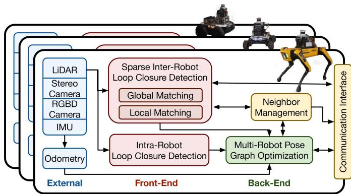  
Fig. 1. Swarm-SLAM Overview.

\- A decentralized approach to neighbor management and pose graph optimization suited for sporadic inter-robot communication;

\- A swarm-compatible open-source framework which supports lidars, as well as stereo or RGB-D cameras;

We extensively evaluate of the overall system performance on datasets and in a real-world experiment.

## II. BACKGROUND AND RELATED WORK

## A. Collaborative SLAM

C-SLAM systems can usually be divided into two categories: centralized and decentralized. Centralized systems rely on a remote base station to aggregate map data and compute the global SLAM estimates for all the robots. However, in those systems, the robots need a reliable permanent connection with the base station, and the scalability is severely limited by the communication bottleneck to the central server. Such stringent networking constraints are often unrealistic, especially in large environments. Decentralized approaches, relying only on occasional communication links between robots and without any need for a central authority, are preferred in those scenarios. However, decentralized systems are limited by the onboard computation and communication capabilities of the robots, and they require more sophisticated data management and bookkeeping strategies to obtain accurate SLAM estimates [2]. Similar to single robot SLAM systems, C-SLAM contains two parts commonly named front-end and back-end, see Fig. 1. The front-end is in charge of feature extraction and data association, while the back-end performs state estimation [1].

1) Front-End: The most challenging step in the C-SLAM front-end is the detection and computation of inter-robot loop closures in a resource-efficient manner. Inter-robot loop closures correspond to common features or places previously visited by two or more robots. Those shared features between the robots maps act as stitching points to merge the local maps together and obtain a shared (global) reference frame.

Since the communication cost of sharing entire maps is usually prohibitive, inter-robot loop closure detection can be performed in two stages [6], [7]. In the first stage, compact global descriptors of images [8] or lidar scans [9], are shared between the robots for place recognition. Similarity scores are computed between the global descriptors from both robots to recognize places, or overlaps, between their respective maps. The recognized places then correspond to loop closure candidates for the second stage. In the second stage, for each candidate with high global descriptors similarity, the corresponding costly local descriptors such as 3D keypoints or scans are transmitted to compute the geometric registration between the two robots images or scans.

2) Back-End: The role of the C-SLAM back-end is to estimate the most likely poses and map from the noisy measurements gathered by all robots. To this end, Choudary et al. [10] propose the distributed Gauss-Seidel (DGS) technique which allows robots to converge to a globally consistent local pose graph by communicating only the pose estimates involved in inter-robot loop closures, and therefore preserving the privacy of their whole trajectories. Tian et al. [11] significantly improve on that approach and provide a certifiably correct distributed solver for pose graph optimization. This technique performs multiple exchanges between the robots until they converge to globally consistent local solutions. In a different vein, recent work by Murai et al. [12] laid the foundation for larger-scale multi-robot collaborative localization based on Gaussian Belief Propagation. One of the main challenges in both single-robot and collaborative SLAM is the frequent occurrence of erroneous measurements among inter-robot loop closures due to perceptual aliasing [13]. While many techniques exist for the single-robot problem, Lajoie et al. [7] first combined DGS with Pairwise Consistency Maximization (PCM) [14], which computes the maximal clique of pairwise consistent inter-robot measurements, to perform robust and distributed optimization. More recently, Yang et al. [15] introduced the Graduated Non-Convexity (GNC) algorithm, a general approach for robust estimation on various problems including pose graph optimization. GNC was integrated with [11] in a robust distributed solver (D-GNC) [16].

3) Open-Source C-SLAM Systems: Many open-source C-SLAM systems have been proposed in the recent years. Cieslewski et al. [6] introduce DSLAM, which uses CNN-based global descriptors for distributed place recognition, and DGS for estimation. DOOR-SLAM [7] robustified the approach by integrating PCM for outlier rejection and adapted it for sporadic inter-robot communication. DiSCo-SLAM [17] extends those ideas to lidar-based C-SLAM using ScanContext global descriptors [9]. Kimera-Multi [16] integrates D-GNC and incorporates semantic data in the resulting maps. In an other line of work, centralized C-SLAM system have also evolved considerably. The lidar-based system LAMP 2.0 [18] introduces a centralized Graph Neural Network-based prioritization mechanism to predict the outcome of pose graph optimization for each inter-robot loop closure candidates. The multi-modal maplab 2.0 [19] supports heterogeneous groups of robots with different sensor setups. In contrast, Swarm-SLAM combines the latest advances from previous frameworks and introduce a new sparse inter-robot loop closure prioritization to further reduce communication. Additionally, unlike previous techniques, Swarm-SLAM leverages ROS 2 [20] and introduces a neighbor management system to seamlessly integrate C-SLAM with ad-hoc networking. Table I offers a comparison of the various systems based on key desirable properties. We refer the reader to [2] for a thorough survey on C-SLAM.

TABLE I  
OPEN-SOURCE C-SLAM FRAMEWORKS SUPPORTING STEREO CAMERAS (S), LIDARS (L) AND/OR RGB-D CAMERAS (D).
<table><tr><td></td><td>Sensor</td><td>Decentralized</td><td>Robust</td><td>Sporadic</td><td>Sparse</td></tr><tr><td>DSLAM [6]</td><td>S</td><td>√</td><td></td><td></td><td></td></tr><tr><td>DOOR-SLAM [7]</td><td>s,1</td><td>√</td><td>√</td><td>√</td><td></td></tr><tr><td>Kimera-Multi [16]</td><td>S</td><td>√</td><td>√</td><td>√</td><td></td></tr><tr><td>Disco-SLAM [17]</td><td>1</td><td>√</td><td>√</td><td>√</td><td></td></tr><tr><td>LAMP 2.0 [18]</td><td>1</td><td></td><td>√</td><td></td><td>√</td></tr><tr><td>maplab 2.0 [19]</td><td>s,d,1</td><td></td><td>V</td><td></td><td></td></tr><tr><td>Swarm-SLAM</td><td>s,d,1</td><td>√</td><td>√</td><td>√</td><td>√</td></tr></table>

## B. Graph Sparsification for C-SLAM

The ever-growing map and pose graph during long-term operations is an important memory and computation efficiency challenge in both single-robot and multi-robot SLAM. One favored solution is graph sparsification, which aims to approximate the complete graph with as few edges as possible, mainly by removing redundant edges that are not providing new information during the estimation process. To this end, Doherty et al. [5] formulate the graph sparsification of single robot pose graphs as a maximum algebraic connectivity augmentation problem, and solve it efficiently using a more tractable convex relaxation. In this paper, instead of sparsifying the pose graph after all the measurements have already been computed, we aim to preemptively sparsify the inter-robot loop closure candidates generated by the place recognition module. This way, we can prioritize the geometric verification of inter-robot loop closures that will approximate the full pose graph, thus avoiding wasting resources on redundant measurements. Importantly, unlike other work maximizing the determinant of the information matrix [21], we leverage the results from [5] and focus on the algebraic connectivity of the pose graph which has been shown to be a key measure of estimation accuracy [22] (i.e., higher algebraic connectivity is associated with lower estimation error). Solving a similar problem, Denniston et al. [23] prioritize loop closure candidates based on point cloud characteristics, the proximity of known beacons, and the information gain predicted with a graph neural network. Interestingly, Tian et al. [24] explore spectral sparsification in the C-SLAM back-end to reduce the required communication during distributed pose graph optimization.

## III. SYSTEM OVERVIEW

As described in Fig. 1, Swarm-SLAM is composed of three modules. First, to enable decentralization, the neighbor management module continuously tracks which robots are in communication range (i.e., neighbors that can be reached reliably) and what data has been exchanged. Robots publish heartbeat messages at a fixed rate such that network connectivity can be evaluated periodically. To make the system scalable (see Property 1), the other modules query the neighbor management process to determine which robots, if any, are available, and orchestrate the operations.

Property 1. Scalable: The number of robots using the framework is not predetermined and it does not require connectivity maintenance during the whole mission. Communication and computation budgets are set to fit the available bandwidth and computation power onboard the individual robots.

The front-end takes as input odometry estimates (obtained using an arbitrary technique) along with synchronized sensor data (see Property 2). Upon reception, the front-end extracts global (e.g. compact learned representation) and local descriptors (e.g. 3D keypoints). Global descriptors allow us to identify candidate place recognition matches (i.e., loop closures) between the robots, then local descriptors are used for 3D registration.

Property 2. Flexible: The framework supports multiple sensors (i.e., stereo cameras, RGB-D cameras, lidars) and is decoupled from the odometry source.

In our decentralized (see Property 3) back-end, the resulting intra-robot and inter-robot loop closure measurements are combined with the odometry measurements into a pose graph. Local pose graphs are transmitted to the robot selected, through neighbor management negotiation, to perform the optimization and the resulting estimates are sent back to the respective robots.

Property 3. Decentralized: All computation is performed onboard the robots without any central authority and they rely only on peer-to-peer communication.

Current pose estimates, resulting from the whole process, are made available periodically in the form of ROS 2 messages for a minimally invasive integration into existing robotic systems. To avoid needless bandwidth use, the neighbor manager keeps track of which measurements have been exchanged. Mapping data for planning or visualization can also be queried at the cost of additional computation and communication. For debugging purposes, we provide a minimal visualization tool which opportunistically collects mapping data from robots in communication range. Overall, we divided place recognition, geometric verification and pose graph optimization into modular and decoupled processes with clear data interfaces to enable researchers to leverage Swarm-SLAM to easily test new ideas in each subsystems.

## IV. FRONT-END

Similar to many comparable inter-robot loop closure detection techniques (e.g. [6], [7], [16]), we adopt a two stage approach in which global matching generate candidate place recognition matches that are verified using local features in the latter stage, i.e. local matching.

## A. Global Matching

For each keyframe, compact descriptors, that can be compared with a similarity score, are extracted from sensor data and broadcast to neighboring robots. When two robots meet, we perform bookkeeping to determine which global descriptors are already known by the other robot and which ones need to be transmitted. We use ScanContext [9] as global descriptors of lidar scans and the recent CNN-based CosPlace [8] for images.

We use nearest neighbors based on cosine similarity for descriptor matching. Once matches are computed, Swarm-SLAM offers two candidate prioritization mechanisms: a greedy prioritization algorithm, used in prior work [6], [7], [16], [17], and a novel spectral approach. To perfom the candidate prioritization, we define the multi-robot pose graph as:

$$
\mathcal { G } = ( V , \mathcal { E } ^ { \mathrm { l o c a l } } , \mathcal { E } ^ { \mathrm { g l o b a l } } )\tag{1}
$$

$$
V = \left( V _ { 1 } , \ldots , V _ { n } \right)\tag{2}
$$

$$
\mathcal { E } ^ { \mathrm { l o c a l } } = ( \mathcal { E } _ { 1 } ^ { \mathrm { l o c a l } } , \dots , \mathcal { E } _ { n } ^ { \mathrm { l o c a l } } )\tag{3}
$$

$$
\mathcal { E } ^ { \mathrm { g l o b a l } } = ( \mathcal { E } _ { \mathrm { f i x e d } } ^ { \mathrm { g l o b a l } } , \mathcal { E } _ { \mathrm { c a n d i d a t e } } ^ { \mathrm { g l o b a l } } )\tag{4}
$$

where V are the vertices from every n robots pose graphs, each vertex corresponding to a keyframe; ${ \mathcal { E } } ^ { \mathrm { l o c a l } }$ are the local pose graphs edges such as odometry measurements and intra-robot loop closures; and $\mathcal { E } ^ { \mathrm { g l o b a l } }$ are the global pose graph edges corresponding to inter-robot loop closures. Eglobal is further divided between $\overline { { \mathcal { E } _ { \mathrm { f i x e d } } ^ { \mathrm { g l o b a l } } } }$ which contains the fixed measurements that have already been computed, and the candidate inter-robot loop closures $\dot { \mathcal { E } } _ { \mathrm { c a n d i d a t e } } ^ { \mathrm { g l o b a l } }$ on which the prioritization is performed. Detailed measurements (i.e., pose estimates) are not required for our proposed candidate prioritization mechanism. Therefore, fixed measurements, both local and global, are undirected unweighted edges between two vertices, and candidates edges contain an additional weight value corresponding to their respective similarity score. This reduced multi-robot pose graph can be built directly from the global matching information and does not require any additional inter-robot communication.

The number of edges B to select at each time step is set by the user. This budget should reflect the communication and computation capacities of the robots. The common candidate prioritization approach widely used prior works is a basic greedy prioritization in which the top B candidates with the highest similarity scores are selected.

In our proposed spectral prioritization process, we frame pose graph sparsification as a candidate prioritization problem, and leverage recent work on spectral sparsification. We observe that the two problems are mathematically equivalent, one being solved before loop closure computation and the other after. Specifically, we perform sparsification on the candidate inter-robot matches before computing the corresponding 3D measurements, reducing resource usage for the costly inter-robot geometric verification of redundant candidates, and achieving better accuracy (see Property 4).

Property 4. Sparse: The framework prioritizes communication using algebraic connectivity maximization sparsification to acheive better localization accuracy with fewer data exchanges. At every stage, it requires less communication than comparable techniques.

As shown in [22], the algebraic connectivity of the pose graph controls the worst-case error of the solutions of the SLAM Maximum Likelihood Estimation problem. The pose graph algebraic connectivity corresponds to the second-smallest eigenvalueλ2 of the rotation weighted Laplacian with entries for pairs of vertices

(i, j) defined as:

$$
L _ { i j } = \left\{ \begin{array} { l l } { \sum _ { ( i , j ^ { \prime } ) \in \delta ( i ) } \kappa _ { i j ^ { \prime } } , } & { i = j , } \\ { - \kappa _ { i j } , } & { \{ i , j \} \in \mathcal { E } , } \\ { 0 , } & { \{ i , j \} \notin \mathcal { E } . } \end{array} \right.\tag{5}
$$

where $\kappa _ { i j }$ denotes the edge weight and $\delta ( i )$ is the set of edges incident to vertex i. Instead of using a noise model for the edge weights as in [5], we use the similarity score $s _ { e } \in [ 0 , 1 ]$ from global matching as confidence metric. Thus, we define $\kappa _ { i j } =$ $\textsf { l } \forall e \in ( \mathcal { E } ^ { \mathrm { l o c a l } } , \mathcal { E } _ { \mathrm { f i x e d } } ^ { \mathrm { g l o b a l } } )$ , and $\kappa _ { i j } = s _ { e } \ \forall \ e \in { \mathcal { E } } _ { \mathrm { c a n d i d a t e } } ^ { \mathrm { g l o b a l } } .$ . This approach forgoes the need to communicate additional information regarding the edges’ estimated noise level. However, it is important to note that it loses the theoretical guarantees from [5], yet we show in Section VI that this heuristic approach works well in realistic cases.

For our purposes, we leverage the property that the Laplacian L can be expressed as the sum of subgraph Laplacians corresponding to each of its edges to define the augmented pose graph Laplacian as follows:

$$
L ( \omega ) \triangleq L ^ { {  { \mathcal E } } ^ { \mathrm { l o c a l } } } + L ^ { {  { \mathcal E } } _ { \mathrm { f i x e d } } ^ { \mathrm { g l o b a l } } } + \sum _ { e \in {  { \mathcal E } } _ { \mathrm { c a n d i d t e } } ^ { \mathrm { g l o b a l } } } \omega _ { e } L _ { e }\tag{6}
$$

where $\omega _ { e } \in \{ 0 , 1 \}$ is the binary variable which determines the prioritization of candidate edge e. Therefore, according to our previously stated goal, we aim to select the subset $\mathcal { E } ^ { \star } \subseteq \bar { \mathcal { E } } _ { \mathrm { c a n d i d a t e } } ^ { \mathrm { g l o b a l } }$ of fixed budgeted size $| { \mathcal { E } } ^ { \star } | = B$ which maximizes the algebraic connectivity $\lambda _ { 2 } ( L ( \omega ) )$

Problem 1: Candidate prioritization via Algebraic Connectivity Maximization

$$
\begin{array} { c } { \operatorname* { m a x } _ { \omega _ { e } \in \{ 0 , 1 \} } \lambda _ { 2 } ( L ( \omega ) ) } \\ { | \omega | = B . } \end{array}\tag{7}
$$

Property 1 is NP-Hard [25] due to the integrality constraint on $\omega _ { e }$ . Therefore, we relax the integrality constraints and, when necessary, we round the optimization result to the nearest solution in the feasible set ofProperty 1. We solve the relaxed problem using the simple and computationally inexpensive approach developed in [5]. It is important to note that this approach requires the pose graph to be connected, so we first perform greedy prioritization up until at least one inter-robot loop closure exists between the local pose graphs. We also use the greedy solution as initial guess for the algebraic connectivity maximization.

In Fig. 2, we present a visualization of our spectral approach results in comparison to the ones obtained with the standard greedy approach. We can see that the candidates selected using our spectral technique are more evenly distributed along the pose graph while the greedy candidates are mostly concentrated in high-similarity areas. Our selected candidates are therefore less redundant for the estimation process.

## B. Local Matching

Once the inter-robot loop closure candidates are selected, the next step is to perform local matching (i.e., geometric verification). This step leverages larger collections of local features, keypoints or point clouds depending on the sensor, to compute

(b) 3 robots S3E Laboratory

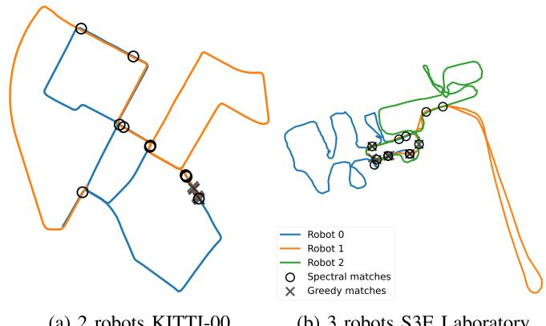  
Fig. 2. Visualization of 10 first loop closure candidates selected by the Spectral and Greedy Approaches. The Spectral approach selects candidates in different regions of the pose graph to increase the accuracy, while the Greedy approach selects redundant candidates in high similarity regions.

the 3D relative pose measurement between the candidate’s two vertices. To avoid computing the same loop closure twice and to reduce the communication burden of geometric verification, we follow [26] and formulate the vertices local features sharing problem as a vertex cover problem. When two or more inter-robot loop closure candidates share a vertex in common, only the common vertex needs to be transmitted to effectively compute all the associated relative pose measurements. Thus, by computing the minimal vertex cover, optimally for bipartite graphs and approximately with 3 robots or more, we obtain an exchange policy which avoids redundant communication.

## C. Inter-Robot Communication

It is worth noting, that both for the spectral matching and the vertex exchange policy, a temporary broker needs to be dynamically elected among the robots in communication range. The broker then computes the matches and sends requests for the vertices to be transferred. In our current implementation, the broker is simply the robot in range with the lowest ID according to our neighbor management system, but it could be elected with a different decentralized mechanism (e.g. based on the available computation resources onboard each robot).

## V. BACK-END

The role of the back-end is to gather the odometry, intraand inter-robot loop closure measurements from the front-end in a pose graph, and then estimate the most likely map and poses based on those noisy measurements. As mentioned above, unlike other recent systems [7], [21] based on distributed pose graph optimization, we opt for a simpler decentralized approach. Similar to the front-end, a robot is dynamically elected to perform the computation among the robots in communication range. The other robots share their current pose graph estimates with the elected robot and receive the updated estimates once the computation is completed. Importantly, any robot can be temporarily elected through negotiation to perform the pose graph optimization during a rendezvous between robots. Swarm-SLAM performs the pose graph optimization using the Graduated Non-Convexity [15] solver, with the robust Truncated Least Square loss.

To ensure convergence to a single global localization estimate after multiple sporadic rendezvous without enforcing a central authority, we introduce an anchor selection process to keep track of the current global reference frame. During pose graph optimization, the anchor usually corresponds to a prior which assigns a fixed value to the first pose of the graph. This anchor then becomes the reference frame of the resulting estimate. In the beginning, all robots are within their own local reference frames where the origin corresponds to their first pose (i.e., initial position and orientation). Then, when some robots meet for the first time (e.g. robots 0, 4 and 5), we choose the first pose of the robot with the lowest ID (e.g. robot 0) as the anchor. Therefore, as a result of the estimation process, the involved robots estimates share the same reference frame (e.g. robot 0’s first pose). In subsequent rendezvous (e.g. robots 2, 3 and 4), the anchor is selected based on the reference frame with the lowest ID (e.g. robot 4’s first pose is selected as the anchor since its reference frame is robot 0’s). After a few rendezvous, the robots converge to a single global reference frame without requiring rendezvous including all robots (e.g. after the second rendezvous, robots 2 and 3 are also within robot 0’s reference frame). This means that Swarm-SLAM can scale to large groups of robots, through iterative estimation among smaller groups of robots.

## VI. EXPERIMENTAL RESULTS

To evaluate the effectiveness of our proposed solutions for the ongoing challenges in Collaborative Simultaneous Localization and Mapping, we conducted extensive experiments on several public datasets, as well as in a real-world deployment. Our experiments involved three robots exploring and mapping an indoor environment and communicating via ad-hoc networking. We specifically evaluated our key contributions to inter-robot loop closure detection and decentralized C-SLAM estimation. Additionally, we present detailed statistics of the communication and computation load during our real-world experiment, providing insight into the system’s performance and resource requirements.

## A. Dataset Experiments

We tested Swarm-SLAM on seven sequences from five different datasets. To demonstrate the flexibility of our framework, we used IMUs, stereo cameras, lidars, or a combination as inputs. First, we tested on the widely known autonomous driving KITTI 00 stereo sequence [27] which we split into two parts to simulate a two-robots exploration. Second, we split the very large (∼10 km) KITTI360 09 lidar sequence [28] into 5 parts that contain a large number of loop closures, making it particularly well suited for inter-robot loop closure detection analysis. Third, we experimented on the first three overlapping lidar sequences of the very recent GrAco dataset [29] acquired with custom ground robots on a college campus. Fourth, we evaluate our system on the three lidar Gate sequences of the M2DGR dataset [30]. Fifth, we tested on three sequences of the recent C-SLAM-focused S3E dataset [31]. To avoid tracking failures and obtain more robust results on S3E sequences, we combined lidar-IMU odometry and stereo camera-based inter-robot loop closure detection, highlighting the versatility of Swarm-SLAM. Overall, we chose the sequences with the most trajectory overlaps to obtain more loop closures, and with available GPS ground truth (except for S3E Laboratory). For simplicity and robustness, we used off-the-shelf software [32] to compute and provide the required odometry input to Swarm-SLAM. To better evaluate the inter-robot loop closure detection, we consider the worst-case scenario in which the robots are within communication range only at the end of their trajectories, such that they have to find loop closures between their whole maps at once. This scenario, analog to multiple robots exploring different parts of an environment and meeting back at the end, is among the most challenging in terms of communication and computation load, and therefore benefits the most from our novel spectral candidate prioritization mechanism. We refer the reader to our open-source implementation for all the parameters and configuration details of the experiments.

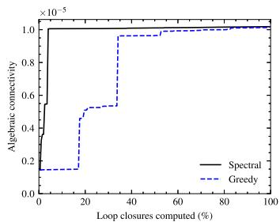

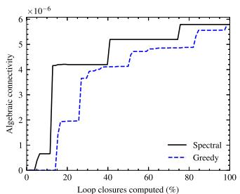

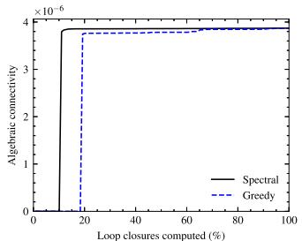

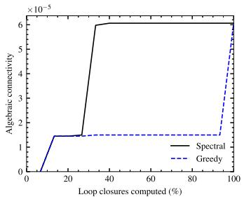

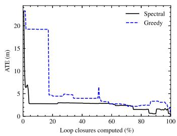  
(a) KITTI 00

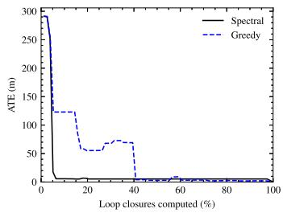  
(b) KITTI-360 09

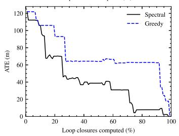  
(c) GrAco Ground

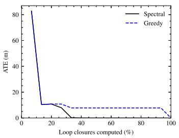  
(d) S3E Square  
Fig. 3. Comparison between Greedy and Spectral prioritization of candidate inter-robot loop closures. For each datasets, we show that the spectral approach outperforms the greedy one in terms of algebraic connectivity (higher is better), and the Absolute Translation Error (ATE) (lower is better). We can see that the spectral prioritization converges to the best estimate with less inter-robot loop closures.

1) Inter-Robot Loop Closure Detection Evaluation: In Fig. 3, we compare the greedy and spectral inter-robot loop closure candidate prioritization techniques with respect to algebraic connectivity, and Absolute Translation Error (ATE). Each approach is used to prioritize the computation of loop closures from the same set of candidates with a budget B of 1, i.e. selecting one loop closure at a time. We plot each metric against the percentage of loop closures computed within the set of candidate (x-axis). We perform prioritization successively up until all the possible matches are selected (i.e., 100% of loop closures computed). We expect that a better prioritization will acheive reasonable accuracy early on, with only a fraction of the matches selected. The ATE is computed against the final pose graph estimate containing all possible inter-robot loop closures, and thus constitutes the best estimate we can achieve. On the first row, we can see that, as intended, our spectral prioritization is correctly maximizing the algebraic connectivity of the pose graph. On the second row, as expected, we can see that our spectral prioritization decreases the error faster than the greedy prioritization. Overall, our experiments show that carefully selecting candidates early on requires the computation of fewer inter-robot loop closures to significantly reduce the estimation error (ATE).

2) Decentralized C-SLAM Evaluation: In Table II, we present the estimates computed in the back-end on all the sequences for which GPS latitude and longitude data is available as ground truth. We report the computation time on a AMD Ryzen 7 CPU and the total communication required in kB. Using our same front-end, we compared our GNC-based decentralized back-end against two state-of-the-art distributed approaches: the Distributed Gauss-Seidel (DGS) pose graph optimization [10] combined with Pairwise Consistency Maximization (PCM) [14] for outlier rejection as used in [7]; and a distributed implementation of Graduated Non-Convexity (D-GNC) [16] based on the RCBD solver [11]. Our chosen back-end consistently achieved the highest level of accuracy (ATE) whereas alternative methods occasionally fell short of generating reasonable estimates. We also consistently outperforms the other approaches in terms of required communication and computation time. Interestingly, when tested on KITTI-360 09, our dataset with the highest number of robots, both DGS+PCM and D-GNC take less computation time compared to GNC, yet they don’t achieve equivalent accuracy and necessitate more than five times the amount of data transmission. While distributed approaches benefit from the division of labour on large problems, more research is required to obtain the same levels of accuracy, robustness, and communication bandwidth. This justifies our practical choice of a simpler approach computing the back-end on a single decentrally-elected robot, which is more robust to communication failures and easier to implement.

TABLE II  
C-SLAM ESTIMATES EVALUATION ON PUBLIC DATASETS WITH DIFFERENT BACK-ENDS
<table><tr><td></td><td></td><td colspan="3">Communication (kB)</td><td colspan="3">Time (s)</td><td colspan="3">ATE (m)</td></tr><tr><td></td><td># Robots</td><td>GNC</td><td>DGS+PCM</td><td>D-GNC</td><td>GNC</td><td>DGS+PCM</td><td>D-GNC</td><td>GNC</td><td>DGS+PCM</td><td>D-GNC</td></tr><tr><td>KITTI 00</td><td>2</td><td>280.00</td><td>30045.50</td><td>13499.49</td><td>20.11</td><td>230.85</td><td>70.903</td><td>2.17</td><td>9.08</td><td>3.77</td></tr><tr><td>KITTI-360 09</td><td>5</td><td>484.91</td><td>3241.21</td><td>4485.13</td><td>196.93</td><td>102.51</td><td>70.82</td><td>4.02</td><td>6.67</td><td>7.15</td></tr><tr><td>GrAco Ground</td><td>3</td><td>105.82</td><td>44686.69</td><td>78162.42</td><td>8.06</td><td>120.25</td><td>143.79</td><td>6.19</td><td>33.73</td><td>8.47</td></tr><tr><td>M2DGR Gate</td><td>3</td><td>51.29</td><td>242.02</td><td>721.39</td><td>1.42</td><td>5.02</td><td>7.85</td><td>0.70</td><td>1.35</td><td>3.07</td></tr><tr><td>S3E Square</td><td>3</td><td>80.97</td><td>1261.12</td><td>620.19</td><td>6.05</td><td>50.31</td><td>26.98</td><td>4.20</td><td>9.74</td><td>20.21</td></tr><tr><td>S3E College</td><td>3</td><td>150.37</td><td>3420.23</td><td>3012.28</td><td>11.96</td><td>125.42</td><td>35.62</td><td>3.57</td><td>25.32</td><td>4.13</td></tr></table>

The best results are in bold

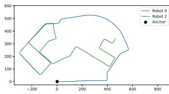  
(a) 0 and 2 rendezvous

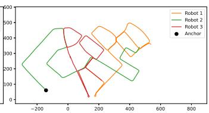  
(b) 1, 2 and 3 rendezvous

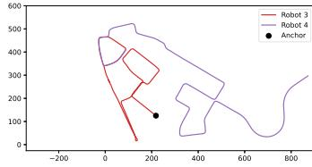

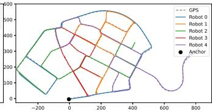  
(c) 3 and 4 rendezvous  
(d) All robots rendezvous  
Fig. 4. Reference frame convergence via occasional rendezvous. From (a) to (c), we show trajectory estimates from successive rendezvous between different groups of robots: {0, 2}, then {1, 2, 3}, and finally {3, 4}. After the three rendezvous, all estimates are within the same global reference frame. For comparison, we also include the result of a rendezvous with all robots along side the GPS estimate (d).

In Fig. 4, we show the Swarm-SLAM resulting estimates on the KITTI360 09 sequence from four different rendezvous, defined as an encounter in which a subset of robots are within communication range of each other. Our anchor selection scheme ensures that by choosing the current first pose estimate from the robot with the lowest reference frame ID (i.e., first poses of (a) robot 0, (b) robot 2, (c) robot 3), we can propagate the global reference frame among the team of robots. In other words, we are able to converge to a single global reference frame through successive estimations between subsets of robots, without enforcing connectivity maintenance or a central authority. This decentralized approach improves the scalability of the system by relying only on local interactions among neighboring robots. We present the Swarm-SLAM solutions on the remaining dataset sequences in Fig. 5.

## B. Real-World Experiments

To assess the viability of Swarm-SLAM on resourceconstrained platforms, we deployed the system in an indoor parking lot and gathered statistics regarding the computation time and communication load. As shown in Fig. 6, we performed an online real-world demonstration with 3 different robots (Boston Dynamics Spot, Agilex Scout, and Agilex Scout Mini), all equipped with an NVIDIA Jetson AGX Xavier onboard computer, an Intel Realsense D455 camera, an Ouster lidar OS0-64, a VectorNav VN100 IMU, and a GL-iNet GL-S1300 OpenWrt gateway for ad hoc networking. We used lidars and IMUs for odometry and the RGB-D cameras for inter-robot loop closure detection.

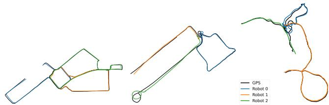  
(a) S3E College  
(b) GrAco Ground  
(c) M2DGR

Fig. 5. Swarm-SLAM trajectory estimates on various dataset sequences compared with GPS ground truth.  
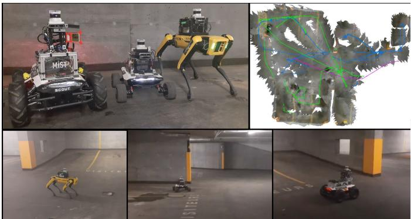  
Fig. 6. Swarm-SLAM experiment with 3 robots, equipped with lidars and RGB-D cameras, simultaneously exploring an indoor parking lot, and achieving shared situational awareness via collaborative perception. A visualization of the resulting map and pose graphs is showed in the top right corner.

As stated in Table III, our robots travelled a total of 475 meters during the experiment and produced a total of 3103 keyframes that needed to be matches and verified in the search for interrobot loop closures. The process resulted in 67 loop closures, including 10 that were rejected by the GNC optimizer. This large number of outliers is attributable to the many similar-looking sections of the parking lot. Swarm-SLAM acheived accurate localization with the transmission of only 94.95 MB of data between the robots, excluding the visualization. The communication load is mostly attributable to the front-end and thus dependent on the number of keyframes. In Table III, we also report the average sparsification and pose graph optimization times. We can observe that the sparsification time, while being non-negligible, is lower than the pose graph optimization. To mitigate this, we implemented sparsification and optimization within separate threads.

TABLE III  
REAL-WORLD EXPERIMENT STATISTICS
<table><tr><td># Robots</td><td>3</td><td>Length (m)</td><td>475.42</td></tr><tr><td># Keyframes</td><td>3103</td><td>Total comm. (MB)</td><td>94.95</td></tr><tr><td># Inter-robot loop cl.</td><td>67</td><td># Outliers</td><td>10</td></tr><tr><td>Optimization time (s)</td><td> $5 . 5 2 \pm 7 . 1 1$ </td><td>Sparsification time (s)</td><td> $2 . 7 1 \pm 2 . 3 9$ </td></tr></table>

## VII. CONCLUSIONS AND FUTURE WORK

In this paper, we presented Swarm-SLAM, a comprehensive resource-efficient C-SLAM framework that is designed to comply with essential properties of swarm robotics. In future work, we aim to investigate collaborative domain calibration and/or uncertainty estimation in place recognition [33] to reduce the prevalence of measurement outliers among inter-robot loop closures, and therefore increase the overall accuracy and resilience of C-SLAM. Overall, we hope that our open-source framework will be useful as a testbed for the research and development of new methods and techniques in place recognition, inter-robot loop closure detection, multi-robot pose graph optimization, and other open-problems.

## REFERENCES

[1] C. Cadena et al., “Past, present, and future of simultaneous localization and mapping: Toward the robust-perception age,” IEEE Trans. Robot., vol. 32, no. 6, pp. 1309–1332, Dec. 2016.

[2] P.-Y. Lajoie, B. Ramtoula, F. Wu, and G. Beltrame, “Towards collaborative simultaneous localization and mapping: A survey of the current research landscape,” Field Robot., vol. 2, no. 1, pp. 971–1000, Mar. 2022.

[3] M. Brambilla, E. Ferrante, M. Birattari, and M. Dorigo, “Swarm robotics: A review from the swarm engineering perspective,” Swarm Intell., vol. 7, no. 1, pp. 1–41, Mar. 2013.

[4] M. Kegeleirs, G. Grisetti, and M. Birattari, “Swarm SLAM: Challenges and perspectives,” Front. Robot. AI, vol. 8, 2021, Art. no. 618268.

[5] K. J. Doherty, D. M. Rosen, and J. J. Leonard, “Spectral measurement sparsification for pose-graph SLAM,” in Proc. IEEE/RSJ Int. Conf. Intell. Robots Syst., Mar. 2022, pp. 01–08.

[6] T. Cieslewski, S. Choudhary, and D. Scaramuzza, “Data-efficient decentralized visual SLAM,” in Proc. IEEE Int. Conf. Robot. Automat., 2018, pp. 2466–2473.

[7] P.-Y. Lajoie, B. Ramtoula, Y. Chang, L. Carlone, and G. Beltrame, “DOOR-SLAM: Distributed, online, and outlier resilient SLAM for robotic teams,” IEEE Robot. Automat. Lett., vol. 5, no. 2, pp. 1656–1663, Apr. 2020.

[8] G. Berton, C. Masone, and B. Caputo, “Rethinking visual geo-localization for large-scale applications,” in Proc. IEEE/CVF Conf. Comput. Vis. Pattern Recognit., New Orleans, LA, USA, 2022, pp. 4868–4878.

[9] G. Kim and A. Kim, “Scan context: Egocentric spatial descriptor for place recognition within 3D point cloud map,” in Proc. IEEE/RSJ Int. Conf. Intell. Robots Syst., 2018, pp. 4802–4809.

[10] S. Choudhary, L. Carlone, C. Nieto, J. Rogers, H. I. Christensen, and F. Dellaert, “Distributed mapping with privacy and communication constraints: Lightweight algorithms and object-based models,” Int. J. Robot. Res., vol. 36, no. 12, pp. 1286–1311, Oct. 2017.

[11] Y. Tian, K. Khosoussi, D. M. Rosen, and J. P. How, “Distributed certifiably correct pose-graph optimization,” IEEE Trans. Robot., vol. 37, no. 6, pp. 2137–2156, Dec. 2021.

[12] R. Murai, J. Ortiz, S. Saeedi, P. H. J. Kelly, and A. J. Davison, “A robot web for distributed many-device localisation,” IEEE Trans. Robot., early access, 2022, doi: 10.1109/TRO.2023.3324127.

[13] P.-Y. Lajoie, S. Hu, G. Beltrame, and L. Carlone, “Modeling perceptual aliasing in SLAM via discrete–Continuous graphical models,” IEEE Robot. Automat. Lett., vol. 4, no. 2, pp. 1232–1239, Apr. 2019.

[14] J. G. Mangelson, D. Dominic, R. M. Eustice, and R. Vasudevan, “Pairwise consistent measurement set maximization for robust multirobot map merging,” in Proc. IEEE Int. Conf. Robot. Automat., 2018, pp. 2916–2923.

[15] H. Yang, P. Antonante, V. Tzoumas, and L. Carlone, “Graduated nonconvexity for robust spatial perception: From non-minimal solvers to global outlier rejection,” IEEE Robot. Automat. Lett., vol. 5, no. 2, pp. 1127–1134, Apr. 2020.

[16] Y. Tian, Y. Chang, F. Herrera Arias, C. Nieto-Granda, J. P. How, and L. Carlone, “Kimera-multi: Robust, distributed, dense metric-semantic SLAM for multi-robot systems,” IEEE Trans. Robot., vol. 38, no. 4, pp. 2022–2038, Aug. 2022.

[17] Y. Huang, T. Shan, F. Chen, and B. Englot, “DiSCo-SLAM: Distributed scan context-enabled multi-robot LiDAR SLAM with two-stage globallocal graph optimization,” IEEE Robot. Automat. Lett., vol. 7, no. 2, pp. 1150–1157, Apr. 2022.

[18] Y. Chang et al., “LAMP 2.0: A robust multi-robot SLAM system for operation in challenging large-scale underground environments,” IEEE Robot. Automat. Lett., vol. 7, no. 4, pp. 9175–9182, Oct. 2022.

[19] A. Cramariuc et al., “maplab 2.0–A modular and multi-modal mapping framework,” IEEE Robot. Automat. Lett., vol. 8, no. 2, pp. 520–527, Feb. 2023.

[20] S. Macenski, T. Foote, B. Gerkey, C. Lalancette, and W. Woodall, “Robot operating system 2: Design, architecture, and uses in the wild,” Sci. Robot., vol. 7, no. 66, May 2022, Art. no. eabm6074.

[21] Y. Tian, K. Khosoussi, and J. P. How, “A resource-aware approach to collaborative loop-closure detection with provable performance guarantees,” Int. J. Robot. Res., vol. 40, no. 10/11, pp. 1212–1233, Sep. 2021.

[22] K. J. Doherty, D. M. Rosen, and J. J. Leonard, “Performance guarantees for spectral initialization in rotation averaging and pose-graph SLAM,” in Proc. Int. Conf. Robot. Automat., 2022, pp. 5608–5614.

[23] C. E. Denniston et al., “Loop closure prioritization for efficient and scalable multi-robot SLAM,” IEEE Robot. Automat. Lett., vol. 7, no. 4, pp. 9651–9658, Oct. 2022.

[24] Y. Tian and J. P. How, “Spectral sparsification for communication-efficient collaborative rotation and translation estimation,” early access, Oct. 2022, doi: 10.1109/TRO.2023.3327635.

[25] D. Mosk-Aoyama, “Maximum algebraic connectivity augmentation is NPhard,” Operations Res. Lett., vol. 36, no. 6, pp. 677–679, Nov. 2008.

[26] M. Giamou, K. Khosoussi, and J. P. How, “Talk resource-efficiently to me: Optimal communication planning for distributed loop closure detection,” in Proc. IEEE Int. Conf. Robot. Automat., 2018, pp. 3841–3848.

[27] A. Geiger, P. Lenz, and R. Urtasun, “Are we ready for autonomous driving? The KITTI vision benchmark suite,” in Proc. IEEE Conf. Comput. Vis. Pattern Recognit., 2012, pp. 3354–3361.

[28] Y. Liao, J. Xie, and A. Geiger, “KITTI-360: A novel dataset and benchmarks for urban scene understanding in 2D and 3D,” IEEE Trans. Pattern Anal. Mach. Intell., vol. 45, no. 3, pp. 3292–3310, Mar. 2023.

[29] Y. Zhu, Y. Kong, Y. Jie, S. Xu, and H. Cheng, “GRACO: A multimodal dataset for ground and aerial cooperative localization and mapping,” IEEE Robot. Automat. Lett., vol. 8, no. 2, pp. 966–973, Feb. 2023.

[30] J. Yin, A. Li, T. Li, W. Yu, and D. Zou, “M2DGR: A multi-sensor and multi-scenario SLAM dataset for ground robots,” IEEE Robot. Automat. Lett., vol. 7, no. 2, pp. 2266–2273, Apr. 2022.

[31] D. Feng et al., “S3E: A large-scale multimodal dataset for collaborative SLAM,” Oct. 2022, arxiv:2210.13723.

[32] M. Labbé and F. Michaud, “RTAB-Map as an open-source LiDAR and visual simultaneous localization and mapping library for large-scale and long-term online operation,” J. Field Robot., vol. 36, no. 2, pp. 416–446, Mar. 2019.

[33] P.-Y. Lajoie and G. Beltrame, “Self-supervised domain calibration and uncertainty estimation for place recognition,” IEEE Robot. Automat. Lett., vol. 8, no. 2, pp. 792–799, Feb. 2023.