# Switch-SLAM: Switching-Based LiDAR-Inertial-Visual SLAM for Degenerate Environments

Junwoon Lee , Student Member, IEEE, Ren Komatsu , Member, IEEE, Mitsuru Shinozaki, Toshihiro Kitajima, Hajime Asama , Fellow, IEEE, Qi An , Senior Member, IEEE, and Atsushi Yamashita , Senior Member, IEEE

Abstract—This letter presents Switch-SLAM, switching-based LiDAR-inertial-visual SLAM for degenerate environments, designed to tackle the challenges in degenerate environments for LiDAR and visual SLAM. Switch-SLAM achieves high robustness and accuracy by utilizing a switching structure that transitions from LiDAR to visual odometry when degeneration of LiDAR odometry is detected. To efficiently detect degeneration, Switch-SLAM incorporates a non-heuristic degeneracy detection method that does not require heuristic tuning and demonstrates generalizability across various environments. Switch-SLAM is evaluated on diverse datasets containing both LiDAR and visual odometry degeneracy scenarios. The experimental results highlight the accurate and robust localization by the proposed method in multiple challenging environments with either LiDAR or visual SLAM degeneracy.

Index Terms—SLAM, sensor fusion, localization, LiDAR degeneracy, harsh environment.

## I. INTRODUCTION

N RECENT years, significant progress has been made in 3D simultaneous localization and mapping (SLAM), leading to notable advancements in the capabilities of mobile robots. These developments have enhanced the capabilities of mobile robots in terms of understanding their surroundings, precisely determining their positions, and creating detailed maps of their environments. However, SLAM is subject to several limitations that arise from inherent constraints imposed by sensors. For example, LiDAR SLAM [1], [2], [3] tend to degenerate in environments lacking distinct structures such as long corridors and vast open fields. Conversely, visual SLAM [4], [5], [6] face challenges in scenarios involving aggressive motions, rapidly changing light conditions, and texture-less environments.

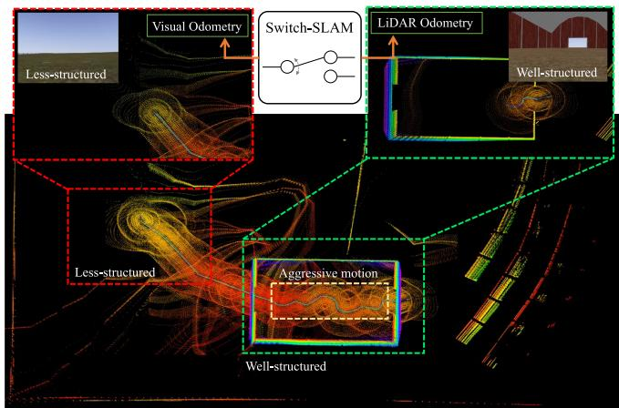  
Fig. 1. Snapshots and maps from simulated Farm dataset that exhibit both aggressive motions and less-structured environments.

To handle these issues, various LiDAR-visual SLAM methods have been developed, including those in [7], [8], [9], [10], [11], [12], [13], which integrate information from a LiDAR and camera. However, these methods have limitations when handling persistent degeneracy that exceeds the system capabilities. These limitations primarily arise from their reliance on fusion methods using maximum a posteriori (MAP) estimation, such as iterated Kalman filters [14] and factor graph optimization [15]. Consequently, long-term failure information can detrimentally impact the overall system performance.

To address these limitations, we propose switching-based LiDAR-inertial-visual SLAM (Switch-SLAM). Switch-SLAM parallelly processes LiDAR and visual odometry and selects the appropriate sensor odometry by non-heuristic degeneracy detection, as shown in Fig. 1. Switch-SLAM incorporates a switching structure that effectively avoids failure information from propagating throughout the system, thereby mitigating the negative impact on performance. The main contributions of our work are as follows:

\- Switching structure: The switching structure allows selecting an optimal initial guess between LiDAR and visual odometry, both of which are propagated with IMU measurements. This selection efficiently avoids long-term degeneracy and ensures that only reliable estimations propagate through the entire system, improving the overall performance.

\- Non-heuristic degeneracy detection: Non-heuristic degeneracy detection checks the convergence of the optimization process by employing a predefined threshold, grounded in physical assumptions and statistical significance. This detection enhances the ability to identify degenerate scenarios effectively without the heuristic tuning of the threshold, making it adaptable to various environmental conditions.

\- Experiments on various scenarios: Switch-SLAM is evaluated by conducting extensive experiments in diverse environments. These scenarios involve degeneracy in both LiDAR and visual odometry, providing a comprehensive evaluation of the system performance. Consequently, Switch-SLAM demonstrates its advantages and effectiveness in challenging scenarios when compared against other state-of-the-art SLAM.

## II. RELATED WORK

Our study is most relevant for LiDAR odometry degeneration and LiDAR-visual SLAM, which are discussed in the following two sections.

## A. LiDAR Odometry Degeneration

Zhang et al. analyzed the eigenvalues of the Hessian matrix of scan-matching cost to detect the degeneracy of LiDAR odometry [16]. They then separated the non-localizable and localizable degrees of freedom (DOF) and only optimized nonlinear equations along with the localizable DOFs. Similarly, Nashed et al. used eigenvalues for degeneracy detection, with a distinctive focus on the ratio between each eigenvalue and maximum eigenvalue in 3-DOF [17]. These methods effectively detect and address degeneration. However, these approaches rely on a heuristic threshold for the eigenvalues, which may not generalize well across different environments.

Ren et al. introduced a degeneracy indicator, defined along with the fluctuation of the optimization vector [18]. This indicator, when incorporated into a factor graph, improved the detection accuracy than eigenvalues-based methods. However, this method requires calculating the entire optimization processes in scan matching, which is time-consuming. Additionally, heuristic factors are still necessary to appropriately scale the degeneracy indicator. Tuna et al. proposed X-ICP, integrating localizability detection and localizability aware optimization based on the classical mechanics of a point cloud [19]. This approach improves scan matching in degenerate environments while eliminating the need for heuristic tuning. However, it relies solely on LiDAR, which may pose challenges in cases of which where direction is not adequately determined by LiDAR alone.

Nubert et al. proposed a learning-based approach to directly detect degeneracy from a LiDAR scan using a 3D convolutional neural network [20]. This strategy achieved a competitive performance compared to a threshold-based method [16]. However, this learning-based method requires a learning process and corresponding degenerate dataset.

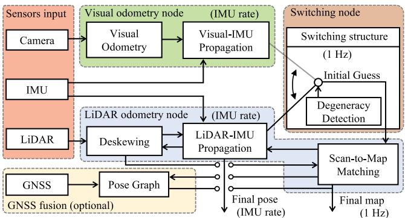  
Fig. 2. System structure of Switch-SLAM.

## B. LiDAR Visual SLAM

Shan et al. proposed LVI-SAM [11] that combines [2] for LiDAR and [6] for visual odometry. This method effectively addresses LiDAR degenerate environments and outperforms the accuracy of other visual and LiDAR SLAM. However, LVI-SAM is susceptible to failures in its visual SLAM subsystem, because it relies on visual odometry for the initial guess of the scan-matching.

Lin et al. proposed R2LIVE [8], which combines measurements of IMU, [21], and [6] by an iterated Kalman filter. Moreover, R3LIVE [9] and FAST-LIVO [10], which also utilize an iterated Kalman filter for sensor fusion, were proposed to achieve high robustness in environments featuring degeneration ofLiDAR or visual odometry. Alternatively, Zhao et al. proposed Super Odometry [12]. This approach utilizes IMU odometry, optimized using the poses from prior visual and LiDAR odometry, as the initial guess for present visual and LiDAR odometry. Recently, Wen et al. proposed LIVER [13], which contains both LiDAR degeneracy handling and learning-based image enhancement.

However, because these systems rely on MAP-based multimodal fusion, the final pose can diverge when individual sensors experience long-term failures. To tackle this issue, we propose a switching structure that explicitly excludes information pertaining to failure or degeneration from the optimization process.

## III. SWITCHING-BASED LIDAR-INERTIAL-VISUAL SLAM

## A. System Overview

The overview of the proposed method is shown in Fig. 2. The proposed approach consists of three main components: visual odometry, LiDAR odometry, and a switching node.

In the visual odometry node, the pose is estimated with sliding window optimization of tracked features, employing the method proposed in [6]. The estimated pose from visual odometry is then propagated at the frequency of the IMU measurements.

In the LiDAR odometry node, the LiDAR distortion resulting from ego-motion is corrected using the poses obtained from the switching structure. Subsequently, scan-to-map matching is conducted utilizing the geometric features proposed in [1], with an initial guess provided by the switching node. The estimated pose from the scan-to-map matching is also propagated at the IMU frequency.

In the switching node, the initial guess for the scan-to-map matching is selected between the poses derived from LIDAR-IMU and visual-IMU propagation, based on the reults of degeneracy detection. Our work also includes a GNSS option, which is fused with the final pose from the scan-to-map matching using pose graph optimization.

## B. Lidar-Inertial-Visual Slam

1) IMU Preintegration: As proposed in [22], IMU preintegration is utilized to integrate a high-frequency IMU with individual sensor odometry. The IMU preintegration factors $( \Delta \mathbf { p } _ { i j } , \Delta \mathbf { v } _ { i j }$ , and $\Delta { \bf R } _ { i j } )$ from time i to j can be as follows:

$$
\Delta \mathbf { p } _ { i j } = \mathbf { R } _ { i } ^ { \top } \left( \mathbf { p } _ { j } - \mathbf { p } _ { i } - \mathbf { v } _ { i } \Delta t _ { i j } - \frac { 1 } { 2 } \mathbf { g } \Delta t _ { i j } ^ { 2 } \right) + \delta \mathbf { p } _ { i j } ,\tag{1}
$$

$$
\Delta \mathbf { v } _ { i j } = \mathbf { R } _ { i } ^ { \top } \left( \mathbf { v } _ { j } - \mathbf { v } _ { i } - \mathbf { g } \Delta t _ { i j } ^ { 2 } \right) + \delta \mathbf { v } _ { i j } ,\tag{2}
$$

$$
\Delta \mathbf { R } _ { i j } = \mathbf { R } _ { i } ^ { \top } \mathbf { R } _ { j } \mathrm { E x p } ( \delta \phi _ { i j } ) ,\tag{3}
$$

where p, v, g, and R denote the translation, linear velocity, gravity vector, and rotation matrix of the IMU state, respectively. $\delta \phi _ { i j } , \delta \mathbf { v } _ { i j } .$ , and $\delta \mathbf { p } _ { i j }$ are process noises with Gaussian distribution. After integrating the IMU preintegration factor with each sensor odometry factor, the last estimated pose is directly propagated using high-frequency IMU measurements, enabling the system to utilize high-frequency poses.

2) LiDAR Odometry: LiDAR odometry is performed by scan-to-map matching, as proposed in [1] and [2]. In this process, planar and edge features are extracted from each LiDAR scan by evaluating the smoothness of the local surface along the same scan line. Moreover, features in j-th scan and those in i-th map are associated using a nearest neighbor search. With this association established, the distances between the extracted features in the scan and corresponding points in the map can be calculated as follows:

$$
d ^ { e } = \frac { \| ( \mathbf { p } _ { j } ^ { e } - \mathbf { p } _ { i , 1 } ^ { e } ) \times ( \mathbf { p } _ { j } ^ { e } - \mathbf { p } _ { i , 2 } ^ { e } ) \| } { \| \mathbf { p } _ { i , 1 } ^ { e } - \mathbf { p } _ { i , 2 } ^ { e } \| } ,\tag{4}
$$

$$
d ^ { p } = \frac { \| ( \mathbf { p } _ { j } ^ { p } - \mathbf { p } _ { i , 1 } ^ { p } ) ( ( \mathbf { p } _ { i , 1 } ^ { p } - \mathbf { p } _ { i , 2 } ^ { p } ) \times ( \mathbf { p } _ { i , 1 } ^ { p } - \mathbf { p } _ { i , 3 } ^ { p } ) ) \| } { \| ( \mathbf { p } _ { i , 1 } ^ { p } - \mathbf { p } _ { i , 2 } ^ { p } ) \times ( \mathbf { p } _ { i , 1 } ^ { p } - \mathbf { p } _ { i , 3 } ^ { p } ) \| } ,\tag{5}
$$

where $d ^ { e }$ denotes the distance between $\mathbf { p } _ { j } ^ { e }$ and corresponding prior edge features $\mathbf { p } _ { i , 1 } ^ { e }$ and $\mathbf { p } _ { i , 2 } ^ { e } . d ^ { p }$ denotes the distance between $\mathbf { p } _ { j } ^ { p }$ and corresponding prior planar features $\mathbf { p } _ { i , 1 } ^ { p } , \mathbf { p } _ { i , 2 } ^ { p }$ and $\mathbf { p } _ { i , 3 } ^ { p } .$ Additional details can be found in [1].

To solve 6-DOF pose x, scan-to-map matching optimization is defined using distances $\mathbf { d } _ { \mathrm { I } }$ (subscript l denotes LiDAR) stacked with all $d ^ { e }$ and $d ^ { p }$ as follows:

$$
\mathbf { f } _ { \mathrm { l } } ( \mathbf { x } ) = \mathbf { d } _ { \mathrm { l } } ,\tag{6}
$$

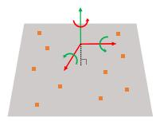  
(a) Vast plane

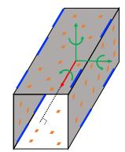  
(b) Corridor

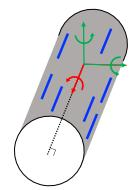  
(c) Tunnel  
Fig. 3. Representative examples of LiDAR odometry degenerate structures and their corresponding well-conditioned/degenerate DOFs. Green arrows denote well-conditioned DOFs. Red arrows denote degenerate DOFs. Orange patches denote planar features. Blue lines denote edge features.

where $\mathbf { f } _ { \mathrm { l } }$ is the nonlinear matching cost derived from (4) and (5). Moreover, (6) can be solved iteratively using the Levenberg-Marquardt method [23] as follows:

$$
\mathbf { x }  \mathbf { x } - ( \mathbf { J } _ { 1 } ^ { \top } \mathbf { J } _ { 1 } + \lambda \mathrm { d i a g } ( \mathbf { J } _ { 1 } ^ { \top } \mathbf { J } _ { 1 } ) ) ^ { - 1 } \mathbf { J } _ { 1 } ^ { \top } \mathbf { f } _ { 1 } ( \mathbf { x } ) ,\tag{7}
$$

where $\begin{array} { r } { \mathbf { J } _ { \mathbf { l } } = \frac { \partial \mathbf { f } _ { \mathbf { l } } } { \partial \mathbf { x } } } \end{array}$ is the Jacobian matrix of $\mathbf { f } _ { \mathrm { l } }$ and $\lambda$ is the damping factor. Consequently, (7) can be simplified as follows:

$$
\delta \mathbf { x } = - \mathbf { H _ { l } } ^ { - 1 } \mathbf { J _ { l } } ^ { \top } \mathbf { d _ { l } } ,\tag{8}
$$

where δx denotes the transformation increment. The pose from (8) is also propagated with IMU measurements.

3) Visual Odometry: The method in [6] is adapted for our visual odometry submodule. This method effectively addresses the scale problem of monocular vision by initialization with the alignment of visual and IMU motion. After initialization, the sliding window optimization is performed for bundle adjustment, and the pose derived from the optimization is propagated with IMU measurements.

Following [6], nonlinear optimization ofvisual-inertial odometry is calculated using the Gauss-Newton method as follows:

$$
\mathbf { x }  \mathbf { x } - ( \mathbf { J _ { v } } ^ { \top } \mathbf { J _ { v } } ) ^ { - 1 } \mathbf { J _ { v } } ^ { \top } \mathbf { f _ { v } } ( \mathbf { x } ) ,\tag{9}
$$

where $\mathbf { f _ { v } }$ (subscript v denotes visual) denotes the cost function of visual-inertial odometry and $\begin{array} { r } { \mathbf { J } _ { \mathbf { v } } = \frac { \partial \mathbf { f } _ { \mathbf { v } } } { \partial \mathbf { x } } } \end{array}$ denotes the corresponding Jacobian matrix. eq. (9) can be simplified as follows:

$$
\delta \mathbf { x } = - \mathbf { H _ { v } } ^ { - 1 } \mathbf { J _ { v } } ^ { \top } \mathbf { d _ { v } } .\tag{10}
$$

## C. Degeneracy Detection of LiDAR Odometry

Most degenerate cases in LiDAR originate from structureless environments, such as a vast open field, long corridor, and tunnel-like structure, as depicted in Fig. 3. However, even in these scenarios, either plane or edge features still exist within the sensing range of LiDAR, making LiDAR odometry rarely degenerate beyond 3-DOFs. Similarly, [24] presented multiple structure-less shapes in which LiDAR odometry degenerates; however, none of them also exceed 3-DOFs. Therefore, we can make physical assumptions that degeneracy rarely occurs in the three out of the six DOFs when a plane or edge feature is present. Consequently, our study primarily focuses on the degeneracy of the other 3-DOF directions.

Eigenvalues of $\mathbf { H } _ { \mathrm { l } }$ in (8) are utilized to detect degeneracy, where $d _ { 1 } , d _ { 2 }$ , and $d _ { 3 }$ denote the most degenerate DOFs. The corresponding three eigenvalues, denoted as $\pmb { \lambda } = [ \lambda _ { 1 } , \lambda _ { 2 } , \lambda _ { 3 } ]$ , are extracted as the three smallest values from the eigenvalues of H in ascending order. Then, λ is normalized to $\overline { { \lambda } } = \overline { { [ \lambda _ { 1 } } } , \overline { { \lambda } } _ { 2 } , \overline { { \lambda } } _ { 3 } ]$ . We define a non-heuristic threshold of normalized eigenvalues using the Chi-squared test [25]. The Chi-squared test is a statistical test assessing two categorical variables are critically associated. Therefore, by using the Chi-squared test, the boundary line at which statistical significance between the expected and observed values is lost can be defined as the non-heuristic threshold. In our case, the DOF of the Chi-squared test can be set as 2 because $\bar { \lambda }$ is normalized to 1 and one value can be determined when the other two are observed. The null hypothesis posits that each normalized eigenvalue follows its respective expectation within 95% interval, allowing outliers of the observed values at a 5% significance level around the expected value. Therefore, the Chi-squared test formulation to reject the null hypothesis is:

$$
\left( \overline { { \lambda } } - \mathbf { e _ { m } } \right) ^ { 2 } / \mathbf { e _ { m } } > 0 . 1 0 3 ,\tag{11}
$$

where 0.103 denotes the Chi-squared value for 2-DOFs at a 95% confidence level, and $\mathbf { e _ { m } }$ denotes the expectation values of each eigenvalue. Note that although the Chi-squared value is the only user-defined parameter, it remains constant across all the experiments.

According to [26], the eigenvalues distribution of a randomly constructed real symmetric matrix with finite dimensions can be approximated with a semicircle distribution [27]. Therefore, to determine $\mathbf { e _ { m } } .$ , we assume that each distribution of $\bar { \lambda }$ follows a symmetric probability distribution. Moreover, note that the norm of $\bar { \lambda }$ is 1, and $\overline { { \lambda } } _ { 1 } \overset { . } { \leq } \overline { { \lambda } } _ { 2 } \leq \overline { { \lambda } } _ { 3 }$ . Therefore, as $\overline { { \lambda } } _ { 1 }$ can take a maximum value of $1 / \sqrt { 3 }$ (when $\overline { { \lambda } } _ { 1 } = \overline { { \lambda } } _ { 2 } = \overline { { \lambda } } _ { 3 } )$ and a minimum value of 0, the expectation of $\overline { { \lambda } } _ { 1 }$ , denoted as $e _ { 1 }$ , is $1 / 2 \sqrt { 3 }$ ≈ 0.289. For $\lambda _ { 2 }$ , the maximum value is $1 / \sqrt { 2 }$ (when $\overline { { \lambda } } _ { 1 } = 0$ and $\overline { { \lambda } } _ { 2 } = \overline { { \lambda } } _ { 3 } )$ and the average minimum value is $e _ { 1 }$ (when $\overline { { \lambda } } _ { 1 } = \overline { { \lambda } } _ { 2 } )$ Thus, $e _ { 2 }$ is 0.498. Similarly, for $\lambda _ { 3 } ,$ , the maximum value is 1, and the average minimum value is $e _ { 2 } .$ Thus, $e _ { 3 }$ is 0.749. Following (11), the degeneracy threshold of $\overline { { \lambda } } , \overline { { \lambda } } _ { t }$ is:

$$
\overline { { \lambda } } _ { t } = \mathbf { e _ { m } } - \sqrt { 0 . 1 0 3 * \mathbf { e _ { m } } } .\tag{12}
$$

Thus, the non-heuristic threshold $\overline { { \lambda } } _ { t }$ is determined as [0.12, 0.27, 0.48] from (12). If any $\bar { \lambda }$ value is lower than the corresponding value of $\overline { { \lambda } } _ { t }$ , the initial guess is “switched” from the value of LiDAR odometry to visual odometry to stabilize the entire scan-to-map optimization process and aid in estimating each eigenvalue stably. Inversely, if all λ values are greater than the corresponding value of $\overline { { \lambda } } _ { t }$ , the system sets the initial guess based on pure LiDAR odometry.

However, problems still remain when dealing with states that are close to the defined threshold. This situation can rapidly change the value of the initial guess and result in non-smooth outcomes during the scan-to-map optimization process. To address this problem, we employ the status buffer method, which prevents the status from changing radically. In this method, the present status is classified as “Normal,” “Start/End to degenerate,” and “Fully degenerate” from a queue Q<sub>s</sub> with a pre-defined size, which continuously stores past status information, as shown in Fig. 4.

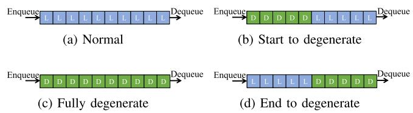  
Fig. 4. Description of the status buffer. $^ { \ast } \mathrm { D } ^ { \ast }$ denotes the sequences with degenerate LiDAR odometry in at least one DOF. “L” denotes the sequences with well-conditioned LiDAR odometry.

Therefore, we employ linear interpolation to bridge the piercing gap in the estimated state between LiDAR and visual odometry during the start or end of LiDAR odometry degeneracy, as shown in Fig. 4(b) and 4(d). The initial guess of the 6-DOF state, $\mathbf { T } _ { k } \in { \mathcal { M } }$ , is interpolated during the start or end of the degenerate status using prior state $\mathbf { T } _ { k - 1 }$ , differential state of LiDAR odometry $\delta \mathbf { T } _ { k - 1 , k } ^ { l } = \mathbf { T } _ { k } ^ { l } \ominus \mathbf { T } _ { k - 1 } ^ { l } \in \mathbb { R } ^ { n }$ , and differential state of visual odometry $\delta \mathbf { T } _ { k - 1 , k } ^ { v } = \mathbf { T } _ { k } ^ { v } \boxed { \mathbf { T } _ { k - 1 } ^ { v } }$ as follows:

$$
\mathbf { T } _ { k } = \mathbf { T } _ { k - 1 } \boxplus \sqrt { 3 } \overline { { \lambda } } _ { 1 } \delta \mathbf { T } _ { k - 1 , k } ^ { l } \boxplus \left( 1 - \sqrt { 3 } \overline { { \lambda } } _ { 1 } \right) \delta \mathbf { T } _ { k - 1 , k } ^ { v } ,\tag{13}
$$

Here, the maximum value of $\sqrt { 3 } \overline { { \lambda } } _ { 1 }$ is $1 , ^ { 6 6 } \boxplus ^ { \prime }$ and $\mathbf { \hat { \Pi } } ^ { 6 6 } \boxminus ^ { \prime } { }$ denote the operations to map the elements to and from a given manifold $\mathcal { M }$ and its tangent space $\mathbb { R } ^ { n }$ [28].

## D. Failure Detection of Visual Odometry

The minimum eigenvalue of the Hessian matrix of visual odometry is unstable and remains large after failure, as shown in [29]. Therefore, we adapt failure detection of visual odometry as proposed in [6] instead of degeneracy detection in our system. The number of tracked features, bias changes, and positional/rotational changes between consecutive keyframes are used for failure detection. If any of these values exceed the predefined threshold, the system treats the current state as a failure. Moreover, when the failure is detected, the state of visual odometry, denoted as $S _ { \mathrm { v o } }$ , is set to “fail,” and the system attempts re-initialization. Until successful re-initialization is achieved, the entire system relies on pure LiDAR odometry.

## E. Scan-to-Map Matching

Scan-to-map matching can fail because estimations of directions to degenerate DOFs can be unstable in structure-less environments. To prevent the effect of a degenerate DOF on the optimization process, we remap (8) considering the degenerate DOF. Given $\mathbf { H } _ { \mathrm { l } }$ and its eigendecomposition as $\mathbf { U } \pmb { \Lambda } \mathbf { U } ^ { - 1 }$ , the optimization process, when the state of LiDAR odometry is well-conditioned or visual odometry fails, is as follows:

$$
\delta \mathbf { x } = - \left( \mathbf { U } \mathbf { \Lambda } \mathbf { A } \mathbf { U } ^ { - 1 } \right) ^ { - 1 } \mathbf { J } _ { 1 } ^ { \top } \mathbf { d } _ { 1 } .\tag{14}
$$

When the state of LiDAR odometry is degenerate in at least one DOF and visual odometry does not fail, the optimization process is remapped by fusing visual and LiDAR odometry in a

```latex
Algorithm 1: Switching Node With Degeneracy Detection.
Input: Prior status $\overline { { \mathbf { T } _ { k - 1 } , \mathbf { H } _ { 1 } } }$ in (8), status buffer queue $Q _ { s }$
with size $n ,$ status of VO $S _ { \mathrm { v o } } ,$ differential state of
$\begin{array} { r } { \mathrm { L O \ } \delta \mathbf { T } _ { k - 1 , k } ^ { l } , } \end{array}$ and $\begin{array} { r } { \mathrm { V O } \ \delta \mathbf { T } _ { k - 1 , k } ^ { v } , } \end{array}$
Output: Final status $\mathbf { T } _ { k }$
1: 3-DOF normalized eigenvalues $\overline { { \lambda } } = \mathrm { e i g e n } _ { d _ { 1 } , d _ { 2 } , d _ { 3 } } ( \mathbf { H } _ { 1 } )$
2: if $S _ { \mathrm { v o } } = = \mathrm { f a i l } \lor \forall i , \overline { { \lambda } } ( i ) \geq \overline { { \lambda } } _ { t } ( i )$ then
3: //Use LO propagation as the initial guess
$\mathbf { T } _ { k } ^ { \mathrm { i n i t } } = \mathbf { T } _ { k - 1 } \boxplus \delta \mathbf { T } _ { k - 1 , k } ^ { l }$
4: else if check $( Q _ { s } ) = = { } ^ {  } \mathrm { S }$ tart/End to degenerate” then
5: //Use an interpolation of VO and LO as the initial
guess
$\mathbf { \widetilde { T } } _ { k } ^ { \mathrm { i n i t } } = \mathbf { T } _ { k - 1 } \boxplus \sqrt { 3 } \overline { { \lambda } } _ { 1 } \delta \mathbf { T } _ { k - 1 , k } ^ { l } \boxplus ( 1 - \sqrt { 3 } \overline { { \lambda } } _ { 1 } ) \delta \mathbf { T } _ { k - 1 , k } ^ { v }$
6: else
7: //Use VO propagation as the initial guess
$\mathbf { T } _ { k } ^ { \mathrm { i n i t } } = \mathbf { T } _ { k - 1 } \boxplus \delta \mathbf { T } _ { k - 1 , k } ^ { v }$
8: end if
9: //Scan to map matching Update $\mathbf { T } _ { k }$ with $\mathbf { T } _ { k } ^ { \mathrm { i n i t } }$
following (16)
10: Update status buffer queue Dequeue $Q _ { s }$ and Enqueue
current status to $Q _ { s }$
11: return $\mathbf { T } _ { k }$
```

tightly coupled way as follows:

$$
\begin{array} { r l } & { \delta \mathbf { x } = \underset { \delta \mathbf { x } } { \operatorname { a r g m i n } } \left( \left. \underset { \mathbf { e } _ { \mathrm { v } } ( \delta \mathbf { x } ) } { \underbrace { \delta \mathbf { x } + ( \mathbf { H } _ { \mathrm { v } } - 1 \mathbf { J } _ { \mathrm { v } } { } ^ { \top } \mathbf { d } _ { \mathrm { v } } } ) } \right. ^ { 2 } \right. } \\ & { \qquad \left. + \left. \underset { \mathbf { e } _ { \mathrm { l } } ( \delta \mathbf { x } ) } { \underbrace { \delta \mathbf { x } + \left( \mathbf { U } \mathbf { A } _ { \mathrm { p } } \mathbf { U } ^ { - 1 } \right) ^ { - 1 } \mathbf { J } _ { \mathrm { l } } { } ^ { \top } \mathbf { d } _ { \mathrm { l } } } } \right. ^ { 2 } \right) . } \end{array}\tag{15}
$$

where $\mathbf { \boldsymbol { \Lambda } } _ { \mathbf { p } }$ denotes the matrix with eigenvalues removed corresponding to degenerate DOFs from Λ.

When both LiDAR odometry degeneracy and visual odometry failure occur, the optimization process is executed only along the well-conditioned DOFs. In this case, the IMU preintegration significantly impacts the undetermined directions. Consequently, the entire process of scan-to-map matching is

$$
\delta \mathbf { x } = \left\{ \begin{array} { l l } { - \mathbf { H } _ { 1 } { } ^ { - 1 } \mathbf { J } _ { 1 } { } ^ { \top } \mathbf { d } _ { 1 } , } & { \mathrm { i f } \forall i , \overline { { \lambda } } ( i ) \geq \overline { { \lambda } } _ { t } ( i ) } \\ { - ( \mathbf { U } \mathbf { A } _ { \mathbf { p } } \mathbf { U } ^ { - 1 } ) ^ { - 1 } \mathbf { J } _ { 1 } { } ^ { \top } \mathbf { d } _ { 1 } , } & { \mathrm { e l s e ~ i f } \ : S _ { \mathrm { v o } } = \mathrm { f a i l } } \\ { \underset { \delta \mathbf { x } } { \mathrm { a r g m i n } } \left( | | \mathbf { e } _ { \mathbf { v } } ( \delta \mathbf { x } ) | | ^ { 2 } + | | \mathbf { e } _ { 1 } ( \delta \mathbf { x } ) | | ^ { 2 } \right) , \quad \mathrm { o t h e r w i s e } . } \end{array} \right.\tag{16}
$$

Note that although (15) relies on MAP fusion, our switching structure ensures robustness of the multimodal system, preventing failure or degeneration of one element from affecting the overall fusion process. The entire processes in the switching node are described in Algorithm 1.

## F. Backend ofSwitch-SLAM

Switch-SLAM contains pose graph optimization to efficiently fuse the GNSS or loop closure with the system. To optimize the pose graph, we use iSAM2 [30], which is time-efficient and robust in large environments. Moreover, we employ Scan context [31] for the loop-closing submodule, which shows high accuracy and robustness.

TABLE I DATASET DETAILS
<table><tr><td> $\mathrm { T y p e }$ </td><td>Dataset</td><td>LiDAR SLAM</td><td>Visual SLAM</td><td>Total Distance (m)</td></tr><tr><td rowspan="3">Simulation</td><td>Fast Rotate</td><td>Well-constraints</td><td>Degenerate</td><td>115</td></tr><tr><td>Plane</td><td>Degenerate</td><td>Well-constraints</td><td>109</td></tr><tr><td>Farm</td><td>Degenerate</td><td>Degenerate</td><td>536</td></tr><tr><td rowspan="6">Real-world</td><td>Handheld</td><td>Degenerate</td><td>Well-constraints</td><td>2850</td></tr><tr><td>Multi Floor</td><td>Degenerate</td><td>Degenerate</td><td>270</td></tr><tr><td>Long Corridor</td><td>Degenerate</td><td>Degenerate</td><td>616</td></tr><tr><td>ANYmal 1</td><td>Degenerate</td><td>Well-constraints</td><td>240</td></tr><tr><td>ANYmal 2</td><td>Degenerate</td><td>Well-constraints</td><td>687</td></tr><tr><td>ANYmal 3</td><td>Degenerate</td><td>Degenerate</td><td>311</td></tr><tr><td></td><td>ANYmal 4</td><td>Well-constraints</td><td>Well-constraints</td><td>500</td></tr></table>

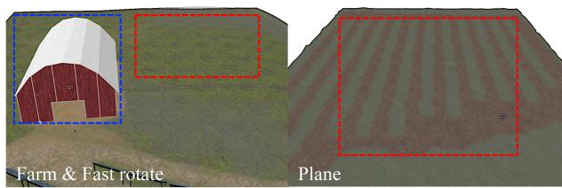  
Fig. 5. Simulated environments. The red region indicates the region of LiDAR SLAM degeneration. The blue region indicates the region of visual SLAM degeneration.

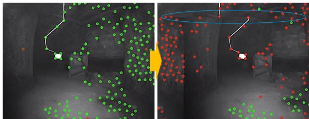  
Fig. 6. Imaging problem caused by video interruption in ANYmal 3. Green dots represent tracked features and red dots indicate untracked features. The blue region highlights the abnormal parts induced by the imaging problem.

## IV. EXPERIMENTS

In this section, the evaluation of the accuracy and robustness of the proposed method with various datasets containing sensor degeneracy is presented. Furthermore, the effectiveness of the proposed degeneracy detectionn is discussed.

## A. Datasets

We prepare various datasets with various environments, as summarized in Table I and shown in Fig. 5. First, we evaluate our method on simulated datasets: Plane, Fast Rotate, and Farm datasets. The Plane dataset demonstrates degenerate environments for LiDAR SLAM in the entire area owing to the presence of predominantly planar structures. The Farm dataset contains both degeneration of visual SLAM, in the blue line region, caused by fast rotations (also shown in the Fast Rotate dataset) and degeneration of LiDAR SLAM, in the red line region, caused by the predominance of plane-only structure. All the simulations are conducted with ROS [32] and in the

TABLE II  
COMPARISON OF ABSOLUTE TRANSLATIONAL ERRORS (MAXIMUM, RMSE) ON PREPARED DATASETS
<table><tr><td>Dataset</td><td colspan="2">Fast Rotate</td><td colspan="2">Plane</td><td colspan="2">Farm</td><td colspan="2">Handheld</td><td colspan="2">Multi Floor</td><td colspan="2">Long Corridor</td><td colspan="2">ANYmal 1</td><td colspan="2">ANYmal 2</td><td colspan="2">ANYmal 3</td><td colspan="2">ANYmal 4</td></tr><tr><td></td><td>Max</td><td>RMSE</td><td>Max</td><td>RMSE</td><td>Max</td><td>RMSE</td><td>Max</td><td>RMSE</td><td>Max</td><td>RMSE</td><td>Max</td><td>RMSE</td><td>Max</td><td>RMSE</td><td>Max</td><td>RMSE</td><td>Max</td><td>RMSE</td><td>Max</td><td>RMSE</td></tr><tr><td>LOAM</td><td>1.41</td><td>0.44</td><td></td><td></td><td></td><td></td><td></td><td></td><td>17.9</td><td>10.6</td><td>25.6</td><td>12.6</td><td>10.26</td><td>6.63</td><td>9.67</td><td>5.05</td><td>7.81</td><td>2.39</td><td>5.79</td><td>3.90</td></tr><tr><td>LIO-SAM</td><td>0.72</td><td>0.21</td><td></td><td></td><td></td><td></td><td></td><td></td><td></td><td></td><td>17.6</td><td>7.64</td><td>8.38</td><td>3.77</td><td></td><td></td><td>7.10</td><td>3.52</td><td>2.47</td><td>1.02</td></tr><tr><td>VINS-MONO</td><td></td><td></td><td>1.17</td><td>0.41</td><td></td><td></td><td>21.4</td><td>10.3</td><td>12.8</td><td>6.30</td><td>23.8</td><td>11.8</td><td>24.9</td><td>9.08</td><td>36.9</td><td>15.1</td><td></td><td></td><td>8.55</td><td>3.52</td></tr><tr><td>LVI-SAM</td><td>8.82</td><td>1.82</td><td>1.82</td><td>0.69</td><td>28.8</td><td>5.75</td><td>3.27</td><td>1.23</td><td></td><td></td><td>8.62</td><td>4.37</td><td>5.83</td><td>2.41</td><td>9.53</td><td>3.28</td><td></td><td></td><td>6.42</td><td>3.75</td></tr><tr><td>R2LIVE</td><td>1.67</td><td>0.64</td><td>19.5</td><td>8.53</td><td>8.52</td><td>4.21</td><td></td><td></td><td>35.2</td><td>18.5</td><td></td><td></td><td></td><td></td><td>14.5</td><td>7.29</td><td>8.60</td><td>3.73</td><td>3.90</td><td>1.18</td></tr><tr><td>R3LIVE</td><td>10.1</td><td>6.43</td><td>9.01</td><td>5.84</td><td>58.6</td><td>34.7</td><td></td><td></td><td>32.4</td><td>19.0</td><td>14.5</td><td>7.63</td><td></td><td></td><td></td><td>1</td><td>6.77</td><td>2.06</td><td>27.1</td><td>14.0</td></tr><tr><td>FAST-LIVO</td><td>11.3</td><td>7.12</td><td>–</td><td>–</td><td>51.2</td><td>26.5</td><td></td><td></td><td>1</td><td></td><td>–</td><td>=</td><td></td><td></td><td>4.87</td><td>1.48</td><td>–</td><td>■</td><td></td><td>-</td></tr><tr><td>Switch-SLAM</td><td>1.50</td><td>0.23</td><td>1.27</td><td>0.35</td><td>1.10</td><td>0.38</td><td>3.07</td><td>1.25</td><td>3.63</td><td>1.61</td><td>5.09</td><td>2.42</td><td>2.96</td><td>1.29</td><td>3.41</td><td>1.37</td><td>3.68</td><td>1.61</td><td>2.42</td><td>1.05</td></tr></table>

“" denotes the failure of localization. The units are in meters.

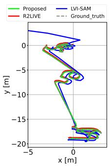  
(a) Fast Rotate

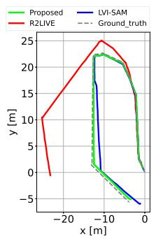  
(b) Plane

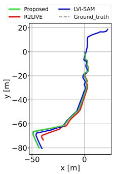  
(c) Farm

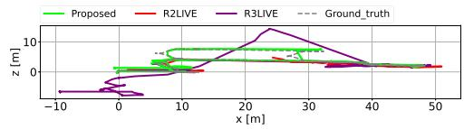  
(d) Multi Floor

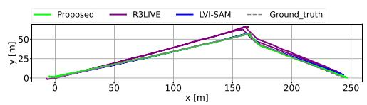  
(e) Long Corridor  
Fig. 7. Trajectory of proposed and compared LiDAR visual SLAM in Fast Rotate, Plane, Farm, Multi Floor, and Long Corridor dataset.

Gazebo simulator [33] using open-sourced environments.<sup>1</sup> The sensor suite of the simulated robot contains Velodyne VLP-16 operating at 10 Hz, 640 480 RGB camera operating at 60 Hz, and Gazebo basic plugin 9-axis IMU operating at 200 Hz.

Second, we evaluate our method on real-world and opensourced datasets: Handheld [11], CERBERUS DARPA subterranean challenge [34] and SubT-MRS [35] datasets. The Handheld dataset contains degeneration of LiDAR odometry caused by vast open fields. Because the CERBERUS dataset (ANYmal 1, 2, 3, and 4) lacks the degeneration of LiDAR, we limit the horizontal field-of-view of LiDAR at 180◦ to create more structure-less situations for each scan. This setup induces LiDAR degradation in ANYmal 1, 2, and 3. Additionally, we only use the front right camera (cam1) in the CERBERUS dataset. This camera experiences a single video interruption momentarily at approximately 10 frames in ANYmal 3, as shown in Fig. 6, leading to the failure of visual odometry. The Multi Floor and Long Corridor dataset (SubT-MRS dataset) contain structure-less and visually challenging scenes simultaneously.

The proposed method, Switch-SLAM is compared with the state-of-the-art of LiDAR [1], [2], visual [6], and LiDAR-visual odometry [8], [9], [10], [11]. All the methods are executed with Ubuntu OS and on an Intel i7-1165G7 CPU in real-time operation. The GNSS integration and loop closure are not used. All the experimental results are presented as averages obtained from each set of three repeated tests.

## B. Accuracy Evaluation

The entire results ofthe evaluation ofaccuracy and trajectories are shown in Table II and Fig. 7. On the Fast Rotate dataset,

LIO-SAM shows the best performance among the compared methods, whereas VINS-MONO fails in their localization because of aggressive rotation. Compared LiDAR visual inertial odometry (LVIO) methods demonstrate a larger drift than pure LiDAR-based methods. Our method is competitive with LIO-SAM because Switch-SLAM works as pure LiDAR SLAM in well-structured environments using the switching structure. On the Plane dataset, which mainly contains less-structured groundonly environments, the proposed method and VIN-MONO exhibit the best performance among the compared methods, whereas the LiDAR-based methods fail in their localization. Our method also outperforms state-of-the-art of LiDAR-visual SLAM because Switch-SLAM mainly employs visual odometry for its initial guess of scan matching in less-structured environments.

On the Farm dataset, which contains both aggressive motion and less-structured environments, LiDAR odometry fails in the phase of mapping less-structured environments, whereas visual odometry fails in the phase ofaggressive motion. Conversely, the proposed method outperforms not only compared LiDAR and visual SLAM but also the state-of-the-art LVIO methods. This result is attributed to the switching structure, which allows for appropriate status transitions based on the given environmental conditions.

In the Handheld dataset, the proposed method is competitive with LVI-SAM, whereas it outperforms the other compared methods, Note that the Handheld dataset contains a few LiDAR SLAM degeneracy phases, which makes no significant difference between LVI-SAM and the proposed method. When visual SLAM degeneracy is prolonged such as in the Fast Rotate and Farm datasets, LVI-SAM can drift significantly compared to the proposed method.

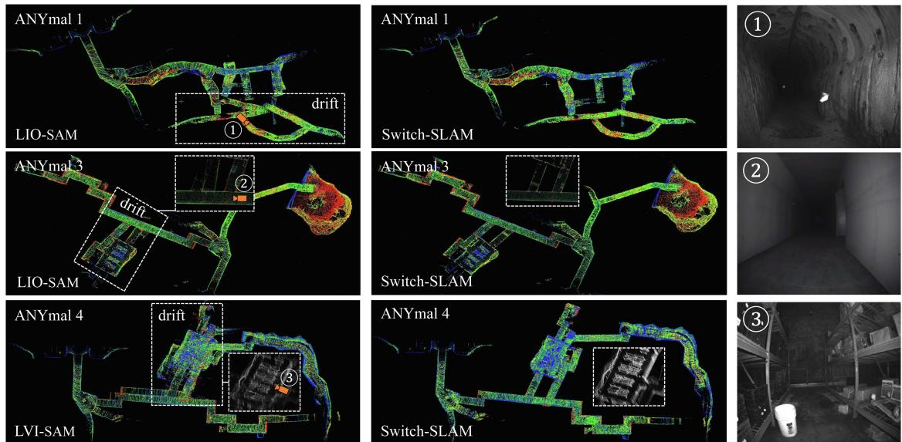  
Fig. 8. Resulting maps from the compared methods and Switch-SLAM.

On the Multi Floor and Long Corridor dataset, the proposed method shows the best performance among the compared methods. Most of the compared methods suffer with scenes featuring both structure-less environments and visual degradation. By comparison, the proposed method deals with these challenges well using the switching-based optimization as expressed in (16).

On the CERBERUS dataset, the proposed method demonstrates the best performance in ANYmal 1 and ANYmal 2. This result highlights the ability of Switch-SLAM to effectively address LiDAR degeneration, as illustrated in Fig. 8, even outperforming the compared LVIO methods. In ANYmal 3, which experiences a single camera interruption, VINS-MONO and LVI-SAM fail in mapping. Moreover, the corridorlike structure makes LOAM and LIO-SAM degenerate. Conversely, Switch-SLAM successfully conducts SLAM in these environments, owing to its switching structure. In ANYmal 4, the LIO-SAM and Switch-SLAM demonstrate superior performance to LVI-SAM. This result is because LVI-SAM relies on VINS-MONO as the initial guess for scan-to-map matching. A significant disparity in state estimation between VINS-MONO and scan-to-map matching lead to substantial drift. In contrast, owing to the status buffer and state interpolation method, the proposed method bridges the substantial gap between visual odometry and scan-to-map matching, leading to successful mapping.

## C. Degeneracy Detection Evaluation

To evaluate the accuracy of degeneracy detection, we compare the proposed method with the state-of-the-arts [16], [17]. The ground truth is prepared by comparing GNSS data with scan-to-scan matching using ICP [36] at each keyframe. In the evaluation, the thresholds for [16] are set to 50, 100, and 200. Moreover, the threshold for [17] are set to 5, 10, and 15. Among them, the best accuracy and recall are obtained for a threshold of 100 for [16] and of 10 for [17].

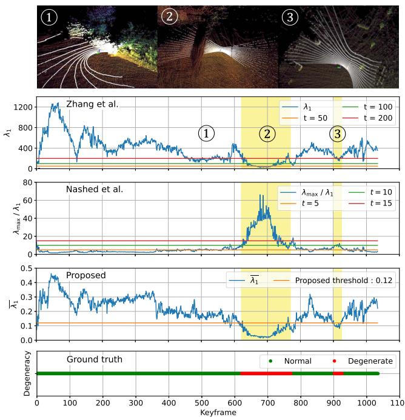  
Fig. 9. Comparison of degeneracy detection of the state-of-the-art and proposed methods on a part of the Handheld dataset, with visualization of the map (color) and LiDAR scan (white). The bottom figure shows the ground truth. The yellow regions are the actual degenerate regions.

The experimental results reveal an accuracy of 0.91 for [16], 0.96 for [17], and 0.96 for the proposed method. The recall is 0.91 for [16], 0.96 for [17], and 0.99 for the proposed method. These result results show that the proposed method achieves 5.5% greater accuracy and 8.8% greater recall compared to [16]. The comparison of the proposed method with the state-of-thearts is illustrated in Fig. 9. Notably, during the third phase of degeneracy, the proposed method successfully detects the degeneracy, which the state-of-the-art methods fail to identify. Note that compared methods are sensitive to threshold tuning, which is not required by our method. This detection is accomplished by normalizing the minimum eigenvalue using 3-DOF eigenvalues and applying a predefined threshold based on the Chi-squared test.

## V. CONCLUSION

In this letter, we propose Switch-SLAM, specially designed to address degeneracy situations of individual sensor odometry. To deal with the limitations of MAP-based sensor fusion, Switch-SLAM introduces a novel switching-based sensor fusion approach that utilizes a switching structure to effectively prevent failure information from propagating throughout the system, thereby enhancing robustness in degenerate situations. Furthermore, Switch-SLAM introduces non-heuristic degeneracy detection method, which eliminates the need for heuristic tuning. Experimental evaluations involving scenarios with degeneration in LiDAR or visual odometry reveal that Switch-SLAM outperforms the state-of-the-art LiDAR, visual, and LiDAR-visual SLAM methods in terms of accuracy and localizability.

Future work will involve testing our method in various fields that contain structure-less enviornments, aggressive motions, and various light conditions, for real-world application.

## REFERENCES

[1] J. Zhang and S. Singh, “Low-drift and real-time LiDAR odometry and mapping,” Auton. Robots, vol. 41, pp. 401–416, 2017.

[2] T. Shan, B. Englot, D. Meyers, W. Wang, C. Ratti, and D. Rus, “LIO-SAM: Tightly-coupled lidar inertial odometry via smoothing and mapping,” in Proc. IEEE/RSJ Int. Conf. Intell. Robots Syst., 2020, pp. 5135–5142.

[3] W. Xu, Y. Cai, D. He, J. Lin, and F. Zhang, “FAST-LIO2: Fast direct LiDAR-inertial odometry,” IEEE Trans. Robot., vol. 38, no. 4, pp. 2053–2073, Aug. 2022.

[4] R. Mur-Artal, J. M. M. Montiel, and J. D. Tardos, “ORB-SLAM: A versatile and accurate monocular SLAM system,” IEEE Trans. Robot., vol. 31, no. 5, pp. 1147–1163, Oct. 2015.

[5] J. Engel, T. Schöps, and D. Cremers, “LSD-SLAM: Large-scale direct monocular SLAM,” in Proc. 13th Eur. Conf. Comput. Vis., 2014, pp. 834–849.

[6] T. Qin, P. Li, and S. Shen, “VINS-mono: A robust and versatile monocular visual-inertial state estimator,” IEEE Trans. Robot., vol. 34, no. 4, pp. 1004–1020, Aug. 2018.

[7] J. Zhang and S. Singh, “Visual-lidar odometry and mapping: Lowdrift, robust, and fast,” in Proc. IEEE Int. Conf. Robot. Automat., 2015, pp. 2174–2181.

[8] J. Lin, C. Zheng, W. Xu, and F. Zhang, “R <sup>2</sup> LIVE: A. robust, real-time, LiDAR-inertial-visual tightly-coupled state estimator and mapping,” IEEE Robot. Automat. Lett., vol. 6, no. 4, pp. 7469–7476, Oct. 2021.

[9] J. Lin and F. Zhang, “R <sup>3</sup> LIVE: A robust, real-time, RGB-colored, LiDARinertial-visual tightly-coupled state estimation and mapping package,” in Proc. IEEE Int. Conf. Robot. Automat., 2022, pp. 10672–10678.

[10] C. Zheng, Q. Zhu, W. Xu, X. Liu, Q. Guo, and F. Zhang, “FAST-LIVO: Fast and tightly-coupled sparse-direct LiDAR-inertial-visual odometry,” in Proc. IEEE/RSJ Int. Conf. Intell. Robots Syst., 2022, pp. 4003–4009.

[11] T. Shan, B. Englot, C. Ratti, and D. Rus, “LVI-SAM: Tightly-coupled LiDAR-visual-inertial odometry via smoothing and mapping,” in Proc. IEEE Int. Conf. Robot. Automat., 2021, pp. 5692–5698.

[12] S. Zhao, H. Zhang, P. Wang, L. Nogueira, and S. Scherer, “Super odometry: IMU-centric LiDAR-visual-inertial estimator for challenging environments,” in Proc. IEEE/RSJ Int. Conf. Intell. Robots Syst., 2021, pp. 8729–8736.

[13] T. Wen, Y. Fang, B. Lu, X. Zhang, and C. Tang, “LIVER: A tightly coupled LiDAR-inertial-visual state estimator with high robustness for underground environments,” IEEE Robot. Automat. Lett., vol. 9, no. 3, pp. 2399–2406, Mar. 2024.

[14] C. Qin, H. Ye, C. E. Pranata, J. Han, S. Zhang, and M. Liu, “LINS: A LiDAR-inertial state estimator for robust and efficient navigation,” in Proc. IEEE Int. Conf. Robot. Automat., 2020, pp. 8899–8906.

[15] H.-A. Loeliger, “An introduction to factor graphs,” IEEE Signal Process. Mag., vol. 21, no. 1, pp. 28–41, Jan. 2004.

[16] J. Zhang, M. Kaess, and S. Singh, “On degeneracy of optimization-based state estimation problems,” in Proc. IEEE Int. Conf. Robot.Automat., 2016, pp. 809–816.

[17] S. B. Nashed, J. J. Park, R. Webster, and J. W. Durham, “Robust rank deficient SLAM,” in Proc. IEEE/RSJ Int. Conf. Intell. Robots Syst., 2021, pp. 6603–6608.

[18] R. Ren, H. Fu, H. Xue, X. Li, X. Hu, and M. Wu, “LiDAR-based robust localization for field autonomous vehicles in off-road environments,” J. Field Robot., vol. 38, no. 8, pp. 1059–1077, 2021.

[19] T. Tuna, J. Nubert, Y. Nava, S. Khattak, and M. Hutter, “X-ICP: Localizability-aware LiDAR registration for robust localization in extreme environments,” IEEE Trans. Robot., vol. 40, pp. 452–471, 2024.

[20] J. Nubert, E. Walther, S. Khattak, and M. Hutter, “Learning-based localizability estimation for robust LiDAR localization,” in Proc. IEEE/RSJ Int. Conf. Intell. Robots Syst., 2022, pp. 17–24.

[21] W. Xu and F. Zhang, “FAST-LIO: A fast, robust LiDAR-inertial odometry package by tightly-coupled iterated Kalman filter,” IEEE Robot. Automat. Lett., vol. 6, no. 2, pp. 3317–3324, Apr. 2021.

[22] C. Forster, L. Carlone, F. Dellaert, and D. Scaramuzza, “On-manifold preintegration for real-time visual-inertial odometry,” IEEE Trans. Robot., vol. 33, no. 1, pp. 1–21, Feb. 2017.

[23] D. W. Marquardt, “An algorithm for least-squares estimation of nonlinear parameters,” J. Soc. Ind. Appl. Math., vol. 11, no. 2, pp. 431–441, 1963.

[24] N. Gelfand, L. Ikemoto, S. Rusinkiewicz, and M. Levoy, “Geometrically stable sampling for the ICP algorithm,” in Proc. IEEE 4th Int. Conf. 3-D Digit. Imag. Model., 2003, pp. 260–267.

[25] K. Pearson, “On the criterion that a given system of deviations from the probable in the case of a correlated system of variables is such that it can be reasonably supposed to have arisen from random sampling,” London, Edinburgh, Dublin Philos. Mag. J. Sci., vol. 50, no. 302, pp. 157–175, 1900.

[26] F. Benaych-Georges and A. Knowles, “Lectures on the local semicircle law for wigner matrices,” 2016, arXiv:1601.04055.

[27] E. P. Wigner, “On the distribution of the roots of certain symmetric matrices,” Ann. Math., vol. 67, no. 2, pp. 325–327, 1958.

[28] C. Hertzberg, R. Wagner, U. Frese, and L. Schröder, “Integrating generic sensor fusion algorithms with sound state representations through encapsulation of manifolds,” Inf. Fusion, vol. 14, no. 1, pp. 57–77, 2013.

[29] N. Demmel, D. Schubert, C. Sommer, D. Cremers, and V. Usenko, “Square root marginalization for sliding-window bundle adjustment,” in Proc. IEEE/CVF Int. Conf. Comput. Vis., 2021, pp. 13260–13268.

[30] M. Kaess, H. Johannsson, R. Roberts, V. Ila, J. J. Leonard, and F. Dellaert, “iSAM2: Incremental smoothing and mapping using the Bayes tree,” Int. J. Robot. Res., vol. 31, no. 2, pp. 216–235, 2012.

[31] G. Kim and A. Kim, “Scan context: Egocentric spatial descriptor for place recognition within 3D point cloud map,” in Proc. IEEE/RSJ Int. Conf. Intell. Robots Syst., 2018, pp. 4802–4809.

[32] M. Quigley et al., “ROS: An open-source robot operating system,” in Proc. IEEE Int. Conf. Robot. Automat. Workshop Open Source Softw., 2009, vol. 3, no. 3.2, p. 5.

[33] N. Koenig and A. Howard, “Design and use paradigms for Gazebo, an open-source multi-robot simulator,” in Proc. IEEE/RSJ Int. Conf. Intell. Robots Syst., 2004, vol. 3, pp. 2149–2154.

[34] M. Tranzatto et al., “Team CERBERUS wins the DARPA subterranean challenge: Technical overview and lessons learned,” Field Robot., vol. 4, pp. 249–312, 2024, doi: 10.55417/fr.2024009.

[35] S. Zhao et al., “SubT-MRS dataset: Pushing SLAM towards all-weather environments,” in IEEE/CVF Conf. Comput. Vis. Pattern Recognit., 2024, pp. 22647–22657.

[36] P. J. Besl and N. D. McKay, “A method for registration of 3-D shapes,” IEEE Trans. Pattern Anal. Mach. Intell., vol. 14, no. 2, pp. 239–256, Feb. 1992.