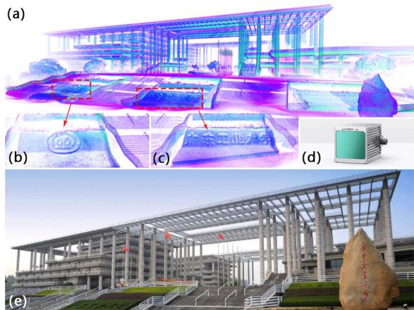
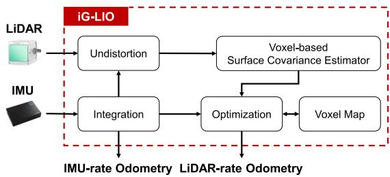
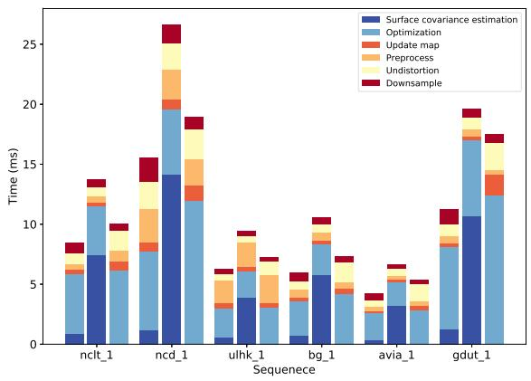
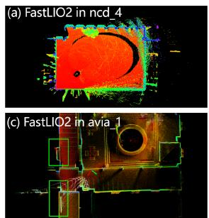
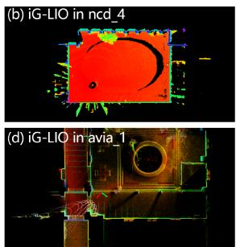
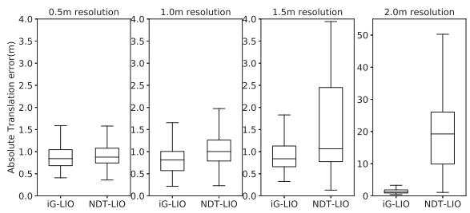
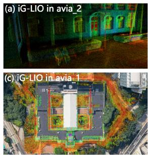
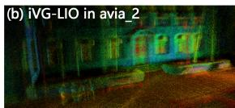
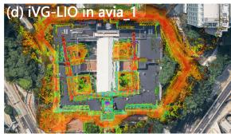

# iG-LIO: An Incremental GICP-Based Tightly-Coupled LiDAR-Inertial Odometry

Zijie Chen , Yong Xu , Member, IEEE, Shenghai Yuan , and Lihua Xie , Fellow, IEEE

Abstract—This work proposes an incremental Generalized Iterative Closest Point (GICP) based tightly-coupled LiDAR-inertial odometry (LIO), iG-LIO, which integrates the GICP constraints and inertial constraints into a unified estimation framework. iG-LIO uses a voxel-based surface covariance estimator to estimate the surface covariances of scans, and utilizes an incremental voxel map to represent the probabilistic models of surrounding environments. These methods successfully reduce the time consumption of the covariance estimation, nearest neighbor search, and map management. Extensive datasets collected from mechanical LiDARs and solid-state LiDARs are employed to evaluate the efficiency and accuracy of the proposed LIO. Even though iG-LIO keeps identical parameters across all datasets, the results show that it is more efficient than Faster-LIO while maintaining comparable accuracy with state-of-the-art LIO systems. The source code for iG-LIO has been open-sourced on GitHub: https://github.com/ zijiechenrobotics/ig\_lio.

Index Terms—SLAM, sensor fusion, LiDAR-inertial odometry.

## I. INTRODUCTION

in unknown environments without absolute measurements (e.g., GNSS). An efficient and accurate LiDAR-inertial odometry (LIO) is crucial for safe navigation [1], the front end of simultaneous localization and mapping (SLAM) [2], and large-scale mapping [3].

In recent years, LO/LIOs have improved the efficiency and accuracy via map management and registration metrics. For map management, LOAM [4] and its variant [5], [6] organize the spatial structure of the local map by kd-tree. Since the map contains thousands to millions of points, rebuilding the spatial structure becomes time-consuming when the local map updates. FastLIO2 [7] proposes a novel incremental kd-tree (ikd-tree) to represent the spatial pattern of the local map. The ikd-tree enables dynamic insertion and rebalancing, which saves the time of reconstructing the kd-tree. Nevertheless, the search complexity of the nearest points on a kd-tree is O(mlogn), where n is the number of points in the local map, and m is their dimension. It is challenging to perform in real-time when dealing with a large number of laser points. Voxelization provides an alternative and efficient approach to organizing the spatial structure of point clouds. It takes O(1) query time to associate the nearest neighbor voxel. The voxel-based methods [8], [9], [10], [11], [12], [13] split the local map into the voxel structure and achieve significantly faster speed in registration. To prevent divergence in narrow environments, AdaLIO [14] imports an adaptive strategy in Faster-LIO [8] and wins first place in the Hilti SLAM Challenge 2023.

The registration metric is one of the key components of LIO. Existing work includes the geometric features-based metrics [4], [5], [6], the dense surface representation-based metrics [15], [16], and the probabilistic distribution-based metrics [17], [18]. Generalized Iterative Closest Point (GICP) [19], which attaches a probabilistic model to Iterative Closest Point, is one of the widely used probabilistic distribution-based metrics. GICP estimates the surface covariance of each laser point and modifies its eigenvalues to achieve geometric feature-based metrics, including point-to-line, point-to-plane, and plane-to-plane. The surface covariance enables GICP to reduce the influence of incorrect correspondences and achieve accurate registration. VGICP [20] incorporates a voxel-based nearest neighbor search on GICP [19]. It is capable of processing 15,000 laser points at a rate of 30 Hz on the CPU. However, integrating GICP into efficient and accurate LIO poses several challenges.

Existing GICP-based LIOs [21], [22], [23] are not truly tightly-coupled with raw measurements. These LIOs are inadequate to maintain robustness in small field-of-view (FOV) LiDAR.

The surface covariance estimation presented in the previous work [19], [20] is unsuitable for sparse and small FOV laser scans (e.g., solid-state LiDAR sampling at 100 Hz or operating indoors). The presence of far-apart laser points within these scans significantly affects the precision of the estimated surface covariance and the registration.

\- Real-time registration using GICP, which relies on kd-tree for nearest neighbor search, becomes difficult when dealing with a dense scan.

  
Fig. 1. Dense map (a) of the main gate of the Guangdong University of Technology (GDUT) (e) is reconstructed by iG-LIO with a handheld device (d). (b) and (c) show the reconstructed details of the map. The experimental video is available at https://youtu.be/zMktZdj4AAk.

\- When GICP is extended to scan-to-map registration, the process of constructing a local map and estimating surface covariances becomes time-intensive.

Balancing efficiency in dense scans while preserving robustness in sparse and small FOV scans is challenging for the present GICP-based odometry [19], [20], [21], [22], [23], [24]. This letter proposes iG-LIO, an incremental GICP-based tightly-coupled LiDAR-inertial odometry, to address the aforementioned challenges. Fig. 1 shows that iG-LIO is capable of constructing the fine structural details of the environment. The main contributions of this letter are summarized as follows.

\- The GICP constraints are tightly-coupled with inertial measurement unit (IMU) constraints in a Maximum A Posteriori (MAP) estimation. The source code has been open-source on GitHub to benefit the community.

\- A voxel-based surface covariance estimator (VSCE) is proposed to improve the efficiency and accuracy of the surface covariance estimation. Compared to the kd-tree based methods [19], [20], VSCE reduces processing time in dense scans (see Section III-A) while maintaining the accuracy of iG-LIO in sparse and small FOV scans (see Section III-B3, III-B5, III-C1).

\- An incremental voxel map is designed to represent the probabilistic models of surrounding environments. Compared to non-incremental methods (e.g., DLIO [23]), it successfully reduces the time cost required for the nearest neighbor search and map management (see Section III-A).

\- Extensive datasets collected from different FOV LiDARs are adopted to evaluate the efficiency and accuracy of the proposed iG-LIO. Even though iG-LIO keeps identical parameters across all datasets, the results show that it is more efficient than Faster-LIO and achieves competitive performance compared to state-of-the-art LIO systems.

The rest of this letter is structured as follows. Section II explains the implementation details of iG-LIO, and Section III presents the efficiency and accuracy of iG-LIO through extensive experiments. Finally, Section IV concludes this letter.

TABLE I SOME IMPORTANT NOTATIONS
<table><tr><td>Notation</td><td>Explanation</td></tr><tr><td>Exp(·)/Log(·)</td><td>The association between Lie algebra and rotation [25].</td></tr><tr><td> $\mathbf { r } , \mathbf { J } , \boldsymbol { \Omega }$ </td><td>The residual, Jacobian, and information matrix in optimization.</td></tr><tr><td> $\mathbf { R } _ { b } ^ { w } , \mathbf { t } _ { b } ^ { w } , \mathbf { v } _ { b } ^ { w }$ </td><td>The rotation, position, and velocity of the body (IMU) frame with respect to the world frame.</td></tr><tr><td> $b _ { k }$   $\mathcal { M } [ i ] . ( \cdot )$ </td><td>The IMU body frame at time k. The element (·) of the i-th voxel in the voxel map</td></tr><tr><td></td><td>M.</td></tr><tr><td> $\mathcal { P }$ </td><td>The point set of the LiDAR scan.</td></tr><tr><td> $\delta ( \cdot )$ </td><td>The error state of state (·).</td></tr><tr><td> $\check { ( \cdot ) } , \hat { ( \cdot ) }$   $( \cdot ) ^ { n }$ </td><td>The prior and posterior estimation of state (·). The n-th update of state (·) in optimization, e.g.,</td></tr><tr><td></td><td> $\hat { \mathbf { R } } _ { b _ { k } } ^ { w , n }$  denotes the posterior rotation from the body frame at time k to the world frame after the n-th update.</td></tr></table>

  
Fig. 2. Block diagram of iG-LIO, it receives LiDAR and IMU measurements and outputs IMU-rate odometry and LiDAR-rate odometry.

## II. INCREMENTAL GICP-BASED TIGHTLY COUPLEDLIDAR-INERTIAL ODOMETRY

## A. System Overview

Table I shows the important notations in this letter. The sensing system state x is expressed as

$$
\begin{array} { r } { \mathbf { x } \doteq \left[ \mathbf { R } _ { b } ^ { w } \quad \mathbf { t } _ { b } ^ { w } \quad \mathbf { v } _ { b } ^ { w } \quad \mathbf { b } _ { \alpha } \quad \mathbf { b } _ { g } \right] , } \end{array}\tag{1}
$$

where $\mathbf { b } _ { \alpha } \in \mathbb { R } ^ { 3 }$ and $\mathbf { b } _ { g } \in \mathbb { R } ^ { 3 }$ are the biases of a three-axis gyroscope and a three-axis accelerometer.

Fig. 2 shows a block diagram of the proposed odometry. Starting with an IMU integration, iG-LIO compensates for a motion distortion of the scan, generates a prior constraint, and outputs an IMU-rate odometry. Then, the voxel-based surface estimator samples the undistorted scan to estimate the surface covariance of each point. Next, the scan implements the nearest neighbor search in the voxel map via hash indexes to achieve GICP constraints. Both the prior and the GICP constraints are integrated into a MAP to estimate the sensing system state. Finally, the scan is incrementally inserted into the voxel map to update the distribution of each voxel grid.

The MAP estimation is formulated as

$$
\underset { \mathbf { x } _ { k } } { \mathop { \operatorname* { m i n } } } \bigg \{ \sum _ { i \in \mathcal { P } } \sum _ { j \in \mathcal { M } } \left\| \mathbf { r } _ { i , j } ^ { G I C P } \right\| _ { \Omega _ { i , j } ^ { G I C P } } ^ { 2 } + \left\| \mathbf { r } _ { k } ^ { p r i o r } \right\| _ { \Omega _ { k } ^ { p r i o r } } ^ { 2 } \bigg \} ,\tag{2}
$$

where $\| \mathbf { r } \| _ { \Omega } ^ { 2 } = \mathbf { r } ^ { \top } \boldsymbol { \Omega } \mathbf { r }$ . The residuals $\mathbf { r } ^ { G I C P }$ and $\mathbf { r } ^ { p r i o r }$ are computed from the GICP constraints (see Section II-D) and the prior constraints (see Section II-B). The matrices $\Omega ^ { G I { \dot { C } } P }$ and $\Omega ^ { \bar { p } r i o r }$ are the corresponding information matrices.

The MAP estimation (2) only maintains the state of a single moment, which can be regarded as tightly coupling IMU measurements with GICP registration. The tightly-coupled mode improves the robustness and accuracy of the state estimation in degenerate scenarios (e.g., LiDAR sampling at 100 Hz). Specifically, unobservable states in the MAP estimation are constrained by IMU measurements, instead of converging to a poor solution in the loosely-coupled mode (e.g., the IMU measurements provide an initial guess for pure GICP registration [24]).

## B. IMU Constraints

The IMU integration predicts the prior estimation xˇ and propagates the covariance of the error state δx. Define a discretization time interval as $\Delta t \doteq t _ { k + 1 } - t _ { k }$ , iG-LIO predicts the prior estimation xˇ via midpoint method,

$$
\begin{array} { r } { \check { \mathbf { R } } _ { b _ { k + 1 } } ^ { w } = \check { \mathbf { R } } _ { b _ { k } } ^ { w } \mathrm { E x p } ( \bar { \omega } \Delta t ) , \ \bar { \omega } = \frac { \omega _ { m , k } + \omega _ { m , k + 1 } } { 2 } - \mathbf { b } _ { g , k } , } \\ { \check { \mathbf { v } } _ { b _ { k + 1 } } ^ { w } = \check { \mathbf { v } } _ { b _ { k } } ^ { w } + \bar { \alpha } \Delta t , \ \check { \mathbf { t } } _ { b _ { k + 1 } } ^ { w } = \check { \mathbf { t } } _ { b _ { k } } ^ { w } + \check { \mathbf { v } } _ { b _ { k } } ^ { w } \Delta t + \frac { 1 } { 2 } \bar { \alpha } \Delta t ^ { 2 } , } \\ { \bar { \alpha } = \frac { \mathbf { R } _ { k } + \mathbf { R } _ { k + 1 } } { 2 } - \mathbf { g } ^ { w } , \ \mathbf { R } _ { k } = \check { \mathbf { R } } _ { b _ { k } } ^ { w } ( \alpha _ { m , k } - \mathbf { b } _ { \alpha , k } ) , } \\ { \mathbf { R } _ { k + 1 } = \check { \mathbf { R } } _ { b _ { k + 1 } } ^ { w } ( \alpha _ { m , k + 1 } - \mathbf { b } _ { \alpha , k } ) , } \end{array}\tag{3}
$$

where $\omega _ { m }$ and $\alpha _ { m }$ are IMU raw measurements. The vector $\mathbf { g } ^ { w }$ is a constant gravity vector in the world frame.

To express the uncertainty of prior constraints in the MAP estimation (2), iG-LIO propagates the covariance of the error state δx. This process is similar to the forward propagation in the iterated error state Kalman filter [26],

$$
\begin{array} { r } { \delta \mathbf { x } _ { k + 1 } = \mathbf { F } _ { k } \delta \mathbf { x } _ { k } + \mathbf { G } _ { k } \mathbf { w } _ { k } , } \end{array}\tag{4}
$$

where

$$
\begin{array} { r l } & { \delta \mathbf { x } _ { k } = \left[ \delta \pmb { \theta } _ { k } ^ { \top } \quad \delta \mathbf { t } _ { k } ^ { \top } \quad \delta \mathbf { v } _ { k } ^ { \top } \quad \delta \mathbf { b } _ { g , k } ^ { \top } \quad \delta \mathbf { b } _ { \alpha , k } ^ { \top } \right] ^ { \top } , } \\ & { } \\ & { \mathbf { w } _ { k } = \left[ \mathbf { n } _ { \alpha , k } ^ { \top } \quad \mathbf { n } _ { g , k } ^ { \top } \quad \mathbf { n } _ { \alpha , k + 1 } ^ { \top } \quad \mathbf { n } _ { g , k + 1 } ^ { \top } \quad \mathbf { n } _ { b _ { \alpha } } ^ { \top } \quad \mathbf { n } _ { b _ { g } } ^ { \top } \right] ^ { \top } . } \end{array}
$$

The vectors $\mathbf { n } _ { \alpha } , \mathbf { n } _ { g } , \mathbf { n } _ { b _ { \alpha } }$ , and $\mathbf { n } _ { b _ { g } }$ are white Gaussian noises of the acceleration measurement $\mathbf { \alpha } _ { \alpha } .$ gyroscope measurement $\omega _ { m } ,$ , acceleration bias $\mathbf { b } _ { \alpha }$ , and gyroscope bias ${ \bf b } _ { g } .$ , respectively. The transition matrices $\mathbf { F } _ { k }$ and $\mathbf { G } _ { k }$ are calculated based on the Appendices E in [27]. Then, the covariance $\check { \mathbf { P } } _ { k + 1 }$ of the error state δx is computed iteratively by

$$
\begin{array} { r } { \check { \mathbf { P } } _ { k + 1 } = \mathbf { F } _ { k } \check { \mathbf { P } } _ { k } \mathbf { F } _ { k } ^ { \top } + \mathbf { G } _ { k } \mathbf { Q } \mathbf { G } _ { k } ^ { \top } , } \end{array}\tag{5}
$$

where Q is a covariance of the process noise.

iG-LIO integrates the IMU inputs until the next round of the LiDAR measurements arrives. The prior constraints in (2) are

defined as

$$
\begin{array} { r } { \mathbf { r } _ { k } ^ { p r i o r } \doteq \left[ \begin{array} { c } { \mathrm { L o g } ( \check { \mathbf { R } } _ { b _ { k } } ^ { w } \mathsf { T } _ { b _ { k } } ^ { w } ) } \\ { \mathbf { t } _ { b _ { k } } ^ { w } - \check { \mathbf { t } } _ { b _ { k } } ^ { w } } \\ { \mathbf { v } _ { b _ { k } } ^ { w } - \check { \mathbf { v } } _ { b _ { k } } ^ { w } } \\ { \mathbf { b } _ { \alpha , k } - \check { \mathbf { b } } _ { \alpha , k } } \\ { \mathbf { b } _ { g , k } - \check { \mathbf { b } } _ { g , k } } \end{array} \right] , \boldsymbol { \Omega } _ { k } ^ { p r i o r } \doteq \check { \mathbf { P } } _ { k } ^ { - 1 } . } \end{array}\tag{6}
$$

## C. Voxel Map

After each measurement update, iG-LIO incrementally adds the laser point to the voxel map and updates the probabilistic model of each voxel to represent the surrounding environment. This method improves the efficiency and accuracy as follows.

The query time of the voxel-based nearest neighbor search is $O ( 1 )$ . Compared to the kd-tree-based method, this approach is computationally cheap and easily scalable for parallel processing [20].

\- The voxel map enables iG-LIO to perform GICP in scan-tomap registration. It enhances the robustness and accuracy of state estimation compared to previous work using GICP in scan-to-scan registration [19], [20].

1) Map Construction: The voxel map characterizes each voxel $\mathcal { M } [ i ]$ by five elements: the number of points N, the sum of points p, the sum of outer products C, the mean of voxel μ, and the covariance of voxel Σ. The structure of the voxel map is implemented via std::unordered\_map in C++, and the hash index is calculated as [28],

$$
\begin{array} { r } { \mathbf { g } = \Big [ g _ { x } \quad g _ { y } \quad g _ { z } \Big ] ^ { \top } \qquad } \\ { \qquad = \Big [ \mathrm { H o o r } ( \frac { p _ { x } } { s } ) \quad \mathrm { f l o o r } ( \frac { p _ { y } } { s } ) \quad \mathrm { f l o o r } ( \frac { p _ { z } } { s } ) \Big ] ^ { \top } , \quad \qquad } \\ { h a s h \_ i n d e x = ( g _ { x } n _ { x } ) \mathbf { x o r } ( g _ { y } n _ { y } ) \mathbf { x o r } ( g _ { z } n _ { z } ) \mathbf { m o d } \mathcal { M } _ { m a x } , } \end{array}\tag{7}
$$

where $p _ { x } , p _ { y } .$ , and $p _ { z }$ are the position of the laser point $\mathbf { p } \in$ $\mathbb { R } ^ { 3 }$ . The function floor(x) computes the largest integer value not greater than x. The parameter s is a voxel resolution, and $\mathcal { M } _ { m a x }$ is the maximum size in the voxel map. The values $n _ { x } , n _ { y } ,$ and $n _ { z }$ are large prime numbers $( \mathrm { e . g . , } n _ { x } = 7 3 8 5 6 0 9 3 , n _ { y } =$ 83492791, and $n _ { z } = 4 7 1 9 4 5 )$

2) Map Update: The voxel map increment consists of two steps: update and delete. For the update step, the undistorted scan $\bar { \mathcal P } _ { k }$ is transformed into the world frame via the posterior estimation xˆ<sub>k</sub>. The laser points in $\bar { \mathcal P } _ { k }$ are subsequently stored into an active list V based on their hash indexes in (7). For each hash index within the active list V, the number of laser points $\tilde { N } _ { i }$ , the sum of points $\tilde { \mathbf { p } } _ { i } .$ , and the sum of outer products $\tilde { \mathbf { C } } _ { i }$ are computed to update the voxel $\mathcal { M } [ i ]$

$$
\begin{array} { r l } & { \mathcal { M } [ i ] . N = \mathcal { M } [ i ] . N + \tilde { N } _ { i } , \ \mathcal { M } [ i ] . \mathbf { p } = \mathcal { M } [ i ] . \mathbf { p } + \tilde { \mathbf { p } } _ { i } , } \\ & { \mathcal { M } [ i ] . \mathbf { C } = \mathcal { M } [ i ] . \mathbf { C } + \tilde { \mathbf { C } } _ { i } , \ \mathcal { M } [ i ] . \boldsymbol { \mu } = \mathcal { M } [ i ] . \mathbf { p } / \mathcal { M } [ i ] . N , } \\ & { \mathcal { M } [ i ] . \boldsymbol { \Sigma } = \frac { 1 } { \mathcal { M } [ i ] . N + 1 } ( \mathcal { M } [ i ] . \mathbf { C } - \mathcal { M } [ i ] . \mathbf { p } \cdot \mathcal { M } [ i ] . \boldsymbol { \mu } ^ { \top } ) . } \end{array}\tag{8}
$$

```latex
Algorithm 1: Updating and deleting in the voxel map
Input: Undistorted LiDAR scan $\bar { \mathcal { P } } _ { k } ,$ current posterior
estimation $\hat { \mathbf { x } } _ { k } ,$ voxel map M.
Output: voxel map M.
1 Transform $\bar { \mathcal { P } } _ { k }$ in world frame via $\hat { \mathbf { x } } _ { k }$ and achieve $\bar { \mathcal P } _ { k } ^ { w } :$
2 for each point pi in $\bar { \mathcal P } _ { k } ^ { w }$ do
3 Compute hash_index of pi via $( 7 ) ;$
4 ${ \mathcal { V } } = { \mathcal { V } } \cup ( i d x = h a s h \_ i n d e x , \mu = \mathbf { p } _ { i } ) ;$
5 end
6 Sort $\nu$ via idx element;
7 for $i \in [ 0 , . . . , \mathrm { s i z e } ( \mathcal { V } ) ]$ do
8 $\tilde { \pmb { \mu } } = \mathbf { 0 } , \tilde { \mathbf { C } } = \mathbf { 0 } , \tilde { N } = 0 ;$
9 for $j \in [ i , . . . , \mathrm { s i z e } ( \mathcal { V } ) ] \ \mathbf { d o }$
10 if $\mathcal { V } [ i ] . i d x = = \mathcal { V } [ j ] . i d x$ then
11 $\tilde { \mu } = \tilde { \mu } + \mathcal { V } [ j ] . \mu , \tilde { N } = \tilde { N } + 1 ;$
12 $\begin{array} { r } { \tilde { \mathbf { C } } = \tilde { \mathbf { C } } + \mathcal { V } [ j ] . \mu \cdot \mathcal { V } [ j ] . \mu ^ { \top } ; } \end{array}$
13 else
14 break;
15 end
16 end
17 if ind V[i].idx in M then
18 Update voxel $\mathcal { M } [ \mathcal { V } [ i ] . i d x ]$ distribution via (8);
19 else
20 Create new voxel
$\mathcal { M } _ { n e w } ( N = 0 , { \bf p } = { \bf 0 } , { \bf C } = { \bf 0 } , \mu = { \bf 0 } , { \Sigma } = { \bf 0 } ) \mathrm { ; }$
21 Update voxel ${ \mathcal { M } } _ { n e w }$ distribution via (8);
22 $\mathcal { M } = \mathcal { M } \cup \mathcal { M } _ { n e w } ;$
23 if $\mathrm { s i z e } ( \mathcal { M } ) > \mathcal { M } _ { m a x }$ then
24 Delete voxel via LRU cache strategy;
25 end
26 end
27 $i = j ;$
28 end
```

To improve the symmetry of the metric [19], GICP modifies the covariance to approximate a local planar,

$$
\mathcal { M } [ i ] . \boldsymbol { \Sigma } = \mathbf { U } \left[ \begin{array} { l l l } { 1 } & { 0 } & { 0 } \\ { 0 } & { 1 } & { 0 } \\ { 0 } & { 0 } & { \epsilon } \end{array} \right] \mathbf { V } ^ { \intercal } ,\tag{9}
$$

where the matrices U and V are the SVD decomposition results of $\mathcal { M } [ i ] . \boldsymbol { \Sigma } = \mathbf { U } \mathbf { D } \mathbf { V } ^ { \intercal }$ . The scalar $\epsilon = 0 . 0 0 1$ denotes the covariance along the normal.

The goal of the delete step is to strike a balance between the storage space of the voxel map and the accuracy of the registration. Since the nearest neighbor search of the registration is only performed within a certain range of the sensing system, the voxel map maintains a specific number of voxels via the LRU cache strategy [8].

The detailed process for updating and deleting in the voxel map can be found in the Algorithm 1.

## D. Measurement Update

1) Voxel-Based Surface Covariance Estimator (VSCE): The scan preparation in GICP registration involves three steps. A scan $\mathcal { P } _ { k }$ undergoes a motion compensation to obtain an undistorted scan $\bar { \mathcal P } _ { k }$ . Subsequently, a voxel grid filter is applied to downsample the scan $\bar { \mathcal P } _ { k }$ to $\bar { \mathcal { P } } _ { k } ^ { \prime } = \{ \mathbf { p } _ { 0 } , . . . , \mathbf { p } _ { N } \}$ , which reduces sensor noise and ensures an adequate spatial pattern of the laser points. Finally, a set of covariances $\mathcal { C } _ { k } = \{ \Sigma _ { 0 } , . . . , \Sigma _ { N } \}$ corresponding to the downsampled scan $\hat { \mathcal { P } } _ { k } ^ { \prime }$ is estimated using a kd-tree based neighbor search.

The voxel structure in the voxel grid filter allows VSCE to combine the downsampling and the surface covariance estimation. Specifically, VSCE estimates the covariance of each laser point based on the 26 neighboring voxels instead of the 20 closest points as in GICP [19]. This choice improves the registration accuracy in the sparse and small FOV scans (see Section III-C3).

2) GICP Constraints: The GICP constraints are modeled as distribution-to-distribution distances. During the nearest neighbor search, the point $\mathbf { p } _ { i }$ is projected into the voxel map M via the hash index (7). The residual and the information matrix of the laser point $p _ { i }$ and voxel $\mathcal { M } [ j ]$ are defined as

$$
\begin{array} { r l } & { \mathbf { r } _ { i , j } ^ { G I C P } \doteq \mathcal { M } [ j ] . \mu - \mathbf { R } _ { b _ { k } } ^ { w } ( \mathbf { R } _ { l } ^ { b } \mathbf { p } _ { i } + \mathbf { t } _ { l } ^ { b } ) - \mathbf { t } _ { b _ { k } } ^ { w } , } \\ & { \Omega _ { i , j } ^ { G I C P } \doteq \sigma _ { G I C P } ( \mathcal { M } [ j ] . \Sigma + \mathbf { R } _ { b _ { k } } ^ { w } \Sigma _ { i } \mathbf { R } _ { b _ { k } } ^ { w } { } ^ { \top } ) ^ { - 1 } , } \end{array}\tag{10}
$$

where $\mathbf { R } _ { l } ^ { b }$ and $\mathbf { t } _ { l } ^ { b }$ are the extrinsic parameters between the LiDAR and the IMU. The matrix $\Sigma _ { i }$ represents the surface covariance of the point $\mathbf { p } _ { i }$ . The parameter $\sigma _ { G I C P }$ denotes the weight of the GICP constraint.

In practice, iG-LIO modifies the surface covariance $\Sigma _ { i }$ to obtain the point-to-plane and plane-to-plane metrics. This modification is necessary since VSCE is unable to compute a stable surface covariance with fewer than five closest points. If the covariance cannot be estimated, iG-LIO sets the corresponding covariance in (10) to be $\Sigma _ { i } = \mathbf { 0 }$ . This modification leads to a degradation from the plane-to-plane metric to the point-to-plane metric [19].

Additionally, iG-LIO employs a chi-squared test to remove outliers that could bring down the state estimation accuracy. The outliers include unsuitable local planar approximations and mismatched feature correspondences.

## E. The iG-LIO Algorithm

This subsection aims to solve the MAP estimation presented in (2) and summarize the iG-LIO algorithm. The MAP estimation (2) is an unconstrained nonlinear least squares problem that can be solved by the Gauss-Newton method. The optimal $\delta \hat { \mathbf x } ^ { n }$ of the n-th iteration is computed as

$$
\underbrace { \sum _ { i } \mathbf { J } _ { i } ^ { \top } \boldsymbol { \Omega } _ { i } \mathbf { J } _ { i } \delta \hat { \mathbf { x } } ^ { n } } _ { \mathbf { H } ^ { n } } = \underbrace { \sum _ { i } - \mathbf { J } _ { i } ^ { \top } \boldsymbol { \Omega } _ { i } \mathbf { r } _ { i } } _ { \mathbf { b } ^ { n } } ,\tag{11}
$$

where $\mathbf { J } _ { i }$ is the Jacobian matrix of the residual $\mathbf { r } _ { i }$ with respect to $\delta \hat { \mathbf x } ^ { n }$ , and $\Omega _ { i }$ is the information matrix of the residual $\mathbf { r } _ { i } .$ In the case of the prior constraint, the Jacobian matrix is

$$
{ \bf J } _ { k } ^ { p r i o r } = \frac { \partial { \bf r } _ { k } ^ { p r i o r } } { \partial \delta { \bf x } } = \left[ \begin{array} { c c } { { \bf J } _ { r } ^ { - 1 } ( \mathrm { L o g } ( \check { \bf R } _ { b _ { k } } ^ { w } { } ^ { \top } { \bf R } _ { b _ { k } } ^ { w } ) ) } & { { \bf 0 } _ { 3 \times 1 2 } } \\ { { \bf 0 } _ { 1 2 \times 3 } } & { { \bf I } _ { 1 2 \times 1 2 } } \end{array} \right] ,\tag{12}
$$

where $\mathbf { J } _ { r } ^ { - 1 } ( \cdot )$ is the inverse of the right Jacobian in [25]. For the GICP constraints, the Jacobian matrix is computed as

$$
\mathbf { J } _ { i , j } ^ { G I C P } = \frac { \partial \mathbf { r } _ { i , j } ^ { G I C P } } { \partial \delta \mathbf { x } } = \left[ \mathbf { R } _ { b _ { k } } ^ { w } [ \mathbf { R } _ { l } ^ { b } \mathbf { p } _ { i } + \mathbf { t } _ { l } ^ { b } ] _ { \times } \quad - \mathbf { I } \quad \mathbf { 0 } _ { 3 \times 9 } \right] .\tag{13}
$$

Algorithm 2: iG-LIO   
Input: Last posterior estimation $\hat { \mathbf { x } } _ { k }$ and covariance   
$\hat { \mathbf { P } } _ { k } .$ IMU measurements $\begin{array} { r } { \alpha _ { m , k \sim k + 1 } , \omega _ { m , k \sim k + 1 } , } \end{array}$   
LiDAR scan $\mathcal { P } _ { k + 1 }$   
Output: Posterior estimation $\hat { \mathbf { x } } _ { k + 1 }$ and covariance   
$\hat { P } _ { k + 1 }$   
1 Integrate IMU measurements $\alpha _ { m , k \sim k + 1 } , \omega _ { m , k \sim k + 1 }$ to   
achieve prior estimation $\check { \mathbf { x } } _ { k + 1 }$ and $\check { \mathbf { P } } _ { k + 1 }$ via (3) (5);   
2 Compensate scan $\mathcal { P } _ { k + 1 }$ to obtain $\bar { \mathcal { P } } _ { k + 1 } ;$   
3 Obtain $\bar { \mathcal { P } } _ { k + 1 } ^ { \prime }$ and $\mathcal { C } _ { k + 1 } = \{ \Sigma _ { 0 } , . . . , \Sigma _ { n } \}$ via VSCE;   
4 repeat   
5 for each point $\mathbf { p } _ { i }$ in $\bar { \mathcal { P } } _ { k + 1 } ^ { \prime }$ do   
6 Compute hash\_index of $\mathbf { p } _ { i }$ via $( 7 ) ;$   
7 if fnd hash\_index in $\mathcal { M }$ then   
8 | Add GICP association to the list ${ \mathcal { F } } ;$   
9 end   
10 end   
11 $\mathbf { H } ^ { n } = \mathbf { 0 } , \mathbf { b } ^ { n } = \mathbf { 0 } ;$   
12 for each element in $\mathcal { F }$ do   
13 Compute $\mathbf { r } _ { i , j _ { - } } ^ { G I C P }$ and $\Omega _ { i , j } ^ { G I C P }$ via (10);   
14 if pass the $\chi ^ { 2 }$ test then   
15 Compute Jacobian $\mathbf { J } _ { i , i } ^ { G I C P }$ i via (13);   
16 $\mathbf { H } ^ { n } = \mathbf { H } ^ { n } + \mathbf { J } _ { i , j } ^ { G I C P ^ { \top } } \mathbf { \hat { \Omega } } \Omega _ { i , j } ^ { G I C P } \mathbf { J } _ { i , j } ^ { G I C P } ;$   
17 $\mathbf { b } ^ { n } = \mathbf { b } ^ { n } - \mathbf { J } _ { i , j } ^ { G I C P ^ { \top } } \pmb { \Omega } _ { i , j } ^ { G I C P } \mathbf { r } _ { i , j } ^ { G I C P } ;$   
18 end   
19 end   
20 Compute $\mathbf { r } _ { k } ^ { p r i o r } , \Omega _ { k } ^ { p r i o r }$ , and $\mathbf { J } _ { k } ^ { p r i o r }$ via (6) (12);   
21 $\mathbf { H } ^ { n } = \mathbf { H } ^ { n } + \mathbf { J } _ { k } ^ { p r i o r } \ ` \boldsymbol { \Omega } _ { k } ^ { p r i o r } \mathbf { J } _ { k } ^ { p r i o r } ;$   
22 $\mathbf { b } ^ { n } = \mathbf { b } ^ { n } - \mathbf { J } _ { k } ^ { p r i o r } \phantom { \Omega _ { k } ^ { m } } \Omega _ { k } ^ { p r i o r } \mathbf { r } _ { k } ^ { p r i o r } ;$   
23 Solve $\mathbf { H } ^ { n } \delta \hat { \mathbf { x } } ^ { n } = \mathbf { b } ^ { n } ;$   
24 Update $\hat { \mathbf { x } } _ { k + 1 } ^ { n }$ by $\delta \hat { \mathbf x } ^ { n }$ to obtain $\hat { \mathbf { x } } _ { k + 1 } ^ { n + 1 } , n = n + 1 ;$   
25 until $| | \delta \hat { \mathbf { x } } ^ { n } | | < \epsilon ;$   
26 $\hat { \mathbf { x } } _ { k + 1 } = \hat { \mathbf { x } } _ { k + 1 } ^ { n } , \hat { \mathbf { P } } _ { k + 1 } = \mathbf { L } _ { k + 1 } ( \mathbf { H } ^ { n } ) ^ { - 1 } \mathbf { L } _ { k + 1 } ^ { \top }$ via (15);   
27 Update voxel map via Algorithm 1.

where [·]<sub>×</sub> is the skew operator in [27].

Assuming that the Guass-Newton method converges after $n \geq 0$ iterations, the measurement update observes the error state distribution $\delta \mathbf { x } _ { k } \sim { \mathcal { N } } ( \delta { \hat { \mathbf { x } } } ^ { n } , ( \mathbf { H } ^ { n } ) ^ { - 1 } )$ in the tangent space of $\hat { \mathbf { x } } _ { k } ^ { n }$ [29], [30]. However, the propagation in (5) requires the distribution $\delta \mathbf { x } _ { k } \sim \mathcal N ( \mathbf 0 , \hat { \mathbf P } _ { k } )$ in the tangent space of $\hat { \mathbf { x } } _ { k } ^ { n + 1 }$ To ensure the consistency of the covariance propagation, it is necessary to reset the covariance of the error state $\delta \mathbf { x } _ { k }$ after the measurement update [27], [29]. The covariance of $\delta \mathbf { x } _ { k }$ is

$$
\begin{array} { r } { \hat { \mathbf P } _ { k } = \mathbf L _ { k } ( \mathbf H ^ { n } ) ^ { - 1 } \mathbf L _ { k } ^ { \top } , } \end{array}\tag{14}
$$

where the projection matrix $\mathbf { L } _ { k }$ is computed following the derivation in [27],

$$
\mathbf { L } _ { k } = \left[ \begin{array} { c c } { \mathbf { I } - \frac { 1 } { 2 } [ \delta \hat { \pmb { \theta } } ^ { n } ] _ { \times } } & { \mathbf { 0 } _ { 3 \times 1 2 } } \\ { \mathbf { 0 } _ { 1 2 \times 3 } } & { \mathbf { I } _ { 1 2 \times 1 2 } } \end{array} \right] .\tag{15}
$$

Finally, the process of iG-LIO is summarized in Algorithm 2.

## III. EXPERIMENTS

The proposed framework is evaluated in six different datasets, including NCLT [31], the Newer College dataset (NCD) [32], ULHK [33], Botanic Garden (BG) [34], AVIA (from FastLIO2 [7] and r3live [35]), and self-collected GDUT.

  
Fig. 3. Average runtime per step for iG-LIO (left), iG-LIO\* (middle), and Faster-LIO (right).

All sequences employ abbreviations due to space limitations, further details are provided in the GitHub page.<sup>1</sup>

To demonstrate the efficiency and accuracy, iG-LIO is compared with state-of-the-art LIO systems: FastLIO2 [7], Faster-LIO [8], and DLIO [23]. Since DLIO assumes that the input scans are collected by a 360<sup>◦</sup> mechanical LiDAR, it is not evaluated in AVIA and GDUT. VoxelMap [9] is another related work that retains the probability distribution in the voxel map. However, it is not included in the experiments because its open-source version removes the fusion of IMU.

Additionally, three ablation experiments are conducted to verify the efficiency of VSCE, and to compare the performance of three constraints: GICP, Normal Distributions Transform (NDT), and VGICP. All the experiments are executed on an Intel i7-10875H CPU (2.30 GHz × 16 cores) with 32 GB RAM using the robot operation system (ROS) in Ubuntu 18.04.

## A. Efficiency

The efficiency of LIO is evaluated by the average runtime of each scan and the average number of effective feature points. In all sequences, Faster-LIO, FastLIO2, and DLIO maintain their default configurations. For iG-LIO, the voxel grid filter resolution and the voxel map resolution are set to be 0.5 m for all sequences, allowing VSCE to estimate surface covariance via 26 neighboring 0.5 m voxels. As shown in Table $\mathrm { I I } ,$ Faster-LIO exhibits slightly faster performance than iG-LIO in the 100 Hz datasets (avia\_2 and avia\_3). However, iG-LIO is 1.2 ∼ 1.5 times faster than Faster-LIO, 2.3 ∼ 2.7 times faster than FastLIO2, and 1.5 ∼ 3.5 times faster than DLIO in other datasets. Except for NCD datasets, DLIO takes more processing time than FastLIO2 since it rebuilds the submap of non-repeating environments.

Fig. 3 shows a significant difference in the optimization and undistortion between iG-LIO and Faster-LIO. While both of them employ std::for\_each to execute for statements, iG-LIO utilizes tbb::parallel\_reduce to parallelize the accumulation of Hessian matrices and residuals, thus achieving better efficiency. Regarding undistortion, iG-LIO enhances performance by removing redundant logic and reducing the copy operations of the point clouds in the memory.

TABLE II  
TIME EVALUATION (MS) AND AVERAGE EFFECTIVE FEATURE POINTS
<table><tr><td rowspan="2">Seq.</td><td colspan="2">iG-LIO</td><td colspan="2">iG-LIO*</td><td colspan="2">Faster-LIO</td><td colspan="2">FastLIO2</td><td colspan="2">DLIO</td></tr><tr><td>Time(ms)</td><td>Feat.1/ Plane(%)2</td><td>Times(ms)</td><td>Feat. / Plane(%)</td><td>Time(ms)</td><td>Feat.</td><td>Time(ms)</td><td>Feat.</td><td>Time(ms)</td><td>Feat.</td></tr><tr><td>nclt_1</td><td>8.524</td><td>1639.29 / 37.27</td><td>13.716</td><td>1616.68 / 45.83</td><td>10.070</td><td>2100.42</td><td>22.536</td><td>1281.06</td><td>31.808</td><td>4703.86</td></tr><tr><td>nclt_2</td><td>9.076</td><td>1686.41  /  35.07</td><td>15.904</td><td>1693.65 / 43.63</td><td>10.883</td><td>2332.65</td><td>23.694</td><td>1363.17</td><td>32.504</td><td>4672.63</td></tr><tr><td>nclt_3</td><td>8.382</td><td>1520.05 / 39.52</td><td>17.717</td><td>1608.32 / 41.82</td><td>10.824</td><td>2373.81</td><td>22.698</td><td>1299.76</td><td>32.591</td><td>4616.82</td></tr><tr><td>nclt_4</td><td>8.680</td><td>1582.57  / 36.73</td><td>17.445</td><td>1605.68 /  40.51</td><td>10.116</td><td>2277.27</td><td>25.428</td><td>1228.30</td><td>32.031</td><td>4773.20</td></tr><tr><td>nclt_5</td><td>8.031</td><td>1299.67  / 39.63</td><td>13.995</td><td>1307.31  /  48.42</td><td>10.334</td><td>1876.65</td><td>20.355</td><td>1127.30</td><td>25.720</td><td>3394.01</td></tr><tr><td>ncd_1</td><td>15.543</td><td>6507.15 / 52.45</td><td>26.835</td><td>6567.61  / 66.31</td><td>18.932</td><td>6123.75</td><td>40.777</td><td>1989.40</td><td>47.384</td><td>10947.30</td></tr><tr><td>ncd_2</td><td>15.788</td><td>6847.09 / 59.00</td><td>27.359</td><td>6869.52 / 75.90</td><td>26.383</td><td>6979.60</td><td>43.929</td><td>1951.00</td><td>48.140</td><td>10493.10</td></tr><tr><td>ncd_3</td><td>17.140</td><td>6991.62 / 62.99</td><td>26.645</td><td>6984.83 /  79.95</td><td>22.069</td><td>6815.49</td><td>38.305</td><td>2692.77</td><td>31.445</td><td>9408.45</td></tr><tr><td>ncd_4</td><td>17.770</td><td>7545.71  / 67.81</td><td>29.416</td><td>7514.35 / 85.38</td><td>19.888</td><td>7264.91</td><td>40.748</td><td>3966.65</td><td>27.535</td><td>5646.77</td></tr><tr><td>ncd_5</td><td>19.732</td><td>7541.02 /  47.84</td><td>28.578</td><td>7560.64 / 60.41</td><td>24.858</td><td>6997.19</td><td>44.814</td><td>2273.57</td><td>36.468</td><td>12055.60</td></tr><tr><td>ulhk_1</td><td>6.300</td><td>1757.98  /  45.75</td><td>9.396</td><td>1775.00 / 57.52</td><td>7.230</td><td>2074.84</td><td>10.425</td><td>1533.36</td><td>11.145</td><td>7242.23</td></tr><tr><td>ulhk_2</td><td>9.926</td><td>2526.50 / 39.22</td><td>14.167</td><td>2540.40  / 50.26</td><td>10.168</td><td>3200.03</td><td>17.584</td><td>2475.83</td><td>22.565</td><td>10544.40</td></tr><tr><td> $\mathsf { b g \_ l }$ </td><td>5.958</td><td>2310.01  / 48.04</td><td>10.579</td><td>2346.46 / 61.51</td><td>7.367</td><td>2655.19</td><td>12.345</td><td>700.26</td><td>14.370</td><td>5535.90</td></tr><tr><td> $\log _ { - 2 }$ </td><td>6.151</td><td>2406.73 / 49.46</td><td>10.908</td><td>2451.6 / 62.82</td><td>7.886</td><td>2748.74</td><td>12.723</td><td>726.06</td><td>15.168</td><td>5926.72</td></tr><tr><td> $\mathsf { b g \_ } 1 ^ { * 3 }$ </td><td>3.676</td><td>1127.53 / 64.89</td><td>6.197</td><td>1138.60 / 78.14</td><td>4.120</td><td>1216.42</td><td>5.933</td><td>432.23</td><td>_4</td><td></td></tr><tr><td> $\mathsf { b g \_ } 2 ^ { * }$ </td><td>3.862</td><td>1144.88 / 66.45</td><td>6.255</td><td>1157.84 / 79.63</td><td>4.138</td><td>1213.34</td><td>5.909</td><td>370.346</td><td></td><td></td></tr><tr><td>avia_1</td><td>3.820</td><td>947.06 / 66.39</td><td>6.120</td><td>948.12 / 80.90</td><td>4.433</td><td>1122.80</td><td>5.957</td><td>555.10</td><td></td><td></td></tr><tr><td>avia_2</td><td>0.869</td><td>145.03 / 48.65</td><td>1.250</td><td>143.91  / 65.08</td><td>0.650</td><td>155.04</td><td>0.901</td><td>80.49</td><td></td><td></td></tr><tr><td>avia_3</td><td>0.930</td><td>186.60 / 37.59</td><td>1.257</td><td>129.00 / 44.13</td><td>0.690</td><td>199.03</td><td>1.164</td><td>138.54</td><td></td><td></td></tr><tr><td>gdut_1</td><td>4.390</td><td>1778.01 /  26.79</td><td>7.370</td><td>1787.41  / 36.85</td><td>6.453</td><td>2221.89</td><td>9.645</td><td>1056.86</td><td></td><td></td></tr></table>

1 "Feat." denotes the number of effective feature points used in optimization; 2 "Plane" denotes the average percentage of the plane-to-plane metrics employed in optimization; 3 "\*" denotes the sequence tested with Livox avia; 4 "-" denotes the method did not participate in the sequence.

TABLE III ABSOLUTE POSE ERROR (RMSE, METERS)
<table><tr><td>Seq.</td><td>iG-LIO iG-LIO*</td><td></td><td>NDT-LIO Faster-LIO FastLIO2 DLIO Dist.(m)</td><td></td><td></td><td></td><td></td></tr><tr><td>nclt_1</td><td>1.673</td><td>1.795</td><td>2.365</td><td>1.855</td><td>1.734</td><td>2.104</td><td>7.58</td></tr><tr><td>nclt_2</td><td>1.230</td><td>1.209</td><td>2.005</td><td>1.279</td><td>1.485</td><td>1.392</td><td>3.17</td></tr><tr><td>nclt_3</td><td>1.558</td><td>1.560</td><td>4.173</td><td>2.141</td><td>2.454</td><td>2.581</td><td>6.12</td></tr><tr><td>nclt_4</td><td>1.496</td><td>1.514</td><td>2.583</td><td>1.544</td><td>2.112</td><td>2.311</td><td>4.09</td></tr><tr><td>nclt_5</td><td>0.956</td><td>1.062</td><td>0.991</td><td>0.933</td><td>0.890</td><td>1.088</td><td>1.14</td></tr><tr><td>ncd_1</td><td>0.322</td><td>0.317</td><td>0.371</td><td>0.340</td><td>0.353</td><td>0.361</td><td>1.61</td></tr><tr><td>ncd_2</td><td>0.375</td><td>0.361</td><td>0.424</td><td>0.373</td><td>0.376</td><td>0.393</td><td>3.06</td></tr><tr><td>ncd_3</td><td>0.099</td><td>0.101</td><td>0.101</td><td>0.119</td><td>0.125</td><td>0.105</td><td>0.48</td></tr><tr><td>ncd_4</td><td>0.083</td><td>0.083</td><td>0.083</td><td>0.079</td><td>0.079</td><td>0.121</td><td>0.09</td></tr><tr><td>ncd_5</td><td>0.125</td><td>0.125</td><td>0.134</td><td>0.141</td><td>0.127</td><td>0.157</td><td>0.70</td></tr><tr><td>ulhk_1</td><td>1.153</td><td>1.271</td><td>1.338</td><td>1.272</td><td>1.196</td><td>2.005</td><td>0.60</td></tr><tr><td>ulhk_2</td><td>1.776</td><td>1.770</td><td>1.807</td><td>1.906</td><td>1.804</td><td>4.254</td><td>0.74</td></tr><tr><td>bg_1</td><td>1.675</td><td>1.758</td><td>1.704</td><td>1.697</td><td>1.911</td><td>1.798</td><td>0.76</td></tr><tr><td>bg_2</td><td>1.606</td><td>1.625</td><td>1.782</td><td>2.086</td><td>1.673</td><td>2.245</td><td>0.74</td></tr><tr><td> $\mathsf { b g \_ } 1 ^ { * 1 }$ </td><td>3.324</td><td>2.032</td><td>4.651</td><td>9.825</td><td>37.625</td><td>_2</td><td>0.76</td></tr><tr><td> ${ \mathfrak { b g } } _ { - } 2 ^ { * }$ </td><td>2.891</td><td>3.263</td><td>4.617</td><td>3.526</td><td>4.124</td><td></td><td>0.74</td></tr></table>

Note that the trajectories of BG sequences were evaluated with the origin alignment. The others were verified via the SE(3) alignment.  
1 "\*" denotes the sequence tested with Livox avia.  
2 “-"denotes the method did not participate in the sequence.

## B. Accuracy and Robustness

This section verifies the accuracy and robustness of the proposed LIO in various environments. Table III shows absolute pose errors (APE). Note that the results of DLIO in NCD may differ from those reported in [23], as the authors made a few changes before open-sourcing the code. To prevent FastLIO2 slippages at the start in NCD, the number of filter points is adjusted instead of skipping the first 100 poses. Therefore, the results of FastLIO2 are different from those in [23] but are consistent with the reported results in [2]. As no ground truth data is available in AVIA and GDUT, Table IV reports the end-to-end errors for the drift evaluation. Both AVIA and GDUT trajectories start and end at the same location.

TABLE IV  
END TO END ERRORS (METERS)
<table><tr><td colspan="6">Sequence iG-LIO iG-LIO* NDT-LIO Faster-LIO FastLIO2</td></tr><tr><td>avia_1</td><td>&lt;0.1</td><td>&lt;0.1</td><td>&lt;0.1</td><td>0.782</td><td>1.537</td><td>Dist.(km) 0.96</td></tr><tr><td>avia_2</td><td>&lt;0.1</td><td>&lt;0.1</td><td>&lt;0.1</td><td>0.177</td><td>0.226</td><td>0.14</td></tr><tr><td>avia_3</td><td>&lt;0.1</td><td>&lt;0.1</td><td>&lt;0.1</td><td>&lt;0.1</td><td>&lt;0.1</td><td>0.09</td></tr><tr><td>gdut_1</td><td>&lt;0.1</td><td>&lt;0.1</td><td>&lt;0.1</td><td>&lt;0.1</td><td>&lt;0.1</td><td>0.27</td></tr></table>

1) Structural Environments: NCLT, NCD, GDUT, and AVIA (avia\_2 and avia\_3) are collected in structural environments. The NCLT and NCD are long-term datasets with 360<sup>◦</sup> mechanical LiDAR (Velodyne HDL-32E for NCLT, Ouster OS1-64 for NCD) and IMU. The AVIA and GDUT are captured by handheld Livox avia. For NCLT, iG-LIO achieves comparable accuracy in APE (about 0.5% ∼ 1.1%) compared to FastLIO2, as shown in Table III. The performance of DLIO is decreased since the scans of NCD are significantly denser than NCLT. In terms of APE in NCD, iG-LIO demonstrates comparable accuracy with other algorithms but with a much faster speed. The avia\_2 sequence is collected at a rate of 100 Hz, which presents a great challenge for robust registration due to the non-repetitive scanning. Both Faster-LIO and FastLIO2 exhibit a minor drift in the initial registration, while iG-LIO shows minimal drift and successfully returns to the starting position.

2) Aggressive Motion: For ncd\_4, the operator manually flips the sensing system, and the maximum angular velocity reaches 183 deg/s. Since the ground truth of NCD has nearly 3.0 cm error in stationary [32], the APE of iG-LIO and FastLIO2 are considered to be identical in Table III. Instead of the Euler method used in FastLIO2, iG-LIO compensates for the motion distortions via the midpoint integration. Fig. 4(a) and (b) show that the mapping result of iG-LIO is clearer than that of FastLIO2.



  
Fig. 4. (a) and (b) show the mapping results of FastLIO2 and iG-LIO in ncd\_4. iG-LIO has less noise in rapid motion and dynamic environment. (c) and (d) show the mapping results of FastLIO2 and iG-LIO in avia\_1. The green squares highlight the inconsistent map of FastLIO2.

3) Indoor Environments: In the avia\_1 sequence, the operator employs Livox avia for large-scale indoor-outdoor mapping. As reported in Table III, both Faster-LIO and FastLIO2 suffer from drift in narrow and cramped environments due to the small FOV LiDAR. Fig. 4(c) illustrates that FastLIO2 generates a significantly inconsistent map when turning in the narrow space. In contrast, iG-LIO returns to the origin point and achieves a consistent map.

4) Dynamic Environments: This subsection exploits ULHK to analyze the robustness of the proposed LIO in dynamic environments. The ULHK is collected in highly urbanized scenes with Velodyne HDL-32E, where dense populations and a multitude of dynamic objects characterize the scenarios. Table III presents that the performance of DLIO deteriorates in dynamic scenarios. iG-LIO maintains accuracy as it adopts the chisquared test to remove unsuitable local planar approximations and mismatched feature correspondences.

5) Unstructured Environments: BG sequences are collected with Velodyne VLP-16 and Livox avia in a large botanic garden. These sequences pose significant challenges for mapping and localization due to platform vibration, dense woods, and narrow paths. Table III reveals that both Faster-LIO and FastLIO2 exhibit substantial drift with Livox avia, because the limited FOV and the insufficient observation lead to the coupling of the estimated gravity direction with gyroscope bias during longterm mapping. In contrast, iG-LIO fixes the gravity direction and utilizes it to constrain the attitude estimation. Compared to the other LIOs, iG-LIO achieves the smallest APE variation in different FOV sensing systems, which demonstrates the adaptability and utility of VSCE and the local planar approximation in unstructured environments.

## C. Ablation Study

1) Effectiveness of Voxel-Based Surface Covariance Estimator (VSCE): To compare the effectiveness between VSCE and the kd-tree based method [19], [20], this study implements iG-LIO\* using the iG-LIO framework. iG-LIO\* estimates the surface covariance of each laser point via a range search in the kd-tree, where the search radius is set at twice the voxel filter resolution. According to Table II, the average percentage of the plane-to-plane metric in iG-LIO is 12% lower than in iG-LIO\*. Despite this, iG-LIO delivers comparable accuracy to iG-LIO\* while demonstrating significantly improved efficiency in Tables II, III, and IV. As illustrated in Fig. 3, iG-LIO is more efficient than iG-LIO\* in terms of the runtime for the surface covariance estimation, because the complexity of the hash index in the nearest neighbor search is O(1) and it can be concurrently executed using libtbb.

  
Fig. 5. Box plots show the translation errors at different resolutions. The translation error of NDT-LIO increases rapidly with larger resolution size. At a resolution of 2.0 m, the median error of iG-LIO and NDT-LIO are 1.16 m and 19.25 m.

2) Performance Comparison Between GICP Constraints and NDT Constraints: To obtain an incremental NDT-based LIO (NDT-LIO), this experiment sets the covariance in (10) to be zero, while keeping the covariance in (9) unchanged. Both iG-LIO and NDT-LIO set the resolution of the voxel grid filter and the voxel map to be 0.5 m. As demonstrated in Tables III and IV, GICP constraints outperform NDT constraints.

To further validate the robustness of iG-LIO under varying resolutions, iG-LIO and NDT-LIO are evaluated with different resolutions in the nclt\_5 sequence. As depicted in Fig. 5, the absolute translation error of both iG-LIO and NDT-LIO increases with larger resolution sizes. However, NDT-LIO’s error exhibits a more rapid increase compared to iG-LIO. These results highlight the robustness of iG-LIO, even when operating with inappropriate voxel resolutions.

3) Accuracy Comparison Between GICP Constraints and VGICP Constraints: The incremental VGICP-based LIO (iVG-LIO) is built upon VGICP [20]. Specifically, iVG-LIO finds 20 closest laser points from a kd-tree and estimates the surface covariance. The voxel update (8) of iVG-LIO is replaced by

$$
\begin{array} { r l } & { \mathcal { M } [ i ] . N = \mathcal { M } [ i ] . N + \tilde { N } _ { i } , \ \mathcal { M } [ i ] . \mathbf { p } = \mathcal { M } [ i ] . \mathbf { p } + \tilde { \mathbf { p } } _ { i } , } \\ & { \mathcal { M } [ i ] . \mathbf { C } = \mathcal { M } [ i ] . \mathbf { C } + \tilde { \mathbf { C } } _ { i } , \ \mathcal { M } [ i ] . \mu = \mathcal { M } [ i ] . \mathbf { p } / \mathcal { M } [ i ] . N , } \\ & { \mathcal { M } [ i ] . \boldsymbol { \Sigma } = \mathcal { M } [ i ] . \mathbf { C } / \mathcal { M } [ i ] . N , } \end{array}\tag{16}
$$

where $\mathcal { M } [ i ]$ .C denotes the sum ofcovariances in the voxel M[i]. The matrix $\tilde { \mathbf { C } } _ { i }$ represents the sum of covariances of each hash index in the active list V.

This study evaluates the accuracy of the constraints via avia\_1 (operating indoor) and avia\_2 (solid-state LiDAR sampling at 100 Hz). The identical parameters are set for iG-LIO and iVG-LIO in both sequences. Compared with the maps of iVG-LIO in Fig. 6, iG-LIO retains finer structural details ofthe environments. The results indicate that the surface covariance estimation in iVG-LIO is unsuitable for sparse scans, as the estimated covariance from the far-apart laser points is unable to formulate an appropriate probabilistic model of the local surface. Moreover, the voxel update in (16) accumulates the estimation errors into each voxel, which affects the registration accuracy.





  
Fig. 6. Mapping results of iG-LIO (see (a) and (c)) and iVG-LIO (see (b) and (d)) in avia\_2 and avia\_1. iG-LIO retains finer structural details of the environments compared with the maps of iVG-LIO.

## IV. CONCLUSION

This letter presented iG-LIO, an open-source odometry that tightly-coupled GICP constraints and IMU constraints in a MAP estimation. iG-LIO used VSCE to estimate the distribution of scans, and utilized the incremental voxel map to represent the probabilistic models of surrounding environments. Extensive experiments and ablation studies verified the efficiency and accuracy of the proposed LIO, encompassing structural, aggressive motion, indoor, dynamic, and unstructured environments. Even though iG-LIO kept identical parameters across all sequences, it achieved nearly the same accuracy as the state-of-the-art LIOs but with faster speed.

## REFERENCES

[1] C. Cao, H. Zhu, Z. Ren, H. Choset, and J. Zhang, “Representation granularity enables time-efficient autonomous exploration in large, complex worlds,” Sci. Robot., vol. 8, no. 80, 2023, Art. no. eadf0970.

[2] T.-M. Nguyen, D. Duberg, P. Jensfelt, S. Yuan, and L. Xie, “SLICT: Multiinput multi-scale surfel-based LiDAR-inertial continuous-time odometry and mapping,” IEEE Robot. Autom. Lett., vol. 8, no. 4, pp. 2102–2109, Apr. 2023.

[3] X. Liu, Z. Liu, F. Kong, and F. Zhang, “Large-scale LiDAR consistent mapping using hierarchical LiDAR bundle adjustment,” IEEE Robot. Autom. Lett., vol. 8, no. 3, pp. 1523–1530, Mar. 2023.

[4] J. Zhang and S. Singh, “LOAM: LiDAR odometry and mapping in realtime,” in Proc. Robot.: Sci. Syst., 2014, pp. 1–9.

[5] T. Shan, B. Englot, D. Meyers, W. Wang, C. Ratti, and D. Rus, “LIO-SAM: Tightly-coupled LiDAR inertial odometry via smoothing and mapping,” in Proc. IEEE/RSJ Int. Conf. Intell. Robots Syst., 2020, pp. 5135–5142.

[6] C. Qin, H. Ye, C. E. Pranata, J. Han, S. Zhang, and M. Liu, “LINS: A LiDAR-inertial state estimator for robust and efficient navigation,” in Proc. IEEE Int. Conf. Robot. Automat., 2020, pp. 8899–8906.

[7] W. Xu, Y. Cai, D. He, J. Lin, and F. Zhang, “FAST-LIO2: Fast direct LiDAR-Inertial odometry,” IEEE Trans. Robot., vol. 38, no. 4, pp. 2053–2073, Aug. 2022.

[8] C. Bai, T. Xiao, Y. Chen, H. Wang, F. Zhang, and X. Gao, “Faster-LIO: Lightweight tightly coupled LiDAR-inertial odometry using parallel sparse incremental voxels,” IEEE Robot. Autom. Lett., vol. 7, no. 2, pp. 4861–4868, Apr. 2022.

[9] C. Yuan, W. Xu, X. Liu, X. Hong, and F. Zhang, “Efficient and probabilistic adaptive voxel mapping for accurate online LiDAR odometry,” IEEE Robot. Autom. Lett., vol. 7, no. 3, pp. 8518–8525, Jul. 2022.

[10] J. Liu, Y. Zhang, X. Zhao, and Z. He, “FR-LIO: Fast and robust LiDARinertial odometry by tightly-coupled iterated Kalman smoother and robocentric voxels,” 2023, arXiv:2302.04031.

[11] X. Ji, S. Yuan, P. Yin, and L. Xie, “LIO-GVM: An accurate, tightlycoupled LiDAR-inertial odometry with Gaussian voxel map,” 2023, arXiv:2306.17436.

[12] Z. Yuan, F. Lang, T. Xu, C. Zhao, and X. Yang, “Semi-elastic LiDARinertial odometry,” 2023, arXiv:2307.07792.

[13] P. Dellenbach, J.-E. Deschaud, B. Jacquet, and F. Goulette, “CT-ICP: Realtime elastic LiDAR odometry with loop closure,” in Proc. IEEE Int. Conf. Robot. Automat., 2022, pp. 5580–5586.

[14] H. Lim, D. Kim, B. Kim, and H. Myung, “AdaLIO: Robust adaptive LiDAR-inertial odometry in degenerate indoor environments,” in Proc. IEEE 20th Int. Conf. Ubiquitous Robots, 2023, pp. 48–53.

[15] J. Behley and C. Stachniss, “Efficient surfel-based SLAM using 3D laser range data in urban environments,” in Proc. Robot.: Sci. Syst., 2018, pp. 9296–9306.

[16] X. Chen, A. Milioto, E. Palazzolo, P. Giguère, J. Behley, and C. Stachniss, “SuMa++ : Efficient LiDAR-based semantic SLAM,” in Proc. IEEE/RSJ Int. Conf. Intell. Robots Syst., 2019, pp. 4530–4537.

[17] M. Magnusson, A. Lilienthal, and T. Duckett, “Scan registration for autonomous mining vehicles using 3D-NDT,” J. Field Robot., vol. 24, no. 10, pp. 803–827, Oct. 2007.

[18] M. Yokozuka, K. Koide, S. Oishi, and A. Banno, “LiTAMIN2: Ultra light LiDAR-based SLAM using geometric approximation applied with KLdivergence,” in Proc. IEEE Int. Conf. Robot. Automat., 2021, pp. 11619– 11625.

[19] A. Segal, D. Haehnel, and S. Thrun, “Generalized-ICP,” in Proc. Robot.: Sci. Syst., 2009, pp. 435–442.

[20] K. Koide, M. Yokozuka, S. Oishi, and A. Banno, “Voxelized GICP for fast and accurate 3D point cloud registration,” in Proc. IEEE Int. Conf. Robot. Automat., 2021, pp. 11054–11059.

[21] B. Kim, C. Jung, D. H. Shim, and A. Agha–mohammadi, “Adaptive keyframe generation based LiDAR inertial odometry for complex underground environments,” in Proc. IEEE Int. Conf. Robot. Automat., 2023, pp. 3332–3338.

[22] A. Reinke et al., “Locus 2.0: Robust and computationally efficient LiDAR odometry for real-time 3 D mapping,” IEEE Robot. Autom. Lett., vol. 7, no. 4, pp. 9043–9050, Oct. 2022.

[23] K. Chen, R. Nemiroff, and B. T. Lopez, “Direct LiDAR-inertial odometry: Lightweight Lio with continuous-time motion correction,” in Proc. IEEE Int. Conf. Robot. Automat., 2023, pp. 3983–3989.

[24] K. Chen, B. T. Lopez, A. a. Agha-mohammadi, and A. Mehta, “Direct LiDAR odometry: Fast localization with dense point clouds,” IEEE Robot. Autom. Lett., vol. 7, no. 2, pp. 2000–2007, Apr. 2022.

[25] C. Forster, L. Carlone, F. Dellaert, and D. Scaramuzza, “On-manifold preintegration for real-time visual–inertial odometry,” IEEE Trans. Robot., vol. 33, no. 1, pp. 1–21, Feb. 2017.

[26] W. Xu and F. Zhang, “FAST-LIO: A fast, robust LiDAR-Inertial odometry package by tightly-coupled iterated Kalman filter,” IEEE Robot. Autom. Lett., vol. 6, no. 2, pp. 3317–3324, Apr. 2021.

[27] J. Solá, “Quaternion kinematics for the error-state Kalman filter,” 2017, arXiv:1711.02508.

[28] M. Teschner, B. Heidelberger, M. Müller, D. Pomerantes, and M. H. Gross, “Optimized spatial hashing for collision detection of deformable objects,” in Proc. Vis., Model., Visual. Conf., 2003, pp. 47–54.

[29] D. He, W. Xu, and F. Zhang, “Symbolic representation and toolkit development of iterated error-state extended kalman filters on manifolds,” IEEE Trans. Ind. Electron., vol. 70, no. 12, pp. 12533–12544, Dec. 2023, doi: 10.1109/TIE.2023.3237872.

[30] B. Bell and F. Cathey, “The iterated Kalman filter update as a Gauss-Newton method,” IEEE Trans. Automat. Control, vol. 38, no. 2, pp. 294–297, Feb. 1993.

[31] N. Carlevaris-Bianco, A. K. Ushani, and R. M. Eustice, “University of Michigan north campus long-term vision and LiDAR dataset,” Int. J. Robot. Res., vol. 35, no. 9, pp. 1023–1035, 2015.

[32] M. Ramezani, Y. Wang, M. Camurri, D. Wisth, M. Mattamala, and M. Fallon, “The newer college dataset: Handheld LiDAR, inertial and vision with ground truth,” in Proc. IEEE/RSJ Int. Conf. Intell. Robots Syst., 2020, pp. 4353–4360.

[33] W. Wen et al., “UrbanLoco: A full sensor suite dataset for mapping and localization in urban scenes,” in Proc. IEEE Int. Conf. Robot. Automat., 2020, pp. 2310–2316.

[34] Y. Liu et al., “BotanicGarden: A high-quality and large-scale robot navigation dataset in challenging natural environments,” 2023, arXiv:2306.14137.

[35] J. Lin and F. Zhang, “R3LIVE: A robust, real-time, RGB-colored, LiDARinertial-visual tightly-coupled state estimation and mapping package,” in Proc. IEEE Int. Conf. Robot. Automat., 2022, pp. 10672–10678.