# FAST-LIVO2: Fast, Direct LiDAR–Inertial–Visual Odometry

Chunran Zheng , Student Member, IEEE, Wei Xu , Zuhao Zou , Tong Hua , Chongjian Yuan Dongjiao He , Member, IEEE, Bingyang Zhou, Member, IEEE, Zheng Liu , Member, IEEE, Jiarong Lin , Member, IEEE, Fangcheng Zhu , Student Member, IEEE, Yunfan Ren , Student Member, IEEE, Rong Wang, Fanle Meng, and Fu Zhang , Member, IEEE

Abstract—This paper presents FAST-LIVO2, a fast and direct LiDAR-inertial-visual odometry framework designed for accurate and robust state estimation in SLAM tasks, enabling real-time robotic applications. FAST-LIVO2 integrates IMU, LiDAR, and image data through an efficient error-state iterated Kalman filter (ESIKF). To address the dimensional mismatch between LiDAR and image measurements, we adopt a sequential update strategy. Efficiency is further enhanced using direct methods for LiDAR and visual data fusion: the LiDAR module registers raw points without extracting features, while the visual module minimizes photometric errors without relying on feature extraction. Both LiDAR and visual measurements are fused into a unified voxel map. The LiDAR module constructs the geometric structure, while the visual module links image patches to LiDAR points, enabling precise image alignment. Plane priors from LiDAR points improve alignment accuracy and are refined dynamically during the process. Additionally, an on-demand raycast operation and real-time image exposure estimation enhance robustness. Extensive experiments on benchmark and custom datasets demonstrate that FAST-LIVO2 outperforms state-of-the-art systems in accuracy, robustness, and efficiency. Key modules are validated, and we showcase three applications: UAV navigation highlighting real-time capabilities, airborne mapping demonstrating high accuracy, and 3D model rendering (mesh-based and NeRF-based) showcasing suitability for dense mapping. Code and datasets are open-sourced on GitHub to benefit the robotics community.

Index Terms—3-D reconstruction, aerial navigation, sensor fusion, simultaneous localization and mapping (SLAM).

## I. INTRODUCTION

N RECENT years, simultaneous localization and mapping particularly in real-time 3-D reconstruction and localization in unknown environments. Due to its ability to estimate poses and reconstruct maps in real time, SLAM has become indispensable for various robot navigation tasks. The localization process delivers crucial state feedback for the robot’s onboard controllers, while the dense 3-D map provides key environmental information, such as free spaces and obstacles, essential for effective trajectory planning. A colored map also carries substantial semantic information, enabling a vivid representation of the real world that opens up vast potential applications, such as virtual and augmented reality, 3-D modeling, and robot–human interactions.

Currently, several SLAM frameworks have been successfully implemented with single-measurement sensors, primarily cameras [1], [2], [3], [4], or LiDAR [5], [6], [7]. Although visual and LiDAR SLAM have shown promise in their own domains, each has inherent limitations that constrain their performance in various scenarios.

Visual SLAM, leveraging cost-effective CMOS sensors and lenses, is capable of establishing accurate data associations, thereby achieving a certain level of localization accuracy. The abundance of color information further enriches the semantic perception. Further leveraging this enhanced scene comprehension; deep learning methods are employed for robust feature extraction and dynamic object filtering. However, the lack of direct depth measurement in visual SLAM necessitates concurrent optimization of map points via operations, such as triangulation or depth filtering, which introduces significant computational overhead that often limits map accuracy and density. Visual SLAM also encounters numerous other limitations, such as varying measurement noise across different scales, sensitivity to illumination changes, and the impact of texture-less environments on data association.

LiDAR SLAM, utilizing LiDAR sensors, obtains precise depth measurements directly, offering superior precision and efficiency in localization and mapping tasks compared with visual SLAM. Despite these strengths, LiDAR SLAM exhibits several significant shortcomings. On one hand, the point cloud maps it reconstructs, albeit detailed, lack color information, thereby reducing their information scale. On the other hand, LiDAR SLAM performance tends to deteriorate in environments presenting insufficient geometric constraints, such as narrow tunnels and a single and extended wall.

As the demand to operate intelligent robots in the real world grows, especially in environments that often lack structure or texture, it is becoming clear that existing systems relying on a single sensor cannot provide the accurate and robust pose estimation as required. To address this issue, the fusion of commonly used sensors, such as LiDAR, camera, and IMU, is gaining increasing attention. This strategy not only combines the strengths of these sensors to provide enhanced pose estimation, but also aids in the construction of accurate, dense, and colored point cloud maps, even in environments where the performance of individual sensors degenerate.

Efficient and accurate LiDAR–inertial–visual odometry (LIVO) and mapping are still challenging problems.

1) The entire LIVO system is tasked with processing LiDAR measurements, consisting of hundreds to thousands of points per second, as well as high-rate, high-resolution images. The challenge of fully utilizing such a vast amount of data, particularly with limited onboard resources, necessitates exceptional computational efficiency.

2) Many existing systems typically incorporate a LiDAR– inertial odometry (LIO) subsystem and a visual–inertial odometry (VIO) subsystem, each necessitating the extraction of features from visual and LiDAR data respectively to reduce computational load. In environments that lack structure or texture, this extraction process often results in limited feature points. Furthermore, to optimize feature extraction, extensive engineering adaptations are essential to accommodate the variability in LiDAR scanning patterns and point densities.

3) To reduce computational demands and achieve tighter integration between camera and LiDAR measurements, a unified map is essential to manage sparse points and the observed high-resolution image measurements simultaneously. However, designing and maintaining such maps are particularly challenging considering the heterogeneous measurements of LiDAR and cameras.

4) To ensure the accuracy of the reconstructed colored point cloud, pose estimation needs to achieve pixel-level accuracy. Meeting this standard presents considerable challenges: proper hardware synchronization, rigorous precalibration of extrinsic parameters between LiDAR and cameras, precise recovery of exposure time, and a fusion strategy capable of reaching pixel-level accuracy in real time.

Motivated by these issues, we propose FAST-LIVO2, a highefficiency LIVO system that tightly integrates LiDAR, image and IMU measurements through a sequentially updated errorstate iterated Kalman filter (ESIKF). With the prior from IMU propagation, the system state is updated sequentially, first by the LiDAR measurements and then by the image measurements, both utilizing direct methods based on a single unified voxel map. Specifically, in the LiDAR update, the system registers raw points to the map to construct and update its geometric structure, and in the visual update, the system reuses LiDAR map points as the visual map points directly without extracting, triangulating, or optimizing any visual features from images. The chosen visual map points in the map are attached with reference image patches previously observed and then projected to the current image to align its pose by minimizing the direct photometric errors (i.e., sparse image alignment). To improve the accuracy in the image alignment, FAST-LIVO2 dynamically updates the reference patches and uses the plane priors obtained from LiDAR points. For improved computation efficiency, FAST-LIVO2 uses LiDAR points to identify visual map points visible from the current image and conduct an on-demanding voxel raycast in case of no LiDAR points. FAST-LIVO2 also estimates the exposure time in real time to handle illumination variation.

FAST-LIVO2 is developed based on FAST-LIVO first proposed in our previous work [8]. The new contributions compared to FAST-LIVO are listed as follows.

1) We propose an efficient ESIKF framework with sequential update to address the dimension mismatch between Li-DAR and visual measurements, improving the robustness of FAST-LIVO that uses asynchronous updates.

2) We use (and even refine) plane priors from LiDAR points for improved accuracy. In contrast, FAST-LIVO assumes all pixels in a patch share the same depth, a wild assumption significantly reducing the accuracy of affine warping in image alignment.

3) We propose a reference patch update strategy to improve the accuracy of image alignment, by selecting highquality, inlier reference patches that have large parallax and sufficient texture details. FAST-LIVO selects the reference patch based on proximity to the current view, often resulting in low-quality reference patches degrading the accuracy.

4) We conduct online exposure time estimation for handling environment illumination variation. FAST-LIVO did not address this issue, leading to poor convergence in image alignment under significant lighting changes.

5) We propose on-demand voxel raycasting to enhance the system robustness in the absence of LiDAR point measurements caused by LiDAR close proximity blind zones, an issue not considered in FAST-LIVO.

Each of the above-mentioned contributions are evaluated in comprehensive ablation studies to verify their effectiveness. We implement the proposed system as practical open software, meticulously optimized for real-time operation on both Intel and ARM processors. The system is versatile, supporting multiline spinning LiDARs, emerging solid-state LiDARs with unconventional scanning patterns, as well as both pinhole cameras and various fisheye cameras.

Besides, we conduct extensive experiments on 25 sequences of public datasets (i.e., Hilti and NTU-VIRAL datasets), alongside various representative private datasets, enabling a comparison with other state-of-the-art (SOTA) SLAM systems (e.g., R3LIVE, LVI-SAM, FAST-LIO2, etc). Both qualitative and quantitative results demonstrate that our proposed system significantly outpaces other counterparts in terms of accuracy and robustness at a reduced computation cost.

Taking a step further to underline the real-world applicability and versatility of our system, we deploy three distinctive applications. First, fully onboard autonomous UAV navigation, demonstrating the system’s real-time capabilities, marks a pioneering instance of employing a LiDAR–inertial–visual system for real-world autonomous UAV flights. Second, airborne mapping showcases the system’s pixel-level precision under structure-less environments in practical use. Finally, the high-quality generation of mesh, texturing, and NeRF models underscores the system’s suitability for rendering tasks. We make our code and dataset available on GitHub.

## II. RELATED WORKS

## A. Direct Methods

Direct methods stand out as a prominent approach for fast pose estimation in both visual and LiDAR SLAM. Unlike feature-based methods [5], [6], [9], [10] which necessitate the extraction of salient feature points (e.g., corners and edge pixels in images; plane and edge points in LiDAR scans) and the generation of robust descriptors for matching, direct methods directly leverage raw measurements to optimize the sensor pose [11] by minimizing an error function based on photometric error or point-to-plane residuals, e.g., [3], [12], [13], [14]. By eliminating the time-consuming feature extraction and matching, direct methods offer fast pose estimation. Nonetheless, the absence of feature matching requires fairly accurate state prior estimation to avoid local minima.

Direct methods in visual SLAM can be broadly categorized into dense direct, semidense direct, and sparse direct methods. Dense direct methods, predominantly adopted for RGB-D cameras with full depth measurements as exemplified by authors in [15], [16], and [17], apply image-to-model alignment for pose estimation. In contrast, semidense direct methods [3], [18] implement direct image alignment by capitalizing on pixels with significant gray-level gradients for estimation. Sparse direct methods [2], [12] focus on delivering accurate state estimation through only a few well-selected raw patches, thus further diminishing the computational burden in comparison to both dense and semidense direct methods.

Unlike direct visual SLAM methods, direct LiDAR SLAM systems [13], [14], [19], [20] do not distinguish between dense and sparse approaches and commonly use spatially downsampled or temporally downsampled raw points in each scan to construct constraints for pose optimization.

In our work, we harness the principles of the direct method for both LiDAR and visual modules. The LiDAR module of our system is adapted from VoxelMap [14], and the visual model is based on a variant of sparse direct method [12]. While drawing inspiration from sparse direct image alignment in [12], our visual module differs by reutilizing the LiDAR points as visual map points, thus mitigating the intensive backend computations (i.e., feature alignment, sliding window optimization and/or depth filtering).

## B. LiDAR–Visual(–Inertial) SLAM

The incorporation of multiple sensors in LiDAR–visual– inertial SLAM equips the system with the capability to handle a wide range of challenging environments, particularly when one sensor experiences failure or partial degeneration. Motivated by this, the research community has seen the emergence of various LiDAR–visual–inertial SLAM systems. Existing methods can generally be divided into two categories: loosely coupled and tightly coupled. The classification can be determined from two perspectives: the state estimation level and the raw measurement level. At the state estimation level, the key is whether the estimate from one sensor serves as an optimization objective in another sensor’s model. At the raw measurement level, it involves whether raw data from different sensors are combined.

Zhang et al. [21] proposed a LiDAR–visual–inertial SLAM system that is loosely coupled at the state estimation level. In this system, VIO subsystem only provides the initial pose for the scan registration in LIO subsystem, instead of being optimized jointly with the scan registration. VIL-SLAM [22] employs a similar loosely coupled method, not utilizing joint optimization of LiDAR, camera, and IMU measurements.

Some systems (e.g., DEMO [23], LIMO [24], CamVox [25], [26]) use 3-D LiDAR points to provide depth measurements for the visual module [1], [4], [27]. While these systems exhibit measurement-level tight coupling, they remain loosely coupled in state estimation, primarily due to the absence of constraints directly derived from LiDAR measurements at state estimation. Another issue arises as 3-D LiDAR points do not have a oneto-one correspondence with 2-D image feature points and/or lines due to mismatched resolutions. This mismatch requires interpolation in depth association, introducing potential errors. To address this, DVL-SLAM [28] employs a direct method for visual tracking, wherein the LiDAR points are directly projected into the image to ascertain the depth of corresponding pixel positions.

The works mentioned previously have not achieved tight coupling at the state estimation level. In pursuit of higher accuracy and robustness, many recent studies have emerged that jointly optimize sensor data in a tightly coupled manner. To name a few, LIC-Fusion [29] tightly fuses IMU measurements, sparse visual features, and LiDAR plane and edge features based on the MSCKF [30] framework. The subsequent LIC-Fusion2.0 [31] enhances LiDAR pose estimation by implementing plane-feature tracking within a sliding window. VILENS [32] offers a joint optimization of visual, LiDAR, and inertial data through a unified factor graph, relying on fixed lag smoothing. R2LIVE [33] tightly fuses the LiDAR, camera, and IMU measurements in an on-manifold iterated Kalman filter [34]. For the VIO subsystem in R2LIVE, a sliding window optimization is used to triangulate the locations ofvisual features in the map.

Several systems achieve complete tight coupling at both the measurement and state estimation levels. LVI-SAM [35] fuses the LiDAR, visual, and inertial sensors in a tightly coupled smoothing and mapping framework, which is built atop a factor graph. The VIO subsystem performs visual feature tracking and extracts feature depth using LiDAR scans. R3LIVE [36] constructs the geometric structure of the global map by LIO and renders map texture by VIO. These two subsystems estimate the system state jointly by fusing their respective LiDAR or visual data with IMUs. The advanced version, R3LIVE++ [37], estimates exposure time in real time and conducts photometric calibration in advance [38], which enables the system to recover the radiance of map points. Unlike most previously mentioned LiDAR-inertial-visual systems that rely on feature-based methods for both LIO and VIO subsystems, R3LIVE series [36], [37] adopt direct methods for both without feature extraction, enabling them to capture subtle environmental features even in texture-less or structure-less scenarios.

Our system also jointly estimates the state using LiDAR, image and IMU data, and maintains a tightly coupled voxel map at the measurement level. Furthermore, our system uses direct methods, harnessing raw LiDAR points for LiDAR scan registration and employing raw image patches for visual tracking. The key difference between our system and R3LIVE (or R3LIVE++) is that R3LIVE (and R3LIVE++) operate at an individual pixel level in the VIO, while our system operates at image patch levels. This difference bestows our system with marked advantages. First, in terms of robustness, our methodology uses a simplified, one-step frame-to-map sparse image alignment for pose estimation, mitigating the heavy reliance on an accurate initial state that has to be obtained by a frame-to-frame optical flow in R3LIVEs. Consequently, our system simplifies and improves upon the two-stage frame-to-frame and frame-to-map operations in R3LIVE. Second, from a computational standpoint, the VIO in R3LIVE predominantly employs a dense direct method which is computationally expensive, necessitating extensive points for residual construction and rendering. In contrast, our sparse direct method provides enhanced computational efficiency. Finally, our system exploits information at the resolution of raw image patches, whereas R3LIVE is capped at the resolution of its point map.

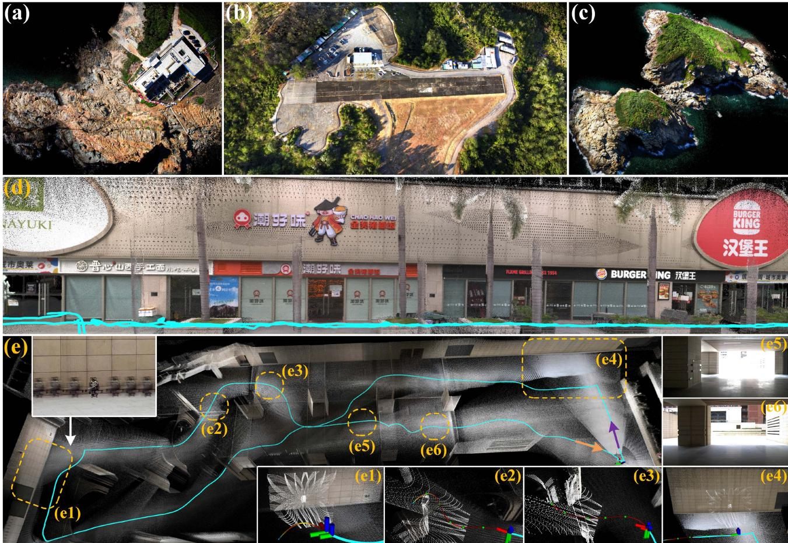  
Fig. 1. FAST-LIVO2 mapping results generated in real time. (a)–(c) showcase airborne mapping, (d) represents a retail street collected with a handheld device and (e) demonstrates an experiment where a UAV carrying a LiDAR, camera, and inertial sensor perform real-time state estimation (i.e., FAST-LIVO2), trajectory planning, and tracking control all on its onboard computer. In (d)–(e), blue lines represent the computed trajectory. In (e1)–(e4), white points indicate the LiDAR scan at that moment, and colored lines depict the planned trajectory. (e1) and (e4) mark areas of LiDAR degeneration. (e2) and (e3) show obstacle avoidance. (e5) and (e6) depict the camera first-person view from indoor to outdoor, highlighting large illumination variation from sudden overexposure to normal (see our accompanying video on YouTube).2

The visual module of our system is most similar to DV-LOAM [39], SDV-LOAM [40], and LVIO-Fusion [41], which projects LiDAR points attached with patches into a new image and tracks the image by minimizing the direct photometric error. However, they have several key differences, such as the use of separate maps for vision and LiDAR, reliance on the assumption of constant depth in patch warping in the visual module, loosely coupling at the state estimation level, and two stages of frame-toframe and frame-to-keyframes for image alignment. In contrast, our system tightly integrates frame-to-map image alignment, LiDAR scan registration, and IMU measurements in an iterated Kalman filter. Besides, thanks to the single unified map for both LiDAR and visual modules, our system can directly employ the plane priors provided by the LiDAR points to accelerate the image alignment.

## III. SYSTEM OVERVIEW

The overview of our system is shown in Fig. 2, which contains four sections: ESIKF (see Section IV), local mapping (see Section V), LiDAR measurement model (see Section VI), and visual measurement model (see Section VII).

The asynchronously sampled LiDAR points are first recombined into scans at the camera’s sampling time through scan recombination. Then, we tightly couple the LiDAR, image and inertial measurements via an ESIKF with sequential state update, where the system state is updated sequentially, first by the LiDAR measurements and then by the image measurements, both utilizing direct methods based on a single unified voxel map (see Section IV). To construct the LiDAR measurement model in the ESIKF update (see Section VI), we compute the frameto-map point-to-plane residual. To establish visual measurement model (see Section VII), we extract the visual map points within the current FoV from the map, making use of visible voxel query and on-demand raycasting; after the extraction, we identify and discard outlier visual map points (e.g., points that are occluded or exhibit depth discontinuity); we then compute frame-to-map image photometric errors for visual update.

The local map for both visual and LiDAR updates is a voxelmap structure (see Section V): the LiDAR points construct and update the map’s geometric structure, while the visual images append image patches to selected map points (i.e., visual map points) and update reference patches dynamically. The updated reference patches have their normal vectors further refined in a separate thread.

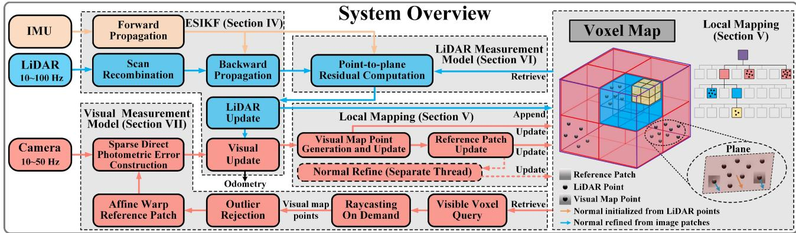  
Fig. 2. System overview of FAST-LIVO2.

TABLE I SOME IMPORTANT NOTATIONS
<table><tr><td>Notations</td><td>Explanation</td></tr><tr><td>田/日</td><td>The encapsulated &quot;boxplus&quot; and</td></tr><tr><td> $^ { G } ( \cdot )$ </td><td>&quot;boxminus&quot; operations on the state manifold</td></tr><tr><td> $^ { C } ( \cdot )$ </td><td>A vector (·) in global world frame</td></tr><tr><td> ${ \mathbf { \ell } } ^ { I } { \mathbf { T } } _ { L }$ </td><td>A vector (·) in camera frame</td></tr><tr><td> ${ \cal C } _ { \mathbf { T } _ { I } }$ </td><td>The extrinsic of LiDAR frame w.r.t. IMU frame The extrinsic of IMU frame w.r.t. camera frame</td></tr><tr><td> ${ \cal G } _ { \mathbf { T } _ { I } }$ </td><td>The pose of IMU frame at time k w.r.t. the global frame</td></tr><tr><td> $\mathbf { x } , { \widehat { \mathbf { x } } } ,$  x</td><td>The ground-truth, predicted and updated estimation of x</td></tr><tr><td> $\widehat { \mathbf { x } } ^ { \kappa }$ </td><td>The κ-th update of x</td></tr><tr><td> $\delta \mathbf { x }$ </td><td>The error state between ground-truth x and its estimation</td></tr></table>

## IV. ESIKF WITH SEQUENTIAL STATE UPDATE

This section outlines the system’s architecture, based on the sequentially updated ESIKF framework.

## A. Notations and State Transition Model

In our system, we assume the time offsets among the three sensors (LiDAR, IMU, and camera) are known, which can be calibrated or synchronized in advance. We take IMU frame (denoted as I) as the body frame and the first body frame as the global frame (denoted as G). Besides, we assume that the three sensors are rigidly attached and the extrinsic, defined in Table I, are precalibrated. Then, the discrete state transition model at the ith IMU measurement is

$$
\mathbf { x } _ { i + 1 } = \mathbf { x } _ { i } \boxplus \left( \Delta t \mathbf { f } \left( \mathbf { x } _ { i } , \mathbf { u } _ { i } , \mathbf { w } _ { i } \right) \right)\tag{1}
$$

where $\Delta t$ is the IMU sample period, the state x, input u, process noise w, and function f are defined as follows:

$$
\begin{array} { r l } & { \mathcal { M } \triangleq S O ( 3 ) \times \mathbb { R } ^ { 1 6 } , \ \mathrm { d i m } ( \mathcal { M } ) = 1 9 } \\ & { { \mathbf x } \triangleq \left[ ^ { G } { \mathbf R } _ { I } ^ { T } \quad ^ { G } { \mathbf p } _ { I } ^ { T } \quad ^ { G } { \mathbf v } _ { I } ^ { T } \quad { \mathbf b } _ { g } ^ { T } \quad { \mathbf b } _ { a } ^ { T } \quad ^ { G } { \mathbf g } ^ { T } \quad \tau \right] ^ { T } \in \mathcal { M } } \\ & { { \mathbf u } \triangleq \left[ \omega _ { m } ^ { T } \quad { \mathbf a } _ { m } ^ { T } \right] ^ { T } , \ \mathbf w \triangleq \left[ { \mathbf n } _ { g } ^ { T } \quad { \mathbf n } _ { a } ^ { T } \quad { \mathbf n } _ { { \mathbf b } _ { g } } ^ { T } \quad { \mathbf n } _ { { \mathbf b } _ { a } } ^ { T } \quad n _ { \tau } ^ { T } \right] ^ { T } } \end{array}
$$

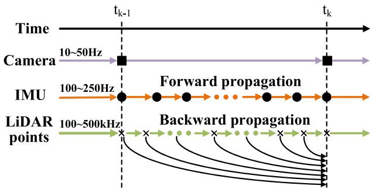  
Fig. 3. Illustration of scan recombination, forward propagation and backward propagation applied to input data.

$$
\mathbf { f } ( \mathbf { x } , \mathbf { u } , \mathbf { w } ) = \left[ \begin{array} { c } { \omega _ { m } - \mathbf { b } _ { g } - \mathbf { n } _ { g } } \\ { G _ { \mathbf { V } _ { I } } + \frac { 1 } { 2 } \big ( ^ { G } \mathbf { R } _ { I } \big ( \mathbf { a } _ { m } - \mathbf { b } _ { a } - \mathbf { n } _ { a } \big ) + { } ^ { G } \mathbf { g } \big ) \Delta t } \\ { G _ { \mathbf { R } _ { I } } \big ( \mathbf { a } _ { m } - \mathbf { b } _ { a } - \mathbf { n } _ { a } \big ) + { } ^ { G } \mathbf { g } } \\ { \mathbf { n } _ { \mathbf { b } _ { g } } } \\ { \mathbf { n } _ { \mathbf { b } _ { a } } } \\ { \mathbf { 0 } _ { 3 \times 1 } } \\ { n _ { \tau } } \end{array} \right]\tag{2}
$$

where ${ \cal G } _ { \mathbf { R } _ { I } , \mathbf { \Lambda } }  { } ^ { G } \mathbf { p } _ { I }$ , and $G _ { \mathbf { V } _ { I } }$ denote the IMU attitude, position, and velocity in the global frame, respectively, $G _ { \mathbf { g } }$ is the gravity vector in the global frame, τ is the inverse camera exposure time relative to the first frame, $n _ { \tau }$ is the Gaussian noise that models τ as a random walk, $\omega _ { m }$ and $\mathbf { a } _ { m }$ are the raw IMU measurements, $\mathbf { n } _ { g }$ and ${ \bf n } _ { a }$ are measurement noises in $\omega _ { m }$ and $\mathbf { a } _ { m } , \mathbf { b } _ { a }$ and ${ \bf b } _ { g }$ are IMU bias, which are modeled as random walk driven by Gaussian noise $\mathbf { n } _ { \mathbf { b } _ { g } }$ and $\mathbf { n } _ { \mathbf { b } _ { a } }$ , respectively.

## B. Scan Recombination

We employ the scan recombination to segment the highfrequency, sequentially sampled LiDAR raw points into distinct LiDAR scans at the camera sampling moments, as depicted in Fig. 3. This ensures both camera and LiDAR data are synchronized at the same frequency (e.g., 10 Hz), allowing for update of state at the same time.

Algorithm 1: Sequential State Update.   
1 Scan recombination to synchronize LiDAR and image   
data at the camera rate;   
2 Forward propagation to obtain state prediction $\widehat { \mathbf { x } }$ and   
its covariance $\widehat { \mathbf { P } } ;$   
3 Backward propagation for LiDAR points motion   
compensation;   
5 $\boldsymbol { \kappa } = - 1 , \boldsymbol { \widehat { \mathbf { x } } } ^ { \kappa = 0 } = \boldsymbol { \widehat { \mathbf { x } } } ;$   
6 repeat   
7 $\kappa = \kappa + 1 ;$   
8 Compute residual $\mathbf { z } _ { l } ^ { \kappa }$ and Jacobin $\mathbf { H } _ { l } ^ { \kappa }$   
9 Compute the state update $\widehat { \mathbf { x } } ^ { \kappa + 1 }$   
10 until $\| \widehat { \mathbf { x } } ^ { \kappa + 1 } \bigcirc \widehat { \mathbf { x } } ^ { \kappa } \| < \epsilon ;$   
11 $\widehat { \mathbf { x } } = \widehat { \mathbf { x } } ^ { \kappa + 1 } , \widehat { \mathbf { P } } = \left( \mathbf { I } - \mathbf { K H } \right) \widehat { \mathbf { P } } ;$   
13 level = −1;   
14 repeat   
15 $\begin{array} { r } { \kappa = - 1 , \widehat { \mathbf { x } } ^ { \kappa = 0 } = \widehat { \mathbf { x } } ; } \end{array}$   
16 level = level + 1;   
17 repeat   
18 $\kappa = \kappa + 1 ;$   
19 Compute residual $\mathbf { z } _ { c } ^ { \kappa }$ and Jacobian $\mathbf { H } _ { c } ^ { \kappa . }$   
20 Compute the state update $\widehat { \mathbf { x } } ^ { \kappa + 1 }$   
21 until $\| \widehat { \mathbf { x } } ^ { \tilde { \kappa } + 1 } \ominus \widehat { \mathbf { x } } ^ { \kappa } \| < \epsilon ;$   
22 $\widehat { \mathbf { x } } = \widehat { \mathbf { x } } ^ { \kappa + 1 } ;$   
23 until level $> = 2 ;$   
24 $\bar { \mathbf { x } } = \widehat { \mathbf { x } } ^ { \kappa + 1 } ; \bar { \mathbf { P } } = \left( \mathbf { I } - \mathbf { K H } \right) \widehat { \mathbf { P } } .$

## C. Propagation

In the ESIKF framework, the state and covariance are propagated from time $t _ { k - 1 }$ , when the last LiDAR scan and image frame are received, to time $t _ { k }$ , when the current LiDAR scan and image frame are received. This forward propagation predicts the state at each IMU input u during $t _ { k - 1 }$ and $t _ { k }$ , by setting the process noise $\mathbf { w } _ { i }$ in (1) to zero. Denote the propagated state as x and covariance as $\widehat { \mathbf { P } } .$ , which will serve as a prior distribution for the subsequent update in Section IV-D. Moreover, to compensate for motion distortion, we conduct a backward propagation as in [42], ensuring points in a LiDAR scan are “measured” at the scan-end time $t _ { k }$ . Note that for notation simplification, we omit the subscript k in all state vectors.

## D. Sequential Update

The IMU propagated state $\widehat { \mathbf { x } }$ and covariance $\widehat { \mathbf { P } }$ impose a prior distribution for x, the system state at time $t _ { k }$ , as follows:

$$
\mathbf { x } \boxdot { \mathbf { x } } \widehat { \mathbf { x } } \sim \mathcal { N } \left( \mathbf { 0 } , \widehat { \mathbf { P } } \right) .\tag{3}
$$

We denote the above-mentioned prior distribution as $p ( \mathbf { x } )$ and the measurement models for the LiDAR and camera as

$$
\begin{array} { r } { \left[ \mathbf { y } _ { l } \right] = \left[ \mathbf { h } _ { l } ( \mathbf { x } , \mathbf { v } _ { l } ) \right] } \\ { \mathbf { y } _ { c } \mathbf { J } } \end{array}\tag{4}
$$

where $\mathbf { v } _ { l } \sim \mathcal { N } ( \mathbf { 0 } , \pmb { \Sigma } _ { \mathbf { v } _ { l } } )$ and $\mathbf { v } _ { c } \sim \mathcal { N } ( \mathbf { 0 } , \pmb { \Sigma } _ { \mathbf { v } _ { c } } )$ denote the measurement noises for the LiDAR and camera, respectively.

A standard ESIKF [43] would update the state x using all the current measurements, including both LiDAR measurement $\mathbf { y } _ { l }$ and image measurements $\mathbf { y } _ { c } .$ However, LiDAR and image measurements are two different sensing modalities, whose data dimensions do not match. Furthermore, the fusion of image measurement may be performed at various levels of the image pyramid. To address the dimension mismatch and give more flexibility for each module, we propose a sequential update strategy. This strategy is theoretically equivalent to the standard update using all measurements, assuming statistical independence of LiDAR measurements $\mathbf { y } _ { l }$ and image measurements $\mathbf { y } _ { c }$ given the state vector $\mathbf { x } \ ( \mathrm { i . e . }$ , measurements corrupted by statistically independent noise).

To introduce the sequential update, we rewrite the total conditional distribution for the current state x as

$$
\begin{array} { r l } & { p ( \mathbf { x } | \mathbf { y } _ { l } , \mathbf { y } _ { c } ) \propto p ( \mathbf { x } , \mathbf { y } _ { l } , \mathbf { y } _ { c } ) = p ( \mathbf { y } _ { c } | \mathbf { x } , \mathbf { y } _ { l }  ) p ( \mathbf { x } , \mathbf { y } _ { l } ) } \\ & { = p ( \mathbf { y } _ { c } | \mathbf { x } ) \underbrace { p ( \mathbf { y } _ { l } | \mathbf { x } ) p ( \mathbf { x } ) } _ { \propto p ( \mathbf { x } | \mathbf { y } _ { l }  ) } . } \end{array}\tag{5}
$$

Equation (5) implies that the total conditional distribution $p ( \mathbf { x _ { \alpha } } )$ ${ \bf y } _ { l } , { \bf y } _ { c } )$ can be obtained by two sequential Bayesian updates. The first step fuses only the LiDAR measurement $\mathbf { y } _ { l }$ with the IMUpropagated prior distribution $p ( \mathbf { x } )$ to obtain the distribution $p ( \mathbf { x } |$ $\mathbf { y } _ { l } )$

$$
p ( \mathbf { x } | \mathbf { y } _ { l } ) \propto p ( \mathbf { y } _ { l } | \mathbf { x } ) p ( \mathbf { x } ) .\tag{6}
$$

The second step then fuses the camera measurement $\mathbf { y } _ { c }$ with $p ( \mathbf { x } | \mathbf { y } _ { l } )$ to obtain the final posterior distribution of x

$$
p \left( \mathbf { x } \vert \mathbf { y } _ { l } , \mathbf { y } _ { c } \right) \propto p \left( \mathbf { y } _ { c } \vert \mathbf { x } \right) p \left( \mathbf { x } \vert \mathbf { y } _ { l } \right) .\tag{7}
$$

Interestingly, the two fusion in (6) and $( 7 )$ follow the same form

$$
q ( \mathbf { x } | \mathbf { y } ) \propto q ( \mathbf { y } | \mathbf { x } ) q ( \mathbf { x } ) .\tag{8}
$$

To conduct the fusion in (8) for either LiDAR or image measurements, we detail the prior distribution q(x) and measurement model $q ( \mathbf { y } \mid \mathbf { x } )$ as follows. For the prior distribution $q ( \mathbf { x } )$ , denote it as $\mathbf { x } = \widehat { \mathbf { x } } \boxplus \delta \mathbf { x }$ with $\delta \mathbf { x } \sim \mathcal { N } ( \mathbf { 0 } , \widehat { \mathbf { P } } )$ . In case of the LiDAR update $( \mathrm { i . e . }$ , the first step), (x, P) is the state and covariance obtained from the propagation step. In case of the visual update $( \mathrm { i . e . } ,$ , the second step), $( \widehat { \mathbf { x } } , \widehat { \mathbf { P } } )$ is the converged state and covariance obtained from the LiDAR update.

To obtain the measurement model distribution $q ( \mathbf { y } \mid \mathbf { x } )$ , denote state estimated at the κth iteration as $\widehat { \mathbf { x } } ^ { \kappa }$ , where ${ \widehat { \mathbf { x } } } ^ { 0 } = { \widehat { \mathbf { x } } }$ Approximating the measurement model (4) (either the LiDAR or camera measurement) through its first-order Taylor expansion made at $\widehat { \mathbf { x } } ^ { \kappa }$ leads to

$$
\mathbf { y } | \mathbf { x } \simeq \underbrace { \mathbf { h } ( \widehat { \mathbf { x } } ^ { \kappa } , \mathbf { 0 } ) } _ { \mathbf { z } ^ { \kappa } } + \mathbf { H } ^ { \kappa } \delta \mathbf { x } ^ { \kappa } + \mathbf { L } ^ { \kappa } \mathbf { v }\tag{9}
$$

$$
q ( \mathbf { y } \left| \mathbf { x } \right) \simeq \mathcal { N } \left( \mathbf { h } \left( \widehat { \mathbf { x } } ^ { \kappa } , \mathbf { 0 } \right) + \mathbf { H } ^ { \kappa } \delta \mathbf { x } ^ { \kappa } , \mathbf { R } \right)\tag{10}
$$

where $\delta \mathbf { x } ^ { \kappa } = \mathbf { x } \boxed { 1 } \widehat { \mathbf { x } } ^ { \kappa } , \mathbf { z } ^ { \kappa }$ is the residual, $\mathbf { L } ^ { \kappa } \mathbf { v } \sim \mathcal { N } ( \mathbf { 0 } , \mathbf { R } )$ is the lumped measurement noise, $\mathbf { H } ^ { \kappa }$ and $\mathbf { L } ^ { \kappa }$ are the Jacobian matrices of $\mathbf { h } ( \widehat { \mathbf { x } } ^ { \kappa } \boxplus \delta \mathbf { x } ^ { \kappa } , \mathbf { v } )$ with respect to $\delta \mathbf { x } ^ { \kappa }$ and $\mathbf { v } ,$ evaluated at zero, respectively.

Then, substituting the prior distribution $q ( \mathbf { x } )$ and the measurement distribution $q ( \mathbf { y } \mid \mathbf { x } )$ in (10) into the posterior distribution (8) and performing maximum likelihood estimation, we can obtain the maximum a-posterior estimation of $\delta \mathbf { x } ^ { \kappa }$ (and hence $\mathbf { x } ^ { \kappa } )$ from the standard update step in the ESIKF framework [43]

$$
\mathbf { K } = \left( \left( \mathbf { H } ^ { \kappa } \right) ^ { T } \mathbf { R } ^ { - 1 } \mathbf { H } ^ { \kappa } + \widehat { \mathbf { P } } ^ { - 1 } \right) ^ { - 1 } \left( \mathbf { H } ^ { \kappa } \right) ^ { T } \mathbf { R } ^ { - 1 }
$$

$$
\widehat { \mathbf { x } } ^ { \kappa + 1 } = \widehat { \mathbf { x } } ^ { \kappa } \box { \mathrm { H } ( - \mathbf { K } \mathbf { z } ^ { \kappa } - ( \mathbf { I } - \mathbf { K } \mathbf { H } ^ { \kappa } ) ( \widehat { \mathbf { x } } ^ { \kappa } \boxdot { \mathbf { z } } \widehat { \mathbf { x } } ) } .\tag{11}
$$

The converged state and covariance matrix then make the mean and covariance of the posterior distribution $q ( \mathbf { x } | \mathbf { y } )$

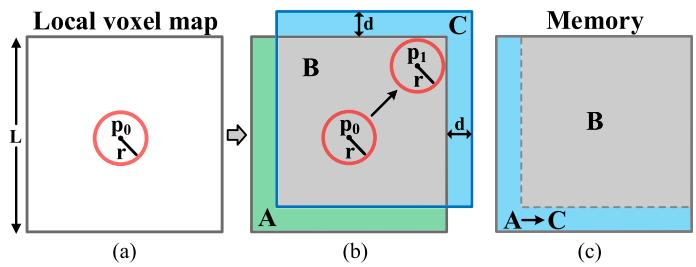  
Fig. 4. 2-D demonstration of local map slide. In (a), the gray rectangle is the initial map region with length L. The red circle is the initial detection area centered at p . In (b), the detection area moves to a new position p where the map boundaries are touched. The map region is moved to a new position (blue rectangle) by distance d. In (c), the memory space B remains unchanged. The memory space A storing the green area is reset for the blue area C in (b). (a) Initial map. (b) Move the map. (c) Reset the memory.

Kalman filter with sequential update has been investigated in the literature, such as in [44] and [45]. This article adopts this approach for ESIKF for LiDAR and camera systems. The implementation of the ESIKF with sequential update is detailed in Algorithm 1. In the first step (Lines 6–10), the error state is updated from the LiDAR measurements (see Section VI-A) iteratively until convergence. The converged state and covariance estimates, denoted again as x and $\widehat { \mathbf { P } } _ { } ,$ are used to update the geometry ofthe map (see Section V-B), and subsequently refined in the second step visual update (Lines 13–23) on each level of the image pyramid (see Section VII-B) until convergence. The optimal state and covariance, denoted as x¯ and P¯ , are employed for propagating incoming IMU measurements (see Section IV-C) and update the visual structures of the map (see Sections V-D and V-E).

## V. LOCAL MAPPING

## A. Map Structure

Our map employs an adaptive voxel structure presented in [14], which is organized by a Hash table and an octree for each Hash entry (see Fig. 2). The hash table manages root voxels, each with a fixed dimension of $0 . 5 \times 0 . 5 \times 0 . 5$ m. Each root voxel encapsulates an octree structure to further organize leaf voxels of varying sizes. A leaf voxel represents a local plane and stores a plane feature (i.e., plane center, normal vector, and uncertainty) along with a set of LiDAR raw points situated on this plane. Some of these points are attached with three-level image patches $( 8 \times 8$ patch size), which we refer to as visual map points. Converged visual map points are only attached with reference patches, while nonconverged ones are attached with reference patches and other visible patches (see Section V-E). The varying size of the leaf voxel allows it to represent local planes of different scales, thus being adaptable to environments with different structure [14].

To prevent the size of the map from going unbound, we keep only a local map within a large local region of length L around the LiDAR’s current position, as illustrated in a 2-D example in Fig. 4. Initially, the map is a cube centered at the LiDAR’s starting position $\mathbf { p } _ { 0 }$ . The LiDAR’s detection area is visualized as a sphere centered at its current position, with its radius defined by the LiDAR’s detection range. When the LiDAR moves to a new position $\mathbf { p } _ { 1 }$ where the detection area touches the boundaries of the map, we move the map away from the boundaries by a distance d. As the map moves, the memory containing the area moved out of the local map will be reset to store new areas moved in the local map. This ring-buffer approach ensures that our local map is maintained within a fixed size of memory. The implementation of the ring-buffer Hash map is detailed in [46]. The map move check is performed after each ESIKF update step.

## B. Geometry Construction and Update

The geometry of the map is constructed and updated from LiDAR point measurements. Specifically, after the LiDAR update in ESIKF (see Section IV), we register all points from the LiDAR scan to the global frame. For each registered LiDAR point, we determine its located root voxel in the Hash map. If the voxel does not exist, we initialize the voxel with the new point and index it into the Hash map. If the determined voxel already exists in the map, we append the point to the existing voxel. After all points in a scan are distributed, we conduct geometry construction and update as follows.

For newly created voxels, we determine if all the contained points lie on a plane based on the singular value decomposition. If so, we calculate the center point $\mathbf { q } = \bar { \mathbf { p } }$ , plane normal ${ \mathbf { n } } ,$ and the covariance matrix of $( \mathbf { q } , \mathbf { n } )$ , denoted as $\Sigma _ { \mathbf { n } , \mathbf { q } } ,$ of the plane. $\pmb { \Sigma } _ { \mathbf { n } , \mathbf { q } }$ is used to characterize the plane uncertainty, which arises from both pose estimation uncertainty and the point measurement noise. The detailed plane criteria and calculation of the plane parameters and uncertainties can be referred to our previous work [14]. If the contained points do not lie on a plane, the voxel is continuously subdivided into eight smaller octants until either the points in the subvoxel are determined to form a plane or the maximum layer (e.g., 3) is reached. In the latter case, the points in the leaf voxel will be discarded. As a result, the map only contains voxels (either root or sub) identified as planes.

For existing voxels that have new points appended, we assess if the new points still form a plane with the existing points in the root voxel or subvoxel. If not, we conduct voxel subdivision as previous. If yes, we update the plane’s parameters (q, n) and covariance $\scriptstyle \dot { \Sigma } _ { \mathbf { n } , \mathbf { q } }$ as above-mentioned too. Once the plane parameters converge (see [14]), the plane will be considered as mature and new points on this plane will be discarded. Moreover, mature planes will have their estimated plane parameters (q, n) and covariance $\pmb { \Sigma } _ { \mathbf { n } , \mathbf { q } }$ fixed.

LiDAR points on planes (either in the root voxel or subvoxel) will be used for generating visual map points in the subsequent section. For mature planes, 50 most recent LiDAR points are candidates for visual map point generation, while for immature planes; all LiDAR points are the candidates. The visual map point generation process will identify some of these candidate points as visual map points and attach them with image patches for image alignment.

## C. Visual Map Point Generation and Update

To generate and update visual map points, we select the candidate LiDAR points in the map that 1) are visible from the current frame (detailed in Section VII-A), and 2) exhibit significant gray-level gradients in the current image. We project these candidate points, after the visual update (see Section IV-D), onto the current image and retain the candidate point with the smallest depth for the local plane in each voxel. Then, we divide the current image into uniform grid cells each with $3 0 \times 3 0$ pixels. If a grid cell does not contain any visual map point projected here, we generate a new visual map point using the candidate point with the highest gray-level gradient and associate it with the current image patch, estimated current state (i.e., frame pose and exposure time), and the plane normal calculated from the LiDAR points as in the previous section. The patch attached to the visual map points has three layers of the same size (e.g., 11 × 11 pixels), each layer is half sampled from the previous layer, forming a patch pyramid. If a grid cell contains visual map points projected here, we add new patch (all three layers of pyramid) to the existing visual map point if 1) more than 20 frames have passed since its last patch addition, or 2) its pixel position in the current frame deviates by more than 40 pixels from its position at the last patch addition. As a result, the map points will likely have effective patches with uniformly distributed viewing angles. Along with the patch pyramid, we also attach the estimated current state (i.e., pose and exposure time) to the map point.

## D. Reference Patch Update

A visual map point could have more than one patch due to the addition of new patches. We need to choose one reference patch for image alignment in the visual update. In detail, we score each patch f based on photometric similarity and viewing angle as follows:

$$
\begin{array} { c } { { \displaystyle \mathrm { N C C } \left( \mathbf { f } , \mathbf { g } \right) = \frac { \sum _ { x , y } \left[ \mathbf { f } \left( x , y \right) - \bar { \mathbf { f } } \right] \left[ \mathbf { g } \left( x , y \right) - \bar { \mathbf { g } } \right] } { \sqrt { \sum _ { x , y } \left[ \mathbf { f } \left( x , y \right) - \bar { \mathbf { f } } \right] ^ { 2 } \sum _ { x , y } \left[ \mathbf { g } \left( x , y \right) - \bar { \mathbf { g } } \right] ^ { 2 } } } } } \\ { { { \displaystyle c = \frac { \mathbf { n } \cdot \mathbf { p } } { \| \mathbf { p } \| } } , ~ \omega _ { 1 } = \frac { 1 } { 1 + e ^ { \mathrm { t r ( \mathbf { Z } _ { n } ) } } } } } \\ { { { \displaystyle S = \left( 1 - \omega _ { 1 } \right) \cdot \frac { 1 } { n } \sum _ { i = 1 } ^ { n } \mathrm { N C C } \left( \mathbf { f } , \mathbf { g } _ { i } \right) + \omega _ { 1 } \cdot c } ~ ( 1 2 \omega _ { 1 } - \omega _ { 1 } ) } } \end{array}\tag{2}
$$

where $\operatorname { N C C } ( \mathbf { f } , \mathbf { g } )$ represents the normalized cross-correlation (NCC) used to measure the similarity between patch f and g at the 0th pyramid level (the level with the highest resolution) of both patch, with mean subtraction applied to both patches, c denotes the cosine similarity between the normal vector n and view direction $\mathbf { p } / \lVert \mathbf { p } \rVert$ of patch f under evaluation. When the patch is directly facing the plane where the map point is located, the value of c is 1. The overall score S is calculated by summing the weighted NCC and c, where the former represents the average similarity between the patch f under evaluation and all other patches g and $\operatorname { t r } ( \Sigma _ { \mathbf { n } } )$ represents the trace of the covariance matrix of the normal vector.

Among all the patches attached to a visual map point, the one with the highest score is updated as the reference patch. The above-mentioned scoring mechanism tends to choose reference patches whose 1) appearance is similar (in terms of NCC) to most of the rest of the patches, a technique used by MVS [47] to avoid patches on dynamic objects; 2) view direction is orthogonal to the plane, thereby maintaining texture details at a high resolution. In contrast, the reference patches update strategy in our previous work FAST-LIVO [8] and prior arts [4] directly select the patch with the smallest view direction difference from the current frame, causing the selected reference patch to be very close to the current frame, hence imposing weak constraints on the current pose update.

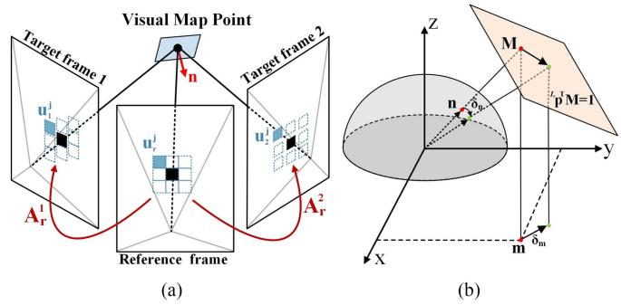  
Fig. 5. (a) Affine warping between reference patches and target patches. (b) Any normal ${ I _ { T } } _ { \mathbf { n } } \in \dot { \mathbb { S } } ^ { 2 }$ lying on the normalized sphere is first projected into a point $\mathbf { M } \in \mathbb { R } ^ { 3 }$ on the plane ${ I _ { r } } { { \bf \Pi } _ { \bf { p } } } ^ { T } { \bf { M } } = 1$ , and then projected to a point m $\in \mathring { \mathbb { R } } ^ { 2 }$ on the x-y plane. This transformation thereby converts a perturbation δn on the sphere into a perturbation δm in x-y plane.

## E. Normal Refine

Each visual map point is assumed to lie on a small local plane. Existing works [2], [4], [8] assumed that all pixels in a patch have the same depth, a wild assumption that does not hold in general. We use plane parameters computed from the LiDAR points as detailed in Section V-B to achieve greater accuracy. This plane normal is crucial for performing affine warping for image alignment in the visual update process. To further enhance the accuracy of the affine warping, the plane normal could be further refined from the patches attached to the visual map point. Specifically, we refine the plane normal in the reference patch by minimizing the photometric error with respect to the other patches attached to the visual map point.

1) Affine Warping: Affine warping is used to transform patch pixels from the reference frame (i.e., the source patch) to patch pixels in the rest of the frames (i.e., the target patch), illustrated in Fig. 5(a). Let uj be the jth pixel coordinates in the source patch and $\mathbf { u } _ { i } ^ { j }$ be the jth pixel coordinates in the ith target patch. Assuming all pixels in the patch lie in a local plane with normal ${ { I } _ { { { r } } } } _ { \mathbf { n } }$ and visual map point position ${ { I } _ { r } } _ { \mathbf { p } }$ (which corresponds to the center pixel for both source and target patches), both represented in the source patch frame, we have

$$
\begin{array} { r l } & { \mathbf { u } _ { i } ^ { j } = \mathbf { A } _ { r } ^ { i } \mathbf { u } _ { r } ^ { j } } \\ & { \mathbf { A } _ { r } ^ { i } = \mathbf { P } \left( ^ { I _ { i } } \mathbf { R } _ { I _ { r } } + ^ { I _ { i } } \mathbf { t } _ { I _ { r } } \frac { 1 } { I _ { r } \mathbf { n } ^ { T } . I _ { r } \mathbf { p } } ^ { I _ { r } } \mathbf { n } ^ { T } \right) \mathbf { P } ^ { - 1 } } \end{array}\tag{13}
$$

where $\mathbf { A } _ { r } ^ { i }$ represents the affine warping matrix that transforms the pixel coordinates from the source (or reference) patch to the ith target patch, ${ \cal I } _ { { } ^ { i } } { \bf R } _ { { \cal I } _ { r } }$ and ${ { I } _ { { { \mathbf { \mathit { \Pi } } } ^ { i } } } } _ { \mathbf { t } _ { I _ { r } } }$ denote the relative pose of the reference frame $I _ { r }$ w.r.t. the target frame $I _ { i } .$ . To use fisheye images directly without rectifying them to pinhole images, we implement projection matrix $\dot { \mathbf { P } }$ and back projection matrix $\mathbf { P } ^ { - 1 }$ based on different camera models (e.g., P is the camera intrinsic matrix for the pinhole camera model).

2) Normal Optimization: To refine the plane normal ${ { I } _ { r } } _ { \mathbf { n } . }$ , we minimize photometric errors between the reference patch and other image patches at the 0th pyramid level (i.e., the highest resolution level)

$$
{ { I } _ { { r } } } _ { \mathbf { n } } \mathbf { n } ^ { * } = \arg \operatorname* { m i n } _ { I _ { { r } } } \sum _ { \mathbf { n } \in \mathbb { S } ^ { 2 } } \sum _ { i \in S } \sum _ { j = 1 } ^ { N ^ { 2 } } { \left\| { { \tau } _ { i } } \mathbf { { I } } _ { i } \left( \mathbf { A } _ { r } ^ { i } \mathbf { u } _ { r } ^ { j } \right) - { { \tau } _ { r } } \mathbf { { I } } _ { r } \left( \mathbf { u } _ { r } ^ { j } \right) \right\| _ { 2 } }\tag{14}
$$

where N is the path size, $\tau _ { r }$ and $\tau _ { i }$ are the inverse exposure times of the reference frame and the ith target frame, respectively. $\mathbf { I } _ { r } ( \mathbf { u } _ { r } ^ { j } )$ denote jth patch pixel in the reference frame, $\dot { \bf I } _ { i } ( { \bf A } _ { r } ^ { i } { \bf u } _ { r } ^ { j } )$ denotes the jth path pixel in the ith target frame, and S is the set of all target frames.

3) Optimization Variable Transformation: To enhance the computational efficiency, we reparameterize the least squares problem in (14). Note that the optimization variable $I _ { \ l ^ { r } \mathbf { n } }$ only appeared in $\begin{array} { r } { \mathbf { M } \triangleq \frac { 1 } { I _ { r } \mathbf { n } ^ { T } . I _ { r } \mathbf { p } } I _ { r } \mathbf { n } \in \mathbb { R } ^ { 3 } } \end{array}$ in (13), the optimization over ${ { I } _ { r } } _ { \bf { n } }$ can be conducted over M. Moreover, the vector M is subject to constraint ${ \cal I } _ { \cal T } \mathbf { p } \cdot \mathbf { M } = 1$ , meaning that M can be parameterized as follows:

$$
\begin{array} { r l } &  \mathbf { M } = \left[ \begin{array} { c } { \mathbf { M } _ { x } } \\ { \mathbf { M } _ { y } } \\ { \frac { 1 } { T _ { r } \mathbf { p } _ { z } } - \frac { I _ { r } \mathbf { p } _ { x } } { T _ { r } \mathbf { p } _ { z } } \mathbf { M } _ { x } - \frac { I _ { r } \mathbf { p } _ { y } } { T _ { r } \mathbf { p } _ { z } } \mathbf { M } _ { y } \right] = \mathbf { B } \mathbf { m } + \mathbf { b } } \\ & { \mathbf { B } = \left[ \begin{array} { c c } { 1 } & { 0 } \\ { 0 } & { 1 } \\ { - \frac { I _ { r } \mathbf { p } _ { x } } { T _ { r } \mathbf { p } _ { z } } } & { - \frac { I _ { r } \mathbf { p } _ { y } } { T _ { r } \mathbf { p } _ { z } } } \end{array} \right] , \mathbf { b } = \left[ \begin{array} { c } { 0 } \\ { 0 } \\ { \frac { 1 } { I _ { r } \mathbf { p } _ { z } } } \end{array} \right] , \mathbf { m } = \left[ \begin{array} { c } { \mathbf { M } _ { x } } \\ { \mathbf { M } _ { y } } \end{array} \right] \in \mathbb { R } ^ { 2 } } \end{array} \end{array}\tag{15}
$$

where ${ \cal I } _ { \cal T } _ { \bf p _ { \it z } } \neq 0$ since no such reference patch could be chosen for the visual map point. The relation among ${ { I } _ { { { r } } } } _ { \mathbf { n } }$ , M, and m are shown in Fig. 5(b).

Finally, the optimization in (14) is conducted over the vector $\mathbf { m } \in \mathbb { R } ^ { 2 }$ without any constraints. This optimization can be performed in a separate thread to avoid blocking the main odometry thread. The optimized parameter m∗ can then be used to recover the optimal normal vector ${ { I } _ { { r } } } _ { { \bf { n } } ^ { * } }$

$$
{ \bf \nabla } ^ { I _ { r } } { \bf n } ^ { * } = \frac { { \bf M } ^ { * } } { \lVert { \bf M } ^ { * } \rVert } , { \bf M } ^ { * } = { \bf B } { \bf m } ^ { * } + { \bf b } .\tag{16}
$$

Once the plane normal converges, the reference patch and normal vector for this visual map point are fixed without further refinement, and all other patches are deleted.

## VI. LIDAR MEASUREMENT MODEL

This section details the LiDAR measurement model ${ \bf y } _ { l } =$ $\mathbf { h } _ { l } ( \mathbf { x } , \mathbf { v } _ { l } )$ used in the LiDAR update of ESIKF in Section IV-D.

## A. Point-to-Plane LiDAR Measurement Model

After obtaining the undistorted points $\{ { } ^ { L } { \bf p } _ { j } \}$ in a scan, we project them to the global frame using the estimated state $\widehat { \mathbf { x } } ^ { \kappa }$ at the κth iteration of LiDAR update

$$
\mathbf { \Lambda } ^ { G } \widehat { \mathbf { p } } _ { j } ^ { \kappa } = { } ^ { G } \widehat { \mathbf { T } } _ { I } ^ { \kappa I } \mathbf { T } _ { L } { } ^ { L } \mathbf { p } _ { j } .\tag{17}
$$

We then identify the root or subvoxel where ${ ^ G } \widehat { \mathbf { p } } _ { j } ^ { \kappa }$ lies in the Hash map. If no voxel is found or the voxel does not contain a plane, the point is discarded. Otherwise, we use the plane in the voxel to establish a measurement equation for the LiDAR point. Specifically, we assume the true LiDAR point $^ L { \bf p } _ { j } ^ { g t }$ , given the accurate LiDAR pose ${ \cal G } _ { \mathbf { T } _ { I } }$ , should lie on the plane with normal $\mathbf { n } _ { j } ^ { g t }$ and center point $\mathbf { q } _ { j } ^ { g t }$ in the voxel. i.e.,

$$
\mathbf { 0 } = \left( \mathbf { n } _ { j } ^ { g t } \right) ^ { T } \left( ^ { G } \mathbf { T } _ { I } ^ { ~ I } \mathbf { T } _ { L } ^ { ~ L } \mathbf { p } _ { j } ^ { g t } - \mathbf { q } _ { j } ^ { g t } \right) .\tag{18}
$$

Since the ground-true point $^ L { \bf p } _ { j } ^ { g t }$ is measured as ${ } ^ { L } \mathbf { p } _ { j }$ with ranging and bearing noises $\delta ^ { L } \mathbf { p } _ { j }$ , we have ${ } ^ { L } { \bf p } _ { j } ^ { g t } = { } ^ { L } { \bf p } _ { j } - \delta ^ { L } { \bf p } _ { j }$ Likewise, the plane parameters $( \mathbf { n } _ { j } ^ { g t } , \mathbf { q } _ { j } ^ { g t } )$ are estimated as

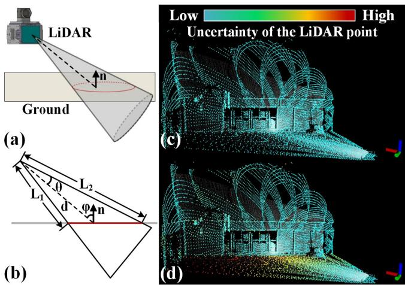  
Fig. 6. (a) and (b), respectively, illustrate the 3-D and side crosssectional views of the LiDAR point uncertainty model considering the laser beam divergence angle θ. The red contour outlines the area that a laser beam spreads. (c) and (d) color the points in a scan by the point location uncertainty. Compared to (c), (d) further takes into account the ranging uncertainty δd resulting from the beam divergence angle. This leads to a higher uncertainty for ground points due to the large spread area of laser beams.

$( \mathbf { n } _ { j } , \mathbf { q } _ { j } )$ with covariance $\pmb { \Sigma } _ { \mathbf { n } , \mathbf { q } }$ (see Section V-B), so we have: ${ \bf n } _ { j } ^ { g t } = { \bf n } _ { j } \boxed { + } { \delta } { \bf n } _ { j } , \ { \bf q } _ { j } ^ { g t } = { \bf q } _ { j } - \delta { \bf q } _ { j }$ . Therefore

$$
\begin{array} { r } { \underbrace { \mathbf { 0 } } _ { \mathbf { y } _ { l } } = \underbrace { \left( \mathbf { n } _ { j } \boxdot \theta \mathbf { n } _ { j } \right) ^ { T } \left( ^ { G } \mathbf { T } _ { I } ^ { I } \mathbf { T } _ { L } \left( ^ { L } \mathbf { p } _ { j } - \delta ^ { L } \mathbf { p } _ { j } \right) - \left( \mathbf { q } _ { j } - \delta \mathbf { q } _ { j } \right) \right) } _ { \mathbf { h } _ { l } ( \mathbf { x } , \mathbf { v } _ { l } ) } } \end{array}\tag{19}
$$

where the measurement noise $\mathbf { v } _ { l } = ( \delta ^ { L } \mathbf { p } _ { j } , \delta \mathbf { n } _ { j } , \delta \mathbf { q } _ { j } )$ consisting of the noise associated with the LiDAR point, the normal vector, and the plane center, respectively.

## B. LiDAR Measurement Noise With Beam Divergence

The uncertainty of a LiDAR point $\delta ^ { L } \mathbf { p } _ { j }$ in the local LiDAR frame is decomposed into two components in [14], the ranging uncertainty δd caused by laser time of flight (TOF), and the bearing direction uncertainty δω originated from encoders. Besides these uncertainties, we also consider uncertainties caused by the laser beam divergence angle $\theta ,$ as illustrated in Fig. 6. As the angle $\varphi$ between the bearing direction and normal vector increases, the ranging uncertainty of the LiDAR point increases significantly, while the bearing direction uncertainty remains unaffected. The δd due to the laser beam divergence angle can be modeled as

$$
\delta d = L _ { 2 } - L _ { 1 } = d \Biggl ( \frac { \cos \varphi } { \cos ( \theta + \varphi ) } - \frac { \cos \varphi } { \cos ( \theta - \varphi ) } \Biggr ) .\tag{20}
$$

Considering δd influenced by TOF and laser beam divergence, when our system selects more points from the ground or walls [see Fig. 6(c) and (d)], it achieves a more precise pose estimation than that not considering such effect.

## VII. VISUAL MEASUREMENT MODEL

This section details the visual measurement model $\mathbf { y } _ { c } =$ $\mathbf { h } _ { c } ( \mathbf { x } , \mathbf { v } _ { c } )$ used in the visual update of ESIKF in Section IV-D.

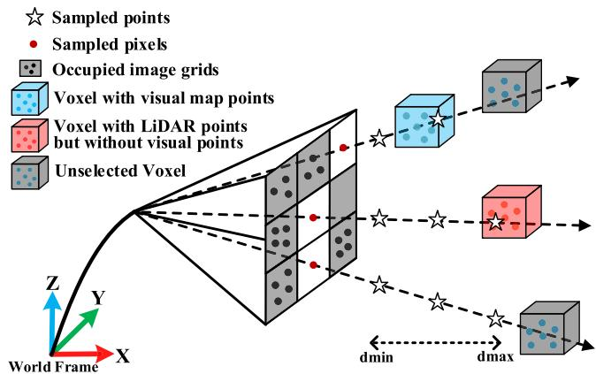  
Fig. 7. Illustration of on-demand voxel raycasting.

## A. Visual Map Point Selection

To perform sparse image alignment in the visual update, we begin by selecting appropriate visual map points. We first extract the set of map points (termed as visual submap) that is visible in the current camera FoV, using voxel, and raycasting queries. Then, the visual map points from this submap are selected and outliers are rejected. This process yields a refined set of visual map points ready for constructing visual photometric errors in the visual measurement model.

1) Visible Voxel Query: Identifying map voxels within the current frame FoV is challenging due to the large number of voxels in the map. To address this issue, we poll the voxels hit by LiDAR points in the current scan. This can be done efficiently by inquiring the voxel Hash table using the measured point position. If the camera FoV is largely overlapped with the LiDAR FoV, map points in the camera FoV likely lie in these voxels as well. We also poll voxels hit by map points identified visible (through the same voxel query and raycasting) in the previous image frame, assuming that two consecutive image frames have large FoV overlaps. Finally, the current visual submap can be obtained as map points contained in these two types of voxels followed by an FoV check.

2) Raycasting on Demand: In most cases, the visual submap can be obtained through the voxel queries above. However, a LiDAR sensor could return no points when it is too close to an object (known as the close proximity blind zones). Also, the camera FoV may not be completely covered by the LiDAR FoV. To recall more visual map points in these cases, we employ a raycasting strategy, as illustrated in Fig. 7. We divide the image into uniform grid cells, each with 30 × 30 pixels, and project the visual map points obtained from the voxel query onto the grid cells. For each image grid cell that is not occupied by these visual map points, a ray is cast backward along the central pixel, where sample points are uniformly distributed along the ray in the depth direction from $d _ { \operatorname* { m i n } } \tan d _ { \operatorname* { m } \mathrm { a x } }$ . In order to reduce computation load, the positions of sample points on each ray in the camera body frame are precomputed. For each sampled point, we evaluate the corresponding voxel’s status: if the voxel contains map points that lie in this grid cell after projection, we incorporate these map points into the visual submap and cease for this ray. Otherwise, we continue to the next sample point on the ray until reaching the maximum depth $d _ { \operatorname* { m a x } } .$ . After processing the entire unoccupied image grid cells through raycasting, we obtain a set of visual map points that distribute among the whole image.

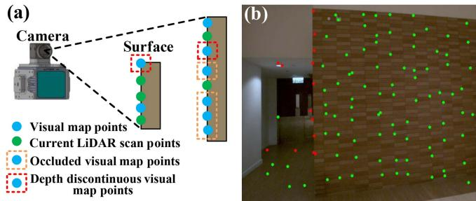  
Fig. 8. Outlier rejection. (a) shows the diagrammatic drawing of occluded and depth-discontinuous visual map points. (b) shows the effect of outlier rejection in real scenes. The red dots are the rejected visual map points, and the green dots are the accepted visual map points.

3) Outlier Rejection: After voxel query and raycasting, we obtain all visual map points in the current frame FoV. However, these visual map points could be occluded in the current frame, have discontinuous depth, have their reference patch taken at large view angles, or have large view angles in the current frame, all of which can severely degrade image alignment accuracy. To address the first issue, we project all the visual map points in the submap into the current frame using the pose after the LiDAR update and keep the lowest depth points in each grid cell of 30 × 30 pixels. To address the second issue, we project the LiDAR points in the current LiDAR scan to the current frame producing a depth map. By comparing the depth of visual map points with their $9 \times 9$ neighbor in the depth map, we determine their occlusion and depth variation. Occluded and depth-discontinuous map points are rejected (see Fig. 8). To address the third and fourth issue, we remove points where the view angle (i.e., the angle between normal vector and direction from the visual map point to the patch optical center) of the reference patch or current patch is too large (e.g., over 80◦). The remaining visual map points will be used to align the current image.

## B. Sparse-Direct Visual Measurement Model

The visual map points $\left\{ { { \bf { \sigma } } ^ { G } } { \bf { p } } _ { i } \right\}$ extracted previously are used to construct the visual measurement model. The underlying principle is that, when transforming the map point ${ \bf \Pi } ^ { G } { \bf p } _ { i }$ to the current image $\mathbf { I } _ { k } ( \cdot )$ with the ground-truth state (i.e., pose) $\mathbf { x } _ { k }$ , the photometric error between the reference patch and the current patch should be zero

$$
\begin{array} { r } { \mathbf { 0 } = \tau _ { k } \mathbf { I } _ { k } ^ { g t } ( \underbrace { \pmb { \pi } \left( ^ { C } \mathbf { T } _ { I } ( ^ { G } \mathbf { T } _ { I } ) ^ { - 1 G } \mathbf { p } _ { i } \right) } _ { \mathbf { u } _ { i } } + \Delta \mathbf { u } ) } \\ { - \tau _ { r } \mathbf { I } _ { r } ^ { g t } ( \underbrace { \pmb { \pi } ( ^ { C _ { r } } \mathbf { T } _ { G } ^ { { G } } \mathbf { p } _ { i } ) } _ { \mathbf { u } _ { i } ^ { \prime } } + \mathbf { A } _ { i } ^ { r } \Delta \mathbf { u } ) } \end{array}\tag{21}
$$

where $\pi ( \cdot )$ is the common camera projection model (i.e., Pinhole, MEI, ATAN, Scaramuzza, Equidistant), $C _ { r } \mathbf { T } _ { G }$ is the pose of the global frame G w.r.t. reference frame $C _ { r }$ , which has been estimated when receiving and fusing the reference frame, ${ \bf A } _ { i } ^ { r }$ is the affine warping matrix that transforms pixels from the ith current patch to the reference patch, Δu is the relative pixel position to the center $\mathbf { u } _ { i }$ within the current patch, $\mathbf { I } _ { k } ^ { g t } , \mathbf { I } _ { r } ^ { g t }$ denote the ground-true pixel values of the reference and current frames, respectively. They are measured as the actual image pixel values $\mathbf { I } _ { k } , \mathbf { I } _ { r }$ with measurement noise $\mathbf { v } _ { c } = ( \delta \mathbf { I } _ { k } , \delta \mathbf { I } _ { r } )$ , which originate from various sources $[ \mathrm { e . g . }$ ., shot noise and the analog-to-digital converter (ADC) noise of the camera CMOS]. Hence

$$
\begin{array} { r } { \underbrace { \mathbf { 0 } } _ { \mathbf { y } _ { c } } = \underbrace { \tau _ { k } \left( \mathbf { I } _ { k } \left( \mathbf { u } _ { i } + \Delta \mathbf { u } \right) - \delta \mathbf { I } _ { k } \right) - \tau _ { r } \left( \mathbf { I } _ { r } \left( \mathbf { u } _ { i } ^ { \prime } + \mathbf { A } _ { i } ^ { r } \Delta \mathbf { u } \right) - \delta \mathbf { I } _ { r } \right) } _ { \mathbf { h } _ { c } \left( \mathbf { x } , \mathbf { v } _ { c } \right) } . } \end{array}\tag{22}
$$

To enhance computational efficiency, we employ an inverse compositional formulation [4], [48], where the pose incremental $\delta \mathbf { T } \in \mathbb { R } ^ { 6 }$ parameterizing ${ ^ G } { \mathbf { T } } _ { I } = { ^ { G } } { \widehat { \mathbf { T } } } _ { I } ^ { \kappa } { \mathbf { E x p } } ( \delta { \mathbf { T } } )$ in $\mathbf { u } _ { i }$ [see (21)], is moved from $\mathbf { u } _ { i }$ to $\mathbf { u } _ { i } ^ { \prime }$ as follows:

$$
\mathbf { u } _ { i } = \pi \left( { C _ { \mathbf { T } _ { I } } \Big ( } ^ { G } \widehat { \mathbf { T } } _ { I } ^ { \kappa } \Big ) ^ { - 1 } G _ { \mathbf { p } _ { i } } \right)
$$

$$
\mathbf { u } _ { i } ^ { \prime } = \pi \left( ^ { C _ { r } } \mathbf { T } _ { G } \mathbf { E x p } \left( \delta \mathbf { T } \right) ^ { G } \mathbf { p } _ { i } \right) .\tag{23}
$$

Given that $\mathbf { u } _ { i } ^ { \prime }$ in the reference frame remains unchanged during each iteration, we only require a one-time computation of the Jacobian matrices w.r.t. $\delta \overset { \cdot } { \mathbf { T } }$ , rather than recalculating them for every iteration.

To estimate the inverse exposure time $\tau _ { k }$ from the measurement (22), we fix the initial inverse exposure time $\tau _ { 0 } = 1$ to eliminate the degeneration of (22) when all inverse exposure time are zeros. The estimated inverse exposure times of subsequent frames are therefore the exposure time relative to the first frame.

Equation (22) is used in the visual update step across three levels (see Algorithm 1); the visual update starts from the coarsest level, after the convergence of a level, it proceeds to the next finer level. The estimated state is then used to generate visual map points (see Section V-C) and update reference patch (see Section V-D).

## VIII. DATASETS FOR EVALUATION

In this section, we introduce datasets for performance evaluation, including public datasets NTU-VIRAL [49], Hilti’22 [50], Hilti’23 [51], and MARS-LVIG [52], as well as our selfcollected FAST-LIVO2 private dataset. Specifically, the NTU-VIRAL and Hilti datasets are used to conduct a quantitative benchmark comparison of our system against other SOTA SLAM systems (see Section IX-B). The FAST-LIVO2 private dataset is primarily used to evaluate our system across various extremely challenging scenarios (see Section IX-C), to demonstrate its capability for high-precision mapping (see Section IX-D), and to validate the functionality of the individual modules within our system (see Sections I-A through I-D in the Supplementary Material [53]). MARS-LVIG dataset is employed for application demonstrations (see Section X) and ablation study (see Section I-E in the Supplementary Material [53]).

## A. NTU-VIRAL, Hilti, and MARS-LVIG Dataset

The NTU-VIRAL dataset, collected at the Nanyang Technological University campus using an aerial platform, presents diverse scenarios embodying unique aerial operational challenges. Specifically, the “sbs” sequences can only provide noisy visual features from distant objects. The “nya” sequences present challenges to LiDAR SLAM due to semitransparent surfaces and to visual SLAM owing to intricate flight dynamics and low lighting conditions. The dataset is equipped with a 16-channel

OS1 $\mathrm { g e n } 1 ^ { 3 }$ LiDAR sampled at 10 Hz and with a built-in IMU at 100 Hz, and two synchronized pinhole cameras triggered at 10 Hz. The left camera is used for evaluation.

The Hilti’22 and Hilti’23 datasets, collected by handheld and robot devices, encompass indoor and outdoor sequences from environments, such as construction sites, offices, labs, and parking areas. These sequences introduce numerous challenges from long corridors, basements, and stairs, with textureless features, varying illumination conditions, and insufficient LiDAR plane constraints. Handheld sequences use a Hesai PandarXT-324 LiDAR at 10 Hz, five wide-angle cameras at 40 Hz, which is downsampled into 10 $\mathrm { H z , }$ and an external Bosch BMI085 IMU at 400 Hz. Meanwhile, the robot-mounted sequences feature a Robosense $\mathrm { B P e a r l } ^ { 5 }$ LiDAR at 10 Hz, eight omnidirectional cameras at 10 Hz, and an Xsens MTi-670 IMU at 200 Hz. In both cases, the front-facing camera is used for all systems under evaluation. Millimeter-accurate ground truth, obtained through a motion capture system or a Total Station [54], is provided for each sequence. Note that the ground truth of the Hilti datasets is not open-source; therefore, algorithmic results on these datasets are evaluated via the Hilti official website. Since “Site $3 ^ { \circ }$ in Hilti’23 does not provide in-depth analysis plots (e.g., RMSE), we exclude these four sequences, but our scoring results for these sequences can still be found on their official website.6 NTU-VIRAL and Hilti contribute a total of 25 sequences.

The MARS-LVIG dataset provides high-altitude, groundfacing mapping data that encompasses diverse unstructured terrains, such as jungles, mountains, and islands. The dataset was collected via a DJI M300 RTK quadrotor, which is equipped with a Livox $\mathrm { A v i a } ^ { 7 }$ LiDAR (with built-in BMI088 IMU) and a high-resolution global-shutter camera, both triggered at 10 Hz. This is notably distinct from the aforementioned NTU-VIRAL and Hilti datasets, which use 752 × 480 grayscale images, while the MARS dataset employs $2 4 4 8 \times 2 0 4 \bar { 8 }$ RGB images, thereby facilitating the generation of clear, dense colored point clouds. Therefore, we leverage this public dataset to validate our capabilities in high-altitude aerial mapping applications.

## B. FAST-LIVO2 Private Dataset

To validate the system’s performance under more extreme conditions (e.g., LiDAR degeneration, low illumination, drastic exposure changes, and cases of no LiDAR measurements), we make a new dataset named FAST-LIVO2 private dataset. The dataset, hardware device, and hardware synchronization scheme are released with the codes of this work to facilitate the reproduction of our work.

1) Platform: Our data collection platform, illustrated in Fig. 9, is equipped with an industrial camera (MV-CA013- 21UC), a Livox Avia LiDAR, and a DJI manifold-2c (Intel i7-8550u CPU and 8GB RAM) as onboard computers. The camera FoV is $7 0 . 6 ^ { \circ } \times 6 8 . 5 ^ { \circ }$ and the LiDAR FoV is $7 0 . 4 ^ { \circ } \times 7 7 . 2 ^ { \circ }$ . All sensors are hard synchronized with a 10 Hz trigger signal, generated by STM32 synchronized timers.

2) Sequence Description: As summarized in Table S1 in the Supplementary Material [53], the FAST-LIVO2 dataset comprises 20 sequences across various scenes (e.g., campus buildings, corridors, basements, mining tunnel, etc.) characterized by structure-less, cluttered, dim, variable-lighting, and weakly textured environments, with a total duration of 66.9 min. Most sequences exhibit visual and/or LiDAR degeneration, such as facing a single and/or texture-less plane, traversing an extremely narrow and/or dark tunnel, and experiencing varying light conditions from indoor to outdoor (see Fig. S7 in the Supplementary Material [53]). To guarantee enhanced synchronous data collection between the camera and LiDAR, we configure the camera with fixed exposure time but autogain mode in most scenarios. For the remaining sequences with autoexposure, we record their ground truth exposure times. In all sequences, the platform returns to the starting point, which enables the drift evaluation.

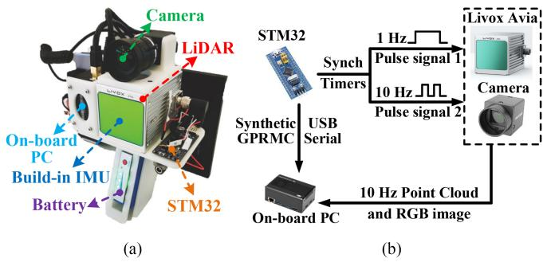  
Fig. 9. Our platform with hardware synchronization for data acquisition. (a) Our handheld platform. (b) Hardware synchronization scheme.

## IX. EXPERIMENT RESULTS

In this section, we conduct extensive experiments to evaluate our proposed system.

## A. Implementation and System Configurations

We implemented the proposed FAST-LIVO2 system in C++ and robots operating system. In the default configuration, the exposure time estimation is enabled, while normal vector refinement is turned OFF. LiDAR points in a scan are downsampled temporally at a 1:3 ratio. The root voxel size for the voxel map is set at 0.5 m, and the maximum layer of the internal octree is 3. The image patch size is $8 \times 8$ for image alignment and $1 1 \times 1 1$ for normal refinement. Within the sequential ESIKF settings, for all the experiments, the camera photometric noise is set to a constant value of 100. The LiDAR depth error and bearing angle error are adjusted to 0.02 m and $0 . 0 5 ^ { \circ }$ for Livox Avia LiDAR and OS1-16, 0.001 m and 0.001◦ for PandarXT-32, 0.008 m and $0 . 0 1 ^ { \circ }$ for Robosense BPearl LiDAR. The laser beam divergence angle is set at $0 . 1 5 ^ { \circ }$ for Livox Avia LiDAR and OS1-16, and at $0 . 0 0 1 ^ { \circ }$ for the PandarXT-32 and Robosense BPearl LiDAR. Our system uses the same parameters in all sequences of all datasets with the same sensor setup. The computation platform for all experiments is a desktop PC equipped with an Intel i7-10700K CPU and 32GB RAM. For FAST-LIVO2, we also test it on an ARM processor that is commonly used in embedded systems with reduced power and cost. The ARM platform is RB5.8 with a Qualcomm Kryo585 CPU and 8GB RAM. We refer to the implementation of FAST-LIVO2 on the ARM-based platform as “FAST-LIVO2 (ARM).”

## B. Benchmark Experiments

In this experiment, we conduct quantitative evaluations on 25 sequences from the NTU-VIRAL, Hilti’22, and 23 open datasets. Our approach is benchmarked against several SOTA open-source odometry systems, including R3LIVE [36], a dense direct LIVO system; FAST-LIO2 [13], a direct LiDAR–inertial odometry system; SDV-LOAM [40], a semidirect LiDAR-visual odometry system; LVI-SAM [35], a feature-based LiDAR– inertial–visual SLAM system; and our previous work FAST-LIVO [8].

These systems are downloaded from their respective GitHub repositories. For FAST-LIO2, FAST-LIVO, and LVI-SAM, we use the recommended settings for indoor and outdoor scenes equipped with multiline LiDAR sensors. For R3LIVE, we adapt the system to work with fisheye camera models and multiline LiDARs equipped with external IMUs (the default configuration only supports internal IMUs). We disable the real-time optimization of the camera intrinsic and the extrinsic ${ \cal C } _ { \mathbf { T } _ { I } }$ due to adverse optimization caused by insufficient IMU excitation in the datasets. Other parameters, including the window size and pyramid level for optical flow tracking, the resolution for downsampling the point cloud of the current scan and the global map, are fine-tuned to achieve optimal performance. Since only the vision module of SDV-LOAM is open-sourced, we integrate it with LeGO-LOAM [7] in a loosely coupled manner, following the methodology described in the original paper [40]. This enhanced system continues to refine poses obtained from the vision module and we also open this implementation on GitHub.9 Given that all compared systems are odometry without loop closure, except for LVI-SAM, we remove the loop-closure module of LVI-SAM to ensure a fair comparison. In addition, we conduct an ablation study on the exposure time estimation module, the normal refine module, and the reference patch update strategy. The default FAST-LIVO2 has real-time exposure estimation and reference patch update, but no normal refinement.

The results of all methods are shown in Table II. It is seen that our method achieves the highest overall accuracy across all sequences with an average RMSE of 0.044 m, which is three times more accurate than the second-place FAST-LIVO at 0.137 m. Our system delivers the best results in most sequences, except for “Outside Building” and “Large Room (dark),” where our system exhibits a slightly (millimeter-level) higher error compared to the LiDAR–inertial only odometry FAST-LIO2. This discrepancy can be attributed to the rich structural features but poor lighting conditions of these sequences, resulting in dim and blurred images. Consequently, fusing these low-quality images does not enhance odometry accuracy. Excluding these two sequences, our method, which leverages tightly coupled LiDAR, inertial, and visual information, outperforms FAST-LIO2, our LIO subsystem, and the LiDAR-visual only odometry, SDV-LOAM, significantly. Notably, SDV-LOAM performs particularly poorly on the Hilti datasets due to its lack of tight integration with IMU measurements, leading to drift in the LO subsystem. In addition, the loose coupling between LiDAR and visual observations, along with poor initial values for

TABLE II  
ABSOLUTE TRANSLATIONAL ERRORS (RMSE, METERS) IN SEQUENCES
<table><tr><td>Dataset</td><td>Sequence</td><td>SDV- LOAM</td><td>Our LIO</td><td>FAST- LIO2</td><td>R3LIVE</td><td>LVI- SAM</td><td>FAST- LIVO</td><td>Ours (w/o expo)</td><td>Ours (w normal)</td><td>Ours (w/o update)</td><td>Ours</td></tr><tr><td rowspan="8">Hilti&#x27;22</td><td>Construction ground</td><td>25.121</td><td>0.011</td><td>0.013</td><td>0.021</td><td>×</td><td>0.022</td><td>0.011</td><td>0.008</td><td>0.015</td><td>0.010</td></tr><tr><td>Construction multilevel</td><td>12.561</td><td>0.031</td><td>0.044</td><td>0.024</td><td>X</td><td>0.052</td><td>0.021</td><td>0.018</td><td>0.025</td><td>0.020</td></tr><tr><td>Construction stairs</td><td>9.212</td><td>0.221</td><td>0.320</td><td>0.784</td><td>9.142</td><td>0.241</td><td>0.049</td><td>0.027</td><td>0.151</td><td>0.016</td></tr><tr><td>Long corridor</td><td>19.531</td><td>0.061</td><td>0.064</td><td>0.061</td><td>6.312</td><td>0.065</td><td>0.069</td><td>0.059</td><td>0.071</td><td>0.067</td></tr><tr><td>Cupola</td><td>9.321</td><td>0.221</td><td>0.250</td><td>2.142</td><td>×</td><td>0.182</td><td>0.161</td><td>0.122</td><td>0.179</td><td>0.121</td></tr><tr><td>Lower gallery</td><td>11.232</td><td>0.014</td><td>0.024</td><td>0.008</td><td>2.281</td><td>0.022</td><td>0.010</td><td>0.008</td><td>0.010</td><td>0.007</td></tr><tr><td>Attic to upper gallery</td><td>4.551</td><td>0.223</td><td>0.720</td><td>2.412</td><td>X</td><td>0.621</td><td>0.101</td><td>0.077</td><td>0.221</td><td>0.069</td></tr><tr><td>Outside building</td><td>2.622</td><td>0.030</td><td>0.028</td><td>0.029</td><td>0.952</td><td>0.052</td><td>0.042</td><td>0.033</td><td>0.050</td><td>0.035</td></tr><tr><td rowspan="8">Hilti&#x27;23</td><td>Floor 0</td><td>4.621</td><td>0.028</td><td>0.031</td><td>0.022</td><td>×</td><td>0.021</td><td>0.025</td><td>0.023</td><td>0.023</td><td>0.018</td></tr><tr><td>Floor 1</td><td>7.951</td><td>0.025</td><td>0.031</td><td>0.024</td><td>8.682</td><td>0.022</td><td>0.024</td><td>0.022</td><td>0.031</td><td>0.023</td></tr><tr><td>Floor 2</td><td>7.912</td><td>0.041</td><td>0.083</td><td>0.046</td><td>X</td><td>0.048</td><td>0.023</td><td>0.021</td><td>0.051</td><td>0.022</td></tr><tr><td>Basement</td><td>6.151</td><td>0.021</td><td>0.038</td><td>0.024</td><td>X</td><td>0.035</td><td>0.020</td><td>0.018</td><td>0.018</td><td>0.016</td></tr><tr><td>Stairs</td><td>9.032</td><td>0.110</td><td>0.170</td><td>0.110</td><td>3.584</td><td>0.152</td><td>0.025</td><td>0.020</td><td>0.132</td><td>0.018</td></tr><tr><td>Parking 3x floors down</td><td>19.952</td><td>0.162</td><td>0.320</td><td>0.462</td><td>×</td><td>0.356</td><td>0.035</td><td>0.022</td><td>0.112</td><td>0.032</td></tr><tr><td>Large room</td><td>16.781</td><td>0.121</td><td>0.028</td><td>0.035</td><td>0.563</td><td>0.031</td><td>0.033</td><td>0.027</td><td>0.118</td><td>0.026</td></tr><tr><td>Large room (dark)</td><td>15.012</td><td>0.051</td><td>0.040</td><td>0.059</td><td>×</td><td>0.053</td><td>0.049</td><td>0.051</td><td>0.058</td><td>0.046</td></tr><tr><td rowspan="8">NTU VIRAL</td><td>eee_01</td><td>0.301</td><td>0.122</td><td>0.212</td><td>0.072</td><td>3.901</td><td>0.191</td><td>0.069</td><td>0.066</td><td>0.109</td><td>0.068</td></tr><tr><td>eee_02</td><td>1.842</td><td>0.131</td><td>0.172</td><td>0.059</td><td>0.182</td><td>0.132</td><td>0.051</td><td>0.055</td><td>0.112</td><td>0.051</td></tr><tr><td>eee_03</td><td>0.301</td><td>0.124</td><td>0.213</td><td>0.078</td><td>0.287</td><td>0.192</td><td>0.068</td><td>0.070</td><td>0.099</td><td>0.068</td></tr><tr><td>nya_01</td><td>0.202</td><td>0.084</td><td>0.141</td><td>0.080</td><td>0.205</td><td>0.121</td><td>0.075</td><td>0.078</td><td>0.106</td><td>0.073</td></tr><tr><td>nya_02</td><td>0.214</td><td>0.153</td><td>0.212</td><td>0.084</td><td>1.296</td><td>0.182</td><td>0.076</td><td>0.081</td><td>0.118</td><td>0.075</td></tr><tr><td>nya_03</td><td>0.251</td><td>0.082</td><td>0.133</td><td>0.079</td><td>0.176</td><td>0.112</td><td>0.060</td><td>0.060</td><td>0.092</td><td>0.059</td></tr><tr><td>sbs_01</td><td>0.212</td><td>0.112</td><td>0.184</td><td>0.075</td><td>0.254</td><td>0.253</td><td>0.064</td><td>0.063</td><td>0.098</td><td>0.062</td></tr><tr><td>sbs_02</td><td>0.233</td><td>0.123</td><td>0.161</td><td>0.076</td><td>0.221</td><td>0.134</td><td>0.062</td><td>0.048</td><td>0.116</td><td>0.061</td></tr><tr><td></td><td>sbs_03</td><td>0.281</td><td>0.122</td><td>0.142</td><td>0.070</td><td>0.309</td><td>0.132</td><td>0.061</td><td>0.047</td><td>0.119</td><td>0.060</td></tr><tr><td>Average</td><td></td><td>7.416</td><td>0.097</td><td>0.151</td><td>0.278</td><td>1.928</td><td>0.137</td><td>0.051</td><td>0.044</td><td>0.089</td><td>0.045</td></tr></table>

× denotes the system totally failed.

VO, often results in local optima or even negative optimization. Our LIO subsystem generally surpasses FAST-LIO2 due to our more accurate noise modeling for each LiDAR point. In a few sequences where FAST-LIO2 outperforms slightly, the differences are minimal, at the millimeter level, and negligible. Moreover, our system’s accuracy significantly exceeds that of other tightly coupled LiDAR–inertial–visual systems across all sequences. Among them, LVI-SAM fails in nine sequences primarily due to its feature-based LIO and VIO subsystems not fully utilizing raw measurements, which degrades its robustness in environments with subtle geometric or texture features. R3LIVE generally performs well, but struggles in “Construction Stairs,” “Cupola,” and “Attic to Upper Gallery” sequences, where its performance is even worse than FAST-LIO2. This is because intense rotations at structure-less staircases result in inadequate pose priors, causing local optima when aligning colored map points with the current frame, and ultimately leading to negative optimization. FAST-LIVO and FAST-LIVO2 overcome such challenges in these sequences by the patch-based image alignments. In addition, situations where the sensors are close to walls in these sequences highlight the effectiveness of raycasting in FAST-LIVO2, with the mapping results in these large-scale scenes shown in Fig. S8 in the Supplementary Material [53]. On the other hand, FAST-LIVO is outperformed by R3LIVE and FAST-LIVO2 on the NTU-VIRAL dataset, especially in unstructured scenes, such as “nya” sequences, where the effects of affine warping based on constant depth assumptions are inaccurate. In contrast, the pixel-level alignment of R3LIVE and the plane prior (or refinement) of FAST-LIVO2 do not encounter such issues.

Comparing the different variants ofFAST-LIVO2, we observe that the average accuracy without real-time exposure time estimation decreases by 6 mm compared to the default, as the exposure time estimation can actively compensate illumination changes in the environment. On the other hand, the average accuracy without the reference patch update decreases by 44 mm compared to the default, as the reference patch update strategy effectively selects patches with higher resolution and avoids selecting outlier patches. Finally, the normal refinement increases the average accuracy by 1 mm, and the accuracy improvement is not consistent in all sequences. The limited improvement is mainly because normal vector refinement yields positive optimization only in simple structured scenes with nice image observations. In the NTU-VIRAL dataset, images from the “eee” and “nya” sequences are extremely dim and blurry, where negative optimization is particularly severe. To further study the effectiveness of the different modules, including exposure time estimation, affine warping, reference patch update, normal convergence, on-demand raycasting, and ESIKF sequential update, we conducted a thorough study on our private dataset and MARS-LVIG dataset. The results are presented in Section I (system module validation) in the Supplementary Material [53] due to the space limit. As confirmed in the results, our system can achieve robust and accurate pose estimation in both structured and unstructured environments, under severe light variations, in remarkably large-scale scenarios with long-term, high-speed data collection, and even in extremely narrow spaces with few LiDAR measurements.

## C. LiDAR Degenerated and Visually Challenging Environments

In this experiment, we evaluate the robustness of our system under environments experiencing LiDAR degeneration and/or visual challenges, comparing it with the qualitative mapping results ofFAST-LIVO and R3LIVE in eight sequences, as shown in Figs. 10 and 11. Fig. 10 showcases LiDAR degeneration sequences where the LiDAR is facing a big wall while moving along the wall from one side to the other. Due to the absence of geometrical constraints since only one wall plane is being observed by the LiDAR, LIO methods would fail. It is worth mentioning that the “HIT Graffiti Wall” sequence spans nearly 800 m with LiDAR continuously facing the wall, leading to considerable degeneration. In all sequences, FAST-LIVO2 distinctly showcases its robustness against even long-term degeneration and its capability to deliver high-precision colored point maps. In contrast, FAST-LIVO managed to obtain the geometric structure but with completely blurred texture. R3LIVE struggles with both geometric structure and texture clarity. Fig. 11 showcases tests in more complicated scenarios where LiDAR and/or camera both degenerate occasionally. The degeneration directions are indicated by respective arrows. “HKU Cultural Center” [see Fig. 11(a)] showcases the mapping results of FAST-LIVO2, R3LIVE, and FAST-LIVO. As can be seen, R3LIVE and FAST-LIVO have distorted point maps, blurred textures, and drifts exceeding 1 m. In contrast, FAST-LIVO2 successfully returns to the starting point, achieving an impressive end-to-end error of less than 0.01 m, while achieving a consistent point map with clear textures. “CBD Building 03” [see Fig. 11(b)] and “Mining Tunnel” [see Fig. 11(c)] display only FAST-LIVO2 results, as R3LIVE and FAST-LIVO failed. In Fig. 11(b), the blue arrow represents movement toward a pure black screen, indicating concurrent LiDAR and camera degeneration. In Fig. 11(c1) and (c2), the red points represent the LiDAR scan at that location, illustrating the areas of LiDAR degeneration due to the single plane being observed. Furthermore, the “Mining Tunnel” exhibits very dim lighting throughout the whole sequence, coupled with frequent visual and LiDAR degeneration. Despite of these challenges, FAST-LIVO2 still returns to the starting point with an end-to-end error of less than 0.01 m in both sequences.

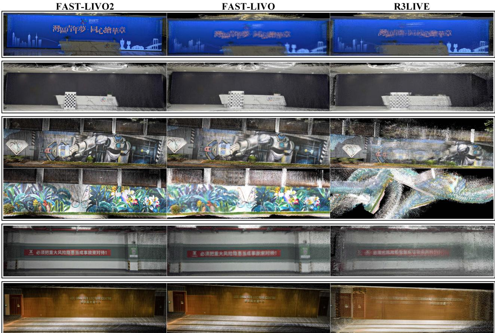  
Fig. 10. Mapping results generated in real time in LiDAR degenerated scenes. The point clouds from top to bottom correspond to “Bright Screen Wall,” “Black Screen Wall,” “HIT Graffiti Wall” (the third and fourth rows), “Banner Wall,” “HKU Lecture Center,” respectively, showing the comparison of colored point cloud constructed FAST-LIVO2, FAST-LIVO, or R3LIVE (see more details on YouTube).10

## D. High-Precision Mapping

In this experiment, we validate the high-precision mapping capabilities of our system. To explore the mapping accuracy across different algorithms and ensure fairness, we compare our system with FAST-LIO2, R3LIVE, and FAST-LIVO in scenes characterized by rich texture and structured environments. We take the sequences “SYSU 01,” “HKU Landmark,” and “CBD Building 01” as examples. Fig. S9 in the Supplementary Material [53] shows the colored point maps of these sequences reconstructed in real time. We can clearly observe that the point maps generated by FAST-LIVO2 retain the finest details among all the systems, the enlarged views of the colored point maps are akin to those in the actual RGB image. In the “SYSU 01” sequence, our algorithm produces fewer white noise dots on the signboard because we normalize the image colors to a reasonable exposure time using the recovered exposure time before coloring, resulting in rarely overexposed colored point maps. The reconstruction of the human and motorcycle in “CBD

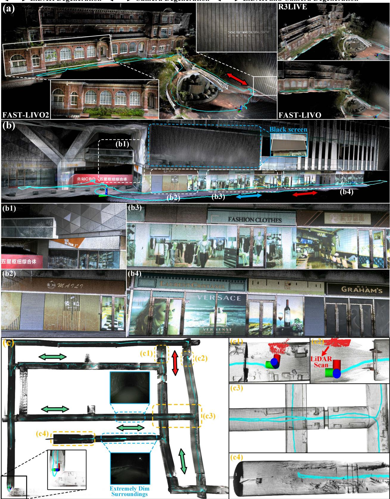  
Fig. 11. Mapping results generated in real time in complex LiDAR degenerated and visually challenging scenes. (a), (b), and (c) correspond to “HKU Cultura Center,” “CBD Building 03,” and “Mining Tunnel,” respectively. Different colored arrows indicate the directions of degeneration caused by different sensors (see more details on YouTube).11

TABLE III PROCESSING TIME (MS) PER LIDAR AND IMAGE FRAME
<table><tr><td>Dataset</td><td>R3LIVE</td><td>LVI- SAM</td><td>FAST- LIVO</td><td>FAST-LIVO2 (LiDAR / Image)</td><td>FAST-LIVO2 (ARM)</td></tr><tr><td>Hilti’22</td><td></td><td></td><td></td><td></td><td></td></tr><tr><td>Construction Ground</td><td>105.03</td><td>×</td><td>52.33</td><td>36.52 (20.44 / 15.05)</td><td>96.12</td></tr><tr><td>Construction Multilevel</td><td>112.13</td><td>X</td><td>56.12</td><td>38.77 (21.38 / 17.39)</td><td>95.38</td></tr><tr><td>Construction Stairs</td><td>125.41</td><td>138.47</td><td>51.34</td><td>39.33 (24.32 / 15.01)</td><td>98.43</td></tr><tr><td>Long Corridor</td><td>120.42</td><td>109.97</td><td>48.68</td><td>41.42 (26.21 / 15.21)</td><td>94.33</td></tr><tr><td>Cupola</td><td>151.52</td><td>X</td><td>59.42</td><td>43.54 (26.53 / 17.01)</td><td>98.12</td></tr><tr><td>Lower Gallery</td><td>119.74</td><td></td><td>131.37 51.15</td><td>41.11 (25.69 / 15.42)</td><td>92.13</td></tr><tr><td>Attic to Upper Gallery</td><td>144.39</td><td>X</td><td>58.61</td><td>44.21 (27.12 / 17.09)</td><td>91.15</td></tr><tr><td>Outside Building</td><td>105.17</td><td>107.92</td><td>44.25</td><td>33.82 (18.91 / 14.91)</td><td>85.43</td></tr><tr><td>Hilti’23</td><td></td><td></td><td></td><td></td><td></td></tr><tr><td>Floor 0</td><td>117.01</td><td>X</td><td>52.23</td><td>42.22 (25.13 / 17.09)</td><td>92.24</td></tr><tr><td>Floor 1</td><td>106.11</td><td>106.98</td><td>50.14</td><td>43.12 (27.43 / 15.69)</td><td>93.52</td></tr><tr><td>Floor 2</td><td>154.65</td><td>X</td><td>53.24</td><td>41.78 (26.12 / 15.66)</td><td>94.43</td></tr><tr><td>Basement</td><td>118.21</td><td>×</td><td>48.23</td><td>39.65 (24.53 / 15.12)</td><td>93.42</td></tr><tr><td>Stairs</td><td>122.94</td><td>114.29</td><td>48.55</td><td>38.42 (22.64 / 15.78)</td><td>95.53</td></tr><tr><td>Parking 3x floors down</td><td>142.43</td><td>×</td><td>51.89</td><td>43.62 (26.99 / 16.63)</td><td>94.22</td></tr><tr><td>Large room</td><td>125.78</td><td>182.18</td><td>55.23</td><td>43.23 (26.43 / 16.80)</td><td>93.28</td></tr><tr><td>Large room (dark)</td><td>131.31</td><td>X</td><td>51.46</td><td>44.21 (29.12 / 15.09)</td><td>92.29</td></tr><tr><td>NTU VIRAL</td><td></td><td></td><td></td><td></td><td></td></tr><tr><td>eee_01</td><td>105.89</td><td></td><td>113.61 38.22</td><td>31.45 (17.24 / 14.21)</td><td>78.03</td></tr><tr><td>eee_02</td><td>112.27</td><td>119.19</td><td>39.43</td><td>30.24 (16.23 / 14.01)</td><td>79.22</td></tr><tr><td>eee_03</td><td>108.11</td><td></td><td>108.7737.53</td><td>29.44 (16.12 / 13.32)</td><td>77.43</td></tr><tr><td>nya_01</td><td>122.73</td><td>124.54</td><td>39.66</td><td>34.52 (18.14 / 16.38)</td><td>79.44</td></tr><tr><td>nya_02</td><td>111.96</td><td>117.18</td><td>35.11</td><td>32.23 (17.33 / 14.90)</td><td>80.52</td></tr><tr><td>nya_03</td><td>115.96</td><td>111.24</td><td>38.42</td><td>33.42 (18.12 / 15.30)</td><td>78.95</td></tr><tr><td>sbs_01</td><td>112.77</td><td>115.67</td><td>39.23</td><td>31.92 (14.68 / 17.24)</td><td>78.32</td></tr><tr><td>sbs_02</td><td>113.01</td><td>110.37</td><td>35.39</td><td>32.56 (17.62 / 14.94)</td><td>72.43</td></tr><tr><td>sbs_03</td><td>119.91</td><td>120.73</td><td>37.41</td><td>33.62 (18.02 / 15.60)</td><td>75.56</td></tr><tr><td>Private Dataset</td><td></td><td></td><td></td><td></td><td></td></tr><tr><td>Retail Street</td><td>85.32</td><td>70.23</td><td>31.22</td><td>19.44 (10.42 / 9.02)</td><td>64.12</td></tr><tr><td>CBD Building 01</td><td>79.22</td><td>65.32</td><td>29.14</td><td>18.22 (10.32 / 7.90)</td><td>62.33</td></tr><tr><td>CBD Building 02</td><td>×</td><td>X</td><td>X</td><td>21.53 (11.50 / 10.03)</td><td>69.98</td></tr><tr><td>CBD Building 03</td><td>×</td><td>×</td><td>×</td><td>21.89 (11.98 / 9.91)</td><td>69.92</td></tr><tr><td>HKU Landmark</td><td>75.43</td><td>68.77</td><td>28.33</td><td>17.42 (10.12 / 7.30)</td><td>63.21</td></tr><tr><td>HKU Lecture Center</td><td>70.42</td><td>×</td><td>31.45</td><td>18.12 (10.99 / 7.13)</td><td>62.88</td></tr><tr><td>HKU Centennial Garden</td><td>74.33</td><td>70.12</td><td>33.46</td><td>19.22 (10.80 / 8.42)</td><td>64.52</td></tr><tr><td>HKU Cultural Center</td><td>102.34</td><td>×</td><td>35.62</td><td>21.43 (11.42 / 10.01)</td><td>72.43</td></tr><tr><td>HKU Main Building</td><td>75.62</td><td>X</td><td>30.21</td><td>19.43 (10.33 / 9.10)</td><td>65.31</td></tr><tr><td>HKUST Red Sculpture</td><td>84.22</td><td>90.13</td><td>32.43</td><td>20.14 (11.12 / 9.02)</td><td>65.42</td></tr><tr><td>HIT Graffiti Wall</td><td>112.56</td><td>X</td><td>39.98</td><td>21.71 (10.55 / 11.16)</td><td>68.99</td></tr><tr><td>Banner Wall</td><td>74.13</td><td>×</td><td>30.22</td><td>19.32 (10.01 / 9.31)</td><td>63.43</td></tr><tr><td>Bright Screen Wall</td><td>73.23</td><td>X</td><td>28.43</td><td>18.22 (9.92 / 8.30)</td><td>61.21</td></tr><tr><td>Black Screen Wall</td><td>71.42</td><td>×</td><td>27.66</td><td>17.99 (9.10 / 8.89)</td><td>60.91</td></tr><tr><td>Office Building Wall</td><td>X</td><td>X</td><td>X</td><td>19.42 (10.11 / 9.31)</td><td>62.33</td></tr><tr><td>Narrow Corridor</td><td>×</td><td>×</td><td>×</td><td>18.44 (8.32 / 10.12)</td><td>61.42</td></tr><tr><td>Long Corridor</td><td>X</td><td>X</td><td>X</td><td>19.53 (10.43 / 9.10)</td><td>62.55</td></tr><tr><td>Mining Tunnel</td><td>×</td><td>×</td><td>×</td><td>29.43 (15.42 / 14.01)</td><td>79.32</td></tr><tr><td>SYSU 01</td><td>112.66</td><td>88.95</td><td>32.23</td><td>23.65 (12.51 / 11.14)</td><td>77.43</td></tr><tr><td>SYSU 02</td><td>110.12</td><td>X</td><td>32.12</td><td>22.63 (11.82 / 10.81)</td><td>72.31</td></tr><tr><td>Average</td><td>108.36</td><td></td><td>108.45 41.43</td><td>30.03 (17.13 / 12.90)</td><td>78.44</td></tr></table>

× denotes the system totally failed

Building 01” also exemplifies our ability to rebuild the details of unstructured objects. In all sequences, the estimated final position returns to the starting point with an end-to-end error of less than 0.01 m. We also tested FAST-LIVO2 in the remaining sequences of the private dataset, with mapping results shown in Fig. S10– S13 in the Supplementary Material [53].

## E. Run Time Analysis

In this section, we evaluate the average computational time per LiDAR scan and image frame of our proposed system, tested on a desktop PC equipped with an Intel i7-10700K CPU and 32GB RAM. Our evaluations span public datasets including Hilti’22, Hilti’23, and NTU-VIRAL, and our private dataset. As shown in

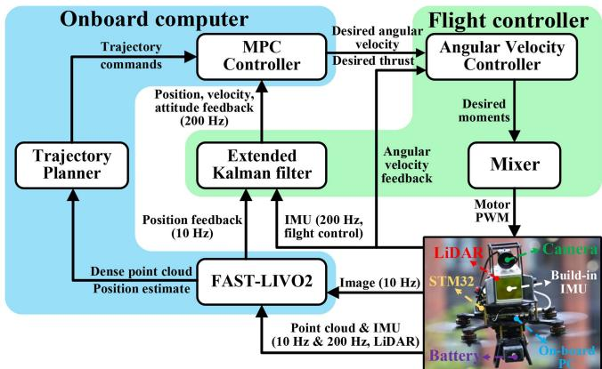  
Fig. 12. Fully onboard UAV navigation algorithm flowchart.

Table III, our system exhibits the lowest processing time across all sequences. The average computation time consumption on an Intel i7 processor is only 30.03 ms (17.13 ms per LiDAR scan and 12.90 ms per image frame), fulfilling real-time operation at 10 Hz. Besides, our system can even operate in real time on ARM processors with an average processing time per frame of just 78.44 ms. LVI-SAM’s LiDAR and visual feature extraction modules in LIO and VIO are time-consuming. In addition to the time consumed by LIO and VIO, LVI-SAM integrates IMU preintegration constraints, visual odometry constraints, and LiDAR odometry constraints within a factor graph, further increasing the overall processing time. For R3LIVE, although also employing a direct method, its pixelwise image alignment necessitates the use of a large number of visual map points. In contrast, our approach uses sparse points with reference patches, enabling efficient alignment. In addition, R3LIVE maintains a colored map that undergoes Bayesian updating, significantly increasing the computational load as the map resolution increases. For FAST-LIO2, the average processing time per frame (Table S3 in the Supplementary Material [53] due to space constraints) is approximately 10.35 ms less than FAST-LIVO2 due to not processing additional image measurements.

FAST-LIVO2 also shows noticeable improvements over the predecessor FAST-LIVO. The primary enhancement stems from our application of inverse compositional formulation in the sparse image alignment. Employing affine warping based on the plane prior from LiDAR points further enhances the convergence efficiency of our method. Consequently, FAST-LIVO2 reduces the number of iterations per pyramid level from 10 to 3, while still achieving superior accuracy.

## X. APPLICATIONS

To showcase the superior performance and versatility of FAST-LIVO2 in real-world applications, we develop multiple solutions, including fully onboard autonomous UAV navigation, airborne mapping, textured mesh generation, and 3-D Gaussian splatting (3DGS) reconstruction for 3-D scene representation.

## A. Fully Onboard Autonomous UAV Navigation

Given the high precision and robust localization performance of FAST-LIVO2, along with its real-time capabilities, we conduct closed-loop autonomous UAV flights.

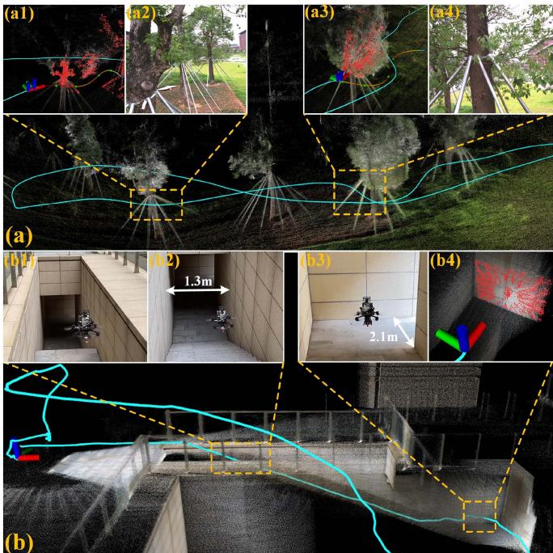

Fig. 13. (a) and (b) are the enlarged point maps of the “Woods” and “Narrow Opening” experiments, respectively. The red points in (a1), (a3), and (b4) represent the current scan. (a2) and (a4) represent the first-person view at the corresponding locations. (b1), (b2), and (b3) depict the third-person view (see more details on YouTube).12  
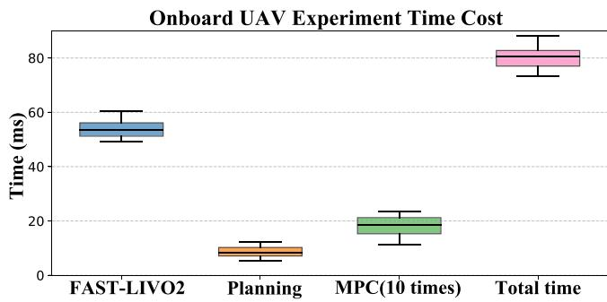  
Fig. 14. Processing time of each module and in total in UAV autonomous navigation experiments across “Basement,” “Woods,” “Narrow Opening,” and “SYSU Campus.” The MPC executes at 100 Hz while planning and FAST-LIVO2 execute at 10 Hz, so its computation time is counted for ten times.

1) System Configurations: The hardware and software setup are illustrated in Fig. 12. For hardware, we use a NUC (Intel i7-1360P CPU and 32 GB RAM) as the onboard computer. In terms of software, the localization component is powered by FAST-LIVO2, which provides position feedback at 10 Hz. The localization result is fed to the flight controller to achieve 200 Hz feedback on position, velocity, and attitude. Besides localization, FAST-LIVO2 supplies a dense registered point cloud to the planning module, the Bubble planner [55], which plans a smooth trajectory that is then tracked by an on-manifold model predictive control (MPC) [56]. The MPC calculates the desired angular rates and thrust, which are tracked by respective low-level angular rate controllers running on the flight controller. Importantly, the MPC, Planner, and FAST-LIVO2 all operate on the onboard computer in real time.

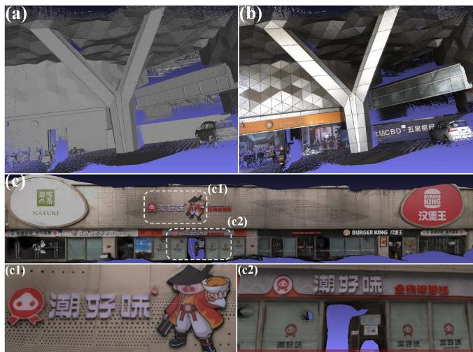  
Fig. 15. (a) and (b) are the mesh and texture mapping of “CBD Building 01,” respectively. (c) is the texture mapping of “Retail Street,” with (c1) and (c2) showing local details.

2) UAVAutonomous Navigation: We conduct four fully onboard autonomous UAV navigation experiments, “Basement,” “Woods,” “Narrow Opening,” and “SYSU Campus” (Table S2 in the Supplementary Material [53]). “Basement” and “Woods” experiments are fully autonomous flights incorporating all planning, MPC, and FAST-LIVO2 modules, while “Narrow Opening” and “SYSU Campus” are manual flights with only MPC and FAST-LIVO2 (without the planning component). As can be seen, “Basement” and “Woods” showcase the UAV’s successful autonomous navigation and obstacle avoidance. In “Narrow Opening,” the UAV is commanded to fly close proximity to a wall leading to few LiDAR points measurements. Nevertheless, the raycasting module recalls a greater number of visual map points, providing abundant constraints for localization, which allows for stable localization. Moreover, “Basement” and “Narrow Opening” experience LiDAR degeneration, observing only a single wall [see Fig. 1(e1) and (e4), Fig. 13(b1)–(b4))], along with significant exposure variations [see Fig. 1(e5)–(e6)]. Despite these challenges, our UAV system performed exceptionally well. “Woods” involves the UAV moving at high speeds up to 3 m/s, demanding rapid response from the entire UAV system [see Fig. 13(a1)–(a4)]. “SYSU Campus”, a nondegenerated scene, primarily demonstrates the onboard high-precision mapping capabilities (see Fig. S14 in the Supplementary Material [53]). Finally, it is worth mentioning that in all these four UAV flights, severe lighting variation occurred. FAST-LIVO2 is able to estimate exposure time that closely follows the ground-truth values (see Fig. S15 in the Supplementary Material [53]).

Regarding onboard computational time, the need to run MPC (at 100 Hz) and Planning (at 10 Hz) on the onboard computer consumes computational resources and memory, limiting the computation resources available to FAST-LIVO2. Despite of the concurrent execution of control and planning, as illustrated in Fig. 14, the average onboard processing time per LiDAR scan and image frame for FAST-LIVO2, approximately 53.47 ms, is still well below the frame period 100 ms. The average processing times for planning and MPC are 8.43 and 18.5 ms, respectively. The total average processing time of 80.4 ms meets very well the real-time requirements for onboard operations.

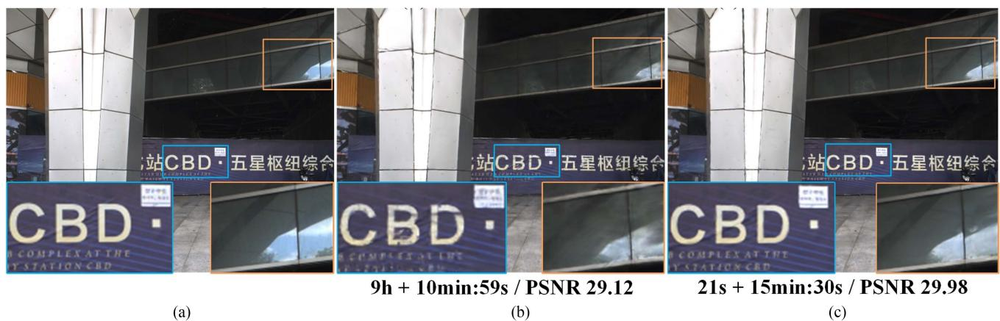  
Fig. 16. Comparison of ground-truth image, COLMAP+3DGS, and FAST-LIVO2+3DGS in terms of render details, computational time (time for generating point clouds and estimating poses + training time), and PSNR for a random frame in “CBD Building 01” (see more details on YouTube.13 (a) Ground-truth image. (b) COLMAP + 3DGS. (c) FAST-LIVO2 + 3DGS.

## B. Airborne Mapping

Airborne mapping represents a crucial task in surveying and mapping applications. To evaluate the suitability of FAST-LIVO2 for this application, we conduct an aerial mapping experiment using the public dataset MARS-LVIG [52] whose hardware configuration is detailed in Section VIII-A. We evaluate the two sequences “HKairport01” and “HKisland01,” whose real-time mapping results are illustrated in Fig. 1(a)–(c), with Fig. 1(a) and (c) corresponding to “HKisland01,” and (b) depicting “HKairport01.” The results demonstrate the effectiveness of FAST-LIVO2 in unstructured environments, such as forests and islands. The system successfully captures many fine structures and sharp coloring effects, including buildings, lane marks on roads, road curbs, tree crowns, and rocks, all of which are clearly visible. The APE (RMSE) for these sequences are 0.64 and 0.27 m for FAST-LIVO2, respectively, compared to 2.76 and 0.52 m for R3LIVE. The average processing times on the desktop PC (see Section IX-A), are approximately 25.2 and 21.8 ms, respectively, compared to 110.5 and 100.2 ms for R3LIVE.

## C. Supporting 3-D Scene Applications: Mesh Generation, Texture, and Gaussian Splatting

Leveraging the high-precision sensor localization and dense 3-D colored point map obtained from FAST-LIVO2, we develop software applications for rendering pipelines including meshing and texturing, as well as emerging NeRF-like rendering pipeline, such as 3DGS. For meshing, we employ VDBFusion [57] based on the truncated signed distance function in “CBD Building 01,” as shown in Fig. 15(a). The sharp edges on the columns and the distinct structure of the roof are clearly visible, demonstrating the high quality of the mesh. This level of detail is achieved due to the high density of FAST-LIVO2’s point clouds and the exceptional accuracy of structural reconstruction. After mesh construction, we use OpenMVS [58] to perform texture mapping using the estimated camera poses in “CBD Building 01” and “Retail Street,” as shown in Fig. 15(b)–(c). In Fig. 15(c1)–(c2), the texture images applied on the triangular facets are seamless and accurately aligned, resulting in a highly clear and precise texture mapping. This is attributed to pixel-level image alignment achieved by FAST-LIVO2.

The dense color point clouds from FAST-LIVO2 can also directly serve as the input of 3DGS. We conduct tests on the sequence “CBD Building 01” utilizing 300 frames out of a total of 1180 images. The results are shown in Fig. 16. Compared to COLMAP [59], our method significantly reduces the time required to obtain dense point clouds and poses from 9 h to 21 s. However, the training time increases from 10 min 59 s to 15 min 30 s. This increase is attributed to the denser point clouds (downsampled to 5 cm), which introduce more parameters to optimize. Nonetheless, the increased density and precision of our point clouds result in a slightly higher peak signal-to-noise ratio (PSNR) compared to the PSNR obtained from COLMAP inputs.

## XI. CONCLUSION AND FUTURE WORK

This article proposed FAST-LIVO2, a direct LIVO framework achieving fast, accurate, and robust state estimation while reconstructing the map on the fly. FAST-LIVO2 can achieve high localization accuracy while being robust to severe LiDAR and/or visual degeneration.

The gain in speed is attributed to the use of raw LiDAR, inertial, and camera measurements within an efficient ESIKF framework with sequential update. In the image update, an inverse compositional formulation along with a sparse patch-based image alignment is further adopted to boost the efficiency. The gain in accuracy is attributed to the use (and even refine) of plane priors from LiDAR points to enhance accuracy of image alignment. Besides, a single unified voxel map is used to manage simultaneously the map points and the observed high-resolution image measurements. The voxel map structure, which supports geometry construction and update, visual map point generation and update, and reference patch update, is developed and validated. The gain in robustness is due to real-time estimation of exposure time, which effectively handles environment illumination variation, and on-demand voxel raycasting to cope with LiDARs’ close proximity blind zones. The efficiency and accuracy of FAST-LIVO2 were evaluated on extensive public datasets, while the robustness and effectiveness of each system module were evaluated on private dataset. The applications of FAST-LIVO2 in real-world robotics applications, such as

UAV navigation, 3-D mapping, and model rendering, were also demonstrated.

As an odometry, FAST-LIVO2 may have drifts over long distances. In the future, we could integrate loop closure and the sliding window optimization into FAST-LIVO2 to mitigate this long-term drift. Moreover, the accurate and dense colored point maps could be used to extract semantic information for object-level semantic mapping.

## REFERENCES

[1] R. Mur-Artal and J. D. Tardós, “ORB-SLAM2: An open-source SLAM system for monocular, stereo, and RGB-D cameras,” IEEE Trans. Robot., vol. 33, no. 5, pp. 1255–1262, Oct. 2017.

[2] J. Engel, V. Koltun, and D. Cremers, “Direct sparse odometry,” IEEE Trans. Pattern Anal. Mach. Intell., vol. 40, no. 3, pp. 611–625, Mar. 2018.

[3] J. Engel, T. Schöps, and D. Cremers, “LSD-SLAM: Large-scale direct monocular SLAM,” in Proc. Eur. Conf. Comput. Vis., 2014, pp. 834–849.

[4] C. Forster, Z. Zhang, M. Gassner, M. Werlberger, and D. Scaramuzza, “SVO: Semidirect visual odometry for monocular and multicamera systems,” IEEE Trans. Robot., vol. 33, no. 2, pp. 249–265, Apr. 2017.

[5] J. Zhang and S. Singh, “LOAM: Lidar odometry and mapping in real-time,” in Proc. Conf. Robot.: Sci. Syst., vol. 2, no. 9, 2014.

[6] J. Lin and F. Zhang, “Loam livox: A fast, robust, high-precision lidar odometry and mapping package for lidars of small FOV,” in Proc. IEEE Int. Conf. Robot. Automat., 2020, pp. 3126–3131.

[7] T. Shan and B. Englot, “LeGO-LOAM: Lightweight and ground-optimized lidar odometry and mapping on variable terrain,” in Proc. IEEE/RSJ Int. Conf. Intell. Robots Syst., 2018, pp. 4758–4765.

[8] C. Zheng, Q. Zhu, W. Xu, X. Liu, Q. Guo, and F. Zhang, “FAST-LIVO: Fast and tightly-coupled sparse-direct lidar-inertial-visual odometry,” in Proc. IEEE/RSJ Int. Conf. Intell. Robots Syst., 2022, pp. 4003–4009.

[9] T. Qin, P. Li, and S. Shen, “VINS-Mono: A robust and versatile monocular visual-inertial state estimator,” IEEE Trans. Robot., vol. 34, no. 4, pp. 1004–1020, Aug. 2018.

[10] R. Mur-Artal, J. M. M. Montiel, and J. D. Tardos, “ORB-SLAM: A versatile and accurate monocular SLAM system,” IEEE Trans. Robot., vol. 31, no. 5, pp. 1147–1163, Oct. 2015.

[11] M. Irani and P. Anandan, “All about direct methods,” in Proc. Workshop Vis. Algorithms, Theory Pract., 1999, pp. 267–277.

[12] C. Forster, M. Pizzoli, and D. Scaramuzza, “SVO: Fast semi-direct monocular visual odometry,” in Proc. IEEE Int. Conf. Robot. Automat., 2014, pp. 15–22.

[13] W. Xu, Y. Cai, D. He, J. Lin, and F. Zhang, “FAST-LIO2: Fast direct lidarinertial odometry,” IEEE Trans. Robot., vol. 38, no. 4, pp. 2053–2073, Aug. 2022.

[14] C. Yuan, W. Xu, X. Liu, X. Hong, and F. Zhang, “Efficient and probabilistic adaptive voxel mapping for accurate online lidar odometry,” IEEE Robot. Automat. Lett., vol. 7, no. 3, pp. 8518–8525, Jul. 2022.

[15] M. Meilland, A. I. Comport, and P. Rives, “Real-time dense visual tracking under large lighting variations,” in Proc. Brit. Mach. Vis. Conf. Brit. Mach. Vis. Assoc., 2011, pp. 45–1.

[16] T. Tykkälä, C. Audras, and A. I. Comport, “Direct iterative closest point for real-time visual odometry,” in Proc. IEEE Int. Conf. Comput. Vis. Workshops, 2011, pp. 2050–2056.

[17] C. Kerl, J. Sturm, and D. Cremers, “Robust odometry estimation for RGB-D cameras,” in Proc. IEEE Int. Conf. Robot. Automat., 2013, pp. 3748– 3754.

[18] J. Engel, J. Sturm, and D. Cremers, “Semi-dense visual odometry for a monocular camera,” in Proc. IEEE Int. Conf. Comput. Vis., 2013, pp. 1449–1456.

[19] K. Chen, R. Nemiroff, and B. T. Lopez, “Direct lidar-inertial odometry: Lightweight LIO with continuous-time motion correction,” in Proc. IEEE Int. Conf. Robot. Automat., 2023, pp. 3983–3989.

[20] Z. Wang, L. Zhang, Y. Shen, and Y. Zhou, “D-LIOM: Tightly-coupled direct lidar-inertial odometry and mapping,” IEEE Trans. Multimedia, vol. 25, pp. 3905–3920, 2023.

[21] J. Zhang and S. Singh, “Laser–visual–inertial odometry and mapping with high robustness and low drift,” J. Field Robot., vol. 35, no. 8, pp. 1242–1264, 2018.

[22] W. Shao, S. Vijayarangan, C. Li, and G. Kantor, “Stereo visual inertial lidar simultaneous localization and mapping,” in Proc. IEEE/RSJ Int. Conf. Intell. Robots Syst., 2019, pp. 370–377.

[23] J. Zhang, M. Kaess, and S. Singh, “A real-time method for depth enhanced visual odometry,” Auton. Robots, vol. 41, pp. 31–43, 2017.

[24] J. Graeter, A. Wilczynski, and M. Lauer, “LIMO: Lidar-monocular visual odometry,” in Proc. IEEE/RSJ Int. Conf. Intell. Robots Syst., 2018, pp. 7872–7879.

[25] Y. Zhu, C. Zheng, C. Yuan, X. Huang, and X. Hong, “CamVox: A low-cost and accurate lidar-assisted visual SLAM system,” in Proc. IEEE Int. Conf. Robot. Automat., 2021, pp. 5049–5055.

[26] S.-S. Huang, Z.-Y. Ma, T.-J. Mu, H. Fu, and S.-M. Hu, “Lidar-monocular visual odometry using point and line features,” in Proc. IEEE Int. Conf. Robot. Automat., 2020, pp. 1091–1097.

[27] C. Campos, R. Elvira, J. J. G. Rodríguez, J. M. Montiel, and J. D. Tardós, “ORB-SLAM3: An accurate open-source library for visual, visual–inertial, and multimap SLAM,” IEEE Trans. Robot., vol. 37, no. 6, pp. 1874–1890, Dec. 2021.

[28] Y.-S. Shin, Y. S. Park, and A. Kim, “DVL-SLAM: Sparse depth enhanced direct visual-lidar SLAM,” Auton. Robots, vol. 44, no. 2, pp. 115–130, 2020.

[29] X. Zuo, P. Geneva, W. Lee, Y. Liu, and G. Huang, “LIC-Fusion: Lidarinertial-camera odometry,” in Proc. IEEE/RSJ Int. Conf. Intell. Robots Syst., 2019, pp. 5848–5854.

[30] K. Sun et al., “Robust stereo visual inertial odometry for fast autonomous flight,” IEEE Robot. Automat. Lett., vol. 3, no. 2, pp. 965–972, Apr. 2018.

[31] X. Zuo et al., “LIC-Fusion 2.0: Lidar-inertial-camera odometry with sliding-window plane-feature tracking,” in Proc. IEEE/RSJ Int. Conf. Intell. Robots Syst., 2020, pp. 5112–5119.

[32] D. Wisth, M. Camurri, S. Das, and M. Fallon, “Unified multimodal landmark tracking for tightly coupled lidar-visual-inertial odometry,” IEEE Robot. Automat. Lett., vol. 6, no. 2, pp. 1004–1011, Apr. 2021.

[33] J. Lin, C. Zheng, W. Xu, and F. Zhang, “R2Live: A robust, real-time, lidar-inertial-visual tightly-coupled state estimator and mapping,” IEEE Robot. Automat. Lett., vol. 6, no. 4, pp. 7469–7476, Oct. 2021.

[34] B. M. Bell and F. W. Cathey, “The iterated Kalman filter update as a Gauss-Newton method,” IEEE Trans.Autom. Control, vol. 38, no. 2, pp. 294–297, Feb. 1993.

[35] T. Shan, B. Englot, C. Ratti, and D. Rus, “LVI-SAM: Tightly-coupled lidar-visual-inertial odometry via smoothing and mapping,” in Proc. IEEE Int. Conf. Robot. Automat., 2021, pp. 5692–5698.

[36] J. Lin and F. Zhang, “R 3 live: A robust, real-time, RGB-colored, lidarinertial-visual tightly-coupled state estimation and mapping package,” in Proc. Int. Conf. Robot. Automat., 2022, pp. 10672–10678.

[37] J. Lin and F. Zhang, “R 3 Live++: A robust, real-time, radiance reconstruction package with a tightly-coupled lidar-inertial-visual state estimator,” IEEE Trans. Pattern Anal. Mach. Intell., 2024.

[38] J. Engel, V. Usenko, and D. Cremers, “A photometrically calibrated benchmark for monocular visual odometry,” 2016, arXiv:1607.02555.

[39] W. Wang, J. Liu, C. Wang, B. Luo, and C. Zhang, “DV-Loam: Direct visual lidar odometry and mapping,” Remote Sens., vol. 13, no. 16, 2021, Art. no. 3340.

[40] Z. Yuan, Q. Wang, K. Cheng, T. Hao, and X. Yang, “SDV-Loam: Semidirect visual-lidar odometry and mapping,” IEEE Trans. Pattern Anal. Mach. Intell., vol. 45, no. 9, pp. 11203–11220, Sep. 2023.

[41] H. Zhang, L. Du, S. Bao, J. Yuan, and S. Ma, “LVIO-Fusion:tightlycoupled lidar-visual-inertial odometry and mapping in degenerate environments,” IEEE Robot. Automat. Lett., vol. 9, no. 4, pp. 3783–3790, Apr. 2024.

[42] W. Xu and F. Zhang, “FAST-LIO: A fast, robust lidar-inertial odometry package by tightly-coupled iterated Kalman filter,” IEEE Robot. Automat. Lett., vol. 6, no. 2, pp. 3317–3324, Apr. 2021.

[43] D. He, W. Xu, and F. Zhang, “Symbolic representation and toolkit development of iterated error-state extended Kalman filters on manifolds,” IEEE Trans. Ind. Electron., vol. 70, no. 12, pp. 12533–12544, Dec. 2023.

[44] D. Willner, C.-B. Chang, and K.-P. Dunn, “Kalman filter algorithms for a multi-sensor system,” in Proc. IEEE Conf. Decis. Control Including 15th Symp. Adaptive Processes, 1976, pp. 570–574.

[45] J. Ma and S. Sun, “Globally optimal distributed and sequential state fusion filters for multi-sensor systems with correlated noises,” Inf. Fusion, vol. 99, 2023, Art. no. 101885.

[46] Y. Ren, Y. Cai, F. Zhu, S. Liang, and F. Zhang, “ROG-MAP: An efficient robocentric occupancy grid map for large-scene and high-resolution lidarbased motion planning,” 2023, arXiv:2302.14819.

[47] R. M. Stereopsis, “Accurate, dense, and robust multiview stereopsis,” IEEE Trans. Pattern Anal. Mach. Intell., vol. 32, no. 8, pp. 1362–1376, Aug. 2010.

[48] S. Baker and I. Matthews, “Lucas-Kanade 20 years on: A unifying framework,” Int. J. Comput. Vis., vol. 56, pp. 221–255, 2004.

[49] T.-M. Nguyen, S. Yuan, M. Cao, Y. Lyu, T. H. Nguyen, and L. Xie, “NTU VIRAL: A visual-inertial-ranging-lidar dataset, from an aerial vehicle viewpoint,” Int. J. Robot. Res., vol. 41, no. 3, pp. 270–280, 2022.

[50] M. Helmberger, K. Morin, B. Berner, N. Kumar, G. Cioffi, and D. Scaramuzza, “The Hilti SLAM challenge dataset,” IEEE Robot. Automat. Lett., vol. 7, no. 3, pp. 7518–7525, Jul. 2022.

[51] L. Zhang et al., “Hilti-Oxford dataset: A millimeter-accurate benchmark for simultaneous localization and mapping,” IEEE Robot. Automat. Lett., vol. 8, no. 1, pp. 408–415, Jan. 2023.

[52] H. Li et al., “MARS-LVIG dataset: A multi-sensor aerial robots SLAM dataset for lidar-visual-inertial-GNSS fusion,” Int. J. Robot. Res., vol. 43, no. 8, 2024, Art. no. 02783649241227968.

[53] “Supplementary material: Fast-livo2: Fast, direct lidar-inertial-visual odometry,” Aug. 2024. [Online]. Available: https://github.com/hku-mars/ FAST-LIVO2/blob/main/Supplementary/LIVO2\_supplementary.pdf

[54] C. Klug, C. Arth, D. Schmalstieg, and T. Gloor, “Measurement uncertainty analysis of a robotic total station simulation,” in Proc. IECON 44th Annu. Conf. IEEE Ind. Electron. Soc., 2018, pp. 2576–2582.

[55] Y. Ren et al., “Bubble planner: Planning high-speed smooth quadrotor trajectories using receding corridors,” in Proc. IEEE/RSJ Int. Conf. Intell. Robots Syst., 2022, pp. 6332–6339.

[56] G. Lu, W. Xu, and F. Zhang, “On-manifold model predictive control for trajectory tracking on robotic systems,” IEEE Trans. Ind. Electron., vol. 70, no. 9, pp. 9192–9202, Sep. 2023.

[57] I. Vizzo, T. Guadagnino, J. Behley, and C. Stachniss, “VDBFusion: Flexible and efficient TSDF integration of range sensor data,” Sensors, vol. 22, no. 3, 2022, Art. no. 1296. [Online]. Available: https://www.mdpi.com/ 1424-8220/22/3/1296

[58] D. Cernea, “OpenMVS: Multi-view stereo reconstruction library 2020,” 2020. [Online]. Available: https://cdcseacave.github.io/openMVS

[59] J. L. Schönberger and J.-M. Frahm, “Structure-from-motion revisited,” in Proc. IEEE Conf. Comput. Vis. Pattern Recognit., 2016, pp. 4104–4113.

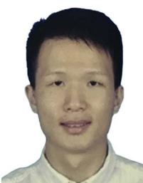

Zuhao Zou received the B.Eng. degree in automatic control system engineering from The University of Sheffield, Sheffield, U.K., in 2016, and the M.Sc. degree in computer vision, graphic, and imaging from University College London, London, U.K., in 2017. He is currently working toward the Ph.D. degree in mechanical engineering with Hong Kong University, Hong Kong, China.

His research interests include robotics, sensor fusion, localization and mapping, and loop detection.

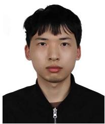

Tong Hua received the B.S. degree in electronic engineering from Shanghai Jiao Tong University, Shanghai, China, in 2021. He has been working toward the master’s degree in information and communication engineering with the Shanghai Key Laboratory of Navigation and Location Based Services, Shanghai Jiao Tong University, Shanghai, China, since 2021.

His research interests include multisensor fusion and visual inertial odometry.

Chongjian Yuan received the B.Eng. degree in automation from the College of Control Science and Engineering, Zhejiang University, Hangzhou, China, in 2016. He is currently working toward the Ph.D. degree in robotics with the Department of Mechanical Engineering, The University of Hong Kong, Hong Kong, China.

His research interests include light detection and ranging SLAM and sensor fusion.

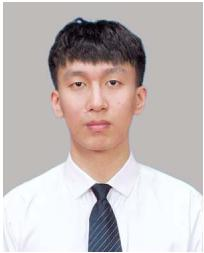  
Chunran Zheng (Student Member, IEEE) received the B.Eng. degree in automation from Xian Jiaotong University, Xi’an, China, in 2020. He is currently working toward the Ph.D. degree in robotics and SLAM with the Department of Mechanical Engineering, The University of Hong Kong, Hong Kong, China.  
His research interests include multisensor calibration, sensor fusion, LiDAR–inertial–visual SLAM, and 3-D Gaussian splatting.

Dongjiao He (Member, IEEE) received the B.S. degree from Southeast University, Nanjing, China, in 2016, the M.S. degree from Shanghai Jiao Tong University, Shanghai, China, in 2019, both in mechanical engineering, and the Ph.D. degree in robotics from the University of Hong Kong, Hong Kong, China, in July 2024, under supervision of Prof. Fu Zhang.

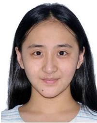

Her research interests of the doctoral degree include advanced multisensor algorithms for autonomous navigation, SLAM, and other related fields of UAVs. She is committed to advancing research for autonomous systems, including multisource information fusion, autonomous perception, and strategy decision.

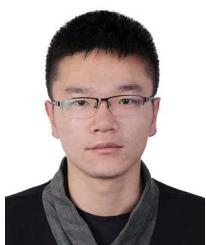

Wei Xu received the Ph.D. degree in mechanical engineering from the University ofHong Kong, Hong Kong, China, in 2022.

He is currently the Chief Technology Officer with Manifold Tech Limited, Hong Kong, China. His research and expertise include filtering algorithms, multisensor fusion, simultaneous localization and dense mapping, unmanned aerial vehicle systems, and motion planning.

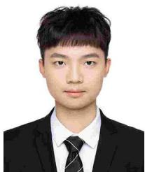

Bingyang Zhou (Member, IEEE) received the B.Eng. degree in automation from the Harbin Institute of Technology, Shenzhen, China, in 2023. He is currently working toward the M.Phil. degree in mechanical engineering with MaRS Lab, Department of Mechanical Engineering, The University of Hong Kong, Hong Kong, China.

His research focuses on simultaneous localization and mapping.

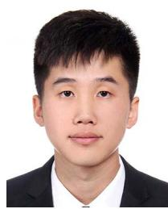

Zheng Liu (Member, IEEE) received the B.Eng. degree in automation from the Harbin Institute of Technology, Harbin, China, in 2019, and the Ph.D. degree in mechanical engineering from the University of Hong Kong, Hong Kong, China, in 2024.

His research interests include visual or LiDARbased localization and mapping, and sensor fusion and calibration.

Rong Wang received the B.Sc. degree in automation from Beihang University, Beijing, China, 2013, and the Ph.D. degree in automation from the University of Chinese Academy of Sciences, Beijing, China, in June 2018.

Her Ph.D. work focused on SLAM and augmented reality. From July 2018, she was with the Information Science Academy, China Electronics Technology Group Corporation, Beijing, China. Her research interests include semantic SLAM and UAV.

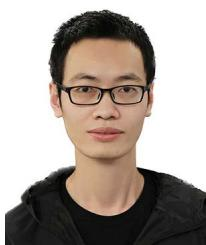

Jiarong Lin (Member, IEEE) received the B.S. degree in optical information science and technology from the University of Electronic Science and Technology of China, Chengdu, China, in 2015. He is currently working toward the Ph.D. degree in robotics with the Department of Mechanical Engineering, The University of Hong Kong, Hong Kong, China.

His research interests include light detection and ranging mapping and sensor fusion.

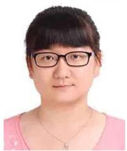

Fanle Meng received the B.Sc. degree in biomedical engineering from the Huazhong University of Science and Technology, Wuhan, China, in 2010, and the Ph.D. degree in biomedical engineering from Tsinghua University, Beijing, China, in June 2018.

Her Ph.D. work focused on medical robotics and surgery navigation. From July 2018, she was with the Information Science Academy, China Electronics Technology Group Corporation, Beijing, China. Her research interests include SLAM and UGV.

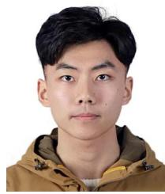

Fangcheng Zhu (Student Member, IEEE) received the B.Eng. degree in automation from the School of Mechanical Engineering and Automation, Harbin Institute of Technology, Shenzhen, China, in 2021. He is currently working toward the Ph.D. degree in robotics with the Department of Mechanical Engineering, University of Hong Kong, Hong Kong, China.

Fu Zhang (Member, IEEE) received the B.E. degree in automation from the University of Science and Technology of China, Hefei, China, in 2011, and the Ph.D. degree in controls from the University of California, Berkeley, CA, USA, in 2015.

His research interests include LiDAR-based simultaneous localization and mapping, sensor calibration, and aerial swarm systems.

His Ph.D. work focused on self-calibration and control ofmicrorate-integrating gyrosensors. In 2016, he was a Research Assistant Professor in design and control of unmanned aerial vehicles (UAVs) with the Robotics Institute, Hong Kong University of Science and Technology, Hong Kong, China. From Aug 2018,

he was an Assistant Professor with the Department of Mechanical Engineering, University of Hong Kong, Hong Kong, China. His research interests include robotics and controls, with focus on UAV design, navigation, control, and lidar-based simultaneous localization and mapping.

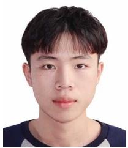

Yunfan Ren (Student Member, IEEE) received the B.Eng. degree in automation from the Harbin Institute of Technology, Harbin, China, in 2021. He is currently working toward the Ph.D. degree with the Department of Mechanical Engineering, The University of Hong Kong, Hong Kong, China.

He is a Member of the MaRS Lab, Hong Kong, China. His research interests include autonomous navigation, UAV planning, optimal control, and swarm system autonomy.

Mr. Ren was recognized as an Outstanding Navigation Paper Finalist at ICRA 2023 and as both the Best Overall and Best Student Paper Finalist at IROS 2023.