# Motion-Aware 3D Gaussian Splatting for Efficient Dynamic Scene Reconstruction

Zhiyang Guo , Wengang Zhou , Senior Member, IEEE, Li Li , Member, IEEE, Min Wang , and Houqiang Li , Fellow, IEEE

Abstract— 3D Gaussian Splatting (3DGS) has become an emerging tool for dynamic scene reconstruction. However, existing methods mainly focus on developing various strategies to extend static 3DGS into a time-variant representation, while overlooking the rich motion information implicitly carried by 2D observations, thus suffering from performance degradation and model redundancy. To address the above problem, we propose a novel motion-aware enhancement framework for dynamic scene reconstruction, which mines useful motion cues from optical flow to improve different paradigms of dynamic 3DGS. Specifically, we first step beyond the vanilla render-based cross-dimensional supervision that suffers from ambiguity and instability, and establish a more robust and effective dense correspondence between 3D Gaussian movements and pixel-level flows. Then a novel flow augmentation method is introduced with additional insights into uncertainty and loss collaboration. Furthermore, for the prevalent deformation-based paradigm that presents a harder optimization problem, a transient-aware deformation auxiliary module is proposed. We conduct extensive experiments on both multi-view and monocular scenes to verify the merits of our work. Compared with the baselines, our method shows significant superiority in both rendering quality and efficiency. The code will be publicly available at https://github.com/jasongzy/MAGS.

Index Terms— Dynamic scene reconstruction, 3D Gaussian splatting, optical flow.

## I. INTRODUCTION

N THE domain of 3D vision, dynamic scene reconstruction I is a crucial task with a wide range of applications, e.g., 3D animation and virtual/augmented reality. This task aims to model the three-dimensional structure and appearance of a scene that changes over time, thereby enabling novel view rendering at arbitrary timestamps. While static scene modeling has witnessed significant progress in recent years, reconstructing dynamic scenes remains an intractable challenge due to the difficulties introduced by motion complexities, topological changes, and spatially or temporally sparse observations.

In the past few years, Neural Radiance Fields (NeRF) [1] has emerged as a remarkable implicit representation for 3D scenes. Researchers have developed various methods [2], [3], [4], [5], [6], [7], [8], [9] to model dynamic scenes with NeRF. Despite their impressive visual quality, the large time overhead stands as a non-negligible obstacle to their practical application. Recently, a new method named 3D Gaussian Splatting (3DGS) [10] has attracted substantial attention from the research community. 3DGS gets rid of the expensive deep neural networks and ray-tracing rendering of NeRF-based methods by introducing the explicit 3D Gaussian representation and efficient point-based rasterization. As a strong competitor to NeRF, 3DGS achieves comparable performance in novel view synthesis while boosting the rendering speed to a real-time level.

It is then a straightforward but challenging task to extend the static 3DGS to a time-variant representation for dynamic content. Some prior works [11], [12], [13], [14], [15] have tried different strategies, e.g., iterative optimization, deformation field, and hyper-dimensional representation, to address this problem. However, these works typically focus on the design of dynamic modeling. They regard frames as discrete samples to fit time-dependent trajectories while overlooking other motion cues underneath sequential 2D observations. Since dynamic 3DGS involves explicit moving and deforming of Gaussians, it presents a tough under-constrained problem to use only images to supervise the reconstruction. The model is prone to local optimum where temporal consistency of Gaussians is not maintained as in the physical world, especially for cases with insufficient viewpoints. This leads to visual overfitting, performance degradation, and redundant modeling in practice.

To address the above issues, we propose a novel motionaware framework to enhance dynamic 3DGS by taking full advantage of optical flow priors. As a well-explored representation of pixel-level movement, optical flow can be efficiently predicted by pretrained networks [16], [17], providing low-cost 2D motion prior for 3DGS. Instead of using plausible render-based supervision like previous practices in depth [18], [19], [20] or segmentation [11], we propose to establish a more robust and finer-grained cross-dimensional motion correspondence specially designed for flows. In this way, Gaussian motions between frames can be aligned with 2D prior using our uncertainty-aware flow loss. We then further extend the flow supervision between adjacent frames into a longer-term version with an online flow bank. Meanwhile, We offer dynamic awareness to existing regularizations in neural rendering with the help of flow prior, thereby giving special attention to the motion parts during optimization. Furthermore, the prevalent deformation-based paradigm for dynamic 3DGS is susceptible to 3D motion ambiguities when relying solely on relative flow constraints. Therefore, we propose an additional deformation auxiliary module to inject transient motion information into Gaussian features and improve the dynamic representation. The overall framework is proved by extensive experiments to be an effective enhancing solution for multi-view/monocular scenes, which possesses efficient dynamic modeling capabilities with less redundancy.

Our main contributions can be summarized as follows:

• We systematically explore the effective exploitation of flow prior in 3DGS-based dynamic scene reconstruction.

• We propose elaborate strategies, including uncertaintyaware flow augmentation and transient-aware deformation auxiliary, in order to develop an effective framework for enhancing different paradigms of dynamic 3DGS.

• Extensive experiments show that our method outperforms the baselines qualitatively and quantitatively in both multi-view and monocular scenes, enabling more accurate and efficient modeling of dynamic content.

## II. RELATED WORKS

In this section, we first briefly review the development of dynamic neural rendering techniques based on Neural Radiance Fields. Then we present recent trends in dynamic reconstruction with Gaussian Splatting methods, as well as their limitation and potential direction for improvement.

## A. Dynamic Neural Rendering With Radiance Fields

In computer vision, the necessity frequently arises for the reconstruction of static or dynamic scenes [21], [22], [23]. As one of the most popular implicit 3D representations in recent years, Neural Radiance Fields (NeRF) [1] signified a breakthrough in high-quality neural rendering techniques for 3D reconstruction [24], [25], [26], [27]. Following this development, many efforts have been made to adapt NeRF to dynamic scenes. Some works [5], [28] combine NeRF with time-conditioned latent codes to represent dynamic content. Another line of methods [2], [3], [4], [29] introduces an explicit deformation field to bend rays passing through varying targets into a canonical space, where a static NeRF is optimized. With the development of efficient NeRF variants [30], [31], [32], there are also approaches [9], [33], [34] attempting to factorize 4D spatio-temporal domain into 2D feature planes for a compact model. Although significantly accelerating the training process, they still cannot meet the practical need for real-time rendering.

## B. Dynamic Reconstruction With Gaussian Splatting

Recently, 3D Gaussian Splatting (3DGS) [10] has emerged as a transformative technique in the task of 3D reconstruction. Characterized by the utilization of millions of explicit Gaussian ellipsoids, this method represents a significant departure from NeRF methodologies, promising not only real-time rendering capabilities but also unprecedented levels of control and editability. Typically, 3DGS-based dynamic reconstruction is just unfolding in the research community [35], [36].

D-3DGS [11] is proposed as the first attempt to extend 3DGS into a dynamic setup. Benefiting from the fast training and rendering process, it employs an intuitive pipeline that iteratively performs frame-by-frame optimization. This paradigm is effective for multi-view dynamic scenes with longterm motions, but presents excessive memory consumption. Inspired by the aforementioned methods of dynamic NeRF, some works [12], [13], [37], [38] introduce the deformation based 3DGS that maintains only one set of canonical Gaussians and learns to deform their geometrical attributes at each timestamp. Another line of research [14], [15], [39] represents dynamic scenes using hyper-dimensional primitives and performs temporal slicing to fit the spatio-temporal movements of Gaussians. These works excel at modeling complex transient dynamics. A more detailed introduction and discussion about these different paradigms of dynamic 3DGS can be found in Sec. III-B.

Notably, additional sensory information has been proved useful for 3DGS. By incorporating segmentation [11] or depth [20] information into the optimization, the model tends to learn a better geometry. However, the exploitation of flowbased motion priors in 3DGS still lacks exploration. Renderbased flow supervision as in NeRF [5] is a suboptimal and less robust expedient for 3DGS [37] due to the gap between pixel-level optical flow and blended 3D motion. The explicit controllability of 3D Gaussians should enable a more flexible and finer-grained way to apply motion guidance.

## C. Concurrent Works

Recently, some concurrent works that consider the use of 2D tracking/flow priors in 3DGS have been proposed. MoSca [40] presents dynamic Gaussians anchored onto the Motion Scaffold representation, which compactly and smoothly encodes the motions. To address the ill-posed problem of reconstruction from monocular videos, the authors design a 2D-tracking-powered initialization process for the trajectories of MoSca nodes and further optimize them using semantic feature matching. However, the used motion priors are longterm 2D tracks, which produce non-negligible problems like incorrect visibility prediction and long-term accumulated errors. Dynamic Gaussian Marbles [41] develops a divide-andconquer learning algorithm and optimizes subsequences of a dynamic scene using isotropic Gaussian marbles (i.e., with identity rotation and scalar scaling). The authors additionally use 2D tracking priors to discourage nearby Gaussians of a pixel from changing their distances to the tracked point. Instead of lifting the priors to 3D space, this algorithm considers pixel-wise neighborhood in 2D space, which is less accurate when aligning with actual 3D trajectories. Shape-of-Motion [42] proposes a low-rank dynamic Gaussian representation with motion bases and coefficients. This work exploits 2D flow priors by rasterizing 3D Gaussian movements into 2D trajectories. Such render-based flow seems plausible but leads to inaccurate motion supervision (discussed later in Sec. IV-A and Fig. 1).

To sum up, all the aforementioned concurrent works develop specific designs for their own representations to make use of 2D tracking/flow priors. Nevertheless, none of them digs into the core issue of flow supervision in 3DGS, $i . e .$ , how to establish an accurate cross-dimensional motion correspondence and handle the inevitable uncertainty of the priors. In this work, we offer a detailed and systematic study on the exploitation of flow priors in 3D Gaussians and present a general and effective solution for motion-aware 3DGS-based dynamic scene reconstruction.

## III. PRELIMINARIES

In this section, We first quickly review the standard 3D Gaussian Splatting method [10] to offer a self-contained interpretation. Then we provide a detailed discussion about three prevalent paradigms of dynamic Gaussian Splatting, which form the foundation of our enhanced motion-aware framework.

## A. 3D Gaussian Splatting

3DGS [10] is an explicit representation using millions of 3D Gaussians to model a scene. Each Gaussian is characterized by a set of attributes (learnable parameters) as follows: 1)

1) 3D position (center): $\mu \in \mathbb { R } ^ { 3 } ;$

2) 3D rotation (represented by a quaternion): $\pmb q \in \mathbb { R } ^ { 4 }$

3) 3D size (scaling factor): $\begin{array} { r } { \pmb { s } \in \mathbb { R } ^ { 3 } ; } \end{array}$

4) view-dependent RGB color (represented by k-DoF spherical harmonics coefficients): $\mathbf { \bar { \Phi } } _ { h } \in \mathbb { R } ^ { 3 ( k + 1 ) ^ { 2 } } \to c \in$ $\mathbb { R } ^ { 3 }$

5) opacity: $o \in [ 0 , 1 ]$

Each Gaussian can be regarded as softly occupying an area of the 3D space. For a position $\pmb { x } \in \mathbb { R } ^ { 3 }$ in the scene, the i-th Gaussian makes its contribution at that coordinate according to the standard Gaussian function weighted by its opacity:

$$
\varphi _ { i } ( { \pmb x } ) = o _ { i } \exp ( - \frac { 1 } { 2 } ( { \pmb x } - { \pmb \mu } _ { i } ) ^ { T } { \pmb \Sigma } _ { i } ^ { T } ( { \pmb x } - { \pmb \mu } _ { i } ) ) ,\tag{1}
$$

where $\pmb { \Sigma } _ { i } \in \mathbb { R } ^ { 3 \times 3 }$ is the covariance matrix of the Gaussian calculated from $\pmb q _ { i }$ and $\mathbf { \boldsymbol { s } } _ { i }$ . Due to the characteristic of Eq. (1), each Gaussian has a long-distant (theoretically infinite) extent, so that gradients have global influence during optimization. The differentiable rendering of 3DGS applies the splatting techniques [10]. Given a view direction, $\pmb { \mu }$ and Σ of all Gaussians are projected to the 2D camera plane. Then the density α of any 3D point can be calculated via a 2D version of Eq. (1). For a certain pixel, the point-based rendering computes its color C by evaluating the blending of N depth-ordered points overlapping that pixel $( i . e . ,$ , α-blending):

$$
C = \sum _ { i = 1 } ^ { N } c _ { i } \alpha _ { i } \prod _ { j = 1 } ^ { i - 1 } ( 1 - \alpha _ { j } ) ,\tag{2}
$$

where $c _ { i }$ and $\alpha _ { i }$ are the color and density value of Gaussian $i ,$ respectively. The optimization of Gaussian parameters is then supervised by the photometric reconstruction loss (difference between rendered and ground-truth images). An adaptive density control strategy is also adopted to change the number of Gaussians and adapt them to different granularity of scenes.

## B. Different Paradigms of Dynamic 3DGS

The original 3DGS [10] is optimized on a static scene and lacks the ability to model dynamic content. Recently, researchers have made some promising attempts at dynamic 3DGS. These works can be abstracted into three main paradigms — iterative, deformation-based, and hyperdimensional dynamic modeling.

1) Iterative Paradigm: In this paradigm, some of the Gaussian parameters (geometrical attributes in general) are iteratively updated in a frame-by-frame optimizing manner. The first frame is reconstructed with the original 3DGS for a static initialization. Then the centers and rotations of Gaussians are further tuned to adapt to the next frame, and so on. Other parameters and the number of Gaussians remain consistent over all timestamps. Once the entire process is complete, individual spatial states of Gaussians across time form a coherent dynamic modeling. This is an intuitive and highly interpretable extension of 3DGS. It can handle longterm dynamic content excellently. The main limitation lies in that those parts invisible in the initial frame can hardly be reconstructed in later iterations. Besides, it requires a multi-camera setup since a monocular initialization for 3DGS remains a tough challenge. A representative work using the iterative paradigm is D-3DGS [11], on which our iterationbased framework is built.

2) Deformation-based Paradigm: Maintaining only a canonical representation and deforming 3D points based on time is a common approach for dynamic modeling in the NeRF research community [2], [3]. Now with the explicit 3D Gaussians, more flexible choices of the deformation method are enabled, $e . g .$ , deformation field [12], [13] or timedependent trajectory fitting [37]. In this work, we take 4D-GS [12] and Deformable-GS [13] as our baselines and build our deformation-based framework upon them. 4D-GS and Deformable-GS both employ a deformation field to predict each Gaussian’s offsets at a given timestamp compared with a mean canonical state. This deformation field is formulated by either a multi-resolution HexPlane [9] or an MLP-based decoder. For each Gaussian at a certain timestamp, the model queries the deformation field with a 4D coordinate $\left( x \mathrm { - } y \mathrm { - } z \mathrm { - } t \right)$ and gets the position, rotation, and scaling deformation values. This paradigm jointly optimizes the entire dynamic scene, enabling implicit global interactions of visual information. It is largely more time- and space-efficient and can work on monocular videos, but may fail when faced with large movements.

3) Hyper-dimensional Paradigm: The aforementioned two paradigms typically assume that dynamic scenes are represented by a fixed set of 3D Gaussians whose geometrical attributes change over time. Therefore, it is challenging for those methods to represent transient contents that suddenly appear or disappear in real-world applications, e.g., flame. Some recent works [14], [15], [39] discard those underlying assumptions and circumvent the need to maintain complicated tracking relationships by formulating a hyper-dimensional dynamic representation. 3D Gaussians are lifted to 4D with additional temporal centers, scaling factors, and spatiotemporal rotation representations (dual quaternion [14] or 4D rotors [15]). As time goes by, a Gaussian first appears and starts to grow when it is sufficiently close to its temporal center. After reaching a peak opacity, it gradually shrinks in density until vanishing when time is sufficiently far from the temporal center.

In summary, each of the aforementioned paradigms has its own superiority and limitations. It is worth noting that in this paper, we have no intention of discussing which paradigm is more promising for dynamic 3DGS. Instead, we propose effective designs of motion-aware enhancement for all cases and hopefully advance the development of dynamic 3DGS.

## IV. METHOD

For the dynamic reconstruction task, we propose a novel enhancement framework that fully exploits the motion cues from optical flow to improve existing dynamic 3DGS methods. First, we establish a correspondence between 3D Gaussian movements and pixel-level flows (Sec. IV-A). Then we introduce our flow augmentation with additional insights into the uncertainty during training and collaboration with other supervisions (Sec. IV-B). For the deformation-based paradigm that presents a harder optimization problem, an extra transientaware deformation auxiliary module is proposed (Sec. IV-C). Finally, we present the optimization details of our framework (Sec. IV-D). The pipeline of our method is illustrated in Fig. 2.

## A. Cross-Dimensional Motion Correspondence

How to effectively model the temporal 3D scene flow is the core problem of dynamic scene reconstruction. In the context of the particle-based 3DGS, such scene flow can be intuitively mapped to the movements of Gaussian centers. Note that theoretically, for anisotropic Gaussian splats, the rotation and scaling changes over time also affect the visual dynamics in rendering. However, most Gaussians that compose a realworld scene are small compared with pixels on the imaging plane, so the pixel-level optical flow can be approximated as the projected translations of Gaussian centers. Moreover, the differentiable tracking of exact point motions including the effects of shape changes is computationally expensive, while accounting only for the movements of Gaussian centers is simple yet effective. To align those movements with 2D optical flow derived from image sequences, a dense cross-dimensional motion correspondence has to be established.

Considering the success of render-based depth supervision in NeRF [18], [19], [43], it seems a plausible solution to projecting the scene flow into the image plane using the differentiable renderer of 3DGS (following the same procedure used for rendering color). While the α-blending in rendering can naturally deal with transparency and occlusion relationship, we found in practice that such render-based supervision presents poor performance when applied to optical flow, and sometimes is even prone to collapse of optimization. This phenomenon can be explained from two views. On one side, unlike depth [44], optical flow is defined and predicted in the 2D image plane, leading to a nonnegligible gap in the render-based flow supervision. Please refer to Fig. 1 for a more detailed exemplar illustration. On the other side, the long-distance (theoretically infinite) Gaussian influence makes the optimization vulnerable to noise and numerical instability. To address the above issues, we propose a more effective way to build the cross-dimensional bridge by performing foreground Gaussian searching and projecting.

Specifically, when optimizing the motion for timestamp t, we start from the depth map of the scene produced as a byproduct of rendering at the last timestamp. For iterative 3DGS, the scene at t−1 is already successfully optimized. For hyper-dimensional and deformation-based 3DGS, the scene geometry is also generally well modeled after the initial coarse stage of training. Therefore, the depth map is moderately accurate in all paradigms. Then a pixel’s 3D location x can be found via unprojection with the help of its depth value. We treat the k nearest Gaussians around that 3D location as the foreground candidates for motion optimization. For a one-to-one correspondence, the Gaussian with the maximum contribution $\varphi _ { k } ( { \pmb x } )$ over that location (calculated by Eq. (1)) should be selected. However, to make the training process more efficient, we perform a “soft selecting” operation instead to affect all k nearby candidates in one iteration. All the 3D center µ of the candidates are reprojected (denoted by Proj(·)) to the image plane of the current timestamp t (viewpoint will change in a monocular scene), producing a set of 2D flows Fˆ with gradients retained for motion optimization later: $\{ \hat { F } _ { i , t } = \mathrm { P r o j } ( \pmb { \mu } _ { i , t } - \pmb { \mu } _ { i , t - 1 } ) | i = 1 , 2 , \cdots , k \}$

## B. Flow Augmentation

Once the projected scene flows for each pixel are obtained, we align them with the optical flow prior produced by a pretrained predictor [17] from paired frames. Meanwhile, since the flow indicates the dynamic parts of a scene, it is also a sort of useful knowledge to introduce dynamic awareness to other supervision signals.

1) Flow Supervision With Uncertainty: Generally, an $L _ { 1 }$ or $L _ { 2 }$ loss between the projected and ground-truth flow can take effect as in previous works [5], [45]. However, uncertainty in this process tends to hinder the optimization. On the one hand, flow predictor and camera calibration have their inherent errors, especially for monocular scenes with camera shake. On the other hand, the pixel-level flow is not always consistent with the motion of a Gaussian center, considering the existence of large Gaussians and complex movements involving scaling and rotation. To handle the above issues, we propose a new flow loss that takes uncertainty into consideration. Inspired by an effective solution in object detection [46], we use the

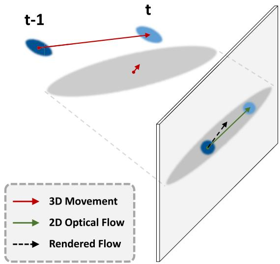  
Fig. 1. Illustration of the gap between actual 3D movement, ideal optical flow, and 2D flow rendered via α-blending. Due to a nearly static Gray Gaussian in front (closer to the imaging plane), the 2D flow produced by the renderer is perturbed and squeezed due to the effect of weighted-average along the ray. If we directly align it with optical flow, inaccurate motion (or even reversed direction under some circumstances) will be back-propagated to 3D Gaussian positions. Not only does this lead to supervision errors, but it also makes the static front Gaussian incorrectly drift during optimization.

KL-Divergence as the loss function for flow alignment:

$$
\begin{array} { l } { \displaystyle \mathcal { L } _ { f } = \mathrm { K L } ( P _ { t } ( f ) | | \hat { P } _ { t } ( f ) ) } \\ { \displaystyle = \int P _ { t } ( f ) \log P _ { t } ( f ) \mathrm { d } f - \int P _ { t } ( f ) \log \hat { P } _ { t } ( f ) \mathrm { d } f } \\ { \displaystyle = \frac { ( F _ { t } - \hat { F } _ { t } ) ^ { 2 } } { 2 \sigma _ { t } ^ { 2 } } + \frac { \log \left( \sigma _ { t } ^ { 2 } \right) } { 2 } + \frac { \log \left( 2 \pi \right) } { 2 } - H \left( P _ { t } ( f ) \right) } \\ { \displaystyle \propto \frac { ( F _ { t } - \hat { F } _ { t } ) ^ { 2 } } { 2 \sigma _ { t } ^ { 2 } } + \frac { 1 } { 2 } \log \left( \sigma _ { t } ^ { 2 } \right) . } \end{array}\tag{3}
$$

It is intended to minimize the KL-Divergence between two distributions of flow $P _ { t } ( f )$ and $\hat { P } _ { t } ( f )$ , which is finally derived to be a weighted difference between the flow prior $\mathbf { } F _ { t }$ and the prediction $\hat { F } _ { t } ^ { \mathrm { } } .$ , along with a regularizer to avoid trivial solutions. We use the normalized Gaussian contribution as mentioned in Eq. (1) in the formulation of the variance $\sigma _ { t } ^ { 2 } \mathbf { : }$

$$
1 / \sigma _ { t } ^ { 2 } = ( \varphi _ { t } / \operatorname* { m a x } _ { k } \varphi _ { k , t } ) \cdot c _ { t } ( { d } ) ,\tag{4}
$$

where $c _ { t } ( d )$ is the learnable view-dependent confidence. Overall, we expect that a Gaussian with less contribution and more uncertainty can produce a larger variance so that the flow loss term for that pixel can adaptively become lower.

2) Flow Bank for Extended Supervision: It is an intuitive idea that flow supervision can also be established within a longer temporal distance, stepping beyond merely adjacent frames as introduced in Sec. IV-A. Furthermore, for multiview videos with fine camera calibration, flow can also be used to transmit positional information from the wellfitted viewpoints to the one being optimized. Such extended flow supervision can not only alleviate the error propagation problem in the frame-by-frame iterative paradigm, but also benefit the deformation-based or hyper-dimensional paradigms by providing accurate anchor points of motion or longerterm trajectory prior, thereby mitigating visual overfitting.

Meanwhile, the exploitation of multiple flow priors for one frame can also cover some occasional errors from the flow predictor. Specifically, we maintain a flow bank to store the information of qualified images that present higher reconstruction quality (measured by PSNR) than an empirical threshold. Both their timestamps and viewpoints are recorded in the bank. During optimization, aside from the aforementioned flow loss between adjacent frames, we find other temporally and spatially nearby observations and randomly choose one of them. The according image is then paired with the current ground-truth image to online extract an extended flow prediction and guide the Gaussians’ deformation using a KL-based loss similar to Eq. (3).

3) Dynamic Awareness Applied to Other Regularizations: Aside from direct motion supervision, we also leverage the flow prior to generate a “dynamic map/mask”, thereby offering dynamic awareness to existing regularizations during optimization.

As the fundamental supervision, the pixel-level photometric (color) loss can be augmented with dynamic awareness. We first derive the normalized magnitude of a 2D flow map, forming a dense dynamic map that indicates the motion parts of an image. Then the prediction $\hat { C } _ { t }$ and ground truth $C _ { t }$ are weighted by it before the calculation of color loss. Note that for monocular scenes with camera displacements, we apply a refined version of dynamic map, which is later introduced in Sec. IV-C. By this means, the flow prior plays the role of an attention map and guides the optimizer to attach more importance to regions with larger movements. Visualizations of the dynamic map and attention regions are shown in Fig. 6. Formally, the refined color loss is given by

$$
\widetilde { \mathcal { L } } _ { c } = \big ( 1 - \lambda _ { c } \big ) \lVert C _ { t } - \hat { C } _ { t } \rVert _ { 2 } ^ { 2 } + \lambda _ { c } \lVert C _ { t } \odot D _ { t } - \hat { C } _ { t } \odot D _ { t } \rVert _ { 2 } ^ { 2 } ,\tag{5}
$$

where $D _ { t }$ is the dynamic map, and $\odot$ means Hadamard product. We use a hyperparameter $\lambda _ { c }$ to balance the dynamicaware term and the original loss, in case the flow predictor fails to produce meaningful results for tiny motions.

Furthermore, in the iterative D-3DGS [11], a physical loss ${ \mathcal { L } } _ { p }$ is applied to a local region of Gaussians to encourage their motion similarity, including local rigidity, rotation, and isometry (physically-based priors). In order not to mix up the dynamic parts with the static background, a 3D foreground mask (jointly optimized using a segmentation loss) is adopted in ${ \mathcal { L } } _ { p }$ . However, we argue that a constantly updating dynamic mask is more suitable to distinguish between static and dynamic Gaussians. The definition of “foreground” relies on 2D semantic segmentation, which is not always well aligned with dynamic regions, especially in complex real-world scenes. Besides, the unsatisfying quality of segmentation also leads to inaccurate dynamic modeling. Instead of struggling to improve the quality of segmentation maps, we turn to dynamic maps since they are free byproducts of our flow supervision. Specifically, we design a 3D dynamic mask based on the aforementioned dynamic map $D _ { t }$ . Using the procedure described in Sec. IV-A, a dense correspondence between pixel-level motion magnitude and 3D Gaussians can be established. We then combine this flow-based information from all viewpoints of the current frame and set a threshold to assign a binary dynamic label (moving or not) to each Gaussian. This derived 3D dynamic mask takes over the role of segmentation-based foreground mask in the physical loss $\mathcal { L } _ { p } .$ . In this way, we upgrade ${ \mathcal { L } } _ { p }$ to a more accurate dynamicaware version as a free byproduct of our flow supervision.

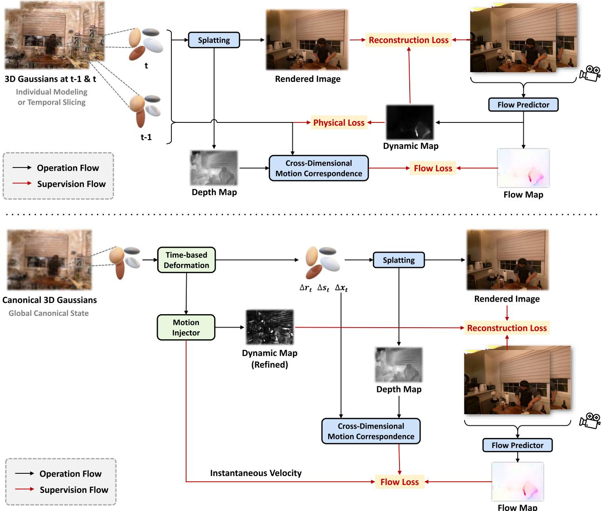  
Fig. 2. The proposed frameworks for iterative/hyper-dimensional (upper) and deformation-based (lower) dynamic 3DGS. We add motion-aware enhancement to all paradigms using the proposed cross-dimensional motion correspondence and flow augmentation strategies. Specifically for the deformation-based framework, a motion injector is employed to handle the motion ambiguities by introducing auxiliary transient information to the deformation features.

## C. Transient-Aware Deformation Auxiliary

Compared with iterative 3DGS, the deformation-based paradigm tries to solve a more difficult optimization problem where scenes at all timestamps are jointly modeled. The aforementioned flow augmentation can still be applied to it, but the performance gain is somehow minor. We attribute this to its different modeling process. In the iterative paradigm, the well-optimized scene at t − 1 can be viewed as a fixed anchor, with which the flow priors guide Gaussians to move towards a clear destination at the current time t. However, in deformation-based 3DGS, neither scenes at t − 1 and t are fixed. Without the anchor, simply optimizing the relative motion of the two has ambiguities and can hardly achieve an ideal effect. On the other hand, we found in practice that the hyper-dimensional paradigm is less vulnerable to motion ambiguity issues, although it is also optimized in a global manner. This can be explained from two aspects. First, under the guidance of flow loss, the hyper-dimensional representation is actually fitting the local spatio-temporal point trajectory (instead of pushing a point towards the target position as in the deformation-based paradigm), which may have some intrinsic robustness against anchor drift. Second and more importantly, the temporal slicing of a 4D rotation results in a time-dependent instantaneous velocity term in the 3D position of the Gaussian [15], which means the transient information is explicitly modeled there. Inspired by this, we re-exploit the flow priors and develop transient-aware auxiliary designs to enhance the deformation-based framework.

1) Motion Injector: Considering the structure of our framework for deformation-based 3DGS, we propose to explicitly inject transient information into the time-variant voxel features. A velocity field $\Theta _ { v }$ is employed to decode the position- and time-dependent feature $\mathbf { \sigma } _ { \mathbf { \sigma } _ { \mathbf { \sigma } _ { \mathbf { \lambda } } } } \mathbf { \sigma } _ { \mathbf { \sigma } _ { \mathbf { \lambda } } } \mathbf { \sigma } _ { \mathbf { \lambda } _ { \mathbf { \lambda } } } \mathbf { \sigma } _ { \mathbf { \lambda } _ { \mathbf { \lambda } } } \mathbf { \sigma } _ { \mathbf { \lambda } _ { \mathbf { \lambda } } } \mathbf { \sigma } _ { \mathbf { \lambda } _ { \mathbf { \lambda } } } \mathbf { \sigma } _ { \mathbf { \lambda } _ { \mathbf { \lambda } } } \mathbf { \sigma } _ { \mathbf { \lambda } _ { \mathbf { \lambda } } }$ of each Gaussian into a 3D instantaneous velocity ${ \mathbf { } } v _ { t }$ . Through dense correspondence searching (Sec. IV-A), ${ \mathbf { } } v _ { t }$ is then aligned with optical flow $\mathbf { \Delta } f _ { t }$ divided by the time interval ∆t (only if it belongs to a visible foreground Gaussian from the current view). To exploit time-contextual cues, the velocity field also takes features from adjacent frames as inputs and integrates them with the current frame. This alignment term is added to the flow loss $\mathcal { L } _ { f }$ proposed in Sec. IV-B as follows:

$$
\widetilde { \mathcal { L } } _ { f } = \mathcal { L } _ { f } + \sum _ { i } \mathbb { 1 } ( i ) \Vert \operatorname { P r o j } ( { \pmb v } _ { i , t } ) \Delta t - { \pmb f } _ { i , t } \Vert _ { 1 } ,\tag{6}
$$

$$
\pmb { v } _ { i , t } = \Theta _ { v } ( \pmb { g } _ { i , t } , \pmb { g } _ { i , t - 1 } , \pmb { g } _ { i , t + 1 } ) ,\tag{7}
$$

where Proj(·) is the reprojecting operation, and 1(·) is an indicator function: 1(i) = 1 iff Gaussian i is selected via foreground searching from the current view (Sec. IV-A). This motion injecting process can be considered as a proxy task whose real objective is to further refine the latent space of the deformation field. With $\widetilde { \mathcal { L } } _ { f } .$ , feature optimization no longer relies solely on the constraints over relative offsets of Gaussian centers across time. Transient motion information without ambiguity is now directly injected into the current timestamp.

2) Dynamic Map Refinement: In Sec. IV-B, we propose to use the normalized flow magnitude as a dynamic map to craft dynamic-aware reconstruction loss. Now with our motion injector, the predicted instantaneous velocity can be a perfect replacement for the ground-truth optical flow adopted there. The reason is twofold. First, velocity comes from a learnable network, which can cover some errors of the prior flow prediction and produce a refined dynamic map. Second, the deformation-based paradigm enables the modeling of monocular scenes, where optical flows between adjacent frames are affected by camera displacements. In this case, all pixels in an image will be marked as dynamic, but we only care about the motion of the scene itself. The refined dynamic map can naturally solve this problem by projecting the 3D velocity into a common camera plane.

## D. Optimization

Our motion-aware dynamic 3DGS framework is optimized in an end-to-end manner. The overall training loss for the iterative paradigm is given by

$$
\begin{array} { r } { \mathcal { L } ^ { I } = \widetilde { \mathcal { L } } _ { c } + \lambda _ { p } \widetilde { \mathcal { L } } _ { p } + \lambda _ { f } \mathcal { L } _ { f } , } \end{array}\tag{8}
$$

where the reconstruction loss $\widetilde { \mathcal { L } } _ { c }$ and physical loss ${ \widetilde { \mathcal { L } } } _ { p }$ are both equipped with dynamic awareness. Note that the segmentation loss [11] is not included since the flow-based dynamic map is proved to be more competent than foreground segmentation in practice. In the hyper-dimensional paradigm, $\widetilde { \mathcal { L } } _ { p }$ is excluded from the loss formulation:

$$
\begin{array} { r } { \mathcal { L } ^ { H } = \widetilde { \mathcal { L } } _ { c } + \lambda _ { f } \mathcal { L } _ { f } . } \end{array}\tag{9}
$$

As for the deformation-based framework, the transient-aware auxiliary introduces an upgraded version of flow loss $\boldsymbol { \widetilde { \mathcal { L } } } _ { f } .$ Given that the adopted deformation field has already ensured the similarity and smoothness between neighboring Gaussians, there is no need for the physically-based constraints anymore. Thus, the refined loss for the deformation-based paradigm is given by

$$
\begin{array} { r } { \mathcal { L } ^ { D } = \widetilde { \mathcal { L } } _ { c } + \lambda _ { f } \widetilde { \mathcal { L } } _ { f } . } \end{array}\tag{10}
$$

During the optimization of all paradigms, we adjust the weight $\lambda _ { f }$ with a schedule similar to warm-up and cosine annealing. Therefore, the flow loss takes into effect after a coarse geometry (depth) is prepared. Then as the motion modeling approaches perfection, $\lambda _ { f }$ progressively decays to account for potential errors in prior and make the model focus more on the texture details. It is noteworthy that such a weight decay strategy also brings special benefits to our motion injector. After the initial warm-up, the weight of flow loss gradually decreases and no longer dominates the relative motion of Gaussians. Instead, transient information is extracted from the feature planes and adaptively takes over to guide the deformation, thanks to previous motion injection.

## V. EXPERIMENTS

In this section, we present extensive experiments to validate the merits of our proposed motion-aware framework. First, in Sec. V-A and Sec. V-B, we give a brief introduction to the datasets, evaluation protocol, and implementation details of the experiments. In Sec. V-C, we present the performance of our model and compare it with other state-of-the-art methods. In Sec. V-D, we elaborate on the reasons why our approach enables efficient dynamic reconstruction, and then validate them by experimental analysis. Finally, in Sec. V-F, we conduct extensive ablative experiments to investigate the effectiveness of the designs in our work.

## A. Experimental Settings

Our method is evaluated on three datasets with different setups. 1) PanopticSports dataset [11], which contains sequences of human motions and object interactions (labcollected multi-view data). Since this dataset contains large motions that both deformation-based and hyper-dimensional paradigms fail to model with temporal consistent particles, we only report the iterative paradigm on it. 2) Neural 3D Video dataset [28] (Neu3DV), which includes high-resolution videos captured with synchronized fixed cameras (in-thewild multi-view data). 3) HyperNeRF dataset [4], which comprises videos ranging from 8 to 15 seconds captured by smartphones (in-the-wild monocular data). We follow [12] to evaluate the methods exclusively on scenes chickchicken, split-cookie, cut-lemon1, and vrig-3dprinter. Since the quantitative metrics on HyperNeRF dataset [4] often do not reflect visual quality due to the inaccurate camera poses of its test set [4], [13], we only include qualitative comparison on it. Note that the synthetic D-NeRF dataset [2] is not included, since its camera setup is designed to mimic a monocular setting by randomly teleporting between adjacent timestamps. Such dramatic changes in viewpoints hinder the accuracy and effectiveness of flow prior. Following previous works, we evaluate the reconstruction performance with PSNR, SSIM, and LPIPS1 [47]. In the following sections, the proposed iterative framework based on D-3DGS [11] is denoted by Ours-I; our deformation-based framework built upon 4D-GS [12] or Deformable-GS [13] is denoted by Ours-D; and the hyper-dimensional framework based on RT-4DGS [14] or Spacetime-GS [39] is denoted by Ours-H.

TABLE I  
QUANTITATIVE COMPARISON ON PANOPTICSPORTS [11]. BOLD DENOTES THE BEST PERFORMANCE, AND UNDERLINE DENOTES THE SECOND PLACE.“OURS-I” HERE REFERS TO THE PROPOSED ITERATIVE FRAMEWORK BASED ON D-3DGS [11]
<table><tr><td>Metric</td><td>Method</td><td>Juggle</td><td>Boxes</td><td>Softball</td><td>Tennis</td><td>Football</td><td>Basketball</td><td>Mean</td></tr><tr><td rowspan="3">PSNR ↑</td><td>3DGS-O [11]</td><td>28.06</td><td>28.49</td><td>28.81</td><td>28.05</td><td>28.59</td><td>26.73</td><td>28.12</td></tr><tr><td>D-3DGS [11]</td><td>29.15</td><td>28.82</td><td>28.50</td><td>28.14</td><td>28.95</td><td>27.81</td><td>28.56</td></tr><tr><td>+ Ours-I</td><td>29.55</td><td>29.60</td><td>29.54</td><td>28.19</td><td>29.71</td><td>29.60</td><td>29.37</td></tr><tr><td rowspan="3">SSIM ↑</td><td>3DGS-O [11]</td><td>0.9014</td><td>0.8957</td><td>0.8994</td><td>0.9012</td><td>0.8975</td><td>0.8846</td><td>0.8966</td></tr><tr><td>D-3DGS [11]</td><td>0.9075</td><td>0.8982</td><td>0.9027</td><td>0.9051</td><td>0.9019</td><td>0.8931</td><td>0.9014</td></tr><tr><td>+ Ours-I</td><td>0.9227</td><td>0.9106</td><td>0.9155</td><td>0.9110</td><td>0.9158</td><td>0.9177</td><td>0.9156</td></tr><tr><td rowspan="3">LPIPS ↓</td><td>3DGS-O [11]</td><td>0.1901</td><td>0.1792</td><td>0.1764</td><td>0.1886</td><td>0.1760</td><td>0.1961</td><td>0.1844</td></tr><tr><td>D-3DGS [11]</td><td>0.1844</td><td>0.1911</td><td>0.1915</td><td>0.1838</td><td>0.1907</td><td>0.1950</td><td>0.1894</td></tr><tr><td>+ Ours-I</td><td>0.1642</td><td>0.1631</td><td>0.1634</td><td>0.1627</td><td>0.1609</td><td>0.1638</td><td>0.1630</td></tr></table>

## B. Implementation Details

1) Flow Prior: We employ UniMatch [17] as our flow predictor. Given that a series of strategies are adopted to overcome potential errors from the flow ground truth, our proposed method is actually robust to different performance of flow predictors. To evaluate this, we also test the classic RAFT [16] predictor in Sec. V-F. Using a flow predictor, bidirectional optical flow is produced from sequential image pairs. For the high-resolution (1352×1014) images in Neu3DV dataset [28], we only sample 20% of the pixels for flow supervision to reduce the overhead in fetching pixel-aligned foreground Gaussians.

2) Networks: In our motion-aware enhancing strategy for deformation-based dynamic 3DGS, we introduce auxiliary modules to further handle the motion ambiguity (Sec. IV-C). Those additional structures include two different prediction heads for the instantaneous velocity (to inject transient motion information into the feature planes) and the learnable viewdependent confidence (to indicate the uncertainty in our KLbased flow loss). In the velocity head, we use a two-layer MLP with ReLU activation to transform the temporally neighboring features into the per-Gaussian 3D velocity, which is later aligned with flow prior in the motion injector. For the viewdependent confidence, we first employ a sinusoidal positional encoding as in [1] to transform the view direction into a high-dimensional embedding. Then a three-layer MLP with Sigmoid activation is adopted to predict the final confidence score from the concatenation of Gaussian features and the viewpoint embedding.

3) Training and Inference: All our experiments are conducted with a single NVIDIA RTX 3090 GPU. The additional priors and supervision inevitably add to the computational complexity of the optimization. Typically, it takes ∼101 min to train Ours-D on one multi-view scene of Neu3DV. For comparison, the baseline 4D-GS [12] takes ∼72 min, while another option of render-based flow loss needs a second rendering process with doubled time cost. Note that our flow augmentation only affects the training pipeline, so the real-time rendering of Gaussians at the inference stage remains unaffected.

## C. Comparison Results

Tab. I summarizes the performance of our iterative framework and two baselines: D-3DGS [11] (reproduced with their official code) and an online-iterative version of the original 3DGS (3DGS-O, implemented following the settings of [11]) on PanopticSports. Tab. II presents the comparison between our frameworks and other methods on Neu3DV including 4D-GS [12], RT-4DGS [14] and Spacetime-GS [39]. On these two multi-view benchmarks, our method shows significant advantage over the baselines. Equipped with our motion-aware enhancement, all the different paradigms have shown noteworthy improvements. The qualitative results on multi-view datasets are exhibited in Fig. 3. We can observe much less background noise and more precise motion in the rendered flow map. Notably, with our uncertainty-aware design, the model is not misled by intrinsic errors of the ground-truth flow as it adaptively produces more reasonable motions (e.g., left part of Fig. 3).

Monocular scenes serve as an even better testbed for our framework. Without flow priors, some motion cues can still be naturally extracted from sufficient viewpoints, but will generally fail to be noticed under a monocular setting, where the camera also has displacements. Our deformationbased framework boosts reconstruction performance by effectively introducing motion information into the paradigm, outperforming all the baselines across all the metrics. In Fig. 4, we can observe the improvement brought by our method. The motion parts are modeled well with less blur, while the static regions remain detailed. This results in clearer edges and finergrained textures of objects, producing better visual quality.

In Fig. 5, we provide more video frames produced by our method with novel camera trajectories. Additional video clips for performance showcase and comparison can be found in our supplementary material.

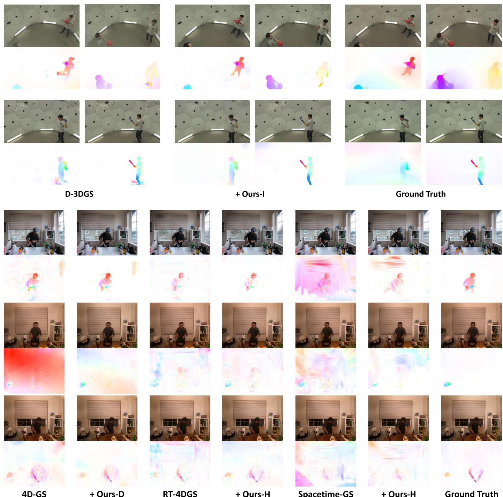  
+ Ours-H  
Ground Truth

Spacetime-GS

Fig. 3. Qualitative comparison on PanopticSports [11] (upper) and Neu3DV [28] (lower). The dense optical flow maps under the images are produced by rendering the Gaussian movements (according to the Middlebury color coding [48]). These render-based flows serve as a useful tool for qualitative visualization despite being a poor choice of supervision signal as discussed in Sec. IV-A.

## D. Study on the Efficiency of Dynamic Reconstruction

The proposed method enables efficient dynamic reconstruction for three reasons. 1) Since our flow augmentation only affects the optimizing pipeline, no extra cost is introduced in rendering. 2) Motion supervision helps produce modeling results with fewer Gaussians and less motion redundancy, especially for monocular reconstruction. 3) Our method still achieves competitive performance with sparser viewpoints for multi-view scenes. We will further interpret the last two points by providing more experimental results.

1) Reducing Redundancy for Monocular Scenes: When digging into the reconstruction results of monocular scenes, we find that the baseline method usually produces redundancy when modeling dynamic parts. The model is prone to a local optimum where many Gaussians are kept outside of the current view and then moved into the image plane at a certain timestamp. This can be validated by Fig. 7 (left) that the foreground Gaussian movements are unreasonably large compared with the image size. In this way, much more Gausssians are needed to force a per-frame dynamic fitting. However, this workaround can only model coarse object motion and significantly degrades the overall rendering quality. For comparison, equipped with our motion-aware guidance, the model learns to reuse existing Gaussians as much as possible, which presents much better dynamic modeling with cross-time correspondence. As illustrated in Fig. 7 (right) and Tab. IV, our method presents promising efficiency with less overhead when dealing with monocular scenes. Without introducing any additional Gaussian pruning strategies (aside from the opacity resetting operation of the original 3DGS [10]), our method can still keep the number of Gaussians within necessary limits and maintain their temporal consistency while achieving better performance. A small number of Gaussians also help to reduce the space and time overhead in rendering, as listed in Tab. IV.

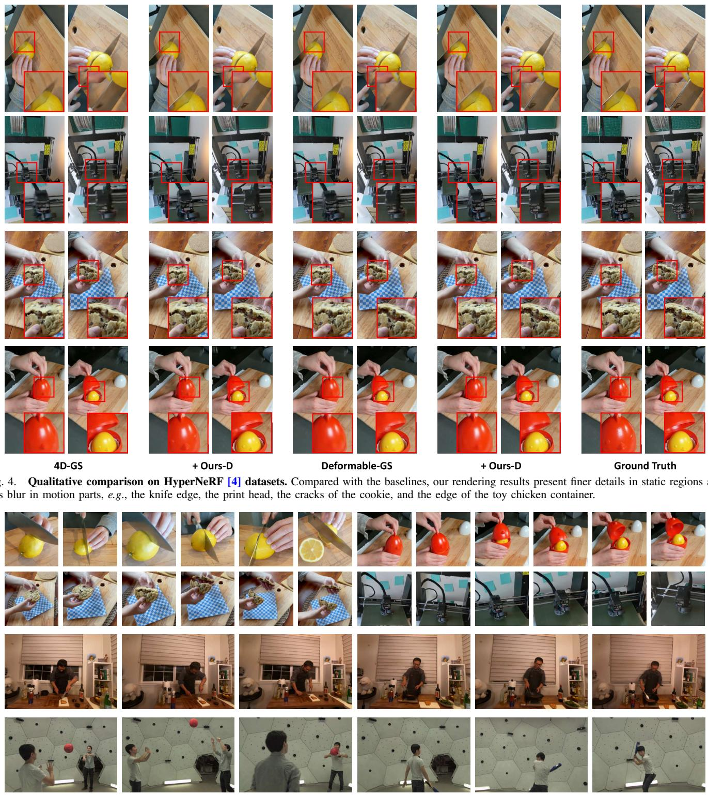  
Fig. 5. Additional rendering results of our method with novel camera trajectories on HyperNeRF [4], Neu3DV [28] and PanopticSports [11] datasets (from top to bottom). Compared with the baselines, our rendering results present less blur in motion parts and finer details in static regions.

2) Robustness under Sparser Viewpoints for Multi-View Scenes: We try to use sparser viewpoints for dynamic modeling in the two multi-view datasets. As shown in Tab. III, while the baselines suffer from significant degradation, our method can still achieve competitive performance. We also provide qualitative results in Fig. 8. It can be observed that our method produces fewer artifacts in the reconstruction results, especially when modeling dynamic regions that need motion priors to alleviate possible Gaussian drifts. This reveals the potential of our motion-aware design for sparse-view 3DGSbased dynamic reconstruction.

TABLE II  
QUANTITATIVE COMPARISON ON NEU3DV [28].ALL SIX SCENES (BOTH DAYTIME AND NIGHTTIME) ARE INCLUDED
<table><tr><td>Metric</td><td>PSNR</td><td>SSIM</td><td>LPIPS</td><td>PSNR</td><td>SSIM</td><td>LPIPS</td><td>PSNR</td><td>SSIM</td><td>LPIPS</td><td>PSNR</td><td>SSIM</td><td>LPIPS</td></tr><tr><td>Scene</td><td colspan="3">cook_spinach</td><td colspan="3">cut _roasted_beef</td><td colspan="3">sear_steak</td><td colspan="3">Mean (three scenes)</td></tr><tr><td>NeRFPlayer [29]</td><td>30.56</td><td>0.9290</td><td>0.1130</td><td>29.35</td><td>0.9080</td><td>0.1440</td><td>29.13</td><td>0.9080</td><td>0.1380</td><td>29.68</td><td>0.9150</td><td>0.1317</td></tr><tr><td>HyperReel [49]</td><td>32.30</td><td>0.9410</td><td>0.0890</td><td>32.92</td><td>0.9450</td><td>0.0840</td><td>32.57</td><td>0.9520</td><td>0.0770</td><td>32.60</td><td>0.9460</td><td>0.0833</td></tr><tr><td>4D-GS [12]</td><td>31.98</td><td>0.9385</td><td>0.0564</td><td>31.56</td><td>0.9394</td><td>0.0619</td><td>31.20</td><td>0.9486</td><td>0.0455</td><td>31.58</td><td>0.9422</td><td>0.0546</td></tr><tr><td>+ Ours-D</td><td>32.10</td><td>0.9367</td><td>0.0559</td><td>32.56</td><td>0.9414</td><td>0.0589</td><td>31.60</td><td>0.9508</td><td>0.0452</td><td>32.09</td><td>0.9430</td><td>0.0533</td></tr><tr><td>RT-4DGS [14]</td><td>32.16</td><td>0.9492</td><td>0.0533</td><td>34.04</td><td>0.9587</td><td>0.0379</td><td>33.69</td><td>0.9622</td><td>0.0352</td><td>33.30</td><td>0.9567</td><td>0.0421</td></tr><tr><td>+ Ours-H</td><td>32.36</td><td>0.9513</td><td>0.0520</td><td>34.22</td><td>0.9596</td><td>0.0357</td><td>33.76</td><td>0.9648</td><td>0.0322</td><td>33.45</td><td>0.9586</td><td>0.0400</td></tr><tr><td>Spacetime-GS [39]</td><td>32.66</td><td>0.9573</td><td>0.0343</td><td>33.12</td><td>0.9585</td><td>0.0351</td><td>33.45</td><td>0.9652</td><td>0.0299</td><td>33.07</td><td>0.9603</td><td>0.0331</td></tr><tr><td>+ Ours-H</td><td>32.81</td><td>0.9590</td><td>0.0322</td><td>33.28</td><td>0.9593</td><td>0.0335</td><td>33.60</td><td>0.9660</td><td>0.0274</td><td>33.23</td><td>0.9614</td><td>0.0310</td></tr><tr><td>Scene</td><td colspan="3">coffee_martini</td><td colspan="3">flame_salmon</td><td colspan="3">flame_steak</td><td colspan="3">Mean (six scenes)</td></tr><tr><td>NeRFPlayer [29]</td><td>31.53</td><td>0.9510</td><td>0.0850</td><td>31.65</td><td>0.9400</td><td>0.0980</td><td>31.93</td><td>0.9500</td><td>0.0880</td><td>30.69</td><td>0.9310</td><td>0.1110</td></tr><tr><td>HyperReel [49]</td><td>28.37</td><td>0.8886</td><td>0.1270</td><td>28.26</td><td>0.8820</td><td>0.1360</td><td>32.20</td><td>0.9490</td><td>0.0780</td><td>31.10</td><td>0.9263</td><td>0.0985</td></tr><tr><td>4D-GS [12]</td><td>26.27</td><td>0.8871</td><td>0.1076</td><td>25.30</td><td>0.8773</td><td>0.1224</td><td>30.46</td><td>0.9403</td><td>0.0597</td><td>29.46</td><td>0.9219</td><td>0.0756</td></tr><tr><td>+ Ours-D</td><td>26.89</td><td>0.8912</td><td>0.1008</td><td>25.67</td><td>0.8844</td><td>0.1154</td><td>30.86</td><td>0.9452</td><td>0.0526</td><td>29.95</td><td>0.9250</td><td>0.0715</td></tr><tr><td>RT-4DGS [14]</td><td>27.41</td><td>0.9110</td><td>0.0970</td><td>26.13</td><td>0.8984</td><td>0.0868</td><td>32.85</td><td>0.9566</td><td>0.0442</td><td>31.05</td><td>0.9394</td><td>0.0591</td></tr><tr><td>+ Ours-H</td><td>27.75</td><td>0.9143</td><td>0.0827</td><td>26.62</td><td>0.9056</td><td>0.0776</td><td>33.12</td><td>0.9613</td><td>0.0360</td><td>31.30</td><td>0.9428</td><td>0.0527</td></tr><tr><td>Spacetime-GS [39]</td><td>28.28</td><td>0.9164</td><td>0.0744</td><td>29.27</td><td>0.9238</td><td>0.0648</td><td>33.45</td><td>0.9652</td><td>0.0299</td><td>31.70</td><td>0.9477</td><td>0.0447</td></tr><tr><td>+ Ours-H</td><td>28.64</td><td>0.9195</td><td>0.0695</td><td>29.51</td><td>0.9256</td><td>0.0627</td><td>33.58</td><td>0.9668</td><td>0.0287</td><td>31.90</td><td>0.9494</td><td>0.0423</td></tr></table>

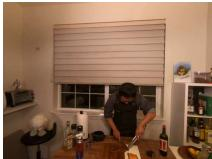  
Image

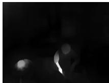  
Dynamic Map

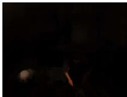  
Dynamic Attention

Flow Map  

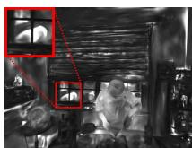

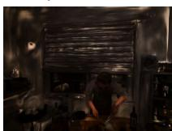  
Dynamic Map (Refined)  
Dynamic Attention (Refined)

Fig. 6. Visualization of the flow map, dynamic maps, and their resulting attention regions. The coarse dynamic map is derived directly from the flow map and shows a quite limited region of interest.  
TABLE III  
EFFECT OF SPARSER VIEWPOINTS FOR MULTI-VIEW RECONSTRUC-TION. FOR THE ITERATIVE PARADIGM (UPPER), WE CUT THE AVAILABLE VIEWS FROM 27 TO 10 FOR ALL FRAMES EXCEPT THE FIRST ONE.FOR THE DEFORMATION-BASED PARADIGM (LOWER), WE REDUCE THE NUMBER OF VIEWS FROM 19 TO 14 / 10 / 5 IN ALL FRAMES
<table><tr><td>Method</td><td>PSNR ↑</td><td>SSIM ↑</td><td>LPIPS ↓</td></tr><tr><td>D-3DGS [11] + Ours-I</td><td>24.3256 25.7227</td><td>0.8254 0.8599</td><td>0.2735 0.2223</td></tr><tr><td>4D-GS [12] (14 views)</td><td>30.5072</td><td></td><td></td></tr><tr><td>+ Ours-D</td><td>31.5064</td><td>0.9309</td><td>0.1639</td></tr><tr><td>Spacetime-GS [39] (14 views)</td><td></td><td>0.9373</td><td>0.1634</td></tr><tr><td>+ Ours-H</td><td>32.6788</td><td>0.9525</td><td>0.1374</td></tr><tr><td>4D-GS [12] (10 views)</td><td>33.0542</td><td>0.9566</td><td>0.1363</td></tr><tr><td>+ Ours-D</td><td>30.1280 30.6458</td><td>0.9268</td><td>0.1788</td></tr><tr><td>Spacetime-GS [39] (10 views)</td><td>30.7129</td><td>0.9295</td><td>0.1771</td></tr><tr><td>+ Ours-H</td><td>31.2110</td><td>0.9310</td><td>0.1620</td></tr><tr><td>4D-GS [12] (5 views)</td><td>26.4375</td><td>0.9368</td><td>0.1605</td></tr><tr><td>+ Ours-D</td><td>27.2582</td><td>0.8972</td><td>0.2236</td></tr><tr><td></td><td></td><td>0.9056</td><td>0.2179</td></tr><tr><td>Spacetime-GS [39] (5 views)</td><td>26.2964</td><td>0.8926</td><td>0.2315</td></tr><tr><td>+ Ours-H</td><td>27.5612</td><td>0.9165</td><td>0.2146</td></tr></table>

TABLE IV  
MODEL OVERHEAD COMPARISON ON HYPERNERF [4] DATASET (4D-GS [12] / OURS). BOLD DENOTES THE BETTER.“STORAGE” IS BASED ON THE SIZE OF THE EXPORTED PLY FILE, WHICH IS PROPORTIONAL TO THE NUMBER OF GAUSSIANS. OUR METHOD ACHIEVES BETTER PERFORMANCE WITH FEWER GAUSSIANS, ENABLING MORE EFFICIENT MODELING AND RENDERING
<table><tr><td>Scene</td><td># Gaussians (K)↓</td><td>Storage (MB) ↓</td><td>FPS ↑</td></tr><tr><td>chickchicken</td><td>280  /  184</td><td>65  /  43</td><td>29  /  33</td></tr><tr><td>split-cookie</td><td>253  / 179</td><td>60  /  42</td><td>30  /  34</td></tr><tr><td>cut-lemon1</td><td>248  /  220</td><td>59  /  52</td><td>30  /  32</td></tr><tr><td>vrig-3dprinter</td><td>270  /  200</td><td>64  /  47</td><td>29  / 33</td></tr></table>

## E. Point Tracking Results

The explicit 3D Gaussian representation also enables the application of point tracking. The trajectory of Gaussians over time can be projected to the image plane for visualization. Meanwhile, any pixel can be tracked based on the dense motion correspondence we established in Sec. IV-A. Quantitative results evaluated by max/mean 2D flow errors are listed in Tab. V. It can be observed that the flow errors of our approach are kept within 1.5 pixels in most cases, while D-3DGS [11] tends to produce floaters and artifacts that have errors of more than 7 pixels. In Fig. 9, we show some visual examples of tracking large motions. Compared with D-3DGS [11], our approach not only presents better visual quality, but also provides improvement in tracking with fewer outliers and better alignment with 2D optical flow. This is attributed to our effective supervision on 3D motions.

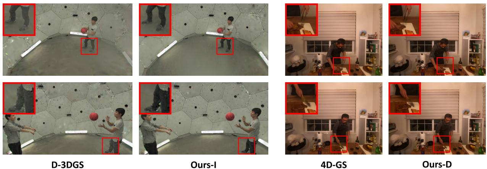

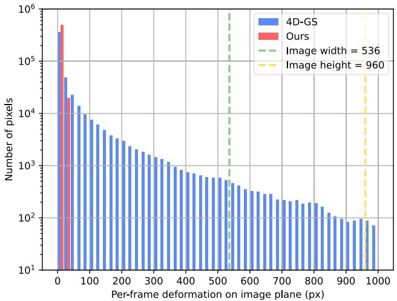

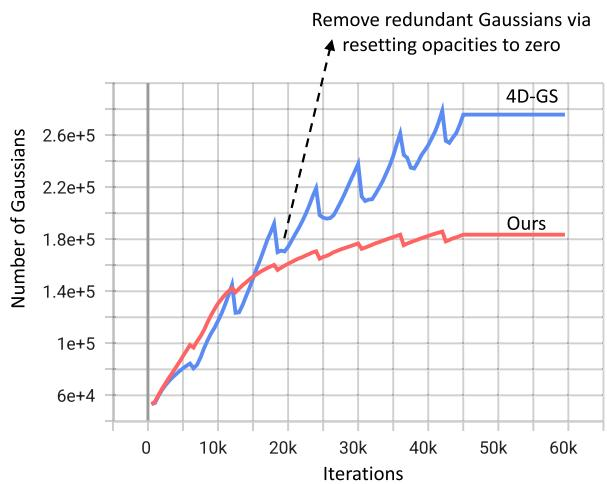  
Fig. 7. Left: histogram of the Gaussian deformation distribution between adjacent frames. The calculation of these pixel-level deformations is similar to the establishment of cross-dimensional motion correspondence we introduced in Sec. IV-A. The baseline method 4D-GS [12] tends to produce unreasonably large movements. Many foreground Gaussians even escape from the image plane. Right: the growing number of Gaussians as the training progresses. Our framework enables more efficient dynamic modeling by naturally restraining the growth of Gaussians. Both graphs are plotted with the results on the chickchicken scene of HyperNeRF dataset.

Fig. 8. Qualitative comparison on PanopticSports [11] (left) and Neu3DV dataset [28] (right) under sparser views. We exhibit zoomed-in details for all the rendering results. Our method shows robustness against insufficient viewpoints by producing fewer artifacts.  
TABLE V  
2D TRACKING EVALUATION BASED ON PIXEL-LEVEL FLOW ERROR. BOLD DENOTES THE BETTER PERFORMANCE
<table><tr><td rowspan="2">2D Tracking Error (px)</td><td colspan="2">Juggle</td><td colspan="2">Boxes</td><td colspan="2">Softball</td><td colspan="2">Tennis</td><td colspan="2">Football</td><td colspan="2">Basketball</td><td colspan="2">Mean</td></tr><tr><td>Max</td><td>Mean</td><td>Max</td><td>Mean</td><td>Max</td><td>Mean</td><td>Max</td><td>Mean</td><td>Max</td><td>Mean</td><td>Max</td><td>Mean</td><td>Max</td><td>Mean</td></tr><tr><td>D-3DGS [11]</td><td>4.6884</td><td>0.6939</td><td>5.3585</td><td>0.0811</td><td>5.4793</td><td>0.7486</td><td>15.5133</td><td>1.2845</td><td>4.7285</td><td>0.3152</td><td>8.1227</td><td>0.5486</td><td>7.3151</td><td>0.6120</td></tr><tr><td>Ours</td><td>0.5775</td><td>0.0818</td><td>1.1085</td><td>0.0315</td><td>1.0127</td><td>0.1428</td><td>3.5133</td><td>0.3656</td><td>1.0298</td><td>0.0927</td><td>1.9251</td><td>0.1350</td><td>1.5278</td><td>0.1416</td></tr></table>

## F. Ablation Study

We conduct extensive ablative experiments to validate the effectiveness of essential components adopted in our method.

1) Motion Correspondence and Flow Supervision: We compare the proposed dense correspondence searching and KL-based flow loss with the flow-rendering and a vanilla $L _ { 1 }$ loss (Tab. VI). The render-based supervision has defects as we discussed in Sec. IV-A and leads to performance degradation. Meanwhile, without uncertainty handling, the model is easily affected by errors of priors.

2) Deformation Auxiliary: For the deformation-based paradigm, our motion injector is vital, without which the model is solving an ambiguous problem and shows limited performance improvement solely with the flow supervision (Tab. VI).

3) Dynamic Awareness: It can be observed in Tab. VI that the dynamic awareness we introduce to the reconstruction loss does guide the model to focus more on the motion parts. Then our refined dynamic map further gives attention to regions needed for accuracy and covers errors in the flow prior. As demonstrated in Fig. 6, the raw flow map fails to extract motion for the reflection of the dog in the window, while our refined dynamic map keenly notices and guides the model to enhance the scene representation there.

4) Pretrained Flow Predictor: We replace the state-ofthe-art flow extractor UniMatch [17] with a classic model

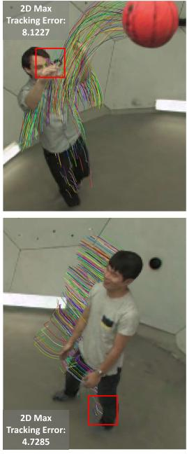  
D-3DGS

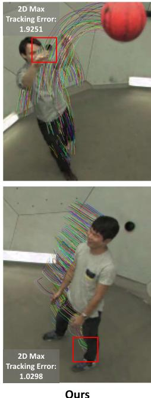  
Fig. 9. Visualization of tracking with 3D Gaussians. Lines in the figures stand for the trajectory of foreground 3D Gaussians on PanopticSports [11]. The 2D tracking errors (represented with max flow errors) are also reported.

TABLE VI  
ABLATIONS ON THE COMPONENTS OF OUR PROPOSED DEFORMATION-BASED FRAMEWORK. BOLD DENOTES THE BEST PERFORMANCE. THE MODEL IS EVALUATED ON THE SCENE CHICKCHICKEN OF HYPERNERF DATASET
<table><tr><td></td><td>PSNR ↑</td><td>SSIM ↑</td><td>LPIPS ↓</td></tr><tr><td>Baseline (4D-GS [12])</td><td>25.9856</td><td>0.7566</td><td>0.4434</td></tr><tr><td>Baseline + render-based flow loss</td><td>25.8640</td><td>0.7487</td><td>0.4552</td></tr><tr><td>Baseline  $+ ~ L _ { 1 }$  flow loss</td><td>26.4666</td><td>0.7904</td><td>0.3554</td></tr><tr><td>Ours-D w/o motion injector</td><td>26.0628</td><td>0.7749</td><td>0.4147</td></tr><tr><td>Ours-D w/o dynamic map</td><td>26.5940</td><td>0.7915</td><td>0.3479</td></tr><tr><td>Ours-D w/o dynamic refinement</td><td>26.8047</td><td>0.7977</td><td>0.3243</td></tr><tr><td>Ours-D (RAFT [16] flow)</td><td>26.8601</td><td>0.7988</td><td>0.3179</td></tr><tr><td>Ours-D (UniMatch [17] flow)</td><td>26.9181</td><td>0.8004</td><td>0.3170</td></tr></table>

TABLE VII

ABLATIONS ON THE COMPONENTS OF OUR PROPOSED ITERATIVE FRAMEWORK. BOLD DENOTES THE BEST PERFORMANCE. THE MODEL IS EVALUATED ON THE SCENE BASKETBALL OF PANOP-TICSPORTS [11]
<table><tr><td></td><td>PSNR ↑</td><td>SSIM ↑</td><td>LPIPS ↓</td></tr><tr><td>Baseline (D-3DGS [11])</td><td>28.2200</td><td>0.9100</td><td>0.1800</td></tr><tr><td>Ours-I + seg loss</td><td>28.0008</td><td>0.8905</td><td>0.2019</td></tr><tr><td>Ours-I + seg (SAM [50]) loss</td><td>28.3206</td><td>0.9104</td><td>0.1859</td></tr><tr><td>Ours-I w/o dynamic map</td><td>29.0930</td><td>0.9103</td><td>0.1697</td></tr><tr><td>Ours-I</td><td>29.6042</td><td>0.9177</td><td>0.1638</td></tr></table>

RAFT [16] that produces coarser flow maps (Tab. VI). Thanks to the proposed uncertainty-aware flow augmentation, Our method presents robustness against those errors in flow priors, with only a slight performance drop.

5) Iterative Framework: We conduct additional ablative experiments to validate the effectiveness of our design for the iterative paradigm. As illustrated in Tab. VII, the segmentation prior leads to performance degradation when working together with our flow supervision and dynamic map. When we turn to use a much stronger model SAM [50] (equipped with manually designed semantic prompts) to obtain the segmentation map, the performance gain is still minor. This indicates a potential conflict between the segmentation supervision and real dynamics. The flow prior is proved to be better at depicting fine-grained motions. And the proposed dynamic map is more competent than segmentation in helping distinguish between dynamic and static content, enabling more accurate motion constraints when applying the physical loss.

## VI. CONCLUSION AND DISCUSSION

In this paper, we propose the motion-aware 3DGS, a novel enhancement framework for efficient dynamic scene reconstruction. How to leverage motion cues from optical flow to enhance 3DGS-based modeling is a non-trivial challenge. By developing several elaborate strategies including uncertainty-aware flow augmentation and transient-aware deformation auxiliary, we provide an effective solution for three prevalent paradigms of dynamic 3DGS. Comprehensive experiments on different datasets demonstrate the superiority of our approach and its huge potential for future investigation.

Despite the merits, there is still room for improvement in this field. Since our work relies on optical flow predictions from 2D images, motion blur is an intractable obstacle in dynamic modeling. Sometimes the model is actually overfitting the blur parts and hindering the temporal consistency of Gaussians. It may be a promising avenue for future works to integrate explicit modeling of the physical process of motion blur within exposure time as in [51].

## REFERENCES

[1] B. Mildenhall, P. P. Srinivasan, M. Tancik, J. T. Barron, R. Ramamoorthi, and R. Ng, “NeRF: Representing scenes as neural radiance fields for view synthesis,” in Proc. Eur. Conf. Comput. Vis. Cham, Switzerland: Springer, Aug. 2020, pp. 405–421.

[2] A. Pumarola, E. Corona, G. Pons-Moll, and F. Moreno-Noguer, “D-NeRF: Neural radiance fields for dynamic scenes,” in Proc. IEEE/CVF Conf. Comput. Vis. Pattern Recognit. (CVPR), Jun. 2021, pp. 10318–10327.

[3] K. Park et al., “Nerfies: Deformable neural radiance fields,” in Proc. IEEE/CVF Int. Conf. Comput. Vis. (ICCV), Oct. 2021, pp. 5865–5874.

[4] K. Park et al., “HyperNeRF: A higher-dimensional representation for topologically varying neural radiance fields,” ACM Trans. Graph., vol. 40, no. 6, pp. 1–12, Dec. 2021.

[5] Z. Li, S. Niklaus, N. Snavely, and O. Wang, “Neural scene flow fields for space-time view synthesis of dynamic scenes,” in Proc. IEEE/CVF Conf. Comput. Vis. Pattern Recognit. (CVPR), Jun. 2021, pp. 6498–6508.

[6] Y. Du, Y. Zhang, H.-X. Yu, J. B. Tenenbaum, and J. Wu, “Neural radiance flow for 4D view synthesis and video processing,” in Proc. IEEE/CVF Int. Conf. Comput. Vis. (ICCV), Oct. 2021, pp. 14304–14314.

[7] B. Attal et al., “TöRF: Time-of-flight radiance fields for dynamic scene view synthesis,” in Proc. NeurIPS, vol. 34, 2021, pp. 26289–26301.

[8] A. Noguchi, X. Sun, S. Lin, and T. Harada, “Neural articulated radiance field,” in Proc. IEEE/CVF Int. Conf. Comput. Vis. (ICCV), Oct. 2021, pp. 5762–5772.

[9] A. Cao and J. Johnson, “HexPlane: A fast representation for dynamic scenes,” in Proc. IEEE/CVF Conf. Comput. Vis. Pattern Recognit (CVPR), Jun. 2023, pp. 130–141.

[10] B. Kerbl, G. Kopanas, T. Leimkuehler, and G. Drettakis, “3D Gaussian splatting for real-time radiance field rendering,” ACM Trans. Graph., vol. 42, no. 4, pp. 1–14, Aug. 2023.

[11] J. Luiten, G. Kopanas, B. Leibe, and D. Ramanan, “Dynamic 3D Gaussians: Tracking by persistent dynamic view synthesis,” in Proc. Int. Conf. 3D Vis. (3DV), Mar. 2024, pp. 800–809.

[12] G. Wu et al., “4D Gaussian splatting for real-time dynamic scene rendering,” in Proc. IEEE/CVF Conf. Comput. Vis. Pattern Recognit. (CVPR), Jun. 2024, pp. 20310–20320.

[13] Z. Yang, X. Gao, W. Zhou, S. Jiao, Y. Zhang, and X. Jin, “Deformable 3D Gaussians for high-fidelity monocular dynamic scene reconstruction,” in Proc. IEEE/CVF Conf. Comput. Vis. Pattern Recognit. (CVPR), Jun. 2024, pp. 20331–20341.

[14] Z. Yang, H. Yang, Z. Pan, and L. Zhang, “Real-time photorealistic dynamic scene representation and rendering with 4D Gaussian splatting,” in Proc. ICLR, 2024. [Online]. Available: https://openreview.net/forum?id=WhgB5sispV

[15] Y. Duan, F. Wei, Q. Dai, Y. He, W. Chen, and B. Chen, “4D-rotor Gaussian splatting: Towards efficient novel view synthesis for dynamic scenes,” in Proc. Special Interest Group Comput. Graph. Interact. Techn. Conf. Conf. Papers, Jul. 2024, pp. 1–11.

[16] Z. Teed and J. Deng, “RAFT: Recurrent all-pairs field transforms for optical flow,” in Proc. Eur. Conf. Comput. Vis. Glasgow, U.K.: Springer, Aug. 2020, pp. 402–419.

[17] H. Xu et al., “Unifying flow, stereo and depth estimation,” IEEE Trans. Pattern Anal. Mach. Intell., vol. 45, no. 11, pp. 13941–13958, Nov. 2023.

[18] K. Deng, A. Liu, J.-Y. Zhu, and D. Ramanan, “Depth-supervised NeRF: Fewer views and faster training for free,” in Proc. IEEE/CVF Conf. Comput. Vis. Pattern Recognit., Jun. 2022, pp. 12882–12891.

[19] B. Roessle, J. T. Barron, B. Mildenhall, P. P. Srinivasan, and M. Nießner, “Dense depth priors for neural radiance fields from sparse input views,” in Proc. IEEE/CVF Conf. Comput. Vis. Pattern Recognit., Jun. 2022, pp. 12892–12901.

[20] J. Chung, J. Oh, and K. M. Lee, “Depth-regularized optimization for 3D Gaussian splatting in few-shot images,” 2023, arXiv:2311.13398.

[21] Y. Yao, Z. Luo, S. Li, T. Fang, and L. Quan, “MVSNet: Depth inference for unstructured multi-view stereo,” in Proc. Eur. Conf. Comput. Vis. (ECCV), 2018, pp. 767–783.

[22] C. Li et al., “Hybrid-MVS: Robust multi-view reconstruction with hybrid optimization of visual and depth cues,” IEEE Trans. Circuits Syst. Video Technol., vol. 33, no. 12, pp. 7630–7644, Apr. 2023.

[23] H. Sun, X. Zheng, P. Ren, J. Wang, Q. Qi, and J. Liao, “SMR: Spatial-guided model-based regression for 3D hand pose and mesh reconstruction,” IEEE Trans. Circuits Syst. Video Technol., vol. 34, no. 1, pp. 299–314, Jul. 2024.

[24] A. Yu, V. Ye, M. Tancik, and A. Kanazawa, “PixelNeRF: Neural radiance fields from one or few images,” in Proc. IEEE/CVF Conf. Comput. Vis. Pattern Recognit. (CVPR), Jun. 2021, pp. 4578–4587.

[25] J. T. Barron, B. Mildenhall, M. Tancik, P. Hedman, R. Martin-Brualla, and P. P. Srinivasan, “Mip-NeRF: A multiscale representation for antialiasing neural radiance fields,” in Proc. IEEE/CVF Int. Conf. Comput. Vis. (ICCV), Oct. 2021, pp. 5855–5864.

[26] J. T. Barron, B. Mildenhall, D. Verbin, P. P. Srinivasan, and P. Hedman, “Mip-NeRF 360: Unbounded anti-aliased neural radiance fields,” in Proc. IEEE/CVF Conf. Comput. Vis. Pattern Recognit., Jun. 2022, pp. 5470–5479.

[27] S. Guo et al., “Depth-guided robust point cloud fusion NeRF for sparse input views,” IEEE Trans. Circuits Syst. for Video Technol., vol. 34, no. 9, pp. 8093–8106, Sep. 2024.

[28] T. Li et al., “Neural 3D video synthesis from multi-view video,” in Proc. IEEE/CVF Conf. Comput. Vis. Pattern Recognit., Jun. 2022, pp. 5521–5531.

[29] L. Song et al., “NeRFPlayer: A streamable dynamic scene representation with decomposed neural radiance fields,” IEEE Trans. Vis. Comput. Graphics, vol. 29, no. 5, pp. 2732–2742, May 2023.

[30] E. R. Chan et al., “Efficient geometry-aware 3D generative adversarial networks,” in Proc. IEEE/CVF Conf. Comput. Vis. Pattern Recognit. (CVPR), Jun. 2022, pp. 16123–16133.

[31] T. Müller, A. Evans, C. Schied, and A. Keller, “Instant neural graphics primitives with a multiresolution hash encoding,” ACM Trans. Graph., vol. 41, no. 4, pp. 102:1–102:15, Jul. 2022.

[32] J. Ding et al., “Ray reordering for hardware-accelerated neural volume rendering,” IEEE Trans. Circuits Syst. Video Technol., early access, Jun. 27, 2024, doi: 10.1109/TCSVT.2024.3419761.

[33] S. Fridovich-Keil, G. Meanti, F. R. Warburg, B. Recht, and A. Kanazawa, “K-planes: Explicit radiance fields in space, time, and appearance,” in Proc. IEEE/CVF Conf. Comput. Vis. Pattern Recognit. (CVPR), Jun. 2023, pp. 12479–12488.

[34] R. Shao, Z. Zheng, H. Tu, B. Liu, H. Zhang, and Y. Liu, “Tensor4D: Efficient neural 4D decomposition for high-fidelity dynamic reconstruction and rendering,” in Proc. IEEE/CVF Conf. Comput. Vis. Pattern Recognit. (CVPR), Jun. 2023, pp. 16632–16642.

[35] G. Chen and W. Wang, “A survey on 3D Gaussian splatting,” 2024, arXiv:2401.03890.

[36] R. Yunus et al., “Recent trends in 3D reconstruction of general nonrigid scenes,” Comput. Graph. Forum, vol. 43, no. 2, May 2024, Art. no. e15062.

[37] K. Katsumata, D. Minh Vo, and H. Nakayama, “A compact dynamic 3D Gaussian representation for real-time dynamic view synthesis,” 2023, arXiv:2311.12897.

[38] Y.-H. Huang, Y.-T. Sun, Z. Yang, X. Lyu, Y.-P. Cao, and X. Qi, “SC-GS: Sparse-controlled Gaussian splatting for editable dynamic scenes,” in Proc. IEEE/CVF Conf. Comput. Vis. Pattern Recognit. (CVPR), Jun. 2024, pp. 4220–4230.

[39] Z. Li, Z. Chen, Z. Li, and Y. Xu, “Spacetime Gaussian feature splatting for real-time dynamic view synthesis,” in Proc. IEEE/CVF Conf. Comput. Vis. Pattern Recognit. (CVPR), Jun. 2024, pp. 8508–8520.

[40] J. Lei, Y. Weng, A. Harley, L. Guibas, and K. Daniilidis, “MoSca: Dynamic Gaussian fusion from casual videos via 4D motion scaffolds,” 2024, arXiv:2405.17421.

[41] C. Stearns et al., “Dynamic Gaussian marbles for novel view synthesis of casual monocular videos,” 2024, arXiv:2406.18717.

[42] Q. Wang, V. Ye, H. Gao, J. Austin, Z. Li, and A. Kanazawa, “Shape of motion: 4D reconstruction from a single video,” 2024, arXiv:2407.13764.

[43] Z. Guo, W. Zhou, M. Wang, L. Li, and H. Li, “HandNeRF: Neural radiance fields for animatable interacting hands,” in Proc. IEEE/CVF Conf. Comput. Vis. Pattern Recognit. (CVPR), Jun. 2023, pp. 21078–21087.

[44] H. Xiong, S. Muttukuru, R. Upadhyay, P. Chari, and A. Kadambi, “SparseGS: Real-time 360◦ sparse view synthesis using Gaussian splatting,” 2023, arXiv:2312.00206.

[45] S. Chen et al., “Bidirectional optical flow NeRF: High accuracy and high quality under fewer views,” in Proc. AAAI Conf. Artif. Intell., 2023, vol. 37, no. 1, pp. 359–368.

[46] Y. He, C. Zhu, J. Wang, M. Savvides, and X. Zhang, “Bounding box regression with uncertainty for accurate object detection,” in Proc. IEEE/CVF Conf. Comput. Vis. Pattern Recognit. (CVPR), Jun. 2019, pp. 2888–2897.

[47] R. Zhang, P. Isola, A. A. Efros, E. Shechtman, and O. Wang, “The unreasonable effectiveness of deep features as a perceptual metric,” in Proc. IEEE/CVF Conf. Comput. Vis. Pattern Recognit., Jun. 2018, pp. 586–595.

[48] S. Baker, D. Scharstein, J. P. Lewis, S. Roth, M. J. Black, and R. Szeliski, “A database and evaluation methodology for optical flow,” Int. J. Comput. Vis., vol. 92, no. 1, pp. 1–31, Nov. 2011.

[49] B. Attal et al., “HyperReel: High-fidelity 6-DoF video with rayconditioned sampling,” in Proc. IEEE/CVF Conf. Comput. Vis. Pattern Recognit. (CVPR), Jun. 2023, pp. 16610–16620.

[50] A. Kirillov et al., “Segment anything,” in Proc. IEEE/CVF Int. Conf. Comput. Vis., Oct. 2023, pp. 4015–4026.

[51] L. Zhao, P. Wang, and P. Liu, “BAD-Gaussians: Bundle adjusted deblur Gaussian splatting,” 2024, arXiv:2403.11831.

  
Zhiyang Guo is currently pursuing the Ph.D. degree in information and communication engineering with the Department of Information Science and Technology, University of Science and Technology of China (USTC). His research interests include computer vision, 3D vision, neural rendering, and generative artificial intelligence.

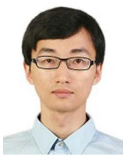

Wengang Zhou (Senior Member, IEEE) received the B.E. degree in electronic information engineering from Wuhan University in 2006 and the Ph.D. degree in electronic engineering and information science from the University of Science and Technology of China (USTC) in 2011. From September 2011 to September 2013, he was a Post-Doctoral Researcher with the Computer Science Department, The University of Texas at San Antonio. He is currently a Professor with the EEIS Department, USTC. His research interests include multimedia information

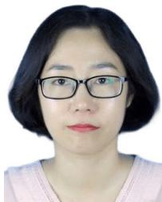

Min Wang received the B.E. and Ph.D. degrees in electronic information engineering from the University of Science and Technology of China (USTC) in 2014 and 2019, respectively. From July 2019 to 2020, she was with the Huawei Noah’s Ark Laboratory. She is currently with the Institute of Artificial Intelligence, Hefei Comprehensive National Science Center. Her current research interests include multimedia information retrieval and computer vision.

retrieval and computer vision. In those fields, he has published over 100 papers in IEEE/ACM TRANSACTIONS and CCF Tier-A international conferences. He is the winner of the National Science Funds of China (NSFC) for Excellent Young Scientists. He was a recipient of the Best Paper Award for ICIMCS 2012. He served as the Publication Chair for IEEE ICME 2021 and won the 2021 ICME Outstanding Service Award. He is also an Associate Editor and the Lead Guest Editor of IEEE TRANSACTIONS ON MULTIMEDIA.

Li Li (Member, IEEE) received the B.S. and Ph.D. degrees in electronic engineering from the University of Science and Technology of China (USTC), Hefei, Anhui, China, in 2011 and 2016, respectively. He was a Visiting Assistant Professor with the University of Missouri-Kansas City from 2016 to 2020. He joined the Department of Electronic Engineering and Information Science, USTC, as a Research Fellow, in 2020, and became a Professor, in 2022. His research interests include image/video/point cloud coding and processing. He received the Best 10% Paper Award at the 2016 IEEE Visual Communications and Image Processing (VCIP) and the 2019 IEEE International Conference on Image Processing (ICIP).

Houqiang Li (Fellow, IEEE) received the B.S., M.Eng., and Ph.D. degrees in electronic engineering from the University of Science and Technology of China, Hefei, Anhui, China, in 1992, 1997, and 2000, respectively. He is currently a Professor with the Department of Electronic Engineering and Information Science, University of Science and Technology of China. He has authored and coauthored over 200 papers in journals and conferences. His research interests include image/video coding, image/video analysis, computer vision, and reinforcement learning. He is the winner of the National Science Funds (NSFC) for Distinguished Young Scientists, the Distinguished Professor of Changjiang Scholars Program of China, and the Leading Scientist of Ten Thousand Talent Program of China. He was a recipient of the Best Paper Award for VCIP 2012, the Best Paper Award for ICIMCS 2012, and the Best Paper Award for ACM MUM in 2011. He served as the General Co-Chair for ICME 2021 and the TPC Co-Chair for VCIP 2010. He is an Associate Editor (AE) of IEEE TRANSACTIONS ON MULTIMEDIA and served as an AE for IEEE TRANSACTIONS ON CIRCUITS AND SYSTEMS FOR VIDEO TECHNOLOGY from 2010 to 2013.