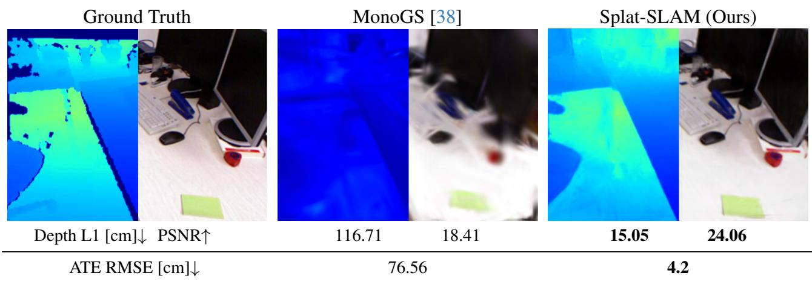
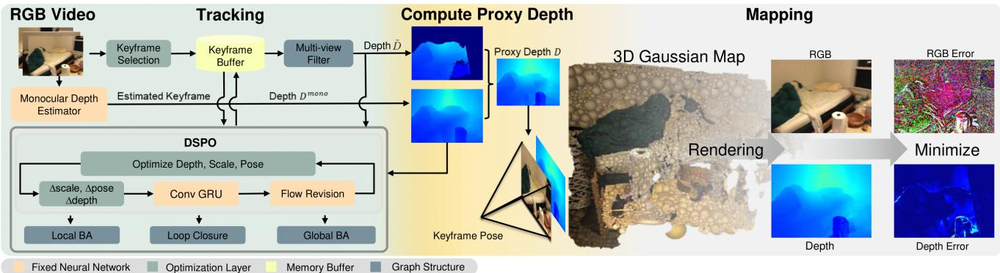
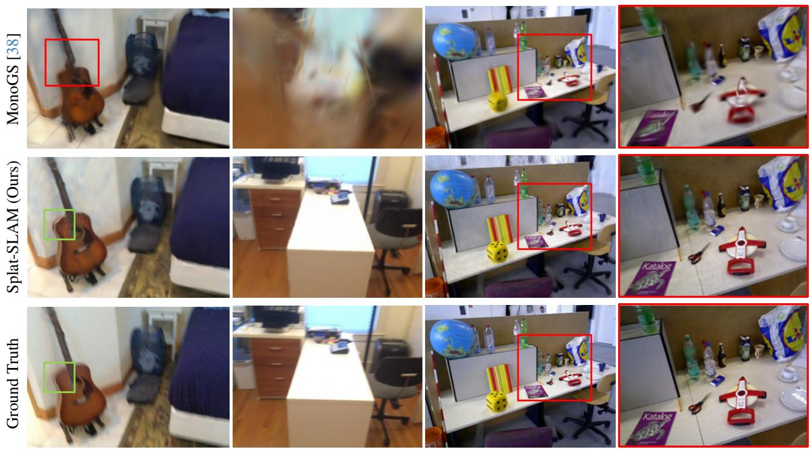
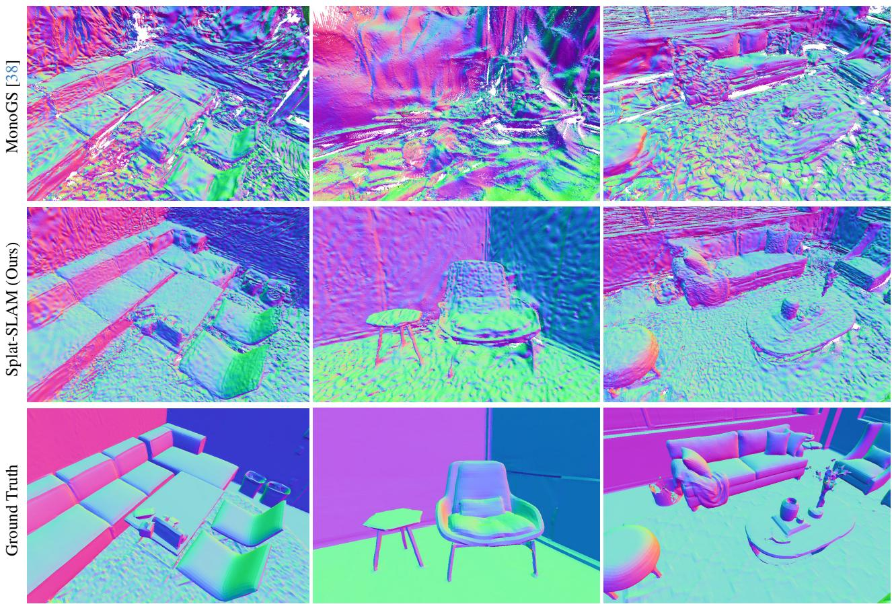
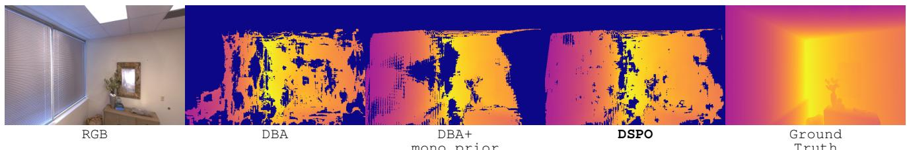

# Splat-SLAM: Globally Optimized RGB-only SLAM with 3D Gaussians

Erik Sandström1,2†\* Ganlin Zhang1\* Keisuke Tateno2 Michael Oechsle2 Michael Niemeyer2 Youmin Zhang6 Manthan Patel1 Luc Van Gool5 Martin R. Oswald4 Federico Tombari2,3 1ETH Zürich 2Google 3TU München 4University of Amsterdam 5INSAIT 6Rock Universes ∗Equal contribution †Work done while at internship at Google

  
Figure 1. Splat-SLAM. Our system yields accurate scene reconstruction (rendering depth L1), rendering (PSNR) and tracking accuracy (ATE RMSE) compared to MonoGS. The results averaged over all keyframes. The scene is from TUM-RGBD [56] fr1 room.

## Abstract

3D Gaussian Splatting offers a compact, efficient approach to RGB-only dense SLAM by providing high-quality map rendering with a dense, optimized 3D Gaussian map. Existing methods, however, often underperform in reconstruction quality compared to alternatives like neural point clouds, primarily due to limited map and pose optimization or reliance on monocular depth. We introduce thefirst RGB-only SLAM system with globally optimized tracking, dynamically adapting the Gaussian map to keyframe pose and depth updates. To address the lack of geometric priors, we incorporate so called Disparity, Scale and Pose Optimization (DSPO) for bundle adjustment, jointly optimizing pose, depth, and monocular depth scale. Our tests on Replica, TUM-RGBD, and ScanNet confirm this approach achieves superior or comparable tracking, mapping, and rendering accuracy with small map sizes andfast runtimes.

## 1. Introduction

A common factor within the recent trend of dense SLAM is that the majority of works reconstruct a dense map by optimizing a neural implicit encoding of the scene, either as weights of an MLP [1, 39, 45, 57], as features anchored in dense grids [3, 29, 42, 51, 58, 66, 67, 79, 81], using hierarchical octrees [71], via voxel hashing [8, 40, 49, 76, 77], point clouds [18, 30, 50] or axis-aligned feature planes [33, 47]. We have also seen the introduction of 3D Gaussian Splatting (3DGS) to the dense SLAM field [21, 24, 38, 69, 73].

Out of this 3D representation race there is, however, not yet a clear winner. In the context of dense SLAM, a careful modeling choice needs to be made to achieve accurate surface reconstruction as well as low tracking errors. Some takeaways can be deduced from the literature: neural implicit point cloud representations achieve state-of-the-art reconstruction accuracy [30, 50], especially with RGBD input. At the same time, 3D Gaussian splatting methods yield the highest fidelity renderings [21, 24, 38, 69, 73] and show promise in the RGB-only setting due to their flexibility in optimizing the surface location [21, 38]. However, they are not leveraging any multi-view depth or geometric prior leading to poor geometry in the RGB-only setting. The majority of the aforementioned works only deploy so called frame-to-model tracking, and do not implement global trajectory and map optimization, leading to excessive drift, especially in real world conditions. Instead, to this date, frame-to-frame tracking methods, coupled with loop closure and global bundle adjustment (BA) achieve state-of-the-art tracking accuracy [76, 77]. However, they use hierarchical feature grids [76, 77], not suitable for map deformations at e.g. loop closure as they require expensive reintegration strategies.

In this work we propose an RGB-only SLAM system that combines the strengths of frame-to-frame tracking using recurrent dense optical flow [61] with the fidelity of 3D Gaussians as the map representation [38] (see Fig. 1). The 3D Gaussian map enables online map deformations at loop closure and global BA. To enable accurate surface recon struction, we leverage consistent so called proxy depth that combines multi-view depth estimation with learned monocular depth. Our contribution comprises, for the first time, a SLAM pipeline encompassing all the following parts:

• A globally consistent frame-to-frame RGB-only tracker.

• A dense deformable 3D Gaussian map that adapts online to loop closure and global bundle adjustment.

• A novel scheme for joint Disparity, Scale and Pose Optimization (DSPO) that combines pose and geometry estimation. It refines inaccurate parts of the estimated keyframe disparity by tightly coupling a monocular depth prior into the bundle adjustment.

• Improved map sizes and runtimes compared to other dense SLAM approaches.

## 2. Related Work

Dense Visual SLAM. Curless and Levoy [9] pioneered dense online 3D mapping with truncated signed distance functions, with KinectFusion [42] demonstrating real-time SLAM via depth maps. Enhancements like voxel hashing [11, 22, 40, 43, 44] and octrees [5, 31, 37, 53, 71] improved scalability, while point-based SLAM [4, 6, 22, 25, 30, 50, 52, 68, 74] has also been effective. To address pose drift, globally consistent pose estimation and dense mapping techniques have been developed, often dividing the global map into submaps [2, 4, 7, 11, 15, 17, 22, 23, 30, 34– 36, 40, 48, 55, 59, 59]. Loop detection triggers submap deformation via pose graph optimization [4, 7, 13, 14, 16– 18, 23, 27, 30, 35, 36, 40, 40, 48, 52, 55, 59, 63, 70]. Sometimes global BA is used for refinement [4, 8, 11, 18, 40, 52, 59, 61, 70, 72]. 3D Gaussian SLAM with RGBD input has also been shown, but these methods do not consider global consistency via e.g. loop closure [24, 69, 73]. Other approaches to global consistency minimize reprojection errors directly, with DROID-SLAM [61] refining dense optical flow and camera poses iteratively, and recent enhancements like GO-SLAM [77] and HI-SLAM [76] optimizing factor graphs for accurate tracking. For a recent survey on NeRFinspired dense SLAM, see [62].

RGB-only Dense Visual SLAM. The majority of NeRF inspired RGB-only dense SLAM methods do not address the problem of global map consistency or requires expensive reintegration strategies via backpropagation [8, 19, 20, 28, 41, 46, 49, 76, 77, 80]. MonoGS [38] and Photo-SLAM [21] pioneered RGB-only SLAM with 3D Gaussians. However, they lack proxy depth which prevents them from achieving high accuracy mapping. MonoGS [38] also lacks global consistency. MoD-SLAM [78] uses an MLP to parameterize the map via a unique reparameterization.

Depth Priors for RGB-only SLAM. NICER-SLAM [80] estimates the scale and shift of a relative mono-depth estimator and supervises all pixels equally. MoD-SLAM [78] combines relative and metric mono-depth estimation, and requires additional finetuning of the metric depth. HI-SLAM [76] proposes a similar technique to ours, but regularizes all available keyframe depth pixels with the mono-depth prior. In our DSPO, we instead split the optimization and use the monocular prior to regularize the high error keyframe depth pixels while the low error keyframe depth is kept fixed to stabilize scale estimation.

## 3. Method

Splat-SLAM is a monocular SLAM system which tracks the camera pose while reconstructing the dense geometry of the scene in an online manner. This is achieved through the following steps: We first track the camera by performing local BA on selected keyframes by fitting them to dense optical flow estimates. The local BA optimizes the camera pose as well as the dense depth of the keyframe. For global consistency, when loop closure is detected, loop BA is performed on an extended graph including the loop nodes and edges (Sec. 3.1). Interleaved with tracking, mapping is done on a progressively growing 3D Gaussian map which deforms online to the keyframe poses and so called proxy depth maps (Sec. 3.2). For an overview of our method, see Fig. 2.

## 3.1. Tracking

To predict the motion of the camera during scene exploration, we use a pretrained recurrent optical flow model [60] coupled with our so called Disparity, Scale and Pose Optimization (DSPO) to jointly optimize camera poses and per pixel disparities. In the following, we describe this process in detail.

Optimization is done with the Gauss-Newton algorithm over a factor graph G(V, E), where the nodes V store the keyframe pose and disparity, and edges E store the optical flow between keyframes. Odometry keyframe edges are added to G by computing the optical flow to the last added keyframe. If the mean flow is larger than a threshold τ ∈ R, the new keyframe is added to G. Edges for loop closure and global BA are discussed later. Importantly, the same objective is optimized for local BA, loop closure and global

  
Figure 2. Splat-SLAM Architecture. Given an RGB input stream, we track and map each keyframe, initially estimating poses through local bundle adjustment (BA) using DSPO (Disparity, Scale and Pose Optimization). This DSPO integrates pose and depth estimation, enhancing depth with monocular depth. It further refines poses globally via online loop closure and global BA. The proxy depth map merges keyframe depths $\tilde { D }$ from the tracking with monocular depth $\bar { D } ^ { m o n o }$ to fill gaps. Mapping employs a deformable 3D Gaussian map, optimizing its parameters through a re-rendering loss. Notably, the 3D map adjusts for global pose and depth updates before each mapping phase.

BA, but over factor graphs with different structures.

The DSPO consists of two optimization objectives that are optimized alternatively. The first objective, typically termed Dense Bundle Adjustment (DBA) [61] optimizes the pose and disparity of the keyframes jointly, Eq. (1). Specifically, the objective is optimized over a local graph defined within a sliding window over the current frame.

$$
\underset { \omega , d } { \arg \operatorname* { m i n } } \sum _ { ( i , j ) \in E } \left\| \tilde { p } _ { i j } - K \omega _ { j } ^ { - 1 } \big ( \omega _ { i } ( 1 / d _ { i } ) K ^ { - 1 } [ p _ { i } , 1 ] ^ { T } \big ) \right\| _ { \Sigma _ { i j } } ^ { 2 }\tag{1}
$$

with $\tilde { p } _ { i j } ~ \in ~ \mathbb { R } ^ { ( W \times H \times 2 ) \times 1 }$ being the flattened predicted pixel coordinates when the pixels $p _ { i } \in \mathbb { R } ^ { ( W \times H \times \dot { 2 } ) \times 1 }$ from keyframe i are projected into keyframe $j$ using optical flow. Further, $K$ is the camera intrinsics, $\omega _ { j }$ and $\omega _ { i }$ the camerato-world extrinsics for keyframes $j$ and $i , d _ { i }$ the disparity of pixel $p _ { i }$ and $\| \cdot \| _ { \Sigma _ { i j } }$ is the Mahalanobis distance with diagonal weighting matrix $\Sigma _ { i j }$ . Each weight denotes the confidence of the optical flow prediction for each pixel in $\tilde { p } _ { i j }$ . For clarity of the presentation, we omit homogeneous coordinates.

In the second objective, we introduce monocular depth $D ^ { \mathrm { m o n o } }$ as two additional data terms, to tackle noisy disparity estimates from the DBA optimization. The monocular depth $D ^ { \mathrm { m o n o } }$ is predicted at runtime by a pretrained relative depth DPT model [12].

$$
\begin{array} { l } { { \displaystyle \arg \operatorname* { m i n } _ { d ^ { h } , \theta , \gamma } \sum _ { ( i , j ) \in E } \left\| \tilde { p } _ { i j } - K \omega _ { j } ^ { - 1 } ( \omega _ { i } ( 1 / d _ { i } ^ { h } ) K ^ { - 1 } [ p _ { i } , 1 ] ^ { T } ) \right\| _ { \Sigma _ { i j } } ^ { 2 } } } \\ { { \displaystyle ~ + \alpha _ { 1 } \sum _ { i \in V } \left\| d _ { i } ^ { h } - ( \theta _ { i } ( 1 / D _ { i } ^ { \mathrm { m o n o } } ) + \gamma _ { i } ) \right\| ^ { 2 } } } \\ { { \displaystyle ~ + \alpha _ { 2 } \sum _ { i \in V } \left\| d _ { i } ^ { l } - ( \theta _ { i } ( 1 / D _ { i } ^ { \mathrm { m o n o } } ) + \gamma _ { i } ) \right\| ^ { 2 } ~ . } } \end{array}
$$

Here, the optimizable parameters are the scales $\theta \in \mathbb { R }$ , shifts $\gamma \in \mathbb R$ and a subset of the disparities $d ^ { h }$ classified as being high error (explained later). This is done since the monocular depth is only deemed useful where the multi-view disparity $d _ { i }$ optimization is inaccurate. Furthermore, $\alpha _ { 1 } < \alpha _ { 2 }$ , which is done to ensure that the scales $\theta$ and shifts γ are optimized with the preserved low error disparities $d ^ { l }$ . The scale $\theta _ { i }$ and shift $\gamma _ { i }$ are initialized using least squares fitting

$$
\{ \theta _ { i } , \gamma _ { i } \} = \underset { \theta , \gamma } { \arg \operatorname* { m i n } } \sum _ { ( u , v ) } \left( \left( \theta ( 1 / D _ { i } ^ { \mathrm { m o n o } } ) + \gamma \right) - d _ { i } ^ { l } \right) ^ { 2 }\tag{3}
$$

Equation (1) and $\operatorname { E q . }$ (2) are optimized alternatively to avoid the scale ambiguity encountered if $d , \theta , \gamma$ and $\omega$ are optimized jointly.

Next, we describe how high and low error disparities are classified. For a given disparity map $d _ { i }$ (separated into low and high error parts $\{ d _ { i } ^ { l } , d _ { i } ^ { h } \} )$ ) for frame $i ,$ we denote the corresponding depth $\tilde { D } _ { i } = 1 / d _ { i }$ . Pixel correspondences $( u , v )$ and $( \hat { u } , \hat { v } )$ between keyframes i and $j$ respectively are established by warping $( u , v )$ into frame $j$ with depth $\tilde { D } _ { i }$ as

$$
\begin{array} { r } { p _ { i } = \omega _ { i } \tilde { D } _ { i } ( u , v ) K ^ { - 1 } [ u , v , 1 ] ^ { T } , } \\ { [ \hat { u } , \hat { v } , 1 ] ^ { T } \propto K \omega _ { j } ^ { - 1 } [ p _ { i } , 1 ] ^ { T } \ . } \end{array}\tag{4}
$$

The corresponding 3D point to $( \hat { u } , \hat { v } )$ is computed from the depth at $( \hat { u } , \hat { v } )$ as

$$
p _ { j } = { \omega _ { j } } \tilde { D } _ { j } ( \hat { u } , \hat { v } ) K ^ { - 1 } [ \hat { u } , \hat { v } , 1 ] ^ { T } \mathrm { ~ . ~ }\tag{5}
$$

If the L2 distance between $p _ { i }$ and $p _ { j }$ is smaller than a threshold, the depth $\tilde { D } _ { i } ( u , v )$ is consistent between i and $j .$ By looping over all keyframes except i, the global two-view consistency $n _ { i }$ can be computed for frame i as

$$
n _ { i } ( u , v ) = \sum _ { { k \in \mathrm { K F s } , \atop k \neq i } } \mathbb { 1 } \Big ( \left. p _ { i } - p _ { k } \right. _ { 2 } < \eta \cdot \operatorname { a v e r a g e } ( \tilde { D } _ { i } ) \Big )\tag{6}
$$

Here, $\Im ( \cdot )$ is the indicator function and $\eta \in \mathbb { R } _ { \geq 0 }$ is a hyperparameter and $n _ { i }$ is the total two-view consistency for pixel $( u , v )$ in keyframe i. $\tilde { D } _ { i } ( u , v )$ is valid if $n _ { i }$ is larger than a threshold.

Loop Closure. To mitigate scale and pose drift, we incorporate loop closure along with online global bundle adjustment (BA) in addition to local window frame tracking. Loop detection is achieved by calculating the mean optical flow magnitude between the current active keyframes (within the local window) and all previous keyframes. Two criteria are evaluated for each keyframe pair: First, the optical flow must be below a specified threshold $\tau _ { \mathrm { l o o p } } ,$ ensuring sufficient co-visibility between the views. Second, the time interval between the frames must exceed a predefined threshold $\tau _ { t }$ to prevent the introduction of redundant edges into the graph. When both criteria are met, a unidirectional edge is added to the graph. During the loop closure optimization process, only the active keyframes and their connected loop nodes are optimized to keep the computational load manageable.

Global BA. For the online global BA, a separate graph that includes all keyframes up to the present is constructed. Edges are introduced based on the temporal and spatial relationships between the keyframes, as outlined in [77]. We execute online global BA every 20 keyframes. To maintain numerical stability, the scales of the disparities and poses are normalized prior to each global BA optimization. This normalization involves calculating the average disparity ¯d across all keyframes and then adjusting the disparity to $d _ { n o r m } = d / \bar { d }$ and the pose translation to $t _ { n o r m } = \bar { d } t$

## 3.2. Deformable 3D Gaussian Scene Representation

We adopt a 3D Gaussian Splatting representation [26] which deforms under DSPO or loop closure optimizations to achieve global consistency. Thus, the scene is represented by a set $\mathcal { G } = \{ g _ { i } \} _ { i = 1 } ^ { N }$ of 3D Gaussians. Each Gaussian primitive $g _ { i } ,$ , is parameterized by a covariance matrix $\Sigma _ { i } \in \mathbb { R } ^ { 3 \times 3 }$ a mean ${ \pmb { \mu } } _ { i } \in \mathbb { R } ^ { 3 }$ , opacity $o _ { i } \in [ 0 , 1 ]$ , and color $\mathbf { c } _ { i } \in \mathbb { R } ^ { 3 }$ All attributes of each Gaussian are optimized through backpropagation. The density function of a single Gaussian is described as

$$
g _ { i } ( { \bf x } ) = \exp \Big ( - { \frac { 1 } { 2 } } ( { \bf x } - { \pmb \mu } _ { i } ) ^ { \top } \Sigma _ { i } ^ { - 1 } ( { \bf x } - { \pmb \mu } _ { i } ) \Big ) ~ .\tag{7}
$$

Here, the spatial covariance $\Sigma _ { i }$ defines an ellipsoid and is decomposed as $\Sigma _ { i } = R _ { i } S _ { i } S _ { i } ^ { T } R _ { i } ^ { T }$ , where $S _ { i } = \mathrm { d i a g } ( s _ { i } ) \in$ $\mathbb { R } ^ { 3 \times 3 }$ is the spatial scale and $R _ { i } ~ \in ~ \mathbb { R } ^ { 3 \times 3 }$ represents the rotation.

Rendering. Rendering color and depth from ${ \mathcal { G } } ,$ , given a camera pose, involves first projecting (known as “splatting”) 3D Gaussians onto the 2D image plane. This is done by projecting the covariance matrix Σ and mean $\pmb { \mu }$ as $\Sigma ^ { \prime } = J R \Sigma R ^ { T } J ^ { T }$ and $\mu ^ { \prime } = K \omega ^ { - 1 } \mu$ , where R is the rotation component of world-to-camera extrinsics $\omega ^ { - 1 }$ and J is the Jacobian of the affine approximation of the projective transformation [82]. The final pixel color $C$ and depth $D ^ { r }$ at pixel $\mathbf { x } ^ { \prime }$ is computed by blending 3D Gaussian splats that overlap at a given pixel, sorted by their depth as

$$
\begin{array} { l } { { \displaystyle { \cal C } = \sum _ { i \in { \cal N } } { \bf c } _ { i } \alpha _ { i } \prod _ { j = 1 } ^ { i - 1 } ( 1 - \alpha _ { j } ) } } \\ { { \displaystyle { \cal D } ^ { r } = \sum _ { i \in { \cal N } } \hat { d } _ { i } \alpha _ { i } \prod _ { j = 1 } ^ { i - 1 } ( 1 - \alpha _ { j } ) ~ , } } \end{array}\tag{8}
$$

where $\hat { d } _ { i }$ is the z-axis depth of the center of the i-th 3D Gaussian and the final opacity $\alpha _ { i }$ is the product of the opacity $o _ { i }$ and the 2D Gaussian density as

$$
\alpha _ { i } = o _ { i } \exp \Big ( - \frac { 1 } { 2 } ( { \bf x } ^ { \prime } - { \pmb \mu } _ { i } ^ { \prime } ) ^ { \top } \Sigma _ { i } ^ { \prime - 1 } ( { \bf x } ^ { \prime } - { \pmb \mu } _ { i } ^ { \prime } ) \Big ) ~ .\tag{9}
$$

Map Initialization. For every new keyframe, we adopt the RGBD strategy of MonoGS [38] for adding new Gaussians to the unexplored scene space. As we do not have access to a depth sensor, we construct a proxy depth map $D$ by combining the inlier multi-view depth $\tilde { D }$ and the monocular depth $D ^ { \mathrm { m o n o } }$ as

$$
D ( u , v ) = \left\{ { \begin{array} { l l } { { \tilde { D } } ( u , v ) } & { { \mathrm { i f ~ } } { \tilde { D } } ( u , v ) { \mathrm { ~ i s ~ v a l i d } } } \\ { { \theta } D ^ { \mathrm { m o n o } } ( u , v ) + \gamma } & { { \mathrm { o t h e r w i s e } } } \end{array} } \right.\tag{10}
$$

Here, $\theta$ and $\gamma$ are computed as in Eq. (3) but using depth instead of disparity.

Keyframe Selection and Optimization. Apart from the keyframe selection based on a mean optical flow threshold $\tau ,$ we additionally adopt the keyframe selection strategy from [38] to avoid mapping redundant frames.

To optimize the 3D Gaussian parameters, we batch the parameter updates to a local window similar to [38] and apply a photometric and geometric loss to the proxy depth as well as a scale regularizer to avoid artifacts from elongated Gaussians. Inspired by [38], we further use exposure compensation by optimizing an affine transformation for each keyframe. The final loss is

$$
\begin{array} { l } { \displaystyle \underset { \mathcal { G } , { \mathbf { a } } , { \mathbf { b } } } { \mathrm { m i n } } \sum _ { k \in \mathrm { K F s } } \frac { \lambda } { N _ { k } } \vert ( a _ { k } C _ { k } + b _ { k } ) - C _ { k } ^ { g t } \vert _ { 1 } } \\ { \displaystyle \quad + \frac { 1 - \lambda } { N _ { k } } \vert D _ { k } ^ { r } - D _ { k } \vert _ { 1 } + \frac { \lambda _ { r e g } } { \vert \mathcal { G } \vert } \sum _ { i } \vert s _ { i } - \tilde { s } _ { i } \vert _ { 1 } ~ , } \end{array}\tag{11}
$$

where KFs contains the set of keyframes in the local window, $N _ { k }$ is the number of pixels per keyframe, λ and $\lambda _ { r e g }$ are hyperparameters, $\mathbf { a } = \{ a _ { 1 } , \ldots , a _ { k } , \ldots \}$ and $\mathbf { b } =$ $\{ b _ { 1 } , \dotsc , b _ { k } , \dotsc \}$ are the parameters for the exposure compensation and s˜ is the mean scaling, repeated over the three dimensions.

<table><tr><td>Metric</td><td>GO-SLAM [77]</td><td>NICER-SLAM [80]</td><td>MoD-SLAM [28]</td><td>Photo-SLAM [21]</td><td>Mono-GS [38]</td><td>Q-SLAM [46]</td><td>Ours</td></tr><tr><td>PSNR ↑</td><td>22.13</td><td>25.41</td><td>27.31</td><td>33.30</td><td>31.22</td><td>32.49</td><td>36.45</td></tr><tr><td>SSIM↑</td><td>0.73</td><td>0.83</td><td>0.85</td><td>0.93</td><td>0.91</td><td>0.89</td><td>0.95</td></tr><tr><td>LPIPS↓</td><td></td><td>0.19</td><td></td><td></td><td>0.21</td><td>0.17</td><td>0.06</td></tr><tr><td>ATE RMSE↓</td><td>0.39</td><td>1.88</td><td>0.35</td><td>1.09</td><td>14.54</td><td></td><td>0.35</td></tr></table>

Table 1. Rendering and Tracking Results on Replica [54] for RGB-Methods. Our method outperforms all methods on rendering and performs on par for tracking accuracy. Results are from [62] except ours (average over 8 scenes). Best results are highlighted as first second , third .

<table><tr><td rowspan="2">Metrics</td><td rowspan="2">NeRF-SLAM DIM-SLAM GO-SLAM NICER-SLAM HI-SLAM MoD-SLAM Mono-GS Q-SLAM [62]</td><td rowspan="2">[28]</td><td rowspan="2">[77]</td><td rowspan="2">[80]</td><td rowspan="2">[76]</td><td rowspan="2">[78]</td><td rowspan="2">[38]</td><td rowspan="2">[46]</td><td rowspan="2">Ours</td></tr><tr><td></td></tr><tr><td>Render Depth L1↓</td><td>4.49</td><td></td><td></td><td></td><td></td><td></td><td>27.24</td><td>2.76</td><td>2.41</td></tr><tr><td>Accuracy ↓</td><td></td><td>4.03</td><td>3.81</td><td>3.65</td><td>3.62</td><td>2.48</td><td>30.61</td><td></td><td>2.43</td></tr><tr><td>Completion ↓</td><td></td><td>4.20</td><td>4.79</td><td>4.16</td><td>4.59</td><td></td><td>12.19</td><td></td><td>3.64</td></tr><tr><td>Comp. Rat. ↑</td><td></td><td>79.60</td><td>78.00</td><td>79.37</td><td>80.60</td><td></td><td>40.53</td><td></td><td>84.69</td></tr></table>

Table 2. Reconstruction Results on Replica [54] for RGB-Methods. Our method outperforms existing works on all metrics. Results are averaged over 8 scenes.

Map Deformation. Since our tracking framework is globally consistent, changes in the keyframe poses and proxy depth maps need to be accounted for in the 3D Gaussian map by a non-rigid deformation. Though the Gaussian means are directly optimized, one could in theory let the optimizer deform the map as refined poses and proxy depth maps are provided. We find, however, that in particular rendering is aided by actively deforming the 3D Gaussian map. We apply the deformation to all Gaussians which receive updated poses and depths before mapping.

Each Gaussian $g _ { i }$ is associated with a keyframe that anchored it to the map G. Assume that a keyframe with camerato-world pose ω and proxy depth D is updated such that $\omega  \omega ^ { \prime }$ and $D \ \to \ D ^ { \prime }$ We update the mean, scale and rotation of all Gaussians $g _ { i }$ associated with the keyframe. Association is determined by what keyframe added the Gaussian to the scene. The mean $\pmb { \mu } _ { i }$ is projected into ω to find the pixel correspondence $( u , v )$ . Since the Gaussians are not necessarily anchored on the surface, instead of re-anchoring the mean at $D ^ { \prime } .$ , we opt to shift the mean by $D ^ { \prime } ( u , v ) - D ( u , v )$ along the optical axis. We update $R _ { i }$ and $s _ { i }$ accordingly as

$$
\begin{array} { r l } & { \pmb { \mu } _ { i } ^ { \prime } = \biggr ( 1 + \frac { D ^ { \prime } ( u , v ) - D ( u , v ) } { ( \omega ^ { - 1 } \pmb { \mu _ { i } } ) _ { z } } \biggr ) \omega ^ { \prime } \omega ^ { - 1 } \pmb { \mu _ { i } } \ , } \\ & { R _ { i } ^ { \prime } = R ^ { \prime } R ^ { - 1 } R _ { i } , s _ { i } ^ { \prime } = \biggr ( 1 + \frac { D ^ { \prime } ( u , v ) - D ( u , v ) } { ( \omega ^ { - 1 } \pmb { \mu _ { i } } ) _ { z } } \biggr ) s _ { i } \ . } \end{array}\tag{2}
$$

Here, (·)z denotes the z-axis depth. For Gaussians which project into pixels with missing depth or outside the viewing frustum, we only rigidly deform them. After the final global BA optimization, we additionally deform the Gaussian map and perform a set of final refinements (see suppl. material).

## 4. Experiments

We first describe our experimental setup and then evaluate our method against state-of-the-art dense RGB and RGBD SLAM methods on Replica [54] as well as the real world TUM-RGBD [56] and the ScanNet [10] datasets. For more experiments and details, we refer to the supplementary material.

Implementation Details. For the proxy depth, we use $\eta =$ 0.01 to filter points and use the condition $n _ { c } \ge 2$ to ensure multi-view consistency. For the mapping loss function, we use $\lambda = 0 . 8 , \lambda _ { r e g } = 1 0 . 0$ . We use 60 iterations during mapping. For tracking, we use $\alpha _ { 1 } = 0 . 0 1$ and $\alpha _ { 2 } = 0 . 1$ as weights for the DSPO. We use the flow threshold $\tau = 4 . 0$ on ScanNet, $\tau = 3 . 0$ on TUM-RGBD and $\tau = 2 . 2 5$ on Replica. The threshold for loop detection is $\tau _ { \mathrm { l o o p } } = 2 5 . 0 $ . The time interval threshold is $\tau _ { t } = 2 0$ . We conducted the experiments on a cluster with an NVIDIA A100 GPU.

Evaluation Metrics. For rendering we report PSNR, SSIM [65] and LPIPS [75] on the rendered keyframe images against the sensor images. For reconstruction, we first extract the meshes with marching cubes [32] as in [50] and evaluate the meshes using accuracy [cm], completion [cm] and completion ratio [%] (threshold 5 cm) against the ground truth meshes. We also report the re-rendering depth L1 [cm] metric to the ground truth sensor depth as in [49]. We use ATE RMSE [cm] [56] to evaluate the estimated trajectory.

Datasets. We use the RGBD trajectories from [57] captured from the synthetic Replica dataset [54]. We also test on realworld data using the TUM-RGBD [56] and the ScanNet [10] datasets.

Scene 0054  
Scene 0000  
  
fr3 (zoom-in)

Figure 3. Rendering Results on ScanNet [10] and TUM-RGBD [56]. Our method yields better rendering quality MonoGS. First column: The red box shows a rendering distortion, likely from the large trajectory error. The green boxes show that our method fuses information from multiple views to avoid motion blur, present in the input. Fourth column: The rendering is from the pose of the red box in the third column.
<table><tr><td>Method</td><td>Metric</td><td>0000</td><td>0059</td><td>0106</td><td>0169</td><td>0181</td><td>0207</td><td>Avg.</td></tr><tr><td colspan="11">RGB-D Input</td></tr><tr><td rowspan="4">SplaTaM [24]</td><td>PSNR↑</td><td>19.33</td><td>19.27</td><td>17.73</td><td>21.97</td><td>16.76</td><td>19.80</td><td></td><td>19.14</td></tr><tr><td>SSIM ↑</td><td>0.66</td><td>0.79</td><td>0.69</td><td>0.78</td><td>0.68</td><td></td><td>0.70</td><td>0.72</td></tr><tr><td>LPIPS↓</td><td>0.44</td><td>0.29</td><td>0.38</td><td>0.28</td><td>0.42</td><td></td><td>0.34</td><td>0.36</td></tr><tr><td>PSNR↑</td><td>18.70</td><td>20.91</td><td>19.84</td><td>22.16</td><td>22.01</td><td>18.90</td><td></td><td>20.42</td></tr><tr><td rowspan="3">MonoGS [38]</td><td>SSIM↑</td><td>0.71</td><td>0.79</td><td>0.81</td><td>0.78</td><td>0.82</td><td>0.75</td><td></td><td>0.78</td></tr><tr><td>LPIPS↓</td><td>0.48</td><td>0.32</td><td>0.32</td><td>0.34</td><td></td><td>0.42</td><td>0.41</td><td>0.38</td></tr><tr><td>PSNR↑</td><td>28.54</td><td>26.21</td><td>26.26</td><td>28.60</td><td>27.79</td><td></td><td>28.63</td><td>27.67</td></tr><tr><td rowspan="3">Gaussian- SLAM [73]</td><td>SSIM↑</td><td>0.93</td><td>0.93</td><td>0.93</td><td>0.92</td><td></td><td>0.92</td><td>0.91</td><td>0.92</td></tr><tr><td>LPIPS↓</td><td>0.27</td><td>0.21</td><td>0.22</td><td>0.23</td><td></td><td>0.28</td><td>0.29</td><td>0.25</td></tr><tr><td></td><td></td><td></td><td></td><td></td><td></td><td></td><td></td><td></td></tr><tr><td>RGB Input GO-</td><td>PSNR↑</td><td>15.74</td><td>13.15</td><td>14.58</td><td>14.49</td><td></td><td>15.72</td><td>15.37</td><td>14.84</td></tr><tr><td rowspan="3">SLAM [77]</td><td>SSIM↑</td><td>0.42</td><td>0.32</td><td>0.46</td><td>0.42</td><td></td><td>0.53</td><td>0.39</td><td>0.42</td></tr><tr><td>LPIPS↓</td><td>0.61</td><td>0.60</td><td>0.59</td><td>0.57</td><td></td><td>0.62</td><td>0.60</td><td>0.60</td></tr><tr><td></td><td></td><td></td><td></td><td></td><td></td><td></td><td></td><td></td></tr><tr><td>MonoGS [38]</td><td>PSNR↑ SSIM↑</td><td>16.91</td><td>19.15</td><td>18.57</td><td></td><td>20.21</td><td>19.51</td><td>18.37</td><td>18.79</td></tr><tr><td rowspan="3"></td><td></td><td>0.62</td><td>0.69</td><td>0.74</td><td></td><td>0.74</td><td>0.75</td><td>0.70</td><td>0.71</td></tr><tr><td>LPIPS↓</td><td>0.70</td><td>0.51</td><td>0.55</td><td></td><td>0.54</td><td>0.63</td><td>0.58</td><td>0.59</td></tr><tr><td>PSNR↑</td><td></td><td></td><td>27.70</td><td>31.14</td><td></td><td></td><td></td><td></td></tr><tr><td rowspan="3">Ours</td><td></td><td>28.68</td><td>27.69</td><td></td><td></td><td></td><td>31.15</td><td>30.49</td><td>29.48</td></tr><tr><td>SSIM↑</td><td>0.83</td><td>0.87</td><td>0.86</td><td></td><td>0.87</td><td>0.84</td><td>0.84</td><td>0.85</td></tr><tr><td>LPIPS↓</td><td>0.19</td><td>0.15</td><td>0.18</td><td>0.15</td><td></td><td>0.23</td><td>0.19</td><td>0.18</td></tr></table>

Table 3. Rendering Performance on ScanNet [10]. Our method performs even better or on par with all RGB-D methods. We take the numbers for SplaTaM and Gaussian-SLAM from [73].

Baseline Methods. We compare our method to numerous works on dense RGB and RGBD SLAM. The main baseline is MonoGS [38].

<table><tr><td>Method</td><td>Method</td><td>f1/desk f2/xyz f3/off f1/desk2 f1/room Avg.</td><td></td><td></td><td></td><td></td><td></td></tr><tr><td colspan="8">RGB-D Input</td></tr><tr><td rowspan="2">SplaTaM [24]</td><td>PSNR↑</td><td>22.00</td><td>24.50</td><td>21.90</td><td></td><td></td><td></td></tr><tr><td>SSIM ↑</td><td>0.86</td><td>0.95</td><td>0.88</td><td></td><td></td><td></td></tr><tr><td rowspan="2">Gaussian-</td><td>LPIPS</td><td>0.23</td><td>0.10</td><td>0.20</td><td></td><td></td><td></td></tr><tr><td>PSNR↑</td><td>24.01</td><td>25.02</td><td>26.13</td><td>23.15</td><td>22.98</td><td>24.26</td></tr><tr><td rowspan="2">SLAM [73]</td><td>SSIM↑ LPIPS ↓</td><td>0.92 0.18</td><td>0.92 0.19</td><td>0.94 0.14</td><td>0.91 0.20</td><td>0.89 0.24</td><td>0.92 0.19</td></tr><tr><td></td><td></td><td></td><td></td><td></td><td></td><td></td></tr><tr><td colspan="8">RGB Input</td></tr><tr><td rowspan="2">Photo-</td><td>PSNR↑</td><td>20.97</td><td>21.07</td><td>19.59</td><td></td><td></td><td></td></tr><tr><td>SSIM↑</td><td>0.74</td><td>0.73</td><td>0.69</td><td></td><td></td><td></td></tr><tr><td rowspan="2">SLAM [21]</td><td>LPIPS↓</td><td>0.23</td><td>0.17</td><td>0.24</td><td></td><td></td><td></td></tr><tr><td>PSNR↑</td><td>19.67</td><td>16.17</td><td>20.63</td><td>19.16</td><td>18.41</td><td></td></tr><tr><td rowspan="2">MonoGS [38]</td><td>SSIM↑</td><td>0.73</td><td>0.72</td><td>0.77</td><td>0.66</td><td>0.64</td><td>18.81 0.70</td></tr><tr><td>LPIPS↓</td><td>0.33</td><td>0.31</td><td>0.34</td><td>0.48</td><td>0.51</td><td>0.39</td></tr><tr><td rowspan="3">Ours</td><td></td><td></td><td></td><td></td><td></td><td></td><td></td></tr><tr><td>PSNR↑</td><td>25.61</td><td>29.53</td><td>26.05 0.84</td><td>23.98 0.81</td><td>24.06</td><td>25.85</td></tr><tr><td>SSIM↑ LPIPS</td><td>0.84 0.18</td><td>0.90 0.08</td><td>0.20</td><td>0.23</td><td>0.80 0.24</td><td>0.84 0.19</td></tr></table>

Table 4. Rendering Performance on TUM-RGBD [56]. Our method performs competitively or better than RGB-D methods. For all RGB-D methods, we take the numbers from [73].

Rendering. In Tab. 1, we evaluate the rendering performance on Replica [54] and find that our method performs superior among all baseline RGB-methods. Table 3 and Table 4 show the rendering accuracy on the ScanNet [10] and TUM-RGBD [56] datasets. In particular, we outperform existing RGB-only works with a clear margin, while even beating the currently best RGBD method, Gaussian-SLAM [73] on most metrics, despite the fact that we do not implement viewdependent rendering in the form of spherical harmonics. We attribute this to our deformable 3D Gaussian map, optimized with strong proxy depth along a globally consistent tracking backend. In Fig. 3 and Fig. 1 we show renderings on the real-world ScanNet [10] and TUM-RGBD [56] datasets. Due to high tracking errors, MonoGS [38] performs poorly on some scenes, yet fails to achieve the same fidelity as our method when the tracking error is low, as a result of the weak geometric constraints during optimization.

  
Office 0  
Office 4  
Room 0

Figure 4. Reconstruction Results on Replica [54] on Normal Shaded Meshes. Our method achieves higher geometric accuracy compared to existing works. MonoGS suffers significantly from a lack of proxy depth, despite multiview optimization.
<table><tr><td>Method</td><td>00</td><td>59</td><td>106</td><td>169</td><td>181</td><td>207</td><td>Avg.-6</td><td>54</td><td>233</td><td>Avg.-8</td></tr><tr><td>RGB-D Input</td><td></td><td></td><td></td><td></td><td></td><td></td><td></td><td></td><td></td><td></td></tr><tr><td>NICE-SLAM [79]</td><td>12.0</td><td>14.0</td><td>7.9</td><td>10.9</td><td>13.4</td><td>6.2</td><td>10.7</td><td>20.9</td><td>9.0</td><td>11.8</td></tr><tr><td>Co-SLAM [64]</td><td>7.1</td><td>11.1</td><td>9.4</td><td>5.9</td><td>11.8</td><td>7.1</td><td>8.7</td><td></td><td>一</td><td></td></tr><tr><td>ESLAM [33]</td><td>7.3</td><td>8.5</td><td>7.5</td><td>6.5</td><td>9.0</td><td>5.7</td><td>7.4</td><td>36.3</td><td>4.3</td><td>10.6</td></tr><tr><td>MonoGS[38]</td><td>16.1</td><td>6.4</td><td>8.1</td><td>8.7</td><td>26.4</td><td>9.2</td><td>12.5</td><td>20.6</td><td>13.1</td><td>13.6</td></tr><tr><td>RGB Input</td><td></td><td></td><td></td><td></td><td></td><td></td><td></td><td></td><td></td><td></td></tr><tr><td>MonoGS[38]</td><td>149.2 96.8</td><td></td><td>155.5</td><td>140.3</td><td>92.6</td><td>101.9</td><td>122.7</td><td>206.4 89.1</td><td></td><td>129.0</td></tr><tr><td>GO-SLAM [77]</td><td>5.9</td><td>8.3</td><td>8.1</td><td>8.4</td><td>8.3</td><td>6.9</td><td>7.7</td><td>13.3</td><td>5.3</td><td>8.1</td></tr><tr><td>HI-SLAM[76]</td><td>6.4</td><td>7.2</td><td>6.5</td><td>8.5</td><td>7.6</td><td>8.4</td><td>7.4</td><td></td><td>一</td><td></td></tr><tr><td>Q-SLAM[46]</td><td>5.8</td><td>8.5</td><td>8.4</td><td>8.7</td><td>8.8</td><td>-</td><td>=</td><td>12.6</td><td>5.3</td><td>1</td></tr><tr><td>Ours</td><td>5.5</td><td>9.1</td><td>7.0</td><td>8.2</td><td>8.3</td><td>7.5</td><td>7.6</td><td>9.4</td><td>5.1</td><td>7.5</td></tr></table>

Table 5. Tracking Accuracy on ScanNet [10] Our method performs on average competitively with HI-SLAM and better than all other methods. Results for the RGB-D methods are from [30].

<table><tr><td rowspan=1 colspan=8>Method        f1/dsk f2/xyz f3/off Avg.-3 f1/dsk2 f1/rm Avg.-5RGB-D Input</td></tr><tr><td rowspan=3 colspan=2>SplaTAM [24]     3.4GS-SLAM [69]    1.5GO-SLAM [77]    1.5</td><td rowspan=1 colspan=2>1.2    5.2</td><td rowspan=1 colspan=1>3.3</td><td rowspan=1 colspan=1>6.5</td><td rowspan=1 colspan=1>11.1</td><td rowspan=1 colspan=1>5.5</td></tr><tr><td rowspan=1 colspan=1>1.6</td><td rowspan=1 colspan=1>1.7</td><td rowspan=1 colspan=1>1.6</td><td rowspan=1 colspan=1>-</td><td rowspan=1 colspan=1></td><td rowspan=1 colspan=1></td></tr><tr><td rowspan=1 colspan=1>0.6</td><td rowspan=1 colspan=1>1.3</td><td rowspan=1 colspan=1>1.1</td><td rowspan=1 colspan=1></td><td rowspan=1 colspan=1>4.7</td><td rowspan=1 colspan=1></td></tr><tr><td rowspan=1 colspan=2>MonoGS [38]     1.4</td><td rowspan=1 colspan=1>1.4</td><td rowspan=1 colspan=1>1.5</td><td rowspan=1 colspan=1>1.5</td><td rowspan=1 colspan=1>5.1</td><td rowspan=1 colspan=1>6.3</td><td rowspan=1 colspan=1>3.1</td></tr><tr><td rowspan=1 colspan=4>RGB Input</td><td rowspan=1 colspan=1></td><td rowspan=1 colspan=1></td><td rowspan=1 colspan=1></td><td rowspan=1 colspan=1></td></tr><tr><td rowspan=1 colspan=1>MonoGS [38]</td><td rowspan=1 colspan=1>3.8</td><td rowspan=1 colspan=1>5.2</td><td rowspan=1 colspan=1>2.9</td><td rowspan=1 colspan=1>4.0</td><td rowspan=1 colspan=1>75.7</td><td rowspan=1 colspan=1>76.6</td><td rowspan=1 colspan=1>32.8</td></tr><tr><td rowspan=1 colspan=1>Photo-SLAM [21]</td><td rowspan=1 colspan=1>1.5</td><td rowspan=1 colspan=1>1.0</td><td rowspan=1 colspan=1>1.3</td><td rowspan=1 colspan=1>1.3</td><td rowspan=1 colspan=1></td><td rowspan=1 colspan=1></td><td rowspan=1 colspan=1></td></tr><tr><td rowspan=1 colspan=1>DIM-SLAM [28]</td><td rowspan=1 colspan=1>2.0</td><td rowspan=1 colspan=1>0.6</td><td rowspan=1 colspan=1>2.3</td><td rowspan=1 colspan=1>1.6</td><td rowspan=1 colspan=1></td><td rowspan=1 colspan=1></td><td rowspan=1 colspan=1></td></tr><tr><td rowspan=1 colspan=1>GO-SLAM [77]</td><td rowspan=1 colspan=1>1.6</td><td rowspan=1 colspan=1>0.6</td><td rowspan=1 colspan=1>1.5</td><td rowspan=1 colspan=1>1.2</td><td rowspan=1 colspan=1>2.8</td><td rowspan=1 colspan=1>5.2</td><td rowspan=1 colspan=1>2.3</td></tr><tr><td rowspan=1 colspan=1>MoD-SLAM [78]</td><td rowspan=1 colspan=1>1.5</td><td rowspan=1 colspan=1>0.7</td><td rowspan=1 colspan=1>1.1</td><td rowspan=1 colspan=1>1.1</td><td rowspan=1 colspan=1>-</td><td rowspan=1 colspan=1></td><td rowspan=1 colspan=1></td></tr><tr><td rowspan=1 colspan=1>Q-SLAM [46]</td><td rowspan=1 colspan=1>1.3</td><td rowspan=1 colspan=1>0.9</td><td rowspan=1 colspan=1></td><td rowspan=1 colspan=1></td><td rowspan=1 colspan=1>2.3</td><td rowspan=1 colspan=1>4.9</td><td rowspan=1 colspan=1></td></tr><tr><td rowspan=1 colspan=1>Ours</td><td rowspan=1 colspan=1>1.6</td><td rowspan=1 colspan=1>0.2</td><td rowspan=1 colspan=1>1.4</td><td rowspan=1 colspan=1>1.1</td><td rowspan=1 colspan=1>2.8</td><td rowspan=1 colspan=1>4.2</td><td rowspan=1 colspan=1>2.1</td></tr></table>

Table 6. Tracking Accuracy on TUM-RGBD [56]. Our method performs even better than RGB-D methods.

Reconstruction. We show quantitative and qualitative results on the Replica [54] dataset in Tab. 2 and Fig. 4 respectively. Our method achieves the best performance on all metrics. Qualitatively, we show normal shaded meshes from different viewpoints. Our method can reconstruct finer details than existing works, especially around thin structures (e.g. second row), where our strong proxy depth coupled with the 3D Gaussian map representation yields superior depth rendering, which directly influences the mesh quality. MonoGS [38] suffers significantly from the lack of proxy depth, visible in all scenes. Figure 1 shows depth rendering on the real-world TUM-RGBD [56] room scene. We compute the average depth L1 error over all keyframes, achieving 15.05 cm, beating existing works.

  
Figure 5. Comparison of Estimated Depth. We show the depth output D˜ from the tracker. The pixels which are invalid (high error) are colored dark blue. DBA is the method that Droid-SLAM [61] uses. The DBA+mono prior strategy is used in HI-SLAM [76], i.e. the mono prior supervises all pixels directly. It is clear that our formulation (DSPO) provides the most consistent keyframe depth.

<table><tr><td>Mono Depth</td><td>Multiview Depth</td><td>Multiview Filtering</td><td>PSNR [dB]↑</td><td>Acc. [cm]↓</td><td>Comp. [cm]↓</td><td>Comp. Ratio [cm]↑</td></tr><tr><td>L</td><td>X</td><td>x</td><td>36.02</td><td>3.62</td><td>4.08</td><td>81.16</td></tr><tr><td>x</td><td>√</td><td>√</td><td>36.17</td><td>2.64</td><td>4.73</td><td>80.12</td></tr><tr><td>x</td><td>√</td><td>X</td><td>36.21</td><td>18.71</td><td>4.06</td><td>80.29</td></tr><tr><td>√</td><td>V</td><td>√</td><td>36.45</td><td>2.43</td><td>3.64</td><td>84.69</td></tr></table>

Table 7. Ablation Study on Replica [54]. We show that the combination of filtered multiview depth completed with monocular depth yields the best performance on all metrics. Mono Depth refers to Dmono, Multiview Depth refers to D˜ and Multiview Filtering means enabling Eq. (6). All results are averaged over 8 scenes.

Tracking. In Tab. 1, Tab. 5 and Tab. 6, we report the tracking accuracy of the estimated trajectory on Replica [54], Scan-Net [10] and TUM-RGBD [56]. On all datasets, our method shows competitive results in every single scene and gives the best average value among the RGB and RGB-D methods.

Ablation Study. In Tab. 7, we conduct a set of ablation studies, by enabling and disabling certain parts. We find that the combination of filtered multiview depth completed with monocular depth yields the best performance in terms of rendering and reconstruction metrics.

In Fig. 5, we show the benefit of the DSPO on the the valid estimated depth maps D˜ , yielding more consistent depth estimation.

Memory and Runtime. In Tab. 8, we evaluate the peak GPU memory usage, map size and runtime of our method. We achieve a comparable GPU memory usage with GO-SLAM [77] and SplaTaM [24]. Our map size is similar to MonoGS [38]. Regarding runtime, we are faster than SplaTaM and comparable to MonoGS. GO-SLAM has the fastest runtime, but as shown in Tab. 1 and Tab. 2, it sacrifices rendering and reconstruction quality for speed.

<table><tr><td></td><td>GO- SLAM [77]</td><td>SplaTAM [24]</td><td>MonoGS [38]</td><td>Ours</td></tr><tr><td>GPU Usage [GiB]</td><td>18.50</td><td>18.54</td><td>14.62</td><td>17.57</td></tr><tr><td>Map Size [MB]</td><td></td><td></td><td>6.8</td><td>6.5</td></tr><tr><td>Avg. FPS</td><td>8.36</td><td>0.14</td><td>0.32</td><td>1.24</td></tr></table>

Table 8. Memory and Running Time Evaluation on Replica [54] room0. Our peak memory usage and runtime are comparable to existing works. We take the numbers from [62] except for ours and MonoGS and we add the Map Size, which denotes the size of the final 3D representation. GPU Usage denotes the peak usage during runtime. All methods are evaluated on an NVIDIA RTX 3090 GPU using single threading for fairness.

Limitations. We currently do not model the appearance with spherical harmonics, since it only yields a marginal gains in rendering accuracy, while requiring more memory. It is is straightforward to add. We only make use of globally optimized frame-to-frame tracking, which fails to leverage frame-to-model queues from the 3D Gaussian map. Another limitation is that our construction of the final proxy depth D is quite simple and does not fuse the monocular and keyframe depths in an informed manner, e.g. using normal consistency. Finally, as future work, it is interesting to study how surface regularization can be enforced via e.g. quadric surface elements as in [46].

## 5. Conclusion

We proposed Splat-SLAM, a dense RGB-only SLAM system which uses a deformable 3D Gaussian map for mapping and globally optimized frame-to-frame tracking via optical flow. Importantly, the inclusion of monocular depth into the tracking loop, to refine the scale and to correct the erroneous keyframe depth predictions, leads to better rendering and mapping. By using the monocular depth for completion, mapping is further improved. Our experiments demonstrate that Splat-SLAM outperforms existing solutions regarding reconstruction and rendering accuracy while being on par or better with respect to tracking as well as runtime and memory usage.

## References

[1] Dejan Azinovic, Ricardo Martin-Brualla, Dan B Goldman,´ Matthias Nießner, and Justus Thies. Neural rgb-d surface reconstruction. In IEEE/CVF Conference on Computer Vision and Pattern Recognition, pages 6290–6301, 2022. 1

[2] Michael Bosse, Paul Newman, John Leonard, Martin Soika, Wendelin Feiten, and Seth Teller. An atlas framework for scalable mapping. In 2003 IEEE International Conference on Robotics and Automation (Cat. No. 03CH37422), pages 1899–1906. IEEE, 2003. 2

[3] Aljaž Božic, Pablo Palafox, Justus Thies, Angela Dai,ˇ and Matthias Nießner. Transformerfusion: Monocular rgb scene reconstruction using transformers. arXiv preprint arXiv:2107.02191, 2021. 1

[4] Yan-Pei Cao, Leif Kobbelt, and Shi-Min Hu. Real-time highaccuracy three-dimensional reconstruction with consumer rgb-d cameras. ACM Transactions on Graphics (TOG), 37(5): 1–16, 2018. 2

[5] Jiawen Chen, Dennis Bautembach, and Shahram Izadi. Scalable real-time volumetric surface reconstruction. ACM Transactions on Graphics (ToG), 32(4):1–16, 2013. 2

[6] Hae Min Cho, HyungGi Jo, and Euntai Kim. Sp-slam: Surfelpoint simultaneous localization and mapping. IEEE/ASME Transactions on Mechatronics, 27(5):2568–2579, 2021. 2

[7] Sungjoon Choi, Qian-Yi Zhou, and Vladlen Koltun. Robust reconstruction of indoor scenes. In IEEE Conference on Computer Vision and Pattern Recognition, pages 5556–5565, 2015. 2

[8] Chi-Ming Chung, Yang-Che Tseng, Ya-Ching Hsu, Xiang-Qian Shi, Yun-Hung Hua, Jia-Fong Yeh, Wen-Chin Chen, Yi-Ting Chen, and Winston H Hsu. Orbeez-slam: A real-time monocular visual slam with orb features and nerf-realized mapping. arXiv preprint arXiv:2209.13274, 2022. 1, 2

[9] Brian Curless and Marc Levoy. Volumetric method for building complex models from range images. In SIGGRAPH Conference on Computer Graphics. ACM, 1996. 2

[10] Angela Dai, Angel X. Chang, Manolis Savva, Maciej Halber, Thomas Funkhouser, and Matthias Nießner. ScanNet: Richly-annotated 3D reconstructions of indoor scenes. In Conference on Computer Vision and Pattern Recognition (CVPR). IEEE/CVF, 2017. 5, 6, 7, 8

[11] Angela Dai, Matthias Nießner, Michael Zollhöfer, Shahram Izadi, and Christian Theobalt. Bundlefusion: Real-time globally consistent 3d reconstruction using on-the-fly surface reintegration. ACM Transactions on Graphics (ToG), 36(4):1, 2017. 2

[12] Ainaz Eftekhar, Alexander Sax, Jitendra Malik, and Amir Zamir. Omnidata: A scalable pipeline for making multi-task mid-level vision datasets from 3d scans. In Proceedings of the IEEE/CVF International Conference on Computer Vision, pages 10786–10796, 2021. 3

[13] Felix Endres, Jürgen Hess, Nikolas Engelhard, Jürgen Sturm, Daniel Cremers, and Wolfram Burgard. An evaluation of the rgb-d slam system. In 2012 IEEE international conference on robotics and automation, pages 1691–1696. IEEE, 2012. 2

[14] Jakob Engel, Thomas Schöps, and Daniel Cremers. Lsd-slam:

Large-scale direct monocular slam. In European conference on computer vision, pages 834–849. Springer, 2014. 2

[15] Nicola Fioraio, Jonathan Taylor, Andrew Fitzgibbon, Luigi Di Stefano, and Shahram Izadi. Large-scale and drift-free surface reconstruction using online subvolume registration. In Proceedings of the IEEE Conference on Computer Vision and Pattern Recognition, pages 4475–4483, 2015. 2

[16] Peter Henry, Michael Krainin, Evan Herbst, Xiaofeng Ren, and Dieter Fox. Rgb-d mapping: Using kinect-style depth cameras for dense 3d modeling of indoor environments. The internationaljournal ofRobotics Research, 31(5):647–663, 2012. 2

[17] Peter Henry, Dieter Fox, Achintya Bhowmik, and Rajiv Mongia. Patch volumes: Segmentation-based consistent mapping with rgb-d cameras. In 2013 International Conference on 3D Vision-3DV 2013, pages 398–405. IEEE, 2013. 2

[18] Jiarui Hu, Mao Mao, Hujun Bao, Guofeng Zhang, and Zhaopeng Cui. CP-SLAM: Collaborative neural point-based SLAM system. In Thirty-seventh Conference on Neural Information Processing Systems, 2023. 1, 2

[19] Tongyan Hua, Haotian Bai, Zidong Cao, and Lin Wang. Fmapping: Factorized efficient neural field mapping for real-time dense rgb slam. arXiv preprint arXiv:2306.00579, 2023. 2

[20] Tongyan Hua, Haotian Bai, Zidong Cao, Ming Liu, Dacheng Tao, and Lin Wang. Hi-map: Hierarchical factorized radiance field for high-fidelity monocular dense mapping. arXiv preprint arXiv:2401.03203, 2024. 2

[21] Huajian Huang, Longwei Li, Hui Cheng, and Sai-Kit Yeung. Photo-slam: Real-time simultaneous localization and photorealistic mapping for monocular, stereo, and rgb-d cameras. arXiv preprint arXiv:2311.16728, 2023. 1, 2, 5, 6, 7

[22] Olaf Kähler, Victor Adrian Prisacariu, Carl Yuheng Ren, Xin Sun, Philip H. S. Torr, and David William Murray. Very high frame rate volumetric integration of depth images on mobile devices. IEEE Trans. Vis. Comput. Graph., 21(11): 1241–1250, 2015. 2

[23] Olaf Kähler, Victor A Prisacariu, and David W Murray. Realtime large-scale dense 3d reconstruction with loop closure. In Computer Vision–ECCV 2016: 14th European Conference, Amsterdam, The Netherlands, October 11-14, 2016, Proceedings, Part VIII 14, pages 500–516. Springer, 2016. 2

[24] Nikhil Keetha, Jay Karhade, Krishna Murthy Jatavallabhula, Gengshan Yang, Sebastian Scherer, Deva Ramanan, and Jonathon Luiten. Splatam: Splat, track and map 3d gaussians for dense rgb-d slam. arXiv preprint, 2023. 1, 2, 6, 7, 8

[25] Maik Keller, Damien Lefloch, Martin Lambers, Shahram Izadi, Tim Weyrich, and Andreas Kolb. Real-time 3d reconstruction in dynamic scenes using point-based fusion. In International Conference on 3D Vision (3DV), pages 1–8. IEEE, 2013. 2

[26] Bernhard Kerbl, Georgios Kopanas, Thomas Leimkühler, and George Drettakis. 3d gaussian splatting for real-time radiance field rendering. ACM Transactions on Graphics, 42(4), 2023. 4

[27] Christian Kerl, Jürgen Sturm, and Daniel Cremers. Dense visual slam for rgb-d cameras. In 2013 IEEE/RSJ Interna-

tional Conference on Intelligent Robots and Systems, pages 2100–2106. IEEE, 2013. 2

[28] Heng Li, Xiaodong Gu, Weihao Yuan, Luwei Yang, Zilong Dong, and Ping Tan. Dense rgb slam with neural implicit maps. In Proceedings of the International Conference on Learning Representations, 2023. 2, 5, 7

[29] Kejie Li, Yansong Tang, Victor Adrian Prisacariu, and Philip HS Torr. Bnv-fusion: Dense 3d reconstruction using bi-level neural volume fusion. In IEEE/CVF Conference on Computer Vision and Pattern Recognition, pages 6166–6175, 2022. 1

[30] Lorenzo Liso, Erik Sandström, Vladimir Yugay, Luc Van Gool, and Martin R Oswald. Loopy-slam: Dense neural slam with loop closures. arXiv preprint arXiv:2402.09944, 2024. 1, 2, 7

[31] Lingjie Liu, Jiatao Gu, Kyaw Zaw Lin, Tat-Seng Chua, and Christian Theobalt. Neural sparse voxel fields. Advances in Neural Information Processing Systems, 33:15651–15663, 2020. 2

[32] William E Lorensen and Harvey E Cline. Marching cubes: A high resolution 3d surface construction algorithm. ACM siggraph computer graphics, 21(4):163–169, 1987. 5

[33] Mohammad Mahdi Johari, Camilla Carta, and François Fleuret. Eslam: Efficient dense slam system based on hybrid representation of signed distance fields. arXiv e-prints, pages arXiv–2211, 2022. 1, 7

[34] Robert Maier, Jürgen Sturm, and Daniel Cremers. Submapbased bundle adjustment for 3d reconstruction from rgb-d data. In Pattern Recognition: 36th German Conference, GCPR 2014, Münster, Germany, September 2-5, 2014, Proceedings 36, pages 54–65. Springer, 2014. 2

[35] R Maier, R Schaller, and D Cremers. Efficient online surface correction for real-time large-scale 3d reconstruction. arxiv 2017. arXiv preprint arXiv:1709.03763, 2017. 2

[36] Yunxuan Mao, Xuan Yu, Kai Wang, Yue Wang, Rong Xiong, and Yiyi Liao. Ngel-slam: Neural implicit representationbased global consistent low-latency slam system. arXiv preprint arXiv:2311.09525, 2023. 2

[37] Nico Marniok, Ole Johannsen, and Bastian Goldluecke. An efficient octree design for local variational range image fusion. In German Conference on Pattern Recognition (GCPR), pages 401–412. Springer, 2017. 2

[38] Hidenobu Matsuki, Riku Murai, Paul HJ Kelly, and Andrew J Davison. Gaussian splatting slam. arXiv preprint arXiv:2312.06741, 2023. 1, 2, 4, 5, 6, 7, 8

[39] Hidenobu Matsuki, Edgar Sucar, Tristan Laidow, Kentaro Wada, Raluca Scona, and Andrew J Davison. imode: Realtime incremental monocular dense mapping using neural field. In 2023 IEEE International Conference on Robotics and Automation (ICRA), pages 4171–4177. IEEE, 2023. 1

[40] Hidenobu Matsuki, Keisuke Tateno, Michael Niemeyer, and Federic Tombari. Newton: Neural view-centric mapping for on-the-fly large-scale slam. arXiv preprint arXiv:2303.13654, 2023. 1, 2

[41] Jens Naumann, Binbin Xu, Stefan Leutenegger, and Xingxing Zuo. Nerf-vo: Real-time sparse visual odometry with neural radiance fields. arXiv preprint arXiv:2312.13471, 2023. 2

[42] Richard A Newcombe, Shahram Izadi, Otmar Hilliges, David Molyneaux, David Kim, Andrew J Davison, Pushmeet Kohli, Jamie Shotton, Steve Hodges, and Andrew W Fitzgibbon. Kinectfusion: Real-time dense surface mapping and tracking. In ISMAR, pages 127–136, 2011. 1, 2

[43] Matthias Nießner, Michael Zollhöfer, Shahram Izadi, and Marc Stamminger. Real-time 3d reconstruction at scale using voxel hashing. ACM Transactions on Graphics (TOG), 32, 2013. 2

[44] Helen Oleynikova, Zachary Taylor, Marius Fehr, Roland Siegwart, and Juan I. Nieto. Voxblox: Incremental 3d euclidean signed distance fields for on-board MAV planning. In 2017 IEEE/RSJ International Conference on Intelligent Robots and Systems, IROS 2017, Vancouver, BC, Canada, September 24-28, 2017, pages 1366–1373. IEEE, 2017. 2

[45] Joseph Ortiz, Alexander Clegg, Jing Dong, Edgar Sucar, David Novotny, Michael Zollhoefer, and Mustafa Mukadam. isdf: Real-time neural signed distance fields for robot perception. arXiv preprint arXiv:2204.02296, 2022. 1

[46] Chensheng Peng, Chenfeng Xu, Yue Wang, Mingyu Ding, Heng Yang, Masayoshi Tomizuka, Kurt Keutzer, Marco Pavone, and Wei Zhan. Q-slam: Quadric representations for monocular slam. arXiv preprint arXiv:2403.08125, 2024. 2, 5, 7, 8

[47] Songyou Peng, Michael Niemeyer, Lars Mescheder, Marc Pollefeys, and Andreas Geiger. Convolutional Occupancy Networks. In European Conference Computer Vision (ECCV). CVF, 2020. 1

[48] Victor Reijgwart, Alexander Millane, Helen Oleynikova, Roland Siegwart, Cesar Cadena, and Juan Nieto. Voxgraph: Globally consistent, volumetric mapping using signed distance function submaps. IEEE Robotics and Automation Letters, 5(1):227–234, 2019. 2

[49] Antoni Rosinol, John J. Leonard, and Luca Carlone. NeRF-SLAM: Real-Time Dense Monocular SLAM with Neural Radiance Fields. arXiv, 2022. 1, 2, 5

[50] Erik Sandström, Yue Li, Luc Van Gool, and Martin R Oswald. Point-slam: Dense neural point cloud-based slam. In International Conference on Computer Vision (ICCV). IEEE/CVF, 2023. 1, 2, 5

[51] Erik Sandström, Kevin Ta, Luc Van Gool, and Martin R. Oswald. Uncle-SLAM: Uncertainty learning for dense neural SLAM. In International Conference on Computer Vision Workshops (ICCVW), 2023. 1

[52] Thomas Schops, Torsten Sattler, and Marc Pollefeys. BAD SLAM: Bundle adjusted direct RGB-D SLAM. In CVF/IEEE Conference on Computer Vision and Pattern Recognition (CVPR), 2019. 2

[53] Frank Steinbrucker, Christian Kerl, and Daniel Cremers. Large-scale multi-resolution surface reconstruction from rgbd sequences. In IEEE International Conference on Computer Vision, pages 3264–3271, 2013. 2

[54] Julian Straub, Thomas Whelan, Lingni Ma, Yufan Chen, Erik Wijmans, Simon Green, Jakob J Engel, Raul Mur-Artal, Carl Ren, Shobhit Verma, et al. The replica dataset: A digital replica of indoor spaces. arXiv preprint arXiv:1906.05797, 2019. 5, 6, 7, 8

[55] Jörg Stückler and Sven Behnke. Multi-resolution surfel maps for efficient dense 3d modeling and tracking. Journal ofVisual Communication and Image Representation, 25(1):137–147, 2014. 2

[56] Jürgen Sturm, Nikolas Engelhard, Felix Endres, Wolfram Burgard, and Daniel Cremers. A benchmark for the evaluation of RGB-D SLAM systems. In International Conference on Intelligent Robots and Systems (IROS). IEEE/RSJ, 2012. 1, 5, 6, 7, 8

[57] Edgar Sucar, Shikun Liu, Joseph Ortiz, and Andrew J. Davison. iMAP: Implicit Mapping and Positioning in Real-Time. In International Conference on Computer Vision (ICCV). IEEE/CVF, 2021. 1, 5

[58] Jiaming Sun, Yiming Xie, Linghao Chen, Xiaowei Zhou, and Hujun Bao. Neuralrecon: Real-time coherent 3d reconstruction from monocular video. In IEEE/CVF Conference on Computer Vision and Pattern Recognition, pages 15598– 15607, 2021. 1

[59] Yijie Tang, Jiazhao Zhang, Zhinan Yu, He Wang, and Kai Xu. Mips-fusion: Multi-implicit-submaps for scalable and robust online neural rgb-d reconstruction. arXiv preprint arXiv:2308.08741, 2023. 2

[60] Zachary Teed and Jia Deng. Raft: Recurrent all-pairs field transforms for optical flow. In Computer Vision–ECCV 2020: 16th European Conference, Glasgow, UK, August 23–28, 2020, Proceedings, Part II 16, pages 402–419. Springer, 2020. 2

[61] Zachary Teed and Jia Deng. Droid-slam: Deep visual slam for monocular, stereo, and rgb-d cameras. Advances in neural information processing systems, 34:16558–16569, 2021. 2, 3, 8

[62] Fabio Tosi, Youmin Zhang, Ziren Gong, Erik Sandström, Stefano Mattoccia, Martin R. Oswald, and Matteo Poggi. How nerfs and 3d gaussian splatting are reshaping slam: a survey, 2024. 2, 5, 8

[63] Hao Wang, Jun Wang, and Wang Liang. Online reconstruction of indoor scenes from rgb-d streams. In Proceedings of the IEEE Conference on Computer Vision and Pattern Recognition, pages 3271–3279, 2016. 2

[64] Hengyi Wang, Jingwen Wang, and Lourdes Agapito. Co-slam: Joint coordinate and sparse parametric encodings for neural real-time slam. In Proceedings ofthe IEEE/CVF Conference on Computer Vision and Pattern Recognition (CVPR), pages 13293–13302, 2023. 7

[65] Zhou Wang, Alan C Bovik, Hamid R Sheikh, and Eero P Simoncelli. Image quality assessment: from error visibility to structural similarity. IEEE transactions on image processing, 13(4):600–612, 2004. 5

[66] Silvan Weder, Johannes Schonberger, Marc Pollefeys, and Martin R Oswald. Routedfusion: Learning real-time depth map fusion. In IEEE/CVF Conference on Computer Vision and Pattern Recognition, pages 4887–4897, 2020. 1

[67] Silvan Weder, Johannes L Schonberger, Marc Pollefeys, and Martin R Oswald. Neuralfusion: Online depth fusion in latent space. In IEEE/CVF Conference on Computer Vision and Pattern Recognition, pages 3162–3172, 2021. 1

[68] Thomas Whelan, Stefan Leutenegger, Renato Salas-Moreno, Ben Glocker, and Andrew Davison. Elasticfusion: Dense

slam without a pose graph. In Robotics: Science and Systems (RSS), 2015. 2

[69] Chi Yan, Delin Qu, Dong Wang, Dan Xu, Zhigang Wang, Bin Zhao, and Xuelong Li. Gs-slam: Dense visual slam with 3d gaussian splatting. arXiv preprint arXiv:2311.11700, 2023. 1, 2, 7

[70] Zhixin Yan, Mao Ye, and Liu Ren. Dense visual slam with probabilistic surfel map. IEEE transactions on visualization and computer graphics, 23(11):2389–2398, 2017. 2

[71] Xingrui Yang, Hai Li, Hongjia Zhai, Yuhang Ming, Yuqian Liu, and Guofeng Zhang. Vox-fusion: Dense tracking and mapping with voxel-based neural implicit representation. In IEEE International Symposium on Mixed and Augmented Reality (ISMAR), pages 499–507. IEEE, 2022. 1, 2

[72] Xingrui Yang, Yuhang Ming, Zhaopeng Cui, and Andrew Calway. Fd-slam: 3-d reconstruction using features and dense matching. In 2022 International Conference on Robotics and Automation (ICRA), pages 8040–8046. IEEE, 2022. 2

[73] Vladimir Yugay, Yue Li, Theo Gevers, and Martin R. Oswald. Gaussian-slam: Photo-realistic dense slam with gaussian splatting, 2023. 1, 2, 6, 7

[74] Heng Zhang, Guodong Chen, Zheng Wang, Zhenhua Wang, and Lining Sun. Dense 3d mapping for indoor environment based on feature-point slam method. In 2020 the 4th International Conference on Innovation in Artificial Intelligence, pages 42–46, 2020. 2

[75] Richard Zhang, Phillip Isola, Alexei A Efros, Eli Shechtman, and Oliver Wang. The unreasonable effectiveness of deep features as a perceptual metric. In IEEE conference on computer vision and pattern recognition, pages 586–595, 2018. 5

[76] Wei Zhang, Tiecheng Sun, Sen Wang, Qing Cheng, and Norbert Haala. Hi-slam: Monocular real-time dense mapping with hybrid implicit fields. IEEE Robotics and Automation Letters, 2023. 1, 2, 5, 7, 8

[77] Youmin Zhang, Fabio Tosi, Stefano Mattoccia, and Matteo Poggi. Go-slam: Global optimization for consistent 3d instant reconstruction. In Proceedings ofthe IEEE/CVF International Conference on Computer Vision, pages 3727–3737, 2023. 1, 2, 4, 5, 6, 7, 8

[78] Heng Zhou, Zhetao Guo, Shuhong Liu, Lechen Zhang, Qihao Wang, Yuxiang Ren, and Mingrui Li. Mod-slam: Monocular dense mapping for unbounded 3d scene reconstruction, 2024. 2, 5, 7

[79] Zihan Zhu, Songyou Peng, Viktor Larsson, Weiwei Xu, Hujun Bao, Zhaopeng Cui, Martin R Oswald, and Marc Pollefeys. Nice-slam: Neural implicit scalable encoding for slam. In IEEE/CVF Conference on Computer Vision and Pattern Recognition, pages 12786–12796, 2022. 1, 7

[80] Zihan Zhu, Songyou Peng, Viktor Larsson, Zhaopeng Cui, Martin R Oswald, Andreas Geiger, and Marc Pollefeys. Nicerslam: Neural implicit scene encoding for rgb slam. arXiv preprint arXiv:2302.03594, 2023. 2, 5

[81] Zi-Xin Zou, Shi-Sheng Huang, Yan-Pei Cao, Tai-Jiang Mu, Ying Shan, and Hongbo Fu. Mononeuralfusion: Online monocular neural 3d reconstruction with geometric priors. arXiv preprint arXiv:2209.15153, 2022. 1

[82] Matthias Zwicker, Hanspeter Pfister, Jeroen Van Baar, and Markus Gross. Surface splatting. In Proceedings ofthe 28th

annual conference on Computer graphics and interactive techniques, pages 371–378, 2001. 4