# WildGS-SLAM: Monocular Gaussian Splatting SLAM in Dynamic Environments

Jianhao Zheng1∗ Zihan Zhu2\* Valentin Bieri2 Marc Pollefeys2,3 Songyou Peng2 Iro Armeni1 1Stanford University 2ETH Zürich 3Microsoft wildgs-slam.github.io

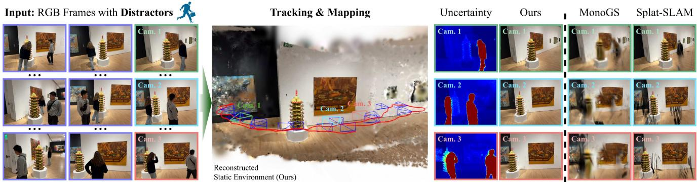  
Figure 1. WildGS-SLAM. Given a monocular video sequence captured in the wild with dynamic distractors, our method accurately tracks the camera trajectory and reconstructs a 3D Gaussian map for static elements, effectively removing all dynamic components. This approach enables high-fidelity rendering even in complex, dynamic scenes. The illustration presents the final 3D Gaussian map, the camera tracking trajectory (in red), and view synthesis comparisons with baseline methods.

## Abstract

We present WildGS-SLAM, a robust and efficient monocular RGB SLAM system designed to handle dynamic environments by leveraging uncertainty-aware geometric mapping. Unlike traditional SLAM systems, which assume static scenes, our approach integrates depth and uncertainty information to enhance tracking, mapping, and rendering performance in the presence ofmoving objects. We introduce an uncertainty map, predicted by a shallow multi-layer perceptron and DI-NOv2features, to guide dynamic object removal during both tracking and mapping. This uncertainty map enhances dense bundle adjustment and Gaussian map optimization, improving reconstruction accuracy. Our system is evaluated on multiple datasets and demonstrates artifact-free view synthesis. Results showcase WildGS-SLAM’s superior performance in dynamic environments compared to state-of-the-art methods.

## 1. Introduction

Simultaneous Localization and Mapping (SLAM) in dynamic environments is a fundamental challenge in computer vision, with broad applications in autonomous navigation, augmented reality, and robotics. Traditional SLAM systems [6, 31, 45] rely on assumptions of scene rigidity, making them vulnerable to tracking errors in dynamic scenes where objects move independently. Although some recent approaches [4, 34, 52] incorporate motion segmentation, semantic information, and depth-based cues to handle dynamic content, they often struggle to generalize across scenes with varied and unpredictable motion patterns. This issue is especially acute in real-world scenarios where dynamic distractors, occlusions, and varying lighting conditions introduce significant ambiguity for SLAM systems.

Uncertainty-aware methods have recently gained attention in scene reconstruction and view synthesis, particularly for handling complex environments with partial occlusions, dynamic objects, and noisy observations. For instance, NeRF On-the-go [36] and WildGaussians [22] introduced uncertainty estimation to improve the rendering quality of neural radiance fields in real-world scenarios, enabling enhanced view synthesis in the presence of motion and varying light conditions. Such approaches provide valuable insights into modeling ambiguities and have shown strong results in highly dynamic environments. However, they focus on sparse-view settings and require camera poses as input.

To address these limitations, we propose a novel SLAM approach, namely WildGS-SLAM, that leverages a 3D Gaussian Splatting (3DGS) representation, designed to perform robustly in highly dynamic environments using only monocular RGB input. Similar to [22, 36], our method takes a purely geometric approach. It integrates uncertainty-aware tracking and mapping, which removes dynamic distractors effectively without requiring explicit depth or semantic labels. This approach enhances tracking, mapping, and rendering while achieving strong generalizability and robustness across diverse real-world scenarios. Results showcase its improved performance over prior work in both indoor and outdoor scenes, supporting artifact-free rendering and high-fidelity novel view synthesis, even in challenging settings.

Specifically, we train a shallow multi-layer perceptron (MLP) given 3D-aware, pre-trained DINOv2 [54] features to predict per-pixel uncertainty. The MLP is trained incrementally as input frames are streamed into the system, allowing it to dynamically adapt to incoming scene data. We leverage this uncertainty information to enhance tracking, guiding dense bundle adjustment (DBA) to prioritize reliable areas. Additionally, during mapping, the uncertainty predictions inform the rendering loss in Gaussian map optimization, helping to refine the quality of the reconstructed scene. By optimizing the map and the uncertainty MLP independently, we ensure maximal performance for each component. To evaluate our method in diverse and challenging scenarios, we collect a new dataset including indoor and outdoor scenes.

Our main contributions are as follows:

• A monocular SLAM framework, namely WildGS-SLAM, utilizing a 3D Gaussian representation that operates robustly in highly dynamic environments, outperforming existing dynamic SLAM methods on a variety of dynamic datasets and on both indoor and outdoor scenarios.

• An uncertainty-aware tracking and mapping pipeline that enables the accurate removal of dynamic distractors without depth or explicit semantic segmentation, achieving high-fidelity scene reconstructions and tracking.

• A new dataset, namely Wild-SLAM Dataset, featuring diverse indoor and outdoor scenes, enables SLAM evaluation in unconstrained, real-world conditions. This dataset supports comprehensive benchmarking for dynamic environments with varied object motions and occlusions.

## 2. Related Work

## 2.1. Traditional Visual SLAM

Most traditional visual SLAM [6, 20, 30, 31] methods assume static scenes, however, the presence of dynamic objects can disrupt feature matching and photometric consistency, leading to substantial tracking drift. To address this, many approaches enhance robustness in dynamic environments by detecting and filtering out dynamic regions, focusing on reconstructing the static parts of the scene. Common approaches to detect dynamic objects include warping or reprojection techniques [3, 34, 39], off-the-shelf optical flow estimators [44, 60], predefined class priors for object detection or semantic segmentation [16, 41], or hybrids of these strategies [2, 4, 40, 51]. Notably, ReFusion [34] requires RGB-D input and uses a TSDF [5] map representation, leveraging depth residuals to filter out dynamic objects. DynaSLAM [2] supports RGB, RGB-D, and stereo inputs, leveraging Mask R-CNN [9] for semantic segmentation with predefined movable object classes, and detects unknown dynamic objects in RGB-D mode via multi-view geometry.

To our knowledge, no existing traditional SLAM methods support monocular input without relying on prior class information, likely due to the sparse nature of traditional monocular SLAM, which limits the use of purely geometric cues for identifying dynamic regions. Our SLAM approach, however, leverages a 3D Gaussian scene representation to provide dense mapping, enabling support for monocular input without prior semantic information.

## 2.2. Neural Implicit and 3DGS SLAM

Recently, Neural Implicit Representations and 3D Gaussian Splatting (3DGS) have gained substantial interest in SLAM research, as they offer promising advancements in enhancing dense reconstruction and novel view synthesis. Early SLAM systems like iMAP [43] and NICE-SLAM [64] pioneered the use of neural implicit representations, integrating mapping and camera tracking within a unified framework. Subsequent works have further advanced these methods by exploring various optimizations and extensions, including efficient representations [15, 21, 47], monocular settings [1, 61, 65], and the integration of semantic information [23, 56, 63]. The emergence of 3D Gaussian Splatting (3DGS) [18] introduces an efficient and flexible alternative representation for SLAM and has been adopted in several recent studies [8, 10, 12, 17, 24, 26, 35, 53, 62]. Among these, MonoGS [28] is the first near real-time monocular SLAM system to use 3D Gaussian Splatting as its sole scene representation. Another notable advancement is Splat-SLAM [37], the state-of-the-art (SoTA) in monocular Gaussian Splatting SLAM, offering high-accuracy mapping with robust global consistency. These methods excel in tracking and reconstruction but typically assume static scene conditions, limiting their robustness as performance degrades significantly in dynamic environments.

Some methods have focused explicitly on handling dynamic environments. Most approaches extract a dynamic object mask for each frame before passing it to the tracking and mapping components. DG-SLAM [52], DynaMon [38], and RoDyn-SLAM [14] combine segmentation masks with motion masks derived from optical flow. DDN-SLAM [25] employs object detection combined with a Gaussian Mixture Model to distinguish between foreground and background, checking feature reprojection error to enhance tracking accuracy. However, these approaches rely heavily on prior knowledge of object classes and depend on object detection or semantic segmentation, limiting their generalizability in real-world settings where dynamic objects may be unknown a priori and difficult to segment.

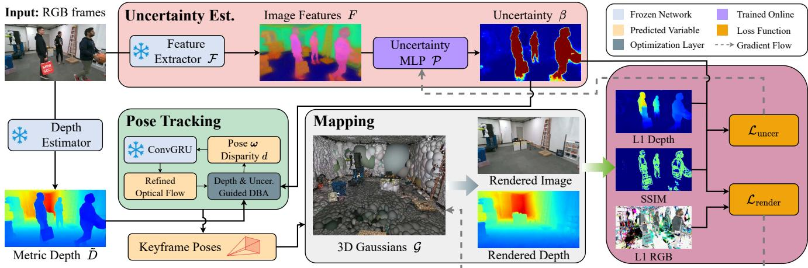  
Figure 2. System Overview. WildGS-SLAM takes a sequence of RGB images as input and simultaneously estimates the camera poses while building a 3D Gaussian map G of the static scene. Our method is more robust to the dynamic environment due to the uncertainty estimation module, where a pretrained DINOv2 model [54] is first used to extract the image features. An uncertainty MLP P then utilizes the extracted features to predict per-pixel uncertainty. During the tracking, we leverage the predicted uncertainty as the weight in the dense bundle adjustment (DBA) layer to mitigate the impact of dynamic distractors. We further use monocular metric depth to facilitate the pose estimation. In the mapping module, the predicted uncertainty is incorporated into the rendering loss to update G. Moreover, the uncertainty loss is computed in parallel to train P. Note that $\mathcal { P }$ and $\mathcal { G }$ are optimized independently, as illustrated by the gradient flow in the gray dashed line. Faces are blurred to ensure anonymity.

In contrast, our method is purely geometric even with monocular input. While similar works such as NeRF On-thego [36] and WildGaussians [22] demonstrate distractor removal in dynamic environments, they are primarily designed for sparse-view settings with known camera poses. Inspired by these approaches, we also leverage the pre-trained 2D foundation model DINOv2 [33] and use an MLP to decode them into an uncertainty map. We extend this framework to tackle the challenging sequential SLAM setting, integrating specific design components that enable robust tracking and high-fidelity mapping within our 3DGS backend.

A concurrent work, MonST3R [58], introduced a feedforward approach for estimating scene geometry in the presence of motion. It detects moving objects by thresholding the difference between the predicted optical flow [49] and the reprojection flow, estimated using an extended version of DUSt3R [48]. However, this approach is limited to short sequences, and its use of point clouds as the scene representation does not support view synthesis.

## 3. Method

Given a sequence of RGB frames $\{ I _ { i } \} _ { i = 1 } ^ { N }$ captured in a dynamic environment, WildGS-SLAM tracks the camera pose while reconstructing the static part of the scene as a 3D Gaussian map (Sec. 3.1). To mitigate the adverse impact of moving objects in tracking and eliminate them from the 3D reconstruction, we utilize DINOv2 features [33] and a shallow MLP to decode them to per-pixel uncertainty (Sec. 3.2). We further introduce how this uncertainty is integrated into the optical-flow-based tracking component (Sec. 3.3). In parallel with tracking, we leverage this uncertainty to progressively expand and optimize the 3D Gaussian map with uncertainty-aware loss functions (Sec. 3.4). The overview of WildGS-SLAM is in Fig. 2.

## 3.1. Preliminary on 3D Gaussian Splatting

We utilize a 3D Gaussian representation [18] to reconstruct the static part of the scanned environment. The scene is represented by a set of anisotropic Gaussians $\mathcal { G } = \{ g _ { i } \} _ { i = 1 } ^ { K }$ Each Gaussian $g _ { i }$ contains color $\boldsymbol { c } _ { i } \in \mathbb { R } ^ { 3 }$ , opacity $o _ { i } \in [ 0 , 1 ]$ mean $\pmb { \mu } _ { i } \in \mathbb { R } ^ { 3 }$ , and covariance matrix $\pmb { \Sigma } _ { i } \in \mathbb { R } ^ { 3 \times 3 }$

Rendering. We follow the same rendering approach as in the original 3DGS [18] but omit spherical harmonics to speed up optimization, as in [28, 55]. Given a camera-to-world pose ω and the projection function $\Pi _ { c }$ that maps 3D points onto the image frame, the 3D Gaussians can be "splatted" onto the 2D image plane by projecting the mean $\pmb { \mu }$ and covariance matrix Σ as $\pmb { \mu } ^ { \prime } = \Pi _ { c } \left( \omega ^ { - 1 } \pmb { \mu } \right)$ and $\Sigma ^ { \prime } = \dot { J } R \Sigma R ^ { T } J ^ { T }$ , where $\textbf {  { J } }$ is the Jacobian of the linear approximation of the projective transformation and R is the rotation component of $\omega$ . The opacity of a Gaussian $g _ { i }$ at pixel $\mathbf { x } ^ { \prime }$ is:

$$
\alpha _ { i } = o _ { i } \exp ( - \frac { 1 } { 2 } ( { \pmb x } ^ { \prime } - { \pmb \mu } _ { i } ^ { \prime } ) ^ { T } { \pmb \Sigma } _ { i } ^ { \prime - 1 } ( { \pmb x } ^ { \prime } - { \pmb \mu } _ { i } ^ { \prime } ) ) .\tag{1}
$$

The rendered color $\hat { I }$ and depth $\hat { D }$ at pixel $\mathbf { x } ^ { \prime }$ are obtained by blending the 3D Gaussians $\mathcal { G } ^ { \prime }$ overlapping with this pixel, sorted by their depth relative to the camera plane:

$$
\hat { I } = \sum _ { i \in \mathcal { G } ^ { \prime } } \pmb { c } _ { i } \alpha _ { i } \prod _ { j = 1 } ^ { i - 1 } \left( 1 - \alpha _ { j } \right) , \hat { D } = \sum _ { i \in \mathcal { G } ^ { \prime } } \hat { d } _ { i } \alpha _ { i } \prod _ { j = 1 } ^ { i - 1 } \left( 1 - \alpha _ { j } \right)\tag{2}
$$

where $\hat { d } _ { i }$ is the z-axis depth of the center of $g _ { i }$ . This process is fully differentiable, enabling incremental map updates as new frames are streamed (we discuss details in Sec. 3.4).

## 3.2. Uncertainty Prediction

WildGS-SLAM’s main contribution is to eliminate the impact of moving distractors in both mapping and tracking. To achieve this, we use an uncertainty prediction component inspired by [22, 36] while additionally incorporating our own custom depth uncertainty loss during training. For each input frame, we extract DINOv2 [33] features and utilize an uncertainty MLP, trained on-the-fly with streamed frames, to predict a per-pixel uncertainty map that mitigates the impact of distractors in both tracking and mapping.

Feed-Forward Uncertainty Estimation. Given an input image $I _ { i } ,$ we use a pre-trained DINOv2 feature extractor $\mathcal { F }$ to derive image features, $F _ { i } = \mathcal { F } ( I _ { i } )$ . Instead of the original DINOv2 model [33], we use the finetuned version from [54], which injects 3D awareness into the model. The features are used as input to a shallow uncertainty MLP P to predict an uncertainty map $\beta _ { i } = \mathcal { P } ( F _ { i } )$ . We bilinearly upsample $\beta _ { i }$ to the original input frame resolution, which is then used in both tracking (Sec. 3.3) and mapping (Sec. 3.4).

Uncertainty Loss Function. For the uncertainty loss functions, we adopt the modified SSIM loss and two regularization terms from NeRF On-the-go [36], along with the L1 depth loss term:

$$
\mathcal { L } _ { \mathrm { d e p t h } } = | \hat { D } _ { i } - \tilde { D } _ { i } | _ { 1 } ,\tag{3}
$$

where ${ \mathcal { L } } _ { \mathrm { d e p t h } }$ represents the L1 loss between the rendered depth $\hat { D } _ { i }$ and the metric depth ${ \tilde { D } } _ { i }$ , as estimated by Metric3D v2 [11]. We find that this additional depth signal effectively improves the model’s ability to distinguish distractors, enhancing the training of the uncertainty MLP. Therefore the total uncertainty loss is:

$$
\mathcal { L } _ { \mathrm { u n c e r } } = \frac { \mathcal { L } _ { \mathrm { S S I M } } ^ { \prime } + \lambda _ { 1 } \mathcal { L } _ { \mathrm { u n c e r \_ D } } } { \beta _ { i } ^ { 2 } } + \lambda _ { 2 } \mathcal { L } _ { \mathrm { r e g \_ V } } + \lambda _ { 3 } \mathcal { L } _ { \mathrm { r e g \_ U } } ,\tag{4}
$$

where $\lambda _ { * }$ are hyperparameters, $\mathcal { L } _ { \mathrm { S S I M } } ^ { \prime }$ is the modified SSIM loss, $\mathcal { L } _ { \mathrm { r e g \_ V } }$ minimizes the variance of predicted uncertainty for features having high similarity, and the last term $\mathcal { L } _ { \mathrm { r e g \_ U } } = \log \beta _ { i }$ prevents $\beta _ { i }$ from being infinitely large. Please refer to NeRF On-the-go [36] for details on $\mathcal { L } _ { \mathrm { S S I M } } ^ { \prime } :$ $\mathcal { L } _ { \mathrm { r e g \_ V } }$ , and $\mathcal { L } _ { \mathrm { r e g \_ U } }$ . We use ${ \mathcal { L } } _ { \mathrm { u n c e r } }$ to train $\mathcal { P }$ in parallel with map optimization (Sec. 3.4).

## 3.3. Tracking

Our tracking component is based on the recent method DROID-SLAM [45] with the incorporation of depth and uncertainty into the DBA to make the system robust in dynamic environments. The original DROID-SLAM [45] uses a pretrained recurrent optical flow model coupled with a DBA layer to jointly optimize keyframe camera poses and disparities. This optimization is performed over a frame graph, denoted as $G = ( V , E )$ , where V represents the selected keyframes and E represents the edges between keyframes.

Following [37, 57], we incorporate loop closure and online global BA to reduce pose drift over long sequences.

Depth and Uncertainty Guided DBA. Different from [37, 45, 57], we integrate the uncertainty map estimated by $\mathcal { P }$ into the BA optimization objective to deal with the moving distractors. In addition, we utilize the metric depth estimated by Metric3D V2 [11] to stabilize the DBA layer, since $\mathcal { P }$ is trained online and can not always give accurate uncertainty estimation, especially during the early stages of tracking. For each newly inserted keyframe $I _ { i } ,$ we first estimate its monocular metric depth ${ \tilde { D } } _ { i }$ and add it to the DBA objective alongside optical flow:

$$
\begin{array} { r l r } {  { \arg \operatorname* { m i n } _ { \omega , d } \sum _ { ( i , j ) \in E } \| \tilde { p } _ { i j } - \Pi _ { c } ( \omega _ { j } ^ { - 1 } \omega _ { i } \Pi _ { c } ^ { - 1 } ( p _ { i } , d _ { i } ) ) \| _ { \Sigma _ { i j } / \beta _ { i } ^ { 2 } } ^ { 2 } } } \\ & { } & { +  \lambda _ { 4 } \sum _ { i \in V } \| M _ { i } ( d _ { i } - 1 / \tilde { D } _ { i } ) \| ^ { 2 } , } \end{array}\tag{5}
$$

The first term is the uncertainty-aware DBA objective where $\tilde { p } _ { i j }$ is the predicted pixel position of pixels $p _ { i }$ projected into keyframe $j$ by the estimated optical flow; this is iteratively updated by a Convolutional Gated Recurrent Unit (ConvGRU) [45]. Πc represents the projection from 3D points to 2D image planes, $\omega _ { i }$ is the camera-to-world transformation for keyframe $i , d _ { i }$ is the optimized disparity, and $\| \cdot \| _ { \Sigma _ { i j } / \beta _ { i } ^ { 2 } }$ is the Mahalanobis distance [29] which weighs the error terms by confidence matrix $\Sigma _ { i j }$ from the flow estimator [45] and our uncertainty map $\beta _ { i } .$ As a result, pixels associated with moving objects will have minimal impact on the optimization in DBA.

The second term is a disparity regularization term to encourage $1 / d _ { i }$ to be close to the predicted depth for all i in the graph nodes V. We find that this regularization term can stabilize the pose estimation, especially when the uncertainty MLP $\mathcal { P }$ has not converged to provide reliable uncertainty $\beta _ { i }$ while moving objects are dominant in the image frames. $M _ { i }$ is a binary mask that deactivates disparity regularization in regions where $\tilde { D } _ { i }$ is unreliable, computed via multi-view depth consistency (details provided in the supplementary).

## 3.4. Mapping

After the tracking module predicts the pose of a newly inserted keyframe, its RGB image I, metric depth ${ \tilde { D } } ,$ , and estimated pose ω will be utilized in the mapping module to expand and optimize the 3DGS map. Given a new keyframe processed in the tracking module, we expand the Gaussian map to cover newly explored areas, using $\tilde { D } _ { i }$ as proxy depth, following the RGBD strategy of MonoGS [28]. Before optimization, we also actively deform the 3D Gaussian map if the poses of previous keyframes are updated by loop closure or global BA, as in Splat-SLAM [37].

Map update. After the map is expanded, we optimize the Gaussians for a fixed number of iterations. We maintain a local window of keyframes selected by inter-frame covisibility, similar to MonoGS [28]. At each iteration, we randomly sample a keyframe with at least 50% probability evenly distributed for the keyframes in the local window, while all the other keyframes share the remaining probability equally. For a selected keyframe, we render the color ˆI and depth $\hat { D }$ image by Eq. (2). The Gaussian map G is optimized by minimizing the render loss $\mathcal { L } _ { \mathrm { r e n d e r } } .$

$$
\mathcal { L } _ { \mathrm { r e n d e r } } = \frac { \lambda _ { 5 } \mathcal { L } _ { \mathrm { c o l o r } } + \lambda _ { 6 } \mathcal { L } _ { \mathrm { d e p t h } } } { \beta ^ { 2 } } + \lambda _ { 7 } \mathcal { L } _ { \mathrm { i s o } } ,\tag{6}
$$

where the color loss $\mathcal { L } _ { \mathrm { c o l o r } } .$ , combines L1 and SSIM losses as follows:

$$
\mathcal { L } _ { \mathrm { c o l o r } } = ( 1 - \lambda _ { \mathrm { s s i m } } ) \Vert \hat { I } - I \Vert _ { 1 } + \lambda _ { \mathrm { s s i m } } \mathcal { L } _ { \mathrm { s s i m } } .\tag{7}
$$

Unlike the loss function for static scenes, here we incorporate the uncertainty map $\beta ,$ which serves as a weighting factor for $\scriptstyle { \mathcal { L } } _ { \mathrm { c o l o r } }$ and ${ \mathcal { L } } _ { \mathrm { d e p t h } }$ , minimizing the influence of distractors during mapping optimization. Additionally, isotropic regularization loss $\mathcal { L } _ { \mathrm { i s o } }$ [28] constrains 3D Gaussians to prevent excessive elongation in sparsely observed regions.

At each iteration, we also compute ${ \mathcal { L } } _ { \mathrm { u n c e r } }$ given the rendered color and depth image as in Eq. (4). ${ \mathcal { L } } _ { \mathrm { u n c e r } }$ is then used to train the uncertainty MLP P in parallel to the map optimization. As shown in [36], it is crucial to separately optimize the 3D Gaussian map and the uncertainty MLP. Therefore, we detach the gradient flow from ${ \mathcal { L } } _ { \mathrm { u n c e r } }$ to the Gaussians ${ \mathcal { G } } ,$ , as well as from $\mathcal { L } _ { \mathrm { r e n d e r } }$ to $\mathcal { P } _ { \cdot }$

## 4. Experiments

## 4.1. Experimental Setup

Datasets. We evaluate our approach on the Bonn RGB-D Dynamic Dataset [34] and TUM RGB-D Dataset [42]. To further assess performance in unconstrained, real-world settings, we introduce the Wild-SLAM Dataset, comprising two subsets: Wild-SLAM MoCap and Wild-SLAM iPhone. The Wild-SLAM MoCap Dataset includes 10 RGB-D sequences recorded with an Intel RealSense D455 camera [13] in a room equipped with an OptiTrack [32] motion capture system, providing ground truth trajectories. The Wild-SLAM iPhone Dataset comprises 7 non-staged RGB sequences recorded with an iPhone 14 Pro. Since ground truth trajectories are not available for this dataset, it is used solely for qualitative experiments. The Wild-SLAM MoCap Dataset provides RGB-D frames at 720 × 1280 resolution, while the Wild-SLAM iPhone Dataset offers RGB frames at 1440 × 1920. For efficiency, in our experiments, we downsample these to $3 6 0 \times 4 8 0$ and $3 6 0 \times 6 4 0$ , respectively. Dataset details are offered in supplementary.

Baselines. We compare WildGS-SLAM with the following 13 methods. (a) Classic SLAM methods: DSO [6], ORB-SLAM2 [30], and DROID-SLAM [45]; (b) Classic SLAM methods dealing with dynamic environments: Refusion [34] and DynaSLAM [2]; (c) Static neural implicit and 3DGS SLAM systems: NICE-SLAM [64], MonoGS [28], and Splat-SLAM [37]; (d) Concurrent neural implicit and 3DGS SLAM systems dealing with dynamic environments: DG-SLAM [52], RoDyn-SLAM [14], DDN-SLAM [25], and DynaMoN [38]; (e) the very recentfeed-forward approach MonST3R [58]; and (f) a concurrent deep SLAM framework for dynamic videos: MegaSaM [27]. To address its substantial VRAM usage (65 frames requiring 33 GB), we adapt the model by integrating a custom sliding-window inference strategy, enabling SLAM-style sequential input processing (referred to as MonST3R-SW; implementation details provided in the supplementary). We include two versions of DynaSLAM [2] in our experiments. The first, DynaSLAM (RGB), uses only monocular input without leveraging geometric information or performing inpainting. The second, DynaSLAM (N+G), utilizes RGB-D input, incorporates geometric information, and performs inpainting. Since not all methods are open-sourced and run on all sequences, we provide detailed sources for each baseline method’s metrics in supplementary.

Metrics. For camera tracking evaluation, we follow the standard monocular SLAM pipeline, aligning the estimated trajectory to the ground truth (GT) using evo [7] with Sim(3) Umeyama alignment [46], and then evaluate (ATE RMSE) [42]. Note that, although our tracking optimizations are performed solely on keyframe images, we recover camera poses for non-keyframes and evaluate the complete camera trajectory. Please refer to the supplementary for details. Additionally, we employ PSNR, SSIM [50], and LPIPS [59] metrics to evaluate the novel view synthesis quality.

## 4.2. Mapping, Tracking, and Rendering

Wild-SLAM Mocap Dataset. We begin our evaluation on the newly captured Wild-SLAM MoCap dataset. As shown in Table 1, our method significantly outperforms other baselines on average. The only exception is a slight increase in tracking error in the Person sequence, where the single person moves in a simple pattern, making it easier for DynaSLAM [2] to use semantic segmentation to mask out dynamic regions within the frames. All other sequences contain various types of distractors beyond humans, with different forms of occlusion. Although Refusion [34] and DynaSLAM (N+G) [2] use geometric approaches leveraging raw depth information to identify dynamic objects, they still underperform compared to our WildGS-SLAM with only monocular input. While MonST3R [58] has demonstrated strong performance on short sequences, extending it to longer sequences with a sliding window approach (MonST3R-SW), even with substantial overlap, still leads to significant tracking errors.

We further evaluate rendering results in Fig. 3, Table 2, and Fig. 4. In Fig. 3, we render from the input view to demonstrate our distractor removal capability. In comparison to other baselines, our method produces artifact-free, realistic renderings of the static scene. To evaluate novel view synthesis, we capture additional images of static scenes as part of the dataset. For each dynamic sequence, we select a subset of static scene images that match the coverage of the dynamic sequence. The results in Table 2 and Fig. 4 showcase that our method has the best novel view synthesis performance thanks to our uncertainty aware mapping.

<table><tr><td>Method</td><td>ANYmal1</td><td>ANYmal2</td><td>Ball</td><td>Crowd</td><td>Person</td><td>Racket</td><td>Stones</td><td>Table1</td><td>Table2</td><td>Umbrella</td><td>Avg.</td></tr><tr><td>RGB-D</td><td></td><td></td><td></td><td></td><td></td><td></td><td></td><td></td><td></td><td></td><td></td></tr><tr><td>Refusion [34]</td><td>4.2</td><td>5.6</td><td>5.0</td><td>91.9</td><td>5.0</td><td>10.4</td><td>39.4</td><td>99.1</td><td>101.0</td><td>10.7</td><td>37.23</td></tr><tr><td>DynaSLAM (N+G) [2]</td><td>1.6</td><td>0.5</td><td>0.5</td><td>1.7</td><td>0.5</td><td>0.8</td><td>2.1</td><td>1.2</td><td>34.8</td><td>34.7</td><td>7.84</td></tr><tr><td>NICE-SLAM [64]</td><td>F</td><td>123.6</td><td>21.1</td><td>F</td><td>150.2</td><td>F</td><td>134.4</td><td>138.4</td><td>F</td><td>23.8</td><td></td></tr><tr><td colspan="10">Monocular</td><td></td><td></td></tr><tr><td>DSO [6]</td><td>12.0</td><td>2.5</td><td>1.0</td><td>88.6</td><td>9.3</td><td>3.1</td><td>41.5</td><td>50.6</td><td>85.3</td><td>26.0</td><td>32.99</td></tr><tr><td>DROID-SLAM [45]</td><td>0.6</td><td>4.7</td><td>1.2</td><td>2.3</td><td>0.6</td><td>1.5</td><td>3.4</td><td>48.0</td><td>95.6</td><td>3.8</td><td>16.17</td></tr><tr><td>DynaSLAM (RGB) [2]</td><td>0.6</td><td>0.5</td><td>0.5</td><td>0.5</td><td>0.4</td><td>0.6</td><td>1.7</td><td>1.8</td><td>42.1</td><td>1.2</td><td>5.19</td></tr><tr><td>MonoGS [28]</td><td>8.8</td><td>51.6</td><td>7.4</td><td>70.3</td><td>55.6</td><td>67.6</td><td>39.9</td><td>24.9</td><td>118.4</td><td>35.3</td><td>47.99</td></tr><tr><td>Splat-SLAM [37]</td><td>0.4</td><td>0.4</td><td>0.3</td><td>0.7</td><td>0.8</td><td>0.6</td><td>1.9</td><td>2.5</td><td>73.6</td><td>5.9</td><td>8.71</td></tr><tr><td>MonST3R-SW [58]</td><td>3.5</td><td>21.6</td><td>6.1</td><td>14.4</td><td>7.2</td><td>13.2</td><td>11.2</td><td>4.8</td><td>33.7</td><td>5.5</td><td>12.12</td></tr><tr><td>MegaSaM [27]</td><td>0.6</td><td>2.7</td><td>0.6</td><td>1.0</td><td>3.2</td><td>1.6</td><td>3.2</td><td>1.0</td><td>9.4</td><td>0.6</td><td>2.40</td></tr><tr><td>WildGS-SLAM (Ours)</td><td>0.2</td><td>0.3</td><td>0.2</td><td>0.3</td><td>0.8</td><td>0.4</td><td>0.3</td><td>0.6</td><td>1.3</td><td>0.2</td><td>0.46</td></tr></table>

Table 1. Tracking Performance on our Wild-SLAM MoCap Dataset (ATE RMSE ↓ [cm]). Best results are highlighted as first , second and third . All baseline methods were run using their publicly available code. For DynaSLAM (RGB), initialization is time-consuming for certain sequences, and only keyframe poses are generated and evaluated. ‘F’ denotes tracking failure.  
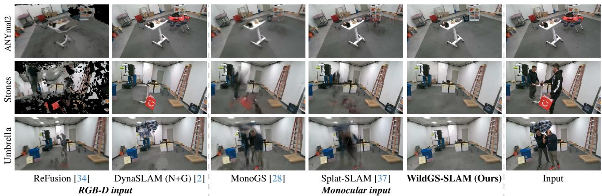  
Figure 3. Input View Synthesis Results on our Wild-SLAM MoCap Dataset. Regardless of the distractor type, our method is able to remove distractors and render realistic images. Faces are blurred to ensure anonymity.

<table><tr><td></td><td></td><td></td><td>ANYmal1 ANYmal2 Ball</td><td></td><td>Crowd Person Racket</td><td></td><td></td><td>Stones</td><td>Table1</td><td></td><td>Table2 Umbrella</td><td>Avg.</td></tr><tr><td colspan="3">Monocular</td><td></td><td></td><td></td><td></td><td></td><td></td><td></td><td></td><td></td><td></td></tr><tr><td rowspan="3">Splat-SLAM [37]</td><td>PSNR ↑</td><td>19.71</td><td>20.32</td><td>17.68</td><td>16.00</td><td>18.58</td><td>16.45</td><td>17.90</td><td>17.54</td><td>11.45</td><td>16.65</td><td>17.23</td></tr><tr><td>SSIM↑</td><td>0.786</td><td>0.800</td><td>0.702</td><td>0.693</td><td>0.754</td><td>0.699</td><td>0.711</td><td>0.717</td><td>0.458</td><td>0.667</td><td>0.699</td></tr><tr><td>LPIPS↓</td><td>0.313</td><td>0.278</td><td>0.294</td><td>0.356</td><td>0.298</td><td>0.301</td><td>0.291</td><td>0.312</td><td>0.650</td><td>0.362</td><td>0.346</td></tr><tr><td rowspan="3">WildGS-SLAM (Ours) SSIM ↑</td><td>PSNR ↑</td><td>21.85</td><td>21.46</td><td>20.06</td><td>21.28</td><td>20.31</td><td>20.87</td><td>20.52</td><td>20.33</td><td>19.16</td><td>20.03</td><td>20.59</td></tr><tr><td></td><td>0.807</td><td>0.832</td><td>0.754</td><td>0.802</td><td>0.801</td><td>0.785</td><td>0.768</td><td>0.788</td><td>0.728</td><td>0.766</td><td>0.783</td></tr><tr><td>LPIPS↓</td><td>0.211</td><td>0.230</td><td>0.191</td><td>0.176</td><td>0.189</td><td>0.186</td><td>0.185</td><td>0.209</td><td>0.303</td><td>0.210</td><td>0.209</td></tr></table>

Table 2. Novel View Synthesis Evaluation on our Wild-SLAM MoCap Dataset. Best results are in bold.

Wild-SLAM iPhone Dataset. We further evaluate our approach on in-the-wild sequences captured using an iPhone RGB camera. Fig. 5 presents rendering results comparisons, along with visualizations of the uncertainty map of our method and the dynamic mask from MonST3R [58]. Our method achieves the best rendering results with an accurate uncertainty map, even able to assign higher uncertainty to the shadows of distractors. In contrast, MonST3R [58] depends heavily on the performance of pretrained models, which may lead to missed detections of entire dynamic objects. On the other hand, MegaSAM [27] leverages only neighboring frames, lacking enough multi-view information, which results in less reliable motion masks.

Bonn RGB-D Dynamic Dataset [34]. Tracking results, presented in Table 3, demonstrate that our method achieves

ANYmal1

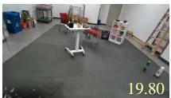  
Splat-SLAM [37]

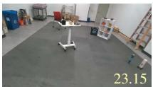  
WildGS-SLAM (Ours)

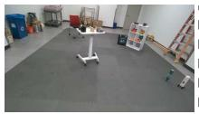  
GT  
ANYmal2

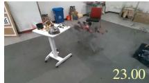

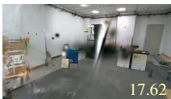

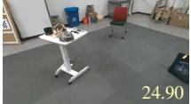

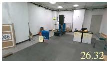

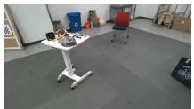  
Splat-SLAM [37]

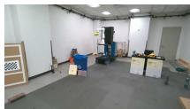

Splat-SLAM [37]  
WildGS-SLAM (Ours)  
WildGS-SLAM (Ours)  
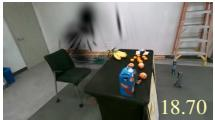  
GT

GT  
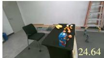  
Splat-SLAM [37]  
WildGS-SLAM (Ours)

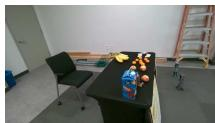  
GT

Figure 4. Novel View Synthesis Results on our Wild-SLAM MoCap Dataset. PSNR metrics (↑) are included in images.  
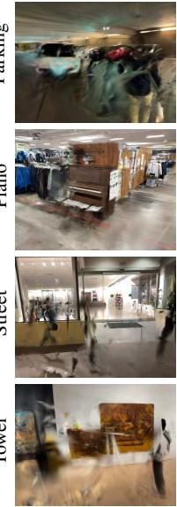  
MonoGS [28]

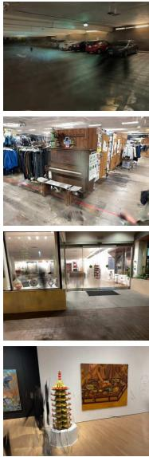  
Splat-SLAM [37]

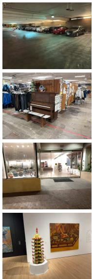  
WildGS-SLAM (Ours)

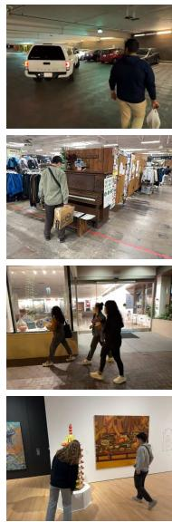  
Input

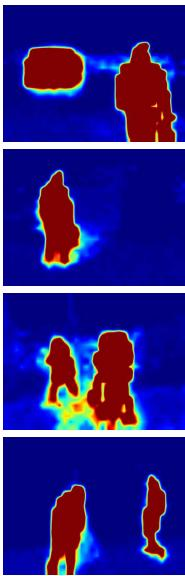  
Uncertainty β (Ours)

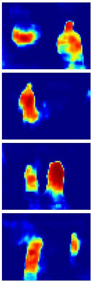  
MegaSaM [27] Mask

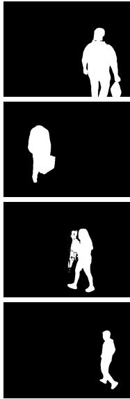  
MonST3R [58] Mask

Figure 5. Input View Synthesis Results on our Wild-SLAM iPhone Dataset. We only show rendering results of monocular methods, as depth images are unavailable in this dataset. Note that our uncertainty map appears blurry, as DINOv2 outputs feature maps at 1/14 of the original resolution, and for mapping we also downsample to 1/3 of the original resolution, in order to maintain SLAM system efficiency. Fo a high-resolution, sharper uncertainty map, the resolution can be increased at the cost of some efficiency; further details and results are provided in the supplementary materials. Faces are blurred to ensure anonymity.  
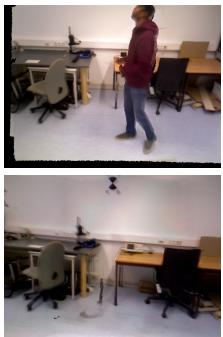  
ReFusion [34]

RGB-D input  
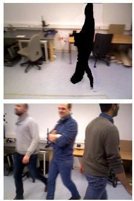  
DynaSLAM (N+G) [2]

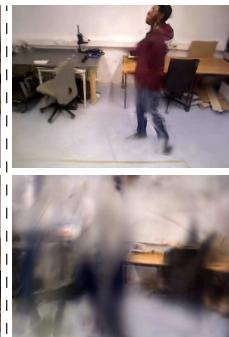  
MonoGS [28]

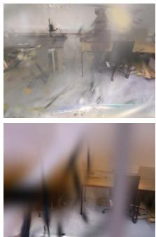  
Splat-SLAM [37] Monocular input

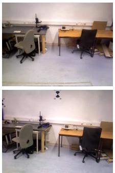  
WildGS-SLAM (Ours)

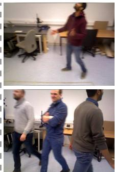  
Input

Figure 6. View Synthesis Results on Bonn RGB-D Dynamic Dataset [34]. We show results on the Balloon (first row) and Crowd (second row) sequences. For Balloon, ReFusion [34] fails to remove the person from the TSDF, and DynaSLAM(N+G)[2] struggles with limited static information from multiple views, resulting in partial black masks. In Crowd, DynaSLAM(N+G)[2] cannot detect dynamic regions, defaulting the original image as the inpainted result. In contrast, ours achieves superior rendering even with motion blur in the input.

<table><tr><td>Method</td><td>Balloon</td><td>Balloon2</td><td>Crowd</td><td>Crowd2</td><td>Person</td><td>Person2</td><td>Moving</td><td>Moving2</td><td>Avg.</td></tr><tr><td colspan="10">RGB-D</td></tr><tr><td>ReFusion [34]</td><td>17.5</td><td>25.4</td><td>20.4</td><td>15.5</td><td>28.9</td><td>46.3</td><td>7.1</td><td>17.9</td><td>22.38</td></tr><tr><td>ORB-SLAM2 [30]</td><td>6.5</td><td>23.0</td><td>4.9</td><td>9.8</td><td>6.9</td><td>7.9</td><td>3.2</td><td>3.9</td><td>6.36</td></tr><tr><td>DynaSLAM (N+G) [2]</td><td>3.0</td><td>2.9</td><td>1.6</td><td>3.1</td><td>6.1</td><td>7.8</td><td>23.2</td><td>3.9</td><td>6.45</td></tr><tr><td>NICE-SLAM [64]</td><td>24.4</td><td>20.2</td><td>19.3</td><td>35.8</td><td>24.5</td><td>53.6</td><td>17.7</td><td>8.3</td><td>22.74</td></tr><tr><td>DG-SLAM [52]</td><td>3.7</td><td>4.1</td><td></td><td></td><td>4.5</td><td>6.9</td><td></td><td>3.5</td><td></td></tr><tr><td>RoDyn-SLAM [14]</td><td>7.9</td><td>11.5</td><td>1</td><td></td><td>14.5</td><td>13.8</td><td></td><td>12.3</td><td></td></tr><tr><td>DDN-SLAM (RGB-D) [25]</td><td>1.8</td><td>4.1</td><td>1.8</td><td>2.3</td><td>4.3</td><td>3.8</td><td>2.0</td><td>3.2</td><td>2.91</td></tr><tr><td colspan="10">Monocular</td></tr><tr><td>DSO [6]</td><td>7.3</td><td>21.8</td><td>10.1</td><td>7.6</td><td>30.6</td><td>26.5</td><td>4.7</td><td>11.2</td><td>15.0</td></tr><tr><td>DROID-SLAM [45]</td><td>7.5</td><td>4.1</td><td>5.2</td><td>6.5</td><td>4.3</td><td>5.4</td><td>2.3</td><td>4.0</td><td>4.91</td></tr><tr><td>MonoGS [28]</td><td>15.3</td><td>17.3</td><td>11.3</td><td>7.3</td><td>26.4</td><td>35.2</td><td>22.2</td><td>47.2</td><td>22.8</td></tr><tr><td>Splat-SLAM [37]</td><td>8.8</td><td>3.0</td><td>6.8</td><td>F</td><td>4.9</td><td>25.8</td><td>1.7</td><td>3.0</td><td></td></tr><tr><td>DynaMoN (MS) [38]</td><td>6.8</td><td>3.8</td><td>6.1</td><td>5.6</td><td>2.4</td><td>3.5</td><td>1.4</td><td>2.6</td><td>4.02</td></tr><tr><td>DynaMoN (MS&amp;SS) [38]</td><td>2.8</td><td>2.7</td><td>3.5</td><td>2.8</td><td>14.8</td><td>2.2</td><td>1.3</td><td>2.7</td><td>4.10</td></tr><tr><td>MonST3R-SW [58]</td><td>5.4</td><td>7.2</td><td>5.4</td><td>6.9</td><td>11.9</td><td>11.1</td><td>3.3</td><td>7.4</td><td>7.3</td></tr><tr><td>MegaSaM [27]</td><td>3.7</td><td>2.6</td><td>1.6</td><td>7.2</td><td>4.1</td><td>4.0</td><td>1.4</td><td>3.4</td><td>3.51</td></tr><tr><td>WildGS-SLAM (Ours)</td><td>2.8</td><td>2.4</td><td>1.5</td><td>2.3</td><td>3.1</td><td>2.7</td><td>1.6</td><td>2.2</td><td>2.31</td></tr></table>

Table 3. Tracking Performance on Bonn RGB-D Dynamic Dataset [34] (ATE RMSE ↓ [cm]). DDN-SLAM [25] is not open source and does not report its RGB mode results on this dataset. DynaSLAM (RGB) [2] consistently fails to initialize or experiences extended tracking loss across all sequences and therefore cannot be included in the table. ‘F’ indicates failure.

<table><tr><td>Method</td><td>f3/ws</td><td>f3/wx</td><td>f3/wr</td><td>f3/whs</td><td>Avg.</td></tr><tr><td colspan="6">RGB-D</td></tr><tr><td>ReFusion [34]</td><td>1.7</td><td>9.9</td><td>40.6*</td><td>10.4</td><td>15.7*</td></tr><tr><td>ORB-SLAM2 [30]</td><td>40.8</td><td>72.2</td><td>80.5</td><td>72.3</td><td>66.45</td></tr><tr><td>DynaSLAM (N+G) [2]</td><td>0.6</td><td>1.5</td><td>3.5</td><td>2.5</td><td>2.03</td></tr><tr><td>NICE-SLAM [64]</td><td>79.8</td><td>86.5</td><td>244.0</td><td>152.0</td><td>140.57</td></tr><tr><td>DG-SLAM [52]</td><td>0.6</td><td>1.6</td><td>4.3</td><td></td><td></td></tr><tr><td>RoDyn-SLAM [14]</td><td>1.7</td><td>8.3</td><td></td><td>5.6</td><td></td></tr><tr><td>DDN-SLAM (RGB-D) [25]</td><td>1.0</td><td>1.4</td><td>3.9</td><td>2.3</td><td>2.15</td></tr><tr><td colspan="6">Monocular</td></tr><tr><td>DSO [6]</td><td>1.5</td><td>12.9</td><td>13.8</td><td>40.7</td><td>17.23</td></tr><tr><td>DROID-SLAM [45]</td><td>1.2</td><td>1.6</td><td>4.0</td><td>2.2</td><td>2.25</td></tr><tr><td>MonoGS [28]</td><td>1.1</td><td>21.5</td><td>17.4</td><td>44.2</td><td>21.05</td></tr><tr><td>Splat-SLAM [37]</td><td>2.3</td><td>1.3</td><td>3.9</td><td>2.2</td><td>2.43</td></tr><tr><td>DynaMoN (MS)</td><td>1.4</td><td>1.4</td><td>3.9</td><td>2.0</td><td>2.18</td></tr><tr><td>DynaMoN (MS&amp;SS) [38]</td><td>0.7</td><td>1.4</td><td>3.9</td><td>1.9</td><td>1.98</td></tr><tr><td>DDN-SLAM (RGB) [25]</td><td>2.5</td><td>2.8</td><td>8.9</td><td>4.1</td><td>4.58</td></tr><tr><td>MonST3R-SW [58]</td><td>2.2</td><td>27.3</td><td>13.6</td><td>19.8</td><td>15.73</td></tr><tr><td>MegaSaM [27]</td><td>0.6</td><td>1.5</td><td>2.6</td><td>1.8</td><td>1.63</td></tr><tr><td>WildGS-SLAM (Ours)</td><td>0.4</td><td>1.3</td><td>3.3</td><td>1.6</td><td>1.63</td></tr></table>

Table 4. Tracking Performance on TUM RGB-D Dataset [42] (ATE RMSE ↓ [cm]). We present sequences with higher dynamics here; see the supplementary materials for tracking results on other dynamic sequences. For methods without complete scene coverage in the original reports, results obtained by running their open-source code are marked with ‘\*’. If open-source code is unavailable, scenes without results are marked with ‘-’. DynaSLAM (RGB) [2] consistently fails to initialize or experiences extended tracking loss across all sequences and therefore cannot be included in this table.

the highest overall performance, underscoring its robustness. In contrast, DynaMoN [38] first performs initial camera tracking and then refines it offline, which is time-consuming. Meanwhile, DynaSLAM (N+G) [2] and DDN-SLAM [25] rely on depth sensor data combined with semantic segmentation. In Fig. 6, we show rendered images from the input view. Our method successfully removes dynamic objects while achieving realistic rendering with minimal artifacts.

TUM RGB-D Dataset [42]. Our tracking method achieves the best performance on all sequences, as shown in Table 4. Rendering results are included in the supplementary.

<table><tr><td></td><td>Wild-SLAM</td><td>Bonn</td><td>TUM</td></tr><tr><td>(a) w/o Uncertainty Mask β</td><td>3.89</td><td>5.11</td><td>1.91</td></tr><tr><td>(b) w/o L1 Depth Loss in Eq. (4)</td><td>0.50</td><td>2.37</td><td>1.83</td></tr><tr><td>(c) YOLOv8 + SAM Mask</td><td>3.06</td><td>2.37</td><td>1.65</td></tr><tr><td>(d) w/o Disparity Reg. in Eq. (5)</td><td>10.97</td><td>F</td><td>2.9</td></tr><tr><td>WildGS-SLAM (Ours)</td><td>0.46</td><td></td><td>2.31 1.63</td></tr></table>

Table 5. WildGS-SLAM Ablation Study (ATE RMSE ↓ [cm]). For each dataset, we report the average tracking error. ‘F’ indicates that the method fails on at least one sequence within that dataset.

## 4.3. Ablation Study

We ablate our key design choices in Table 5. For (c), we pass predefined distractor types to YOLOv8\* to generate bounding boxes, then apply the Segment Anything Model (SAM) [19] for segmentation within each box. It achieves similar results on Bonn and TUM datasets, as their distractors are primarily humans. Our method outperforms all other variants, confirming the effectiveness of our design choices.

## 5. Conclusion

In this paper, we introduced WildGS-SLAM, a novel SLAM approach designed to handle dynamic environments through a purely geometric framework. By leveraging a shallow MLP to predict per-pixel uncertainty based on pre-trained 3D-aware features, our method efficiently isolates static and dynamic scene elements, enabling robust tracking and rendering. Through extensive evaluations on both newly collected and existing datasets, we demonstrated that WildGS-SLAM achieves state-of-the-art performance in dynamic SLAM tasks, excelling in both tracking and novel view synthesis.

Limitation. Our method’s uncertainty predictor is trained on-the-fly with input frames, making it challenging to recognize distractors when a limited number of views capture the same regions. Introducing motion priors could improve handling of dynamic scenes and enhance tracking robustness.

Acknowledgements. The authors thank Sayan Deb Sarkar, Tao Sun, Ata Celen, Liyuan Zhu, Emily Steiner, Jikai Jin, Yiming Zhao, Matt VanCleave, Tess Ruby Horowitz Buckley, Stanley Wang for their help in Wild-SLAM data collection. We thank Aleesa Pitchamarn Alexander for granting permission to release the data collected from the Spirit House exhibition. We also thank Aleesa Pitchamarn Alexander, Robert M. and Ruth L. Halperin for curating the exhibition, as well as all the participating artists, particularly Dominique Fung, Stephanie H. Shih, and Tammy Nguyen whose art works are prominently captured in the video data.

## References

[1] Thomas Belos, Pascal Monasse, and Eva Dokladalova. Mod slam: Mixed method for a more robust slam without loop closing. In VISAPP, 2022. 2

[2] Berta Bescos, José M. Fácil, Javier Civera, and José Neira. DynaSLAM: Tracking, Mapping and Inpainting in Dynamic Scenes. IEEE Robotics and Automation Letters (RA-L), 2018. 2, 5, 6, 7, 8

[3] Jiyu Cheng, Yuxiang Sun, and Max Q-H Meng. Improving monocular visual slam in dynamic environments: an opticalflow-based approach. Advanced Robotics, 2019. 2

[4] Shuhong Cheng, Changhe Sun, Shijun Zhang, and Dianfan Zhang. Sg-slam: A real-time rgb-d visual slam toward dynamic scenes with semantic and geometric information. IEEE Transactions on Instrumentation and Measurement, 2022. 1, 2

[5] Brian Curless and Marc Levoy. A volumetric method for building complex models from range images. In ACM Trans. on Graphics, 1996. 2

[6] Jakob Engel, Vladlen Koltun, and Daniel Cremers. Direct sparse odometry. IEEE Trans. on Pattern Analysis and Machine Intelligence (PAMI), 2017. 1, 2, 5, 6, 8

[7] Michael Grupp. evo: Python package for the evaluation of odometry and slam. https://github.com/MichaelGrupp/evo, 2017. 5

[8] Seongbo Ha, Jiung Yeon, and Hyeonwoo Yu. Rgbd gs-icp slam. arXiv preprint arXiv:2403.12550, 2024. 2

[9] Kaiming He, Georgia Gkioxari, Piotr Dollár, and Ross Girshick. Mask r-cnn. In Proc. ofthe IEEE International Conf. on Computer Vision (ICCV), 2017. 2

[10] Jiarui Hu, Xianhao Chen, Boyin Feng, Guanglin Li, Liangjing Yang, Hujun Bao, Guofeng Zhang, and Zhaopeng Cui. Cgslam: Efficient dense rgb-d slam in a consistent uncertaintyaware 3d gaussian field. In Proc. of the European Conf. on Computer Vision (ECCV), 2024. 2

[11] Mu Hu, Wei Yin, Chi Zhang, Zhipeng Cai, Xiaoxiao Long, Hao Chen, Kaixuan Wang, Gang Yu, Chunhua Shen, and Shaojie Shen. Metric3d v2: A versatile monocular geometric foundation model for zero-shot metric depth and surface normal estimation. arXiv preprint arXiv:2404.15506, 2024. 4

[12] Huajian Huang, Longwei Li, Hui Cheng, and Sai-Kit Yeung. Photo-slam: Real-time simultaneous localization and photorealistic mapping for monocular stereo and rgb-d cam-

eras. In Proc. IEEE Conf. on Computer Vision and Pattern Recognition (CVPR), 2024. 2

[13] Intel RealSense. Intel® RealSense™ Depth Camera D455, 2024. 5

[14] Haochen Jiang, Yueming Xu, Kejie Li, Jianfeng Feng, and Li Zhang. Rodyn-slam: Robust dynamic dense rgb-d slam with neural radiance fields. IEEE Robotics and Automation Letters (RA-L), 2024. 2, 5, 8

[15] Mohammad Mahdi Johari, Camilla Carta, and François Fleuret. Eslam: Efficient dense slam system based on hybrid representation of signed distance fields. arXiv preprint arXiv:2211.11704, 2022. 2

[16] Masaya Kaneko, Kazuya Iwami, Toru Ogawa, Toshihiko Yamasaki, and Kiyoharu Aizawa. Mask-slam: Robust featurebased monocular slam by masking using semantic segmentation. In CVPR Workshops, 2018. 2

[17] Nikhil Keetha, Jay Karhade, Krishna Murthy Jatavallabhula, Gengshan Yang, Sebastian Scherer, Deva Ramanan, and Jonathon Luiten. Splatam: Splat track & map 3d gaussians for dense rgb-d slam. In Proc. IEEE Conf. on Computer Vision and Pattern Recognition (CVPR), 2024. 2

[18] Bernhard Kerbl, Georgios Kopanas, Thomas Leimkühler, and George Drettakis. 3d gaussian splatting for real-time radiance field rendering. ACM Trans. on Graphics, 2023. 2, 3

[19] Alexander Kirillov, Eric Mintun, Nikhila Ravi, Hanzi Mao, Chloe Rolland, Laura Gustafson, Tete Xiao, Spencer Whitehead, Alexander C Berg, Wan-Yen Lo, et al. Segment anything. In Proc. ofthe IEEE International Conf. on Computer Vision (ICCV), 2023. 8

[20] Georg Klein and David Murray. Parallel tracking and mapping for small ar workspaces. In ISMAR, 2007. 2

[21] Evgenii Kruzhkov, Alena Savinykh, Pavel Karpyshev, Mikhail Kurenkov, Evgeny Yudin, Andrei Potapov, and Dzmitry Tsetserukou. Meslam: Memory efficient slam based on neural fields. In IEEE International Conference on Systems, Man, and Cybernetics (SMC), 2022. 2

[22] Jonas Kulhanek, Songyou Peng, Zuzana Kukelova, Marc Pollefeys, and Torsten Sattler. Wildgaussians: 3d gaussian splatting in the wild. In Advances in Neural Information Processing Systems (NIPS), 2024. 1, 3, 4

[23] Kunyi Li, Michael Niemeyer, Nassir Navab, and Federico Tombari. Dns slam: Dense neural semantic-informed slam. arXiv preprint arXiv:2312.00204, 2023. 2

[24] Linfei Li, Lin Zhang, Zhong Wang, and Ying Shen. GsΘ{3} lam: Gaussian semantic splatting slam. In ACM MM, 2024. 2

[25] Mingrui Li, Jiaming He, Guangan Jiang, and Hongyu Wang. Ddn-slam: Real-time dense dynamic neural implicit slam with joint semantic encoding. arXiv preprint arXiv:2401.01545, 2024. 2, 5, 8

[26] Mingrui Li, Shuhong Liu, Heng Zhou, Guohao Zhu, Na Cheng, Tianchen Deng, and Hongyu Wang. Sgs-slam: Semantic gaussian splatting for neural dense slam. In Proc. of the European Conf. on Computer Vision (ECCV), 2024. 2

[27] Zhengqi Li, Richard Tucker, Forrester Cole, Qianqian Wang, Linyi Jin, Vickie Ye, Angjoo Kanazawa, Aleksander Holynski, and Noah Snavely. Megasam: Accurate, fast, and robust structure and motion from casual dynamic videos. arXiv preprint arXiv:2412.04463, 2024. 5, 6, 7, 8

[28] Hidenobu Matsuki, Riku Murai, Paul HJ Kelly, and Andrew J Davison. Gaussian splatting slam. In Proc. IEEE Conf. on Computer Vision and Pattern Recognition (CVPR), 2024. 2, 3, 4, 5, 6, 7, 8

[29] Goeffrey J McLachlan. Mahalanobis distance. Resonance, 1999. 4

[30] Raul Mur-Artal and Juan D Tardós. Orb-slam2: An opensource slam system for monocular, stereo, and rgb-d cameras. IEEE transactions on robotics, 2017. 2, 5, 8

[31] Raul Mur-Artal, Jose Maria Martinez Montiel, and Juan D Tardos. Orb-slam: a versatile and accurate monocular slam system. IEEE transactions on robotics, 2015. 1, 2

[32] OptiTrack. Optitrack - motion capture systems. 5

[33] Maxime Oquab, Timothée Darcet, Théo Moutakanni, Huy Vo, Marc Szafraniec, Vasil Khalidov, Pierre Fernandez, Daniel Haziza, Francisco Massa, Alaaeldin El-Nouby, et al. Dinov2: Learning robust visual features without supervision. arXiv preprint arXiv:2304.07193, 2023. 3, 4

[34] E. Palazzolo, J. Behley, P. Lottes, P. Giguère, and C. Stachniss. ReFusion: 3D Reconstruction in Dynamic Environments for RGB-D Cameras Exploiting Residuals. In Proc. IEEE International Conf. on Intelligent Robots and Systems (IROS), 2019. 1, 2, 5, 6, 7, 8

[35] Zhexi Peng, Tianjia Shao, Yong Liu, Jingke Zhou, Yin Yang, Jingdong Wang, and Kun Zhou. Rtg-slam: Real-time 3d reconstruction at scale using gaussian splatting. In SIGGRAPH 2024 Conference Papers, 2024. 2

[36] Weining Ren, Zihan Zhu, Boyang Sun, Jiaqi Chen, Marc Pollefeys, and Songyou Peng. Nerf on-the-go: Exploiting uncertainty for distractor-free nerfs in the wild. In Proc. IEEE Conf. on Computer Vision and Pattern Recognition (CVPR), 2024. 1, 3, 4, 5

[37] Erik Sandström, Keisuke Tateno, Michael Oechsle, Michael Niemeyer, Luc Van Gool, Martin R Oswald, and Federico Tombari. Splat-slam: Globally optimized rgb-only slam with 3d gaussians. arXiv preprint arXiv:2405.16544, 2024. 2, 4, 5, 6, 7, 8

[38] Nicolas Schischka, Hannah Schieber, Mert Asim Karaoglu, Melih Görgülü, Florian Grötzner, Alexander Ladikos, Daniel Roth, Nassir Navab, and Benjamin Busam. Dynamon: Motion-aware fast and robust camera localization for dynamic neural radiance fields. arXiv e-prints, pages arXiv–2309, 2023. 2, 5, 8

[39] Raluca Scona, Mariano Jaimez, Yvan R Petillot, Maurice Fallon, and Daniel Cremers. Staticfusion: Background reconstruction for dense rgb-d slam in dynamic environments. In Proc. IEEE International Conf. on Robotics and Automation (ICRA), 2018. 2

[40] Rulin Shen, Kang Wu, and Zhi Lin. Robust visual slam in dynamic environment based on motion detection and segmentation. Journal ofAutonomous Vehicles and Systems, 2024. 2

[41] João Carlos Virgolino Soares, Marcelo Gattass, and Marco Antonio Meggiolaro. Crowd-slam: visual slam towards crowded environments using object detection. Journal ofIntelligent & Robotic Systems, 2021. 2

[42] Jürgen Sturm, Nikolas Engelhard, Felix Endres, Wolfram Burgard, and Daniel Cremers. A benchmark for the evaluation

of rgb-d slam systems. In Proc. IEEE International Conf. on Intelligent Robots and Systems (IROS), 2012. 5, 8

[43] Edgar Sucar, Shikun Liu, Joseph Ortiz, and Andrew J Davison. imap: Implicit mapping and positioning in real-time. In Proc. ofthe IEEE International Conf. on Computer Vision (ICCV), 2021. 2

[44] Yuxiang Sun, Ming Liu, and Max Q-H Meng. Motion removal for reliable rgb-d slam in dynamic environments. Robotics and Autonomous Systems, 2018. 2

[45] Zachary Teed and Jia Deng. Droid-slam: Deep visual slam for monocular, stereo, and rgb-d cameras. In Advances in Neural Information Processing Systems (NeurIPS), 2021. 1, 4, 5, 6, 8

[46] Shinji Umeyama. Least-squares estimation of transformation parameters between two point patterns. IEEE Trans. on Pattern Analysis and Machine Intelligence (PAMI), 1991. 5

[47] Hengyi Wang, Jingwen Wang, and Lourdes Agapito. Co-slam: Joint coordinate and sparse parametric encodings for neural real-time slam. In Proc. IEEE Conf. on Computer Vision and Pattern Recognition (CVPR), 2023. 2

[48] Shuzhe Wang, Vincent Leroy, Yohann Cabon, Boris Chidlovskii, and Jerome Revaud. Dust3r: Geometric 3d vision made easy. In Proc. IEEE Conf. on Computer Vision and Pattern Recognition (CVPR), 2024. 3

[49] Yihan Wang, Lahav Lipson, and Jia Deng. Sea-raft: Simple, efficient, accurate raft for optical flow. In Proc. of the European Conf. on Computer Vision (ECCV), 2024. 3

[50] Zhou Wang, Alan C Bovik, Hamid R Sheikh, and Eero P Simoncelli. Image quality assessment: from error visibility to structural similarity. IEEE Trans. on Image Processing (TIP), 2004. 5

[51] Wenxin Wu, Liang Guo, Hongli Gao, Zhichao You, Yuekai Liu, and Zhiqiang Chen. Yolo-slam: A semantic slam system towards dynamic environment with geometric constraint. Neural Computing and Applications, 2022. 2

[52] Yueming Xu, Haochen Jiang, Zhongyang Xiao, Jianfeng Feng, and Li Zhang. DG-SLAM: Robust Dynamic Gaussian Splatting SLAM with Hybrid Pose Optimization. In Advances in Neural Information Processing Systems (NeurIPS), 2024. 1, 2, 5, 8

[53] Chi Yan, Delin Qu, Dan Xu, Bin Zhao, Zhigang Wang, Dong Wang, and Xuelong Li. Gs-slam: Dense visual slam with 3d gaussian splatting. In Proc. IEEE Conf. on Computer Vision and Pattern Recognition (CVPR), 2024. 2

[54] Yuanwen Yue, Anurag Das, Francis Engelmann, Siyu Tang, and Jan Eric Lenssen. Improving 2d feature representations by 3d-aware fine-tuning. In Proc. of the European Conf. on Computer Vision (ECCV), 2024. 2, 3, 4

[55] Vladimir Yugay, Yue Li, Theo Gevers, and Martin R Oswald. Gaussian-slam: Photo-realistic dense slam with gaussian splatting. arXiv preprint arXiv:2312.10070, 2023. 3

[56] Hongjia Zhai, Gan Huang, Qirui Hu, Guanglin Li, Hujun Bao, and Guofeng Zhang. Nis-slam: Neural implicit semantic rgb-d slam for 3d consistent scene understanding. IEEE Transactions on Visualization and Computer Graphics, 2024. 2

[57] Ganlin Zhang, Erik Sandström, Youmin Zhang, Manthan Patel, Luc Van Gool, and Martin R Oswald. Glorie-slam: Globally optimized rgb-only implicit encoding point cloud slam. arXiv preprint arXiv:2403.19549, 2024. 4

[58] Junyi Zhang, Charles Herrmann, Junhwa Hur, Varun Jampani, Trevor Darrell, Forrester Cole, Deqing Sun, and Ming-Hsuan Yang. Monst3r: A simple approach for estimating geometry in the presence of motion. arXiv preprint arxiv:2410.03825, 2024. 3, 5, 6, 7, 8

[59] Richard Zhang, Phillip Isola, Alexei A Efros, Eli Shechtman, and Oliver Wang. The unreasonable effectiveness of deep features as a perceptual metric. In Proc. IEEE Conf. on Computer Vision and Pattern Recognition (CVPR), 2018. 5

[60] Tianwei Zhang, Huayan Zhang, Yang Li, Yoshihiko Nakamura, and Lei Zhang. Flowfusion: Dynamic dense rgb-d slam based on optical flow. In Proc. IEEE International Conf. on Robotics and Automation (ICRA), 2020. 2

[61] Wei Zhang, Tiecheng Sun, Sen Wang, Qing Cheng, and Norbert Haala. Hi-slam: Monocular real-time dense mapping with hybrid implicit fields. IEEE Robotics and Automation Letters, 2023. 2

[62] Liyuan Zhu, Yue Li, Erik Sandström, Konrad Schindler, and Iro Armeni. Loopsplat: Loop closure by registering 3d gaussian splats. In Proc. ofthe International Conf. on 3D Vision (3DV), 2025. 2

[63] Siting Zhu, Guangming Wang, Hermann Blum, Jiuming Liu, Liang Song, Marc Pollefeys, and Hesheng Wang. Sni-slam: Semantic neural implicit slam. In Proc. IEEE Conf. on Computer Vision and Pattern Recognition (CVPR), 2024. 2

[64] Zihan Zhu, Songyou Peng, Viktor Larsson, Weiwei Xu, Hujun Bao, Zhaopeng Cui, Martin R. Oswald, and Marc Pollefeys. Nice-slam: Neural implicit scalable encoding for slam. In Proc. IEEE Conf. on Computer Vision and Pattern Recognition (CVPR), 2022. 2, 5, 6, 8

[65] Zihan Zhu, Songyou Peng, Viktor Larsson, Zhaopeng Cui, Martin R Oswald, Andreas Geiger, and Marc Pollefeys. Nicerslam: Neural implicit scene encoding for rgb slam. In Proc. ofthe International Conf. on 3D Vision (3DV), 2024. 2